# Alethicode 业务精进优化报告

> 审查日期：2026-04-18
> 原则：**不增加新功能**，只精进已有业务流程的质量、效率和用户体验
> 参考：IntelliCode (NeurIPS 2024), A4L (Georgia Tech), FSRS (Anki), SocraticLM, FINER, AI Gem

---

## 一、核心业务流程概览

### 1.1 提交判题流程

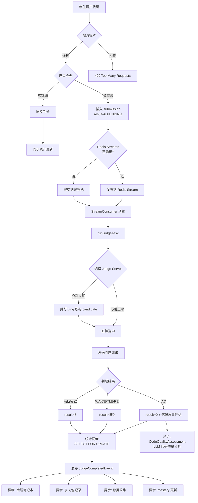

### 1.2 AI Tutor 工作流状态机

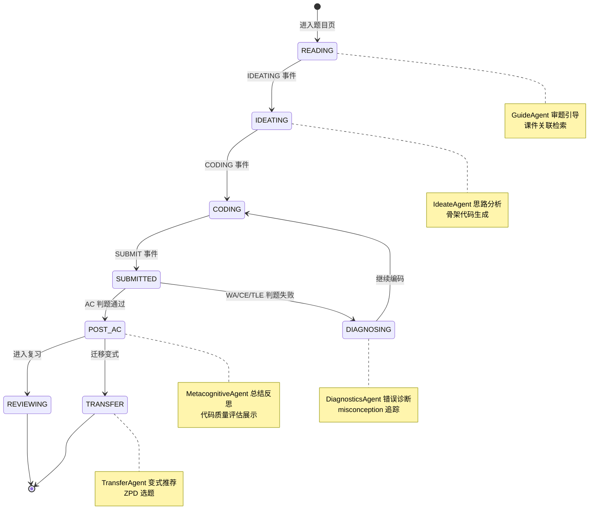

### 1.3 课件处理流水线

```mermaid
flowchart LR
    A[上传课件文件<br/>PDF/PPTX/DOCX] --> B[文档归一化<br/>DocumentNormalization]
    B --> C[文档解析<br/>DocumentParsing]
    C --> D[页面文本提取<br/>Python 脚本]
    D --> E[KC 知识点抽取<br/>LLM]
    E --> F[课件示例提取<br/>LLM]
    F --> G[题目生成<br/>LLM]
    G --> H[Judge 验证<br/>标准答案判题]
    H --> I[题目发布<br/>写入 problem 表]
    
    style B fill:#4CAF50,color:#fff
    style C fill:#4CAF50,color:#fff
    style D fill:#2196F3,color:#fff
    style E fill:#FF9800,color:#fff
    style F fill:#FF9800,color:#fff
    style G fill:#FF9800,color:#fff
    style H fill:#f44336,color:#fff
    style I fill:#9C27B0,color:#fff
```

### 1.4 学习者画像构建瀑布图

```mermaid
gantt
    title 学习者画像数据源与更新时机
    dateFormat X
    axisFormat %s

    section 实时更新
    提交判题 mastery EMA          :done, a1, 0, 1
    错题笔记本自动写入              :done, a2, 1, 2
    misconception 追踪             :done, a3, 2, 3
    frustration 事件采集            :done, a4, 3, 4

    section 工作流驱动
    AI Agent 对话上下文             :active, b1, 0, 2
    LearnerState 投射               :active, b2, 2, 4
    LearningTwin 数字孪生           :active, b3, 4, 5

    section 离线/周期
    KC Graph 依赖传播              :crit, c1, 0, 3
    NFK 知识追踪模型推理            :crit, c2, 3, 5
    Ebbinghaus 间隔复习调度         :crit, c3, 5, 6
    周报摘要生成                    :crit, c4, 6, 7
```

---

## 二、与业界最佳实践的对标分析

### 2.1 Alethicode vs IntelliCode（NeurIPS 2024）

| 维度 | IntelliCode | Alethicode 现状 | 差距 |
|------|------------|----------------|------|
| Learner State | Centralized, versioned, single-writer | 分散在多表，各 Agent 独立读写 | ⚠️ 缺少版本化 |
| Graduated Hints | 5 级：Metacognitive → Conceptual → Analogical → Structural → Near-solution | GuideAgent 单级提示 | ⚠️ 缺少梯度 |
| Mastery Update | POMDP + reward function | EMA α=0.7 | ⚠️ 公式过简 |
| Spaced Repetition | SM-2 集成 | Ebbinghaus 间隔（数据库存在但调度被动） | ⚠️ 调度不主动 |
| Agent Orchestration | StateGraph, single-writer policy | OrchestratorAgent, 无写冲突保护 | ⚠️ 无审计 |

### 2.2 Alethicode vs FSRS（Anki 新一代算法）

| 维度 | FSRS | Alethicode 现状 |
|------|------|----------------|
| 间隔算法 | 基于遗忘曲线拟合，自适应 stability/difficulty | 固定间隔（无算法） |
| 个性化 | 每个用户每个 KC 独立参数 | 全局统一 |
| 输入信号 | 用户自评（Again/Hard/Good/Easy） | 仅 AC/WA 二元信号 |

### 2.3 Alethicode vs A4L 数据架构（Georgia Tech）

| 维度 | A4L | Alethicode 现状 |
|------|-----|----------------|
| 数据标准 | Caliper/xAPI 学习事件标准 | 自定义 JSON 格式 |
| 数据管线 | 异步流式摄入 + Schema 验证 | 同步写入 PostgreSQL |
| 隐私 | 内置匿名化层 | 无匿名化 |
| 可视化 | 多角色仪表板（学生/教师/研究者） | 教师仪表板（部分） |

---

## 三、优化建议（按业界最佳实践排序）

### OPT-01: Graduated Hints 梯度提示（对标 IntelliCode 5 级提示）

**现状**：`GuideAgent` 生成单级提示，不管学生的掌握度和困难程度，提示的详细程度都一样。

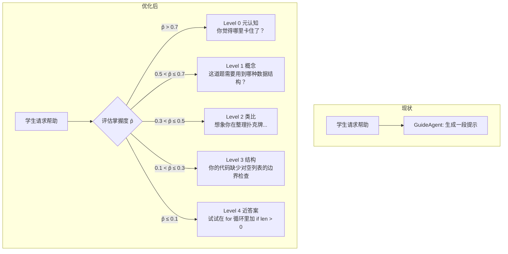

**实施**：在 `GuideAgent.execute()` 中根据 `LearnerState.masteryByKc` 选择提示级别，修改 system prompt 模板加入 `hint_level` 参数。不需要新建 Agent，只需修改 prompt 策略。

---

### OPT-02: 判题结果 WebSocket 实时推送（消除轮询）

**现状**：前端 `setInterval` 轮询 ~500ms。

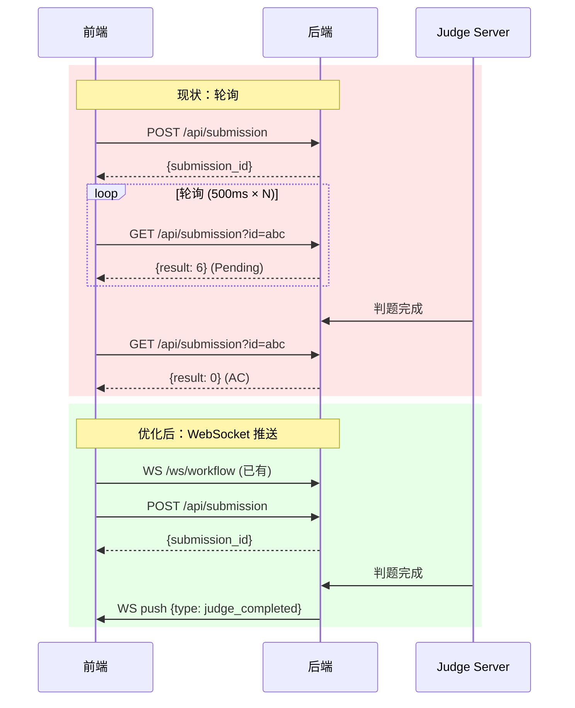

**收益**：减少每次提交 10-20 次无效 HTTP 请求。已有 `WorkflowRealtimeSupport` 基础设施，只需在 `JudgeCompletedEventListener` 中加一行 WS 广播。

---

### OPT-03: EMA mastery 升级为 FSRS 思想（对标 Anki FSRS）

**现状**：

```
mastery_new = 0.7 × outcome + 0.3 × mastery_old
```

**问题**：
- 固定 α=0.7 导致单次 WA 惩罚过重（0.8 → 0.56，骤降 30%）
- 无稳定性/难度概念，做 10 次 AC 的 KC 和做 1 次 AC 的 KC mastery 相同
- 首次做题 mastery 波动极大

**优化后（FSRS 思想简化版）**：

```
stability = stability_old × (1 + α × (outcome - mastery_old))
difficulty = difficulty_old × (1 - β × (outcome - 0.5))
mastery_new = 1 - e^(-t / stability)
```

```mermaid
flowchart TD
    A[提交判题结果] --> B{AC or WA}
    B -->|AC| C[stability ↑<br/>difficulty ↓]
    B -->|WA| D[stability ↓<br/>difficulty ↑]
    C --> E[mastery = 1 - e^{-t/stability}]
    D --> E
    E --> F[更新 learner_kc_mastery 表]
    F --> G[间隔复习调度:<br/>next_review = stability × desired_retention]
```

**实施范围**：只修改 `LearnerMasteryServiceUnified.updateMastery()` 的 SQL 公式，`learner_kc_mastery` 表加 `stability` 和 `difficulty` 两个字段。

---

### OPT-04: 错题笔记本 evidence 数组化（保留错误频率）

**现状**：同一题同一 `error_taxonomy` 只保留最后一条 evidence（覆盖更新）。

**优化**：`evidence_ptr` 从单条 JSON 改为 JSON 数组（最多 5 条），每次 append。

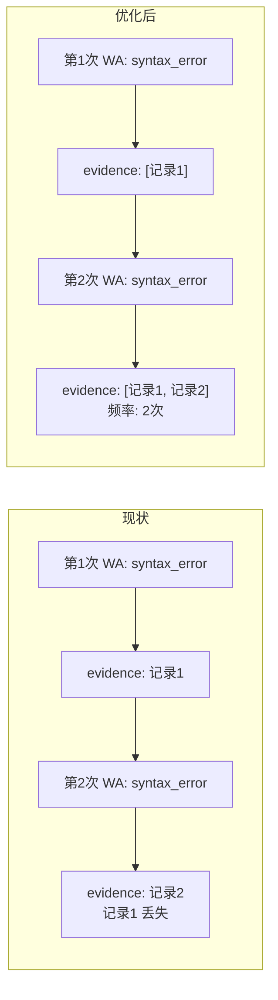

---

### OPT-05: Agent 对话上下文复用（对标 IntelliCode dual-memory）

**现状**：每次 Agent dispatch 都完整执行 `LearnerProfileProjector`（5 条 SQL）+ `EvidencePackAssembler`（3 条 SQL）。

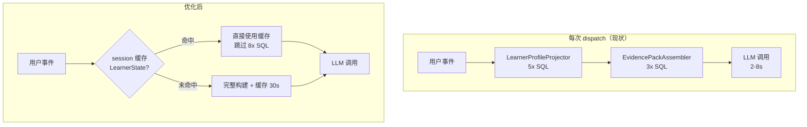

**实施**：在 `AITutorWorkflowAdminServiceImpl` 的 session context 中缓存最近一次 `LearnerState`，设置 30 秒 TTL。同一次做题过程中学生画像变化不大。

---

### OPT-06: 课件处理流水线幂等性

**现状**：任何阶段失败都需要从头开始。

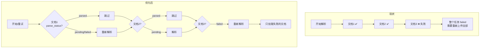

---

### OPT-07: 间隔复习主动提醒（对标 FSRS + IntelliCode spaced repetition）

**现状**：间隔复习只有用户主动点击时才触发。

**优化**：
- 用户进入题目页时，`AITutorWelcomeService` 检查该题关联的 KC 是否有到期复习项
- 如有，在 welcome 消息中注入复习提醒
- 利用已有的 `reviewDue` 查询逻辑，在 welcome 流程中复用

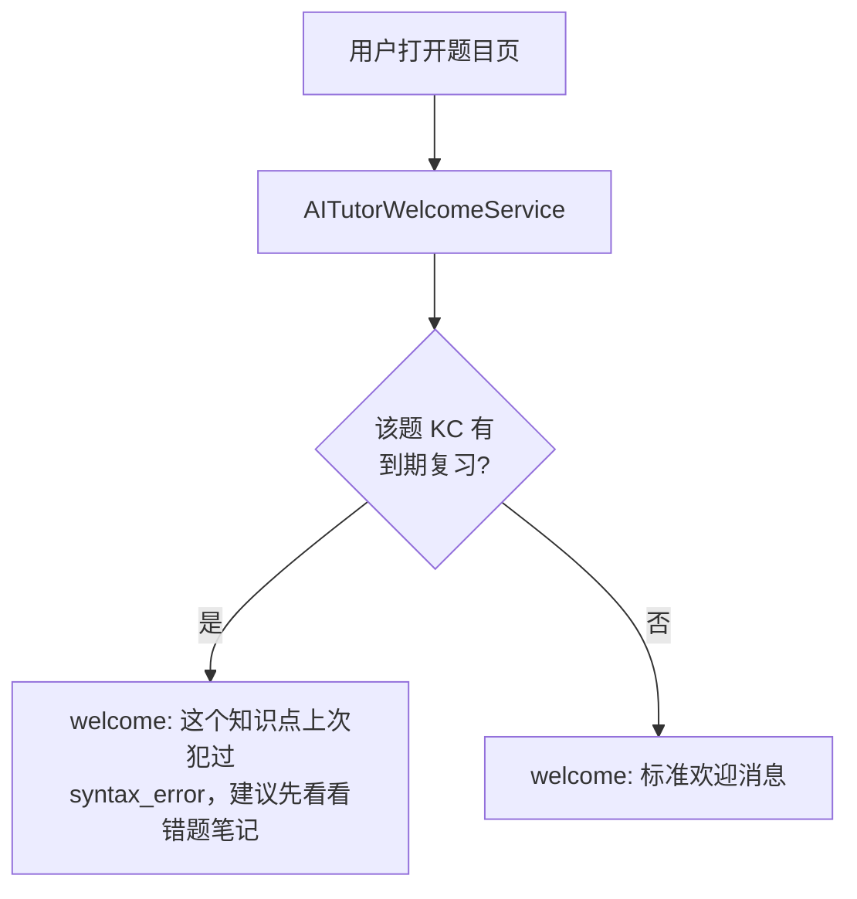

---

## 四、数据流全景图

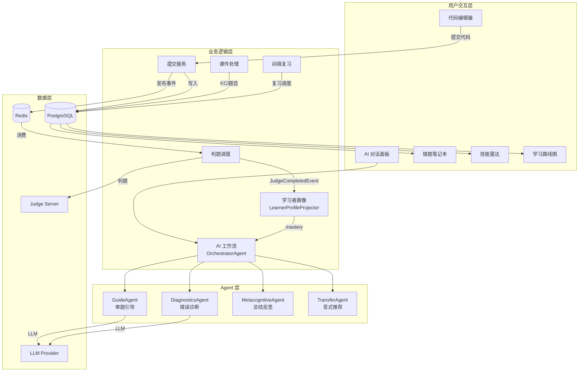

---

## 五、优化优先级矩阵

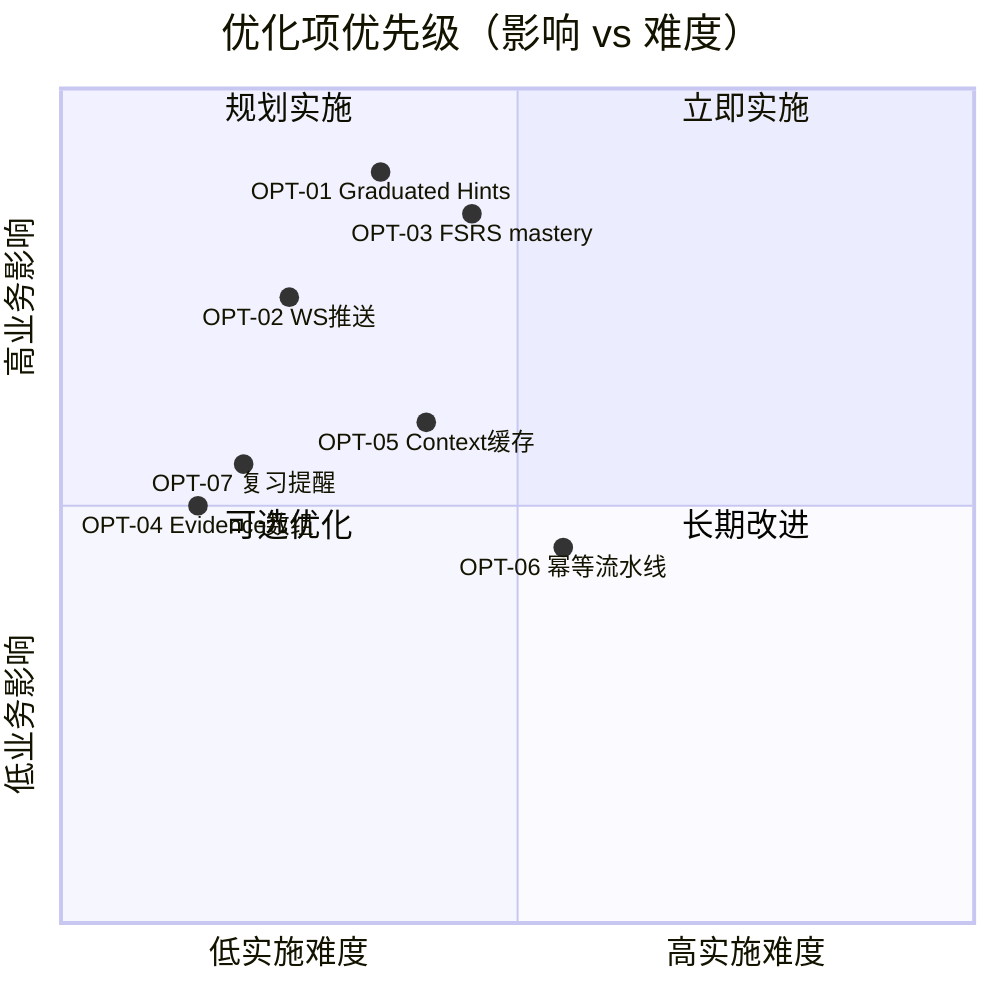

| 顺序 | 编号 | 优化项 | 影响面 | 难度 | 对标 |
|------|------|--------|--------|------|------|
| ⭐1 | OPT-01 | Graduated Hints 梯度提示 | 全用户 | 中 | IntelliCode 5-level hints |
| ⭐2 | OPT-02 | 判题结果 WS 推送 | 全用户 | 低 | 通用最佳实践 |
| ⭐3 | OPT-03 | FSRS mastery 公式 | 全用户 | 中 | Anki FSRS / IntelliCode POMDP |
| 4 | OPT-04 | Evidence 数组化 | 全用户 | 低 | — |
| 5 | OPT-07 | 间隔复习主动提醒 | 全用户 | 低 | IntelliCode spaced repetition |
| 6 | OPT-05 | Agent Context 缓存 | AI 用户 | 中 | IntelliCode dual-memory |
| 7 | OPT-06 | 课件流水线幂等 | 教师 | 中 | A4L 数据管线 |

---

## 六、实施建议

### Phase 1：快速见效（1-2 天）
- OPT-02：WS 推送（在 `JudgeCompletedEventListener` 加 WS 广播）
- OPT-04：evidence 数组化（改 SQL 的 `evidence_ptr` 更新逻辑）
- OPT-07：welcome 复习提醒（`AITutorWelcomeService` 加 reviewDue 查询）

### Phase 2：核心提升（3-5 天）
- OPT-01：Graduated Hints（改 GuideAgent prompt + mastery 分级逻辑）
- OPT-03：FSRS mastery（`learner_kc_mastery` 加字段 + 改 updateMastery SQL）

### Phase 3：性能优化（1-2 天）
- OPT-05：Agent Context 缓存（session-level LearnerState cache）
- OPT-06：课件幂等性（per-document parse_status tracking）
