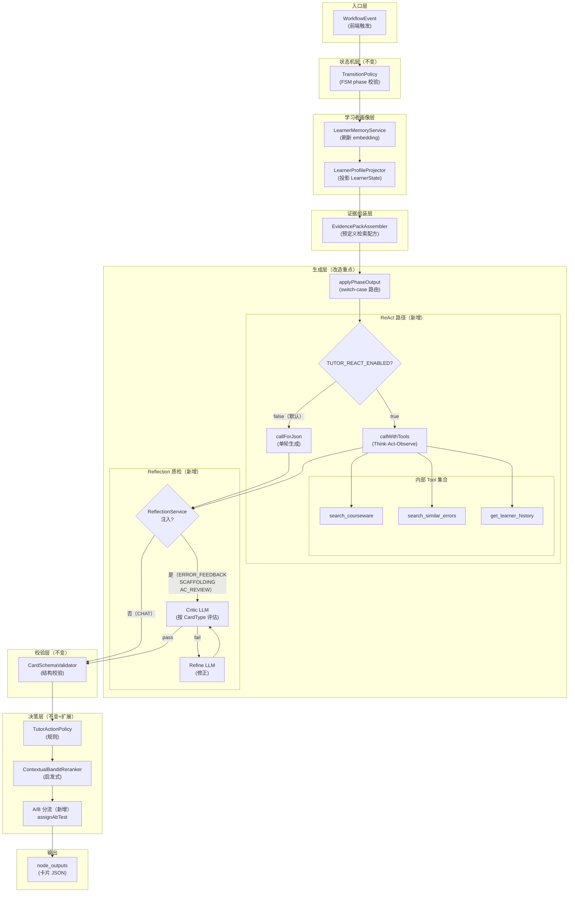
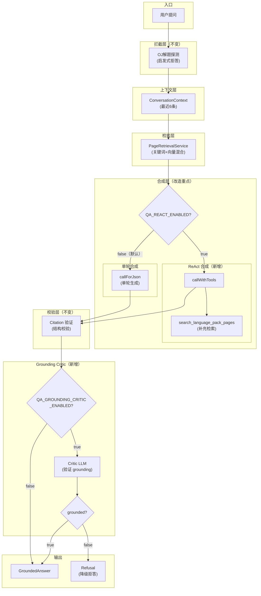
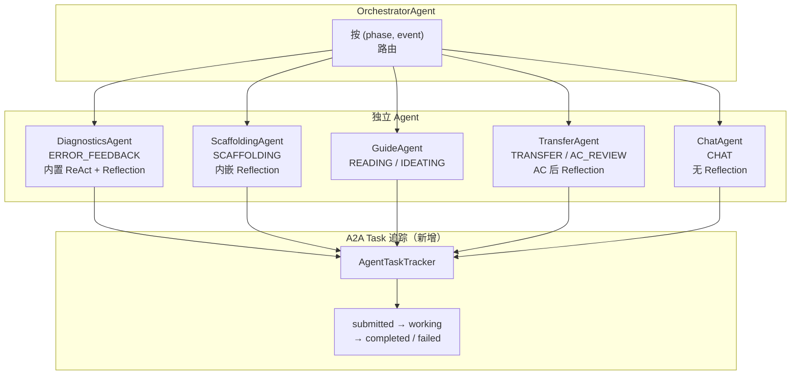
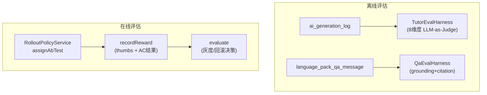

# 当前 Agent Architecture 工作流全景

> **界面归属说明**：本文档涉及的 AI 能力分布在两个独立的用户界面：
> - **做题界面 AI 导学面板**：嵌入在 `Problem.vue` 的 `UnifiedAgentPanel.vue` 组件中，后端由 `AITutorController` / `AITutorWorkflowController` 接入，核心服务为 `AITutorWorkflowAdminServiceImpl`。下文第一、三、四节涉及。
> - **课件问答页**：独立路由 `/language-pack-qa`，对应 `LanguagePackQaPage.vue`，后端由 `LanguagePackQaController` 接入，核心服务为 `LanguagePackQaServiceImpl` → `PageRetrievalServiceImpl` → `AnswerSynthesisServiceImpl`。下文第二节涉及。
> - 两个界面共享底层基础设施：`LlmClient`（callForJson / callWithTools / callForEmbedding）、`TutorToolRegistry`（4 个内部工具）、`ReflectionService`。

## 一、AI 导学助手（Tutor Workflow）完整流程

> **所属界面**：做题界面 → AI 导学面板（`Problem.vue` → `UnifiedAgentPanel.vue`）

## 二、QA 智能问答（Language Pack QA）完整流程

> **所属界面**：课件问答页（`/language-pack-qa` → `LanguagePackQaPage.vue`）

## 三、Agent 化架构（P2 新增，与现有 switch-case 并行）

> **所属界面**：做题界面 → AI 导学面板

## 四、评估框架（P1 新增）

> **跨界面**：TutorEvalHarness 评估做题界面的导学卡片，QaEvalHarness 评估课件问答页的回答质量

## 五、环境变量开关清单

| 变量名 | 默认值 | 作用 | 影响界面 |
|--------|--------|------|---------|
| `TUTOR_REACT_ENABLED` | `false` | ERROR_FEEDBACK 启用 ReAct | 做题界面 AI 导学面板 |
| `TUTOR_REACT_MAX_ITERATIONS` | `4` | ReAct 最大迭代数 | 做题界面 AI 导学面板 |
| `QA_REACT_ENABLED` | `false` | QA 启用 ReAct 自适应检索 | 课件问答页 |
| `QA_REACT_MAX_ITERATIONS` | `3` | QA ReAct 最大迭代数 | 课件问答页 |
| `QA_GROUNDING_CRITIC_ENABLED` | `false` | QA 启用 grounding critic | 课件问答页 |
| `LLM_TOOL_USE_PROMPT_FALLBACK` | `false` | tool-use 回退为 prompt-based | 两者共用 |

## 六、Code Review 结论

### 已修复的问题

1. **Critical**: `generateErrorDiagnosisViaReact` 中 tool executor 使用 `null` userId/problemId/languagePackId，导致工具返回空结果 → **已修复**，从 `applyPhaseOutput` 传入实际 userId 和 problemId。

2. **High**: QA grounding critic 在每次调用时都执行（无论是否启用），增加不必要的 LLM 调用和延迟 → **已修复**，新增 `QA_GROUNDING_CRITIC_ENABLED` 开关，默认关闭。

3. **Low**: `RolloutPolicyService` 中未使用的 `ThreadLocalRandom` 导入 → **已修复**。

### 安全审查

- **SQL 注入**：所有 SQL 查询使用参数化查询（`?` 占位符），无拼接风险。
- **API Key 泄露**：API Key 仅在 `Authorization` header 中使用，日志仅输出 proxy 描述，不泄露 key。
- **输入验证**：tool executor 的 `args` 来自 LLM，但最终只用于已有的参数化查询，安全。

### 性能评估

- **默认路径无变化**：所有新增功能默认关闭（环境变量开关），生产环境在显式启用前无性能影响。
- **ReAct 路径延迟**：启用后 ERROR_FEEDBACK 从 1 次 LLM 调用增至 2-5 次，预计从 ~5 秒增至 ~10-15 秒。CHAT 路径不受影响。
- **Reflection 延迟**：增加 1-3 次 LLM 调用（1 Critic + 可选 1 Refine + 1 final Critic），CHAT 场景跳过。

### 正确性检查

- **ReflectionServiceImpl**: maxRounds=1 时最坏情况 3 次 LLM 调用（Critic + Refine + final Critic），行为正确。
- **callWithTools**: transcript 是 mutable ArrayList，正确支持多轮追加。`Map.of()` 用于不可变 entry 是安全的。
- **Agent 兼容性**：现有 `applyPhaseOutput` switch-case 保持不变，Agent 化为独立路径，不影响生产。

### 生产就绪评估

| 项目 | 状态 |
|------|------|
| 编译通过 | ✅ |
| 现有测试不受影响 | ✅ (LlmClientTest 6/6) |
| 默认行为无变化 | ✅ (所有开关默认 false) |
| SQL 注入风险 | ✅ 无 |
| API Key 安全 | ✅ |
| 错误处理 | ✅ fail-fast |
| 灰度能力 | ✅ 环境变量按场景开关 |
| 回滚能力 | ✅ 关闭环境变量即回退到原始路径 |

**结论：可以投入生产**。建议灰度策略：先在非生产环境启用 `TUTOR_REACT_ENABLED` 观察 ERROR_FEEDBACK 质量变化，确认无回归后再启用 QA 路径。
