# Alethicode——面向初学者的 LLM 驱动智能教育平台

**设计说明书**

**参赛编号：**××××××  
**参赛学校：**××××  
**参赛成员：**××× ××× ×××  

**2026年4月**

---

## 目录

1. [简介](#1-简介)
   1. [作品创意/项目背景](#11-作品创意项目背景)
   2. [项目实施计划](#12-项目实施计划)
2. [总体设计](#2-总体设计)
   1. [系统功能](#21-系统功能)
   2. [系统软硬件平台](#22-系统软硬件平台)
   3. [关键技术](#23-关键技术)
   4. [作品特色](#24-作品特色)
3. [详细设计说明](#3-详细设计说明)
   1. [系统结构设计](#31-系统结构设计)
   2. [数据结构设计](#32-数据结构设计)
   3. [系统界面设计](#33-系统界面设计)
4. [系统安装及使用说明](#4-系统安装及使用说明)
5. [总结](#5-总结)
6. [附录](#6-附录)
   1. [名词定义](#61-名词定义)
   2. [参考资料](#62-参考资料)
   3. [源代码清单](#63-源代码清单)

---

## 1 简介

### 1.1 作品创意/项目背景

对于非计算机专业、缺少系统编程训练的非科班初学者而言，进入编程学习时最常见的困难并不只是"不会写代码"，而是：

- 看完题目以后，不知道应该先理解什么
- 提交失败以后，只知道结果是 `WA/RE/TLE`，却不知道错在何处
- 课堂课件和做题练习之间缺少直接桥梁
- 教师只能看到分数和提交次数，难以快速定位教学薄弱点

当前市面上针对这类场景的典型"解决方案"主要有三种，但每种都存在结构性缺陷：

| 现有方案 | 核心问题 |
|---------|----------|
| **传统 OJ**（洛谷、POJ 等） | 只返回 AC/WA/TLE 等结果码，不提供任何过程性教学反馈；面向竞赛选手设计，非科班初学者在"知道错了但不知道为什么错"的循环中反复受挫 |
| **通用 AI 聊天**（直接使用 ChatGPT 等） | 缺乏题目上下文绑定，容易给出与当前编程任务无关的泛泛回答；没有阶段约束，学生可能跳过审题直接要答案；没有教学设计，输出内容的教学适切性完全靠运气 |
| **AI + 判题拼装方案** | 在 OJ 旁边加一个 LLM 聊天框，本质是两个独立系统的 UI 拼接——AI 不知道学生处在做题的哪个阶段，不知道历史提交的错误模式，更无法将诊断结果沉淀为错题数据、反哺教师教学 |

Alethicode 围绕这些真实教学痛点设计，并不是对上述方案的修补，而是从架构层面给出不同的解法。核心亮点有两个：

1. **AI 导学助手——多 Agent 结构化导学**：在做题页面中内嵌六阶段结构化导学面板（审题→构思→编码→诊断→复盘→迁移），由 1 个编排 Agent + 5 个专职教学 Agent 协同驱动。与"在 OJ 旁边放一个聊天框"不同，每个教学 Agent 只处理其擅长的教学任务，OrchestratorAgent 根据做题阶段和事件类型精确分派，使每一次 AI 输出都来自"知道自己该做什么"的专职角色——这是单一 LLM 聊天框无论如何调整 prompt 都无法稳定达到的效果。
2. **教学闭环——"学→练→诊→复→析"不可拆的完整链路**：AI 导学助手只是链路中的一个环节（"练"）。真正的差异在于，平台把课件问答（学）、AI 导学做题（练）、错误诊断（诊）、错题本与专项复习（复）、教师数据看板（析）五个环节的数据打通在同一个系统内。传统方案中，这五个环节分别由不同工具承担（教材 PDF + OJ + ChatGPT + Excel 错题记录 + 人工统计），数据断裂使得"AI 导学"无法访问学生的历史错误模式，"教师分析"无法获取 AI 反馈的质量数据——链路一旦断开，所谓"智能教学"就退化为互不关联的工具拼盘。

Alethicode 的定位不是单一的在线判题工具，而是一个面向高校编程教学场景、尤其面向非科班初学者的、由 LLM 驱动的智能化教育平台。学习任务评测是它的重要基础设施，但不是全部——真正的目标是以 **AI 导学助手** 为学生侧的核心触点、以 **教学闭环** 为整体架构主线，把教学资源、学习过程、学习诊断和教学决策统一到同一平台内。

本作品希望解决三类问题，并据此建立平台级能力：

1. **做题过程可教学**：非科班初学者做题时获得按阶段组织的、来自专职 Agent 的过程性反馈，而不仅仅是一个判题结果码。
2. **学习数据可闭环**：课件、做题、错题、复习、学情五类数据在同一系统内流动，任何一个环节产生的数据都能被下游环节直接消费，而不是散落在互不关联的工具中。
3. **教学决策有依据**：教师能够从教学闭环中获取结构化的学情证据（薄弱知识点、风险学生、错误模式），而不是只看到提交次数和通过率。

### 1.2 项目实施计划

项目研发分为四个阶段：

| 阶段 | 时间 | 主要内容 | 负责人 |
|------|------|----------|--------|
| 需求分析与原型设计 | 第 1–2 周 | 调研非科班学生学习痛点；确定功能范围与技术选型；完成原型设计 | 全体 |
| 核心功能开发 | 第 3–8 周 | 完成判题系统、AI 导学助手六阶段工作流、课件问答、错题本核心功能 | ××× 后端，××× 前端，××× AI 工作流 |
| 教学闭环与班级系统 | 第 9–12 周 | 完成班级管理、教师数据看板、专项复习包、首页仪表盘，打通"学→练→诊→复→析"完整链路 | ××× 后端，××× 前端，××× 数据看板 |
| 测试与文档 | 第 13–14 周 | 全链路集成测试；编写设计说明书与用户手册；准备答辩演示 | 全体 |

---

## 2 总体设计

### 2.1 系统功能

#### 2.1.1 功能概述

系统功能按"学生侧"和"教师+管理员侧"两条主线组织。学生侧覆盖"学→练→诊→复"四个教学环节，教师+管理员侧覆盖"析"（教学分析）以及平台运维管理。所有功能模块共同服务于教学闭环的完整链路。

**系统功能框架图：**

```text
┌──────────────────────────────────────────────────────────────────────────────┐
│                          Alethicode 智能教育平台                             │
├──────────────────────────────────┬───────────────────────────────────────────┤
│          学生侧功能               │         教师 + 管理员侧功能              │
├──────────────────────────────────┤───────────────────────────────────────────┤
│ ┌──────────────────────────────┐ │ ┌─────────────────────────────────────┐   │
│ │ 首页仪表盘                   │ │ │ 班级教学管理                        │   │
│ │  ├─ 课程掌握度               │ │ │  ├─ 创建/加入班级                   │   │
│ │  ├─ 做题/通过统计            │ │ │  ├─ 成员管理（角色升降）            │   │
│ │  ├─ 待复习错题               │ │ │  ├─ 课件管理（上传/排序）           │   │
│ │  ├─ 学习建议                 │ │ │  ├─ 班级题目管理（添加/发布/隐藏）  │   │
│ │  └─ 快捷入口                 │ │ │  ├─ AI 生成题目                     │   │
│ └──────────────────────────────┘ │ │  └─ 作业管理（创建/批改/截止）      │   │
│ ┌──────────────────────────────┐ │ └─────────────────────────────────────┘   │
│ │ 学习任务评测                 │ │ ┌─────────────────────────────────────┐   │
│ │  ├─ 题库浏览与筛选           │ │ │ 教师数据看板                        │   │
│ │  ├─ 题目详情与代码编辑       │ │ │  ├─ 班级学情周报生成                │   │
│ │  ├─ 多语言沙箱判题           │ │ │  ├─ 学习脉搏趋势图                  │   │
│ │  │  (Python3/C/C++/Java)     │ │ │  ├─ 活跃知识点排行                  │   │
│ │  └─ 提交记录与历史           │ │ │  ├─ 薄弱知识点 TOP3 + 教学建议     │   │
│ └──────────────────────────────┘ │ │  ├─ 风险学生预警 + 干预建议        │   │
│ ┌──────────────────────────────┐ │ │  ├─ 课件使用分析                    │   │
│ │ AI 导学助手（核心）          │ │ │  └─ 学生个体画像                    │   │
│ │  ├─ 六阶段结构化导学         │ │ └─────────────────────────────────────┘   │
│ │  │  (审题→构思→编码          │ │ ┌─────────────────────────────────────┐   │
│ │  │   →诊断→复盘→迁移)        │ │ │ 管理后台                            │   │
│ │  ├─ 6 Agent 协同驱动         │ │ │  ├─ 用户管理                        │   │
│ │  ├─ 11 类结构化教学卡片      │ │ │  ├─ 公告管理                        │   │
│ │  └─ 质量控制与反思检查       │ │ │  ├─ 题目管理                        │   │
│ └──────────────────────────────┘ │ │  │  ├─ 创建/编辑                    │   │
│ ┌──────────────────────────────┐ │ │  │  └─ 批量导入导出                 │   │
│ │ 课件知识问答                 │ │ │  ├─ 知识点图谱管理                  │   │
│ │  ├─ 课程内容包选择           │ │ │  ├─ AI 变体题审核                   │   │
│ │  ├─ RAG 带引用回答           │ │ │  ├─ 语言包初始化管线               │   │
│ │  ├─ 引用页跳转验证           │ │ │  │  (12 阶段课件加工)              │   │
│ │  └─ 回答质量反馈             │ │ │  ├─ Judge Server 管理              │   │
│ └──────────────────────────────┘ │ │  ├─ AI 服务配置                    │   │
│ ┌──────────────────────────────┐ │ │  ├─ 系统路径配置                    │   │
│ │ 错题本与专项复习             │ │ │  └─ 基础设施配置                    │   │
│ │  ├─ 错题筛选与根因分析       │ │ └─────────────────────────────────────┘   │
│ │  ├─ AI 学习反思生成          │ │                                           │
│ │  ├─ 专项复习包               │ │                                           │
│ │  ├─ 一键重做                 │ │                                           │
│ │  └─ 错题数据导出             │ │                                           │
│ └──────────────────────────────┘ │                                           │
├──────────────────────────────────┴───────────────────────────────────────────┤
│                           基础设施层                                         │
│  PostgreSQL + pgvector │ Redis │ Judge Server │ LLM / Embedding │ Flyway    │
└──────────────────────────────────────────────────────────────────────────────┘
```

```mermaid
%%{init: {'theme': 'base', 'themeVariables': {'fontSize': '18px', 'fontFamily': 'Microsoft YaHei, PingFang SC, Helvetica Neue, Arial, sans-serif'}, 'flowchart': {'curve': 'linear', 'nodeSpacing': 40, 'rankSpacing': 55, 'padding': 16}}}%%
graph TD
    ROOT["Alethicode 智能教育平台"]
    ROOT --> STUDENT["学生侧"]
    ROOT --> TEACHER["教师 + 管理员侧"]

    STUDENT --> DASH["首页仪表盘"]
    DASH --> DASH1["课程掌握度"]
    DASH --> DASH2["做题/通过统计"]
    DASH --> DASH3["待复习错题"]
    DASH --> DASH4["学习建议"]
    DASH --> DASH5["快捷入口"]

    STUDENT --> OJ["学习任务评测"]
    OJ --> OJ1["题库浏览与筛选"]
    OJ --> OJ2["题目详情与代码编辑"]
    OJ --> OJ3["多语言沙箱判题<br/>(Python3/C/C++/Java)"]
    OJ --> OJ4["提交记录与历史"]

    STUDENT --> AI["AI 导学助手（核心）"]
    AI --> AI1["六阶段结构化导学"]
    AI --> AI2["6 Agent 协同驱动"]
    AI --> AI3["11 类结构化教学卡片"]
    AI --> AI4["质量控制与反思检查"]

    STUDENT --> QA["课件知识问答"]
    QA --> QA1["课程内容包选择"]
    QA --> QA2["RAG 带引用回答"]
    QA --> QA3["引用页跳转验证"]
    QA --> QA4["回答质量反馈"]

    STUDENT --> ERR["错题本与专项复习"]
    ERR --> ERR1["错题筛选与根因分析"]
    ERR --> ERR2["AI 学习反思生成"]
    ERR --> ERR3["专项复习包"]
    ERR --> ERR4["一键重做"]
    ERR --> ERR5["错题数据导出"]

    TEACHER --> CLASS["班级教学管理"]
    CLASS --> CL1["创建/加入班级"]
    CLASS --> CL2["成员管理（角色升降）"]
    CLASS --> CL3["课件管理（上传/排序）"]
    CLASS --> CL4["班级题目管理"]
    CLASS --> CL5["AI 生成题目"]
    CLASS --> CL6["作业管理"]

    TEACHER --> ANAL["教师数据看板"]
    ANAL --> AN1["班级学情周报"]
    ANAL --> AN2["学习脉搏趋势图"]
    ANAL --> AN3["薄弱知识点 TOP3"]
    ANAL --> AN4["风险学生预警"]
    ANAL --> AN5["课件使用分析"]
    ANAL --> AN6["学生个体画像"]

    TEACHER --> ADMIN["管理后台"]
    ADMIN --> AD1["用户管理"]
    ADMIN --> AD2["公告管理"]
    ADMIN --> AD3["题目管理<br/>(创建/编辑/批量导入导出)"]
    ADMIN --> AD4["知识点图谱管理"]
    ADMIN --> AD5["AI 变体题审核"]
    ADMIN --> AD6["语言包初始化管线<br/>(12 阶段课件加工)"]
    ADMIN --> AD7["Judge Server 管理"]
    ADMIN --> AD8["AI 服务 / 系统配置"]
```

以下数据直接基于当前仓库统计，反映系统当前工程规模：

| 项目 | 当前规模 |
|------|---------|
| 后端 Java 源文件 | 362 个 |
| 后端 Java 代码行数 | 58,352 行 |
| 后端测试文件 | 87 个 |
| 前端 Vue 组件 | 104 个 |
| 前端 JS 模块 | 74 个 |
| Flyway 迁移脚本 | 50 个 |
| 控制层映射端点 | 307 个 |
| AI 卡片类型 | 11 类 |

#### 2.1.2 功能说明

##### 一、学生侧功能

**1. 首页仪表盘**

登录后的第一个页面，汇聚教学闭环各环节的入口和关键指标。学生一眼即可了解当前学习状态并决定下一步行动：

- **课程掌握度**：基于课程内容包的已做题/已通过比例，以环形进度条直观展示
- **做题与通过统计**：累计已做题数、已通过数，量化学习进展
- **待复习错题**：从错题本中提取当日到期的复习错题数量，导航栏同步显示红点角标提醒
- **学习建议**：每日一句编程学习提示
- **快捷操作**：一键跳转"去做题"、"课件问答"、"我的班级"
- **最近提交**：展示近期提交记录，快速回看做题状态

**2. 学习任务评测**

学生在题库页浏览和筛选题目，进入题目详情页后阅读题面、在在线代码编辑器中编写代码并提交。系统支持 **Python3、C、C++、Java** 四种语言判题，由独立 Judge Server 在 Docker 隔离沙箱中编译执行，返回 `AC / WA / CE / TLE / RE / MLE / PAC` 等结果。

该模块的核心价值不只是"能判题"，而是为 AI 导学助手提供稳定的上下文来源：题目描述、当前代码、提交结果、错误类型、历史提交等信息会自动进入后续教学反馈链路。

**3. AI 导学助手（核心功能）**

题目详情页右侧的 `UnifiedAgentPanel` 是本系统最核心的学生交互界面。区别于通用 AI 聊天框，AI 导学助手具有三个关键特征：

- **阶段自动驱动**：做题过程按"审题→构思→编码→诊断→复盘→迁移"六阶段自动编排。阶段转换由系统事件（进入题目、首次提交、判题返回 WA/AC 等）触发，无需学生主动选择——非科班初学者不需要自己判断"我现在应该问什么"。
- **Agent 专职分工**：6 个 Agent 中，`OrchestratorAgent` 负责根据阶段和事件分派，5 个教学 Agent 各自只处理其擅长的任务。每个 Agent 拥有独立的上下文权限——`GuideAgent` 看不到测试用例答案因此不会泄露，`DiagnosticsAgent` 能访问判题结果和错误堆栈因此诊断有据可查。
- **卡片化输出**：11 类结构化教学卡片（审题导学、思路分析、worked example、faded example、Parsons problem、minimal hint、错误诊断、执行轨迹、AC 总结、迁移推荐、自由对话）让学生快速识别"这条帮助在做什么"，教师可统计每类卡片的使用频率和有效性。

**4. 课件知识问答**

学生通过导航栏"课件问答"进入 `/language-pack-qa` 页面，对课程内容包提问：

- 选择目标课程内容包
- 输入自然语言问题，系统通过关键词检索 + pgvector 向量检索匹配相关课件段落
- LLM 生成带证据引用的回答，每条引用标注课件页码
- 点击引用页码可跳转到课件原页验证
- 对回答进行"有帮助/没帮助/引用不准"反馈
- 查看历史问答会话

课件从"讲完就结束的静态 PDF"变成了学生可随时回问、反复回看的知识底座。

**5. 错题本与专项复习**

导航栏"错题本"进入 `/learner-notebook`，将错题记录、根因、修复、反思和重做整合在同一页面：

- **错题筛选**：按错误类型（WA/RE/TLE 等）和编程语言筛选
- **根因分析**：每条错题自动附带 AI 生成的根因分析和错误类型标签
- **AI 反思**：一键生成针对该错题的学习反思，帮助学生理解"为什么会犯这个错"
- **专项复习包**：按错题类型集中生成复习题目包，从"记录错误"延伸为"集中再练"
- **一键重做**：直接跳转到原题重新作答
- **数据导出**：导出错题记录用于线下复习

##### 二、教师 + 管理员侧功能

**1. 班级教学管理**

导航栏"班级"进入 `/classroom`，教师和助教可进行完整的教学组织管理：

- **班级管理**：创建班级、生成邀请码邀请学生加入
- **成员管理**：查看班级成员列表，支持将学生提升为助教、降级、移除
- **课件管理**：上传课件文件、管理课件排序与可见性
- **班级题目管理**：从题库添加题目到班级、控制题目发布/隐藏状态、移除题目
- **AI 生成题目**：基于课件内容由 AI 自动生成变体题目，教师审核后发布
- **作业管理**：创建作业（关联班级题目、设置截止时间）、查看作业完成情况、批改评分

**2. 教师数据看板**

班级详情页的"数据看板"Tab（仅教师和助教可见），从教学闭环全链路自动聚合数据，为教学决策提供结构化证据：

- **班级学情周报**：一键生成本周/本月的班级学情综合报告
- **学习脉搏趋势图**：近 7 天 / 近 30 天的做题量、通过率、错题数趋势
- **活跃知识点排行**：当前班级最常涉及的知识点 TOP 排行
- **薄弱知识点 TOP3**：班级整体掌握最差的 3 个知识点，附带教学改进建议
- **风险学生预警**：自动识别需要干预的学生（长期未提交、错误率持续偏高等），附干预建议。导航栏铃铛图标同步推送教学警报
- **课件使用分析**：课件各章节的访问热度和问答频率
- **学生个体画像**：点击学生查看掌握度、错题分布、LLM 生成的个性化评语

**3. 管理后台**

用户下拉菜单"管理"进入 `/admin`（管理员完整权限，教师可访问题目和 AI 教学相关功能）：

- **用户管理**：用户列表、角色管理、账号状态管理
- **公告管理**：发布/编辑/删除全站公告
- **题目管理**：题目创建/编辑、测试用例管理、批量导入导出
- **知识点图谱管理**：维护全局知识点（KC）体系，支撑错题分类和教学分析
- **AI 变体题审核**：审核 AI 自动生成的变体题目，确保题目质量后发布
- **语言包初始化管线**：12 阶段课件加工管线（归一化→解析→知识点抽取→分段→出题→发布），支持阶段日志查看和管线重启
- **Judge Server 管理**：查看判题服务状态、心跳监控、孤立测试用例清理
- **AI 服务配置**：配置 LLM 和 Embedding 的 API 地址、密钥和模型参数
- **系统路径配置**：配置上传目录、课件存储路径等系统级参数
- **基础设施配置**：数据库、Redis 等基础设施连接配置

### 2.2 系统软硬件平台

#### 2.2.1 系统开发平台（含开源/第三方工具）

本系统开发采用“**Windows 主机 + WSL2 Ubuntu + Docker + 前后端分离工具链**”的方式进行。后端在 Java 21 / Spring Boot 3.4.4 环境下开发，前端在 Node.js 20.19.0+ / Vue 3 / Vite 7 环境下开发，数据库与缓存通过 Docker 容器在本地联调。

**1. 开发硬件环境**

| 设备角色 | 设备型号 | 生产厂家 | 硬件配置 | 用途 |
|---------|---------|---------|---------|------|
| 开发主机 | `TX Air FA401KM_FA401KM` | ASUSTeK COMPUTER INC.（华硕） | AMD Ryzen AI 7 H 350 处理器、16GB 内存、KIOXIA `KBG60ZNV1T02` 1TB SSD | 前后端开发、容器联调、文档编写与演示环境承载 |

**2. 开发软件环境、开源平台与第三方工具**

| 类别 | 名称 | 生产厂家/维护方 | 官网 | 版本 | 平台提供的功能 | 在本系统中的作用 |
|------|------|----------------|------|------|---------------|------------------|
| 主机操作系统 | Windows 10 Home China | Microsoft | <https://www.microsoft.com/windows> | `2009`（Build `26100`） | 开发主机基础运行环境 | 提供宿主机桌面环境与 WSL2 虚拟化基础 |
| 开发操作系统 | Ubuntu | Canonical Ltd. | <https://ubuntu.com/> | `22.04.2 LTS` | Linux 开发环境 | 运行后端构建、脚本、Docker 编排与本地联调 |
| 后端语言运行时 | Eclipse Temurin JDK | Eclipse Adoptium | <https://adoptium.net/> | `21` | Java 编译与运行 | 运行 Spring Boot 后端与测试 |
| 后端框架 | Spring Boot | Spring Team | <https://spring.io/projects/spring-boot> | `3.4.4` | Web、JPA、WebSocket、Security、Actuator 等企业级能力 | 实现后端核心业务框架 |
| 后端构建工具 | Apache Maven | Apache Software Foundation | <https://maven.apache.org/> | `3.9+` | 依赖管理、编译、测试、打包 | 构建后端工程 |
| 前端运行时 | Node.js | OpenJS Foundation | <https://nodejs.org/> | `20.19.0+` | JavaScript 运行时与前端工具链 | 运行前端构建与测试脚本 |
| 前端框架 | Vue.js | Vue.js Team | <https://vuejs.org/> | `3.5.13` | 单页应用开发 | 实现学生端、教师端和管理端页面 |
| 前端构建工具 | Vite | Vite Team | <https://vite.dev/> | `7.1.5` | 前端开发服务器与生产打包 | 前端构建与调试 |
| 前端网关 | Nginx | NGINX / F5 | <https://nginx.org/> | `1.27-alpine` | 静态资源托管与反向代理 | 生产部署时统一提供前端入口，并代理 `/api`、`/ws` |
| 关系数据库 | PostgreSQL | PostgreSQL Global Development Group | <https://www.postgresql.org/> | `16+` | 关系型事务数据管理 | 存储题目、提交、班级、课件、错题、AI 工作流等核心业务数据 |
| 向量扩展 | pgvector | pgvector 开源项目 | <https://github.com/pgvector/pgvector> | `pg16` 镜像集成 | 向量检索与相似度计算 | 支撑课件问答的向量检索 |
| 缓存系统 | Redis | Redis 社区 / Redis Ltd. | <https://redis.io/> | `7+` | 高速缓存与会话存储 | 用于 Session、缓存与部分运行态数据 |
| 容器引擎 | Docker Engine | Docker, Inc. | <https://www.docker.com/> | `24+` | 容器运行环境 | 运行数据库、缓存、判题与部署服务 |
| 容器编排 | Docker Compose Plugin | Docker, Inc. | <https://docs.docker.com/compose/> | `2.20+` | 多容器编排 | 编排 `frontend/backend/postgres/redis/judge` 五类服务 |
| 数据库迁移 | Flyway | Redgate Software | <https://flywaydb.org/> | `10.x`（随依赖解析） | 数据库版本迁移 | 管理 50 个数据库迁移脚本 |
| API 文档 | SpringDoc / Swagger UI | springdoc.org 社区 | <https://springdoc.org/> | `2.8.5` | OpenAPI 文档生成 | 生成 REST API 文档 |
| 监控组件 | Micrometer + Prometheus Registry | Micrometer / Prometheus Community | <https://micrometer.io/>；<https://prometheus.io/> | `1.x`（随依赖解析） | 指标采集与导出 | 输出后端健康与性能指标 |
| 判题服务 | Judge Server | QingdaoU OnlineJudge 开源生态 | <https://github.com/QingdaoU/OnlineJudge> | `1.6.1` | 代码编译、隔离执行、判题结果回传 | 提供沙箱判题能力 |
| 在线编辑器 | CodeMirror | CodeMirror 项目 | <https://codemirror.net/> | `6.x` | 浏览器代码编辑 | 题目详情页代码编辑器基础能力 |
| 文档转换工具 | LibreOffice | The Document Foundation | <https://www.libreoffice.org/> | 系统仓库版本 | Office 文档转换与规范化 | 课程内容包预处理 |
| 文档解析库 | `pypdf` / `python-pptx` / `python-docx` | 各自开源社区 | <https://pypdf.readthedocs.io/>；<https://python-pptx.readthedocs.io/>；<https://python-docx.readthedocs.io/> | 镜像内安装版本 | 解析 PDF、PPT、DOCX | 支撑语言包初始化与页级解析 |
| 大模型接入 | OpenAI 兼容 API | 外部模型服务提供方 | 由服务提供方给出 | 按服务提供方版本 | 文本生成与向量生成接口 | 用于 AI 导学、课件问答、错题反思、教学分析 |

**3. 第三方工具/源代码出处与已实现功能**

本项目未直接复制未声明的第三方教学算法源码；核心业务逻辑、教学工作流、数据结构与系统编排由项目组自主实现。第三方组件主要承担基础设施能力，关键出处如下：

| 第三方组件/源代码 | 出处 | 已实现的功能 |
|------------------|------|-------------|
| Judge Server | QingdaoU OnlineJudge 开源项目及其 `judge:1.6.1` 镜像 | 代码编译、隔离执行、结果回传 |
| CodeMirror 6 | CodeMirror 官方项目 | 浏览器端代码编辑 |
| LibreOffice + `pypdf` + `python-pptx` + `python-docx` | 各组件官方开源项目 | 课件规范化、格式转换、文本与页级解析 |

**4. 数据库说明**

系统只使用 **PostgreSQL** 作为唯一的持久化业务数据库，不存在多个关系数据库之间的数据同步问题。`pgvector` 不是独立数据库，而是安装在 PostgreSQL 实例中的向量扩展，结构化业务字段与向量字段在同一数据库实例中统一管理，通过业务主键和课程内容包 ID 建立关联。`Redis` 仅用于缓存与 Session 管理，不承担核心业务数据的持久化关系建模。

#### 2.2.2 系统运行平台

系统运行时采用 **前后端分离的分布式组件架构**。若按软件组件划分，本系统属于分布式系统；若按本次参赛提交版本的物理部署方式划分，则采用 **单机集中部署**，即 `frontend`、`backend`、`postgres`、`redis`、`judge` 五类服务通过 Docker Compose 部署在同一台 Linux 宿主机上，浏览器通过统一入口访问系统。

**1. 运行硬件环境与部署要求**

| 硬件设备 | 型号/厂家 | 配置要求 | 部署角色 | 部署要求 |
|---------|----------|---------|---------|---------|
| 学生/教师终端 | 通用 PC / 笔记本，厂家不限 | 双核 CPU、4GB 内存、1366×768 及以上分辨率 | 用户访问终端 | 仅安装现代浏览器，不部署业务服务 |
| 应用服务器（实际演示宿主机） | `TX Air FA401KM_FA401KM` / ASUSTeK COMPUTER INC. | AMD Ryzen AI 7 H 350、16GB 内存、1TB SSD | 前端、后端、数据库、缓存、判题统一部署节点 | 需运行 Linux、Docker Engine、Docker Compose Plugin |
| 外部 AI 服务节点 | 第三方云服务，由服务商提供 | 由服务商保障 | 提供 LLM / Embedding 推理能力 | 不在本地部署，应用服务器需可通过 HTTPS 访问 |

说明：当前仓库的独立部署文件为 `deploy/docker-compose.yml`，对外入口端口为 `18080`，后端调试端口为 `8081`。本次参赛版本的最小完整运行形态即为单机多容器部署。

**2. 系统通信网络与组件连接关系**

系统组件之间通过 Docker Compose 默认 `bridge` 网络互联，容器内部通过服务名 `frontend`、`backend`、`postgres`、`redis`、`judge` 相互访问；浏览器只访问统一入口 `Frontend(Nginx)`，再由 Nginx 将 `/api/*` 和 `/ws/*` 请求反向代理到后端服务。其连接关系如下：

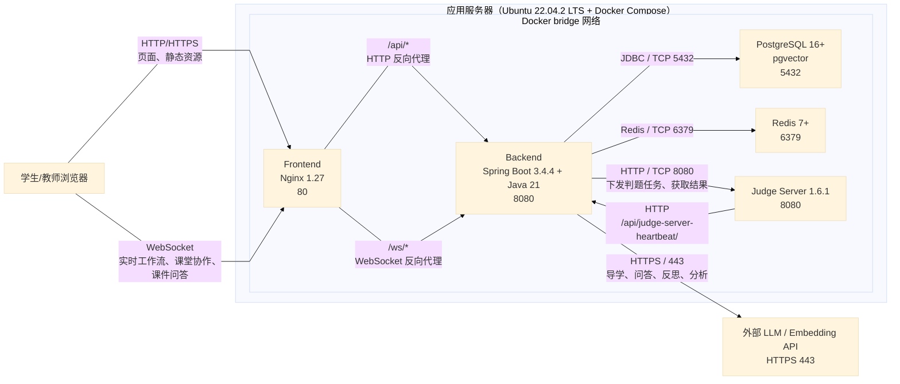

各通信链路的详细说明如下：

| 通信起点 | 通信终点 | 协议/端口 | 连接方式 | 用途 |
|---------|---------|----------|---------|------|
| 浏览器 | Frontend（Nginx） | HTTP/HTTPS，演示环境外部端口 `18080 -> 80` | 用户外部访问 | 页面访问、静态资源下载 |
| 浏览器 | Frontend（Nginx） | WebSocket，经 `/ws/*` 同源接入 | 用户外部访问 | AI 工作流、课堂协作、课堂监控、课件问答实时消息 |
| Frontend（Nginx） | Backend | HTTP `8080` | 容器内服务名访问 | 代理 `/api/*` REST 请求 |
| Frontend（Nginx） | Backend | WebSocket `8080` | 容器内服务名访问 | 代理 `/ws/workflow/*`、`/ws/classroom/*`、`/ws/qa/*` |
| Backend | PostgreSQL | JDBC over TCP `5432` | 容器内服务名访问 | 读写结构化业务数据与向量数据 |
| Backend | Redis | TCP `6379` | 容器内服务名访问 | Session、缓存与运行态数据 |
| Backend | Judge Server | HTTP `8080` | 容器内服务名访问 | 下发判题任务、获取判题结果 |
| Judge Server | Backend | HTTP `/api/judge-server-heartbeat/` | 容器内服务名访问 | 心跳注册与状态上报 |
| Backend | 外部 LLM / Embedding API | HTTPS `443` | 公网访问 | AI 导学、课件问答、错题反思、教学分析 |

当前系统已实际注册并使用的实时通道包括 `/ws/workflow/{sessionId}`、`/ws/classroom/collab/{sessionId}`、`/ws/classroom/monitor/{classroomId}`、`/ws/qa/{sessionId}`。

**3. 每台硬件设备上部署的系统软件及版本要求**

| 硬件设备 | 部署软件 | 版本要求 | 部署说明 |
|---------|---------|---------|---------|
| 学生/教师终端 | Chrome / Edge / Firefox 等现代浏览器 | 最近 2 个主版本内 | 负责页面访问与 WebSocket 实时交互 |
| 应用服务器宿主机 | Ubuntu Server / Ubuntu（WSL2 演示环境） | `22.04.2 LTS` | 提供 Linux 运行环境 |
| 应用服务器宿主机 | Docker Engine | `24+` | 运行所有业务容器 |
| 应用服务器宿主机 | Docker Compose Plugin | `2.20+` | 编排多容器服务 |
| 应用服务器上的 `frontend` 容器 | Nginx | `1.27-alpine` | 托管前端静态资源并统一反向代理 |
| 应用服务器上的 `backend` 容器 | Eclipse Temurin JRE | `21` | 运行 Java 后端 |
| 应用服务器上的 `backend` 容器 | Spring Boot | `3.4.4` | 承载业务逻辑、WebSocket、数据访问、AI 工作流 |
| 应用服务器上的 `backend` 容器 | Python3、LibreOffice、`pypdf`、`python-pptx`、`python-docx` | 镜像内安装版本 | 支撑课件规范化、文档解析与语言包初始化 |
| 应用服务器上的 `postgres` 容器 | PostgreSQL + pgvector | `16+` | 核心业务数据库与向量检索 |
| 应用服务器上的 `redis` 容器 | Redis | `7+` | 缓存与 Session |
| 应用服务器上的 `judge` 容器 | Judge Server | `1.6.1` | 代码编译、隔离执行与判题 |
| 外部 AI 服务节点 | OpenAI 兼容 API 服务 | 按服务提供方版本 | 提供文本生成和向量生成能力 |

**4. 运行平台结论**

综上，本系统在结构上属于分布式系统，在本次参赛交付形态上采用单机集中部署。该方案既完整保留了浏览器、前端入口、后端、数据库、缓存、判题服务和外部 AI 服务之间的真实通信关系，又保证了部署简单、演示稳定和环境可复现，符合竞赛作品提交与现场展示要求。

### 2.3 关键技术

1. **多 Agent 编排与上下文隔离**：系统不是让一个大模型在一个对话窗口中“扮演多个老师”，而是把教学职责拆成 `OrchestratorAgent + 5 个专职 Agent`。编排层只负责根据阶段和事件选路；执行层每个 Agent 只拿到完成本职任务所需的最小上下文，例如 `GuideAgent` 只看题面与当前代码，`DiagnosticsAgent` 才能额外访问判题结果与错误证据。这种“编排决策”与“教学执行”分离、加上最小权限上下文隔离的工程设计，是系统能够长期稳定运行的基础。

2. **事件驱动的六阶段教学状态机**：系统将做题过程抽象为 `READING → IDEATING → CODING → ERROR_FEEDBACK → AC_REVIEW → TRANSFER` 六阶段，并以“进入题目、首次提交、判题返回、通过”等真实系统事件驱动阶段迁移。这样做的关键价值不只是流程可视化，而是把 AI 输出从“用户随便问、模型随便答”变成“在确定状态下执行确定职责”。对于非科班初学者，这相当于把教学节奏从学生自行摸索，变成系统按认知顺序主动编排。

3. **ReAct 式诊断执行链路**：在错误诊断场景下，系统不是直接让模型根据表面现象生成解释，而是让诊断 Agent 以 ReAct 方式围绕真实证据工作，即先分析需要什么信息，再调用内部工具读取判题结果、执行轨迹、提交上下文，最后组合为诊断结论。这样得到的输出是“基于证据的教学反馈”，而不是脱离判题现场的泛化建议。对于编程教育场景，是否能够把 LLM 的自然语言能力绑定到真实程序执行证据上，是工程上非常关键的分水岭。

4. **Harness 驱动的质量治理机制**：本系统把 AI 输出当作需要治理的工程对象，而不是不可控的黑箱文本。核心输出采用结构化卡片协议，关键节点接入 Reflection 检查，前后端均围绕卡片类型、消息类型、阶段状态建立契约；同时通过 Harness / 契约测试 / 集成测试去验证工作流状态迁移、实时推送、页面渲染和结果协议是否一致。也就是说，平台不是“接一个模型 API 就算完成”，而是把 Agent 的行为纳入了可验证、可回归、可迭代的工程体系。

5. **结构化教学卡片协议**：系统定义 11 类 `CardType`，把 AI 输出映射成审题导学、思路分析、最小提示、错误诊断、执行轨迹、AC 总结、迁移推荐等明确类型。其技术意义在于：同一种教学意图有固定输出槽位、固定渲染组件、固定质量校验口径，前端无需猜测模型想表达什么，后端也能按类型统计有效性。这使 AI 从“自由文本生成器”变成“可被界面和业务消费的结构化服务”。

6. **教育理论驱动的工程落地**：系统中的 Agent 工作流并不是随意拼出来的对话流程，而是明确吸收了教育学中的脚手架理论（Scaffolding）、认知学徒制（Cognitive Apprenticeship）、形成性评价（Formative Assessment）和掌握学习（Mastery Learning）思想。具体体现为：先审题再构思的认知分段、错误后先诊断再重做的反馈闭环、按掌握度与错因生成补题与复盘内容、把“做对/做错”扩展为“为什么对、为什么错、下一步练什么”。因此，教育理论不是写在文档里的口号，而是已经落进了 Agent 分工、工作流状态和卡片协议之中。

7. **课件知识底座与证据化问答**：课程内容包经过规范化、解析、知识点抽取、分段与发布后，进入 RAG 问答链路，为 AI 导学与课件问答同时提供可引用的知识证据。其关键技术价值不只是“能检索”，而是让教学回答能回指具体课件页码，降低 LLM 纯生成带来的漂移风险，并把课件从静态文件提升为可供 Agent 调用的知识底座。

### 2.4 作品特色

1. **这个问题不能靠传统 OJ 解决**：传统 OJ 的能力边界是“给出判题结果”，而不是“在做题过程中实施教学”。它可以告诉学生 `WA`，却无法告诉学生“你是在审题阶段卡住，还是在循环边界上犯错”。对于非科班初学者，最大痛点并不是没有分数，而是没有过程性反馈。因此，如果目标是提升初学者的真实学习体验，而不是单纯完成判题，传统 OJ 先天不够。

2. **这个问题不能靠通用 AI 聊天解决**：把 ChatGPT 或其他通用大模型放在 OJ 旁边，看起来像是“有了 AI”，但它实际上不知道学生当前处在哪一道题、哪个阶段、刚刚提交了什么代码、判题为什么失败、过去重复错过什么知识点。没有这些上下文，AI 只能给出泛化建议，无法保证教学时机、教学粒度和教学边界。也就是说，通用聊天工具能回答问题，但不能承担教学流程编排。

3. **这个问题不能靠“AI + OJ 拼装”解决**：如果课件、OJ、错题本、复习和教师分析分散在多个系统里，即使每个系统都“有一点智能”，数据仍然会在系统边界断裂。断裂带来的直接后果是：AI 看不到历史错因，错题本不知道课件知识点，教师看板拿不到 AI 干预效果，最终每个环节都只能局部最优。Alethicode 的必要性恰恰在于它把“学→练→诊→复→析”放进同一个平台，使每个环节都消费同一份学习数据。

4. **只有平台化方案才能同时服务学生和教师**：学生侧真正需要的是“做题时被引导”，教师侧真正需要的是“看到可干预的学情证据”。如果只有 AI 聊天，教师拿不到结构化教学数据；如果只有 OJ 看板，学生得不到按阶段组织的帮助。Alethicode 把两端统一在一套数据模型和一条工作流上，所以学生每一次做题、提问、出错和复盘，最终都能沉淀成教师可用的教学证据。这不是单点工具能补出来的能力。

5. **Alethicode 的价值不是多用了一个模型，而是把模型变成了教学基础设施**：别的方案往往停留在“接入一个 LLM API”，而 Alethicode 进一步完成了 Agent 分工、状态机编排、证据化诊断、结构化卡片协议、实时推送、质量校验与教学闭环。这意味着它不是“会聊天的 OJ”，而是“能在真实做题流程中稳定实施教学的教育平台”。这正是为什么在同类问题上，必须使用本项目，而不是把若干现成工具简单叠加。

---

## 3 详细设计说明

### 3.1 系统结构设计

#### 3.1.1 技术架构

本系统以 **B/S 平台为主、移动平台为辅** 进行实现。Web 端采用浏览器/服务器模式，学生、教师和管理员通过浏览器访问统一入口即可使用系统；移动端采用 UniApp 构建跨平台应用，复用同一套后端 REST API，面向碎片化学习场景提供轻量访问能力。系统**未采用传统桌面 C/S 架构**，原因是编程教学场景强调低安装成本、易维护、便于课堂统一接入，而桌面客户端会增加部署、升级和机房维护复杂度，不符合高校教学环境的实际需求。

系统总体上采用前后端分离架构：前端负责界面渲染与交互，后端负责业务逻辑、AI 工作流编排、判题调度和数据访问。前端到后端的请求-响应类操作通过 REST API 实现，实时状态推送通过 WebSocket 实现；后端再统一连接 PostgreSQL、Redis、Judge Server 和外部 LLM/Embedding 服务。当前参赛版本在部署形态上为单机多容器，但从组件关系上看属于逻辑分布式架构。

选用该技术路线的原因如下：

- 选择 **B/S 架构**：学生和教师只需浏览器即可使用，适合课堂、机房和个人设备混合场景，便于统一部署与升级。
- 选择 **移动平台补充**：移动端适合查看提交记录、课件问答、班级信息和学习建议，扩展学习场景而不改变后端核心架构。
- 不采用 **传统 C/S 桌面架构**：桌面安装、版本维护和环境兼容成本高，不利于教学平台快速迭代。
- 选择 **Spring Boot 3.4.4**：便于组织 REST API、WebSocket、JPA、Security、Actuator 等企业级能力，适合中大型教育平台后端开发。
- 选择 **Vue 3 + Vite**：组件化开发效率高，页面交互丰富，适合构建学生端、教师端和管理端的统一前端体系。
- 选择 **PostgreSQL + pgvector**：既能管理结构化教学数据，又能支持课件问答所需的向量检索，避免多数据库割裂。
- 选择 **Redis**：承担缓存和 Session 管理，降低高频读写压力。
- 选择 **Judge Server + Docker 隔离**：保证代码编译执行的安全性和可控性。
- 选择 **WebSocket**：适合 AI 导学工作流、课件问答、课堂监控等实时反馈场景。

系统关键开发技术框架如下：

| 平台/层次 | 采用技术 | 作用 |
|----------|---------|------|
| Web 前端（B/S） | Vue 3 + Vite + Element Plus | 学生端、教师端、管理端界面开发 |
| 移动端 | UniApp + Vue 3 + Pinia | Android/iOS/HarmonyOS 跨平台客户端 |
| 后端 | Spring Boot 3.4.4 + Java 21 | 业务逻辑、AI 工作流、判题调度、接口服务 |
| 实时通信 | WebSocket | AI 导学、课件问答、课堂协作、课堂监控 |
| 数据层 | PostgreSQL 16+ + pgvector、Redis 7+ | 结构化数据、向量检索、缓存与 Session |
| 判题层 | Judge Server 1.6.1 + Docker | 安全执行学生代码并回传判题结果 |
| AI 能力层 | OpenAI 兼容 LLM / Embedding API | 导学、问答、反思、分析 |

其技术架构如图所示：

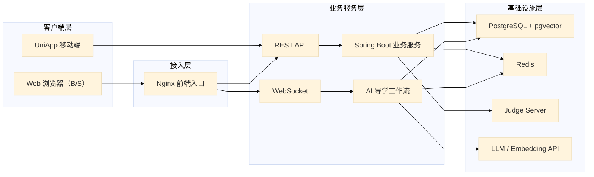

#### 3.1.2 功能模块设计

系统按照“**用户交互层 → 接入通信层 → 领域业务层 → 基础设施层**”四层原则划分模块；在领域业务层内部，再按“学习任务评测、AI 导学、课件知识、错题复习、班级教学、系统管理”六类业务职责继续拆分。这样的划分原则有两个目的：一是把界面、通信、业务和基础设施解耦；二是把学生侧与教师侧功能统一到同一业务模型下，避免重复建设和数据割裂。

系统功能模块结构图如下：

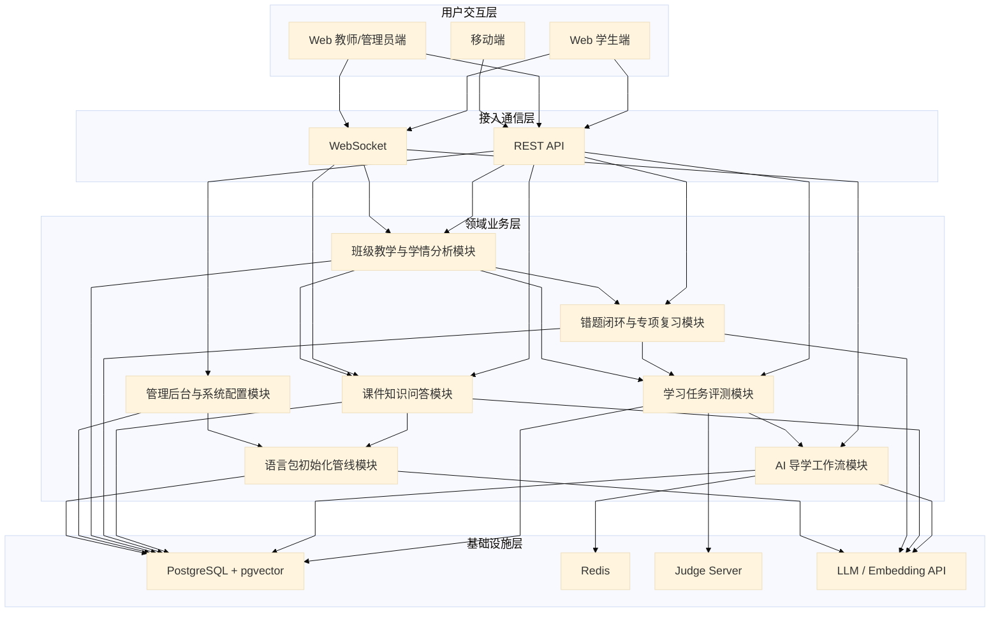

若按面向对象设计的包级关系理解，系统后端主要由 `controller`、`service`、`repository`、`entity`、`websocket`、`config` 等包组成，其中 `service` 再按业务域拆分为 `aitutor`、`submission`、`classroom`、`languagepack`、`monitor`、`account` 等子包。主要模块调用关系可抽象为如下包图：

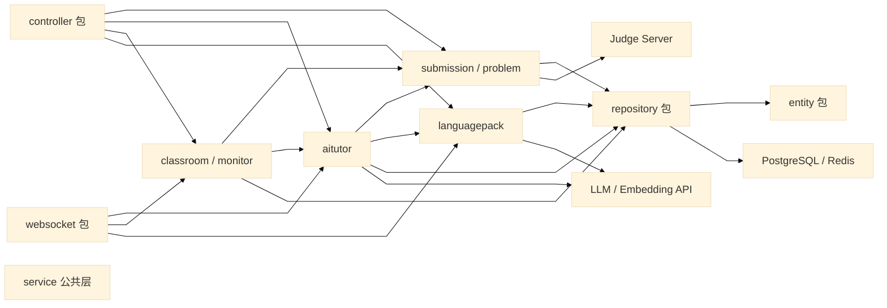

从调用关系上看：

- **学习任务评测模块** 是学生做题链路入口，负责代码提交、判题调度与结果回写。
- **AI 导学工作流模块** 以评测事件为输入，是系统教学能力的核心编排层。
- **课件知识问答模块** 与 **语言包初始化管线模块** 配合，负责把原始课件转化为可检索知识底座并对外提供问答能力。
- **错题闭环与专项复习模块** 依赖评测结果与 AI 诊断数据生成复习内容。
- **班级教学与学情分析模块** 聚合做题、课件、错题和 AI 交互数据，为教师提供班级管理和学情证据。
- **管理后台与系统配置模块** 负责题目、用户、知识点、课程内容包、判题服务和系统参数管理。

#### 3.1.3 关键功能/算法设计

本节给出“程序设计应用类”项目的关键功能流程与算法设计。系统未使用数据库存储过程，关键逻辑主要由 Spring Boot 服务层和 AI 工作流层实现。

**1. 代码提交、判题与 AI 导学联动流程**

该流程解决“学生提交后只能看到 AC/WA，却不知道下一步该做什么”的问题。系统在接收到提交后，不仅完成判题，还会把判题结果转化为教学事件，自动触发相应 Agent 和教学卡片。

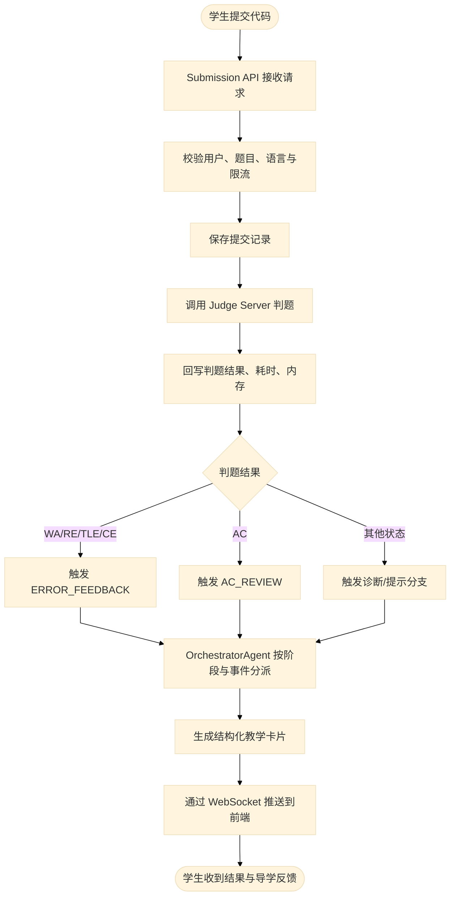

该流程的优化点有三项：

- 判题结果与教学反馈共用同一事件链路，避免“先判题、再额外请求 AI”的前后脱节。
- WebSocket 负责实时推送，减少前端轮询等待时间。
- Agent 调度基于阶段和事件，而不是让学生自己判断应当点击哪一种帮助。

**2. 多 Agent 调度算法**

该算法解决“一个大模型既要审题、又要诊断、还要复盘，导致角色漂移和回答越界”的问题。核心思想是：先由编排器判定阶段，再把任务分配给拥有最小必要上下文的专职 Agent。

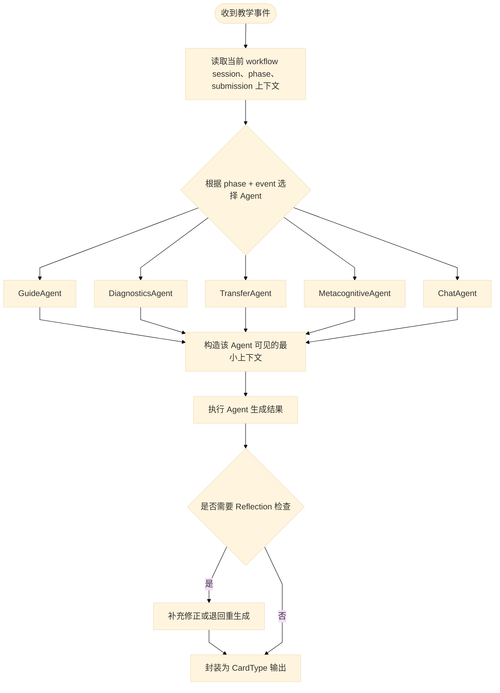

该调度算法的关键优化技巧是“**最小权限上下文**”与“**按类型输出**”：GuideAgent 不接触不必要的判题证据，DiagnosticsAgent 才能看到错误信息，输出最终统一落到结构化卡片协议，从而降低大模型自由发挥导致的答案泄露、风格漂移和诊断失焦。

**3. 课件初始化与 RAG 问答流程**

该流程解决“课件只是静态文件，学生无法把课件知识直接用于做题和复习”的问题。系统先将课件加工为知识底座，再在问答时把检索结果与生成结果绑定。

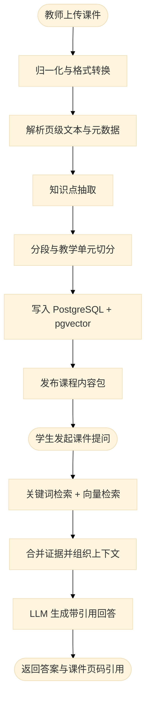

这里的优化点在于：

- 课件问答不是直接把整份课件喂给模型，而是先做页级解析、知识点抽取和分段，降低上下文噪声。
- 关键词检索与向量检索结合，兼顾术语精确匹配和语义相似匹配。
- 回答结果强制携带引用页码，便于学生回到原课件验证，降低幻觉风险。

**4. 错题闭环与专项复习生成流程**

该流程解决“学生错题只停留在记录层面，错误无法转化为后续学习动作”的问题。系统将错误提交、根因分析和复习建议串联为闭环。

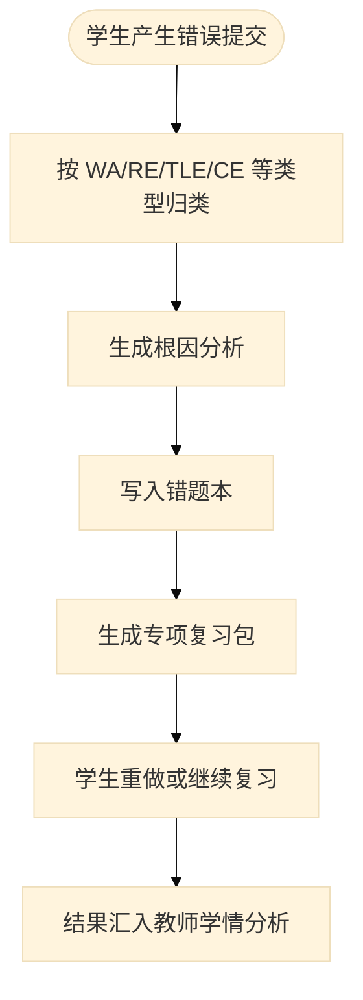

这一流程的核心技巧是把“错误结果”转化为“可复习对象”，使错题不再只是历史记录，而成为后续补题、反思和教师干预的依据。

### 3.2 数据结构设计

#### 3.2.1 存储数据

**1. 数据库**

本项目属于人工智能教育赛道，数据结构设计的重点不是传统业务管理字段，而是支撑 AI 导学、RAG 检索和教学闭环的数据对象。系统采用 `PostgreSQL 16 + JSONB + pgvector + Flyway` 的混合存储方案：关系型字段保证事务一致性，`JSONB` 保存 Agent 过程证据和半结构化卡片，`pgvector` 支撑课件页级语义检索，Flyway 迁移脚本负责数据库版本演进。

从逻辑上，数据库可分为四组核心对象：

- **基础教学对象**：`user`、`problem`、`submission`，承担学生、题目与判题结果的主数据。
- **Agent 导学对象**：`ai_workflow_session`、`ai_workflow_event`、`ai_workflow_checkpoint`，记录六阶段导学状态、事件和检查点。
- **教学闭环对象**：`ai_learner_notebook`、`ai_error_review_package`、`ai_error_review_problem`，将错误提交转化为可复盘、可复习、可统计的教学证据。
- **RAG 知识对象**：`language_pack`、`language_pack_init_task`、`language_pack_document`、`language_pack_page`、`language_pack_init_agent_run`，支撑课件加工、知识抽取、页级索引与 Agent 处理审计。

当前生产 Schema 未定义独立业务视图，核心数据对象均以数据表方式持久化；本节按“突出 Agent 与教学闭环”的原则，列出主要业务表的数据字典。

**系统逻辑数据模型 E-R 图：**

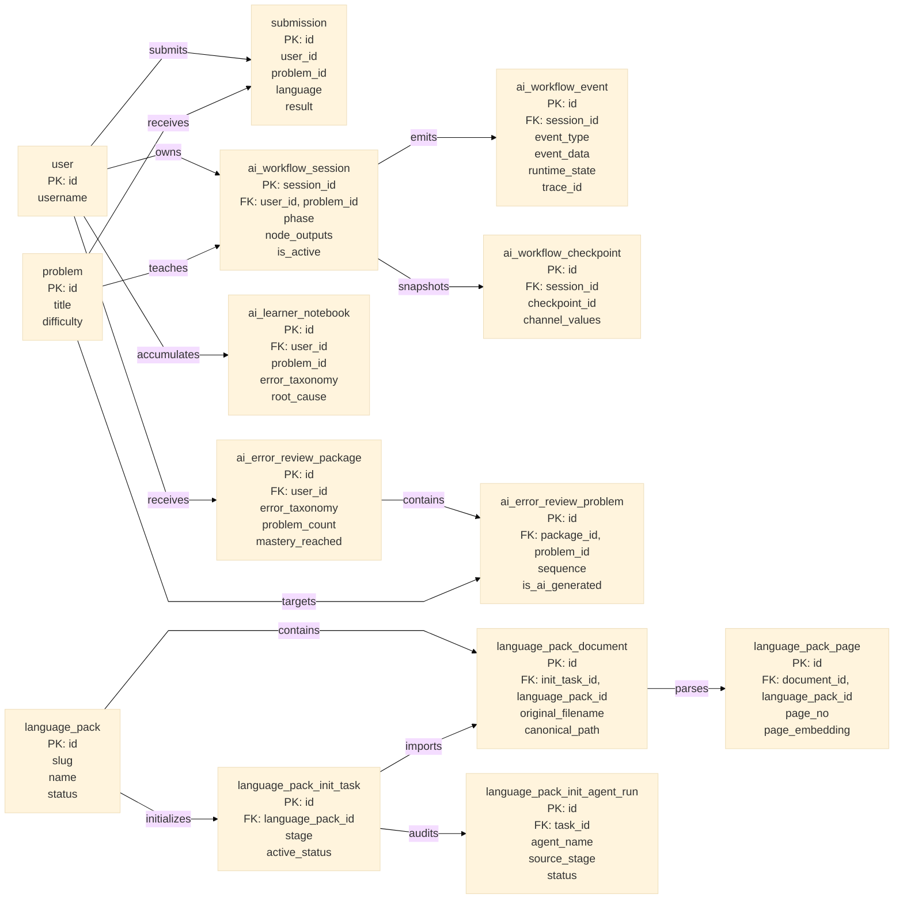

**主要业务表数据字典：**

表 3-1  AI 导学会话表  
数据表名：`ai_workflow_session`　　　　　中文描述：AI 导学工作流会话表

| 字段名称 | 字段描述 | 数据类型 | 长度 | 是否允许空 | 缺省值 | 备注 |
|---------|---------|---------|------|-----------|--------|------|
| session_id | 会话主键 | varchar | 64 | N | NULL | 主键 |
| thread_id | 线程标识 | varchar | 64 | N | NULL | 用于异步编排 |
| user_id | 学生 ID | bigint | 8 | N | NULL | 外键，关联 `user.id` |
| problem_id | 题目 ID | bigint | 8 | N | NULL | 外键，关联 `problem.id` |
| phase | 当前阶段 | varchar | 64 | N | `READING` | 六阶段状态 |
| node_outputs | 各节点输出缓存 | jsonb | - | N | `{}` | 存储结构化卡片输出 |
| behavior_metrics | 行为指标 | jsonb | - | N | `{}` | 连续报错、编辑频率等 |
| pending_human_action | 待用户动作 | text | - | N | 空串 | 前端交互提示 |
| last_safe_response | 最近安全回复 | text | - | Y | NULL | 安全过滤后保留 |
| submission_id | 最近提交 ID | varchar | 64 | N | 空串 | 关联提交上下文 |
| is_active | 是否活跃 | boolean | 1 | N | `true` | 会话有效标记 |
| created_at | 创建时间 | timestamptz | - | N | `now()` | 时间戳 |
| updated_at | 更新时间 | timestamptz | - | N | `now()` | 索引字段 |

约束与索引：主键 `session_id`；外键 `user_id`、`problem_id`；索引 `idx_ai_workflow_session_user_problem_active(user_id, problem_id, is_active, updated_at desc)`。

表 3-2  AI 导学事件表  
数据表名：`ai_workflow_event`　　　　　中文描述：AI 导学事件与运行时跟踪表

| 字段名称 | 字段描述 | 数据类型 | 长度 | 是否允许空 | 缺省值 | 备注 |
|---------|---------|---------|------|-----------|--------|------|
| id | 事件主键 | bigserial | 8 | N | 自增 | 主键 |
| session_id | 所属会话 ID | varchar | 64 | N | NULL | 外键，关联 `ai_workflow_session.session_id` |
| event_type | 事件类型 | varchar | 64 | N | NULL | 如 `READING`、`CHAT` |
| event_data | 事件载荷 | jsonb | - | N | `{}` | 前后端交换的事件参数 |
| created_at | 创建时间 | timestamptz | - | N | `now()` | 时间戳 |
| runtime_state | 运行态 | varchar | 32 | Y | NULL | Harness 运行时状态 |
| trace_id | 跟踪 ID | varchar | 64 | Y | NULL | 链路追踪键 |
| failure_bucket | 失败桶 | varchar | 64 | Y | NULL | 失败类型归因 |
| recovery_reason | 恢复原因 | varchar | 64 | Y | NULL | 中断后恢复说明 |

约束与索引：主键 `id`；外键 `session_id`；索引 `idx_ai_workflow_event_session_time(session_id, created_at asc)`、`idx_ai_workflow_event_runtime_state(runtime_state)`、`idx_ai_workflow_event_trace_id(trace_id)`。

表 3-3  AI 导学检查点表  
数据表名：`ai_workflow_checkpoint`　　　　　中文描述：工作流恢复检查点表

| 字段名称 | 字段描述 | 数据类型 | 长度 | 是否允许空 | 缺省值 | 备注 |
|---------|---------|---------|------|-----------|--------|------|
| id | 检查点主键 | bigserial | 8 | N | 自增 | 主键 |
| session_id | 所属会话 ID | varchar | 64 | N | NULL | 外键 |
| checkpoint_id | 检查点标识 | varchar | 64 | N | NULL | 会话内唯一 |
| channel_values | 通道状态快照 | jsonb | - | N | `{}` | 用于断点恢复 |
| created_at | 创建时间 | timestamptz | - | N | `now()` | 时间戳 |

约束与索引：主键 `id`；外键 `session_id`；唯一索引 `idx_ai_workflow_checkpoint_unique(session_id, checkpoint_id)`；索引 `idx_ai_workflow_checkpoint_session_time(session_id, created_at desc)`。

表 3-4  学习错因笔记表  
数据表名：`ai_learner_notebook`　　　　　中文描述：学生错题与根因反思表

| 字段名称 | 字段描述 | 数据类型 | 长度 | 是否允许空 | 缺省值 | 备注 |
|---------|---------|---------|------|-----------|--------|------|
| id | 笔记主键 | varchar | 64 | N | NULL | 主键 |
| user_id | 学生 ID | bigint | 8 | N | NULL | 外键，关联 `user.id` |
| problem_id | 题目 ID | bigint | 8 | Y | NULL | 逻辑关联 `problem.id` |
| language | 编程语言 | varchar | 32 | N | `Python3` | 默认 Python3 |
| error_taxonomy | 错误分类 | varchar | 64 | N | `unknown` | 如语法错、边界错 |
| root_cause | 根因分析 | text | - | Y | NULL | AI 生成 |
| fix_outcome | 修复结果 | text | - | Y | NULL | 学生修复结果 |
| student_reflection | 学生反思 | text | - | Y | NULL | 复盘文本 |
| tags | 标签数组 | jsonb | - | N | `[]` | 知识点、场景标签 |
| evidence_ptr | 证据指针 | jsonb | - | N | `{}` | 指向提交、堆栈、卡片 |
| is_deleted | 是否逻辑删除 | boolean | 1 | N | `false` | 软删除 |
| create_time | 创建时间 | timestamptz | - | N | `now()` | 时间戳 |
| update_time | 更新时间 | timestamptz | - | N | `now()` | 时间戳 |

约束与索引：主键 `id`；外键 `user_id`；索引 `idx_ai_notebook_user_create_time(user_id, create_time desc)`。

表 3-5  错题复习包表  
数据表名：`ai_error_review_package`　　　　　中文描述：按错误类型组织的专项复习包

| 字段名称 | 字段描述 | 数据类型 | 长度 | 是否允许空 | 缺省值 | 备注 |
|---------|---------|---------|------|-----------|--------|------|
| id | 复习包主键 | varchar | 64 | N | NULL | 主键 |
| user_id | 学生 ID | bigint | 8 | N | NULL | 外键 |
| error_taxonomy | 错误分类 | varchar | 64 | N | NULL | 与错因统一口径 |
| evidence_summary | 证据摘要 | jsonb | - | N | `{}` | 生成复习包依据 |
| problem_count | 题目数量 | integer | 4 | N | `0` | 包含题数 |
| completed_count | 已完成数量 | integer | 4 | N | `0` | 学习进度 |
| mastery_reached | 是否达到掌握 | boolean | 1 | N | `false` | 教学闭环结果 |
| created_at | 创建时间 | timestamptz | - | N | `now()` | 时间戳 |
| updated_at | 更新时间 | timestamptz | - | N | `now()` | 时间戳 |
| all_ac | 是否全部通过 | boolean | 1 | N | `false` | 全 AC 标记 |

约束与索引：主键 `id`；外键 `user_id`；索引 `idx_ai_error_review_package_user(user_id, created_at desc)`、`idx_ai_error_review_package_taxonomy(user_id, error_taxonomy)`。

表 3-6  复习包题目表  
数据表名：`ai_error_review_problem`　　　　　中文描述：复习包内题目明细表

| 字段名称 | 字段描述 | 数据类型 | 长度 | 是否允许空 | 缺省值 | 备注 |
|---------|---------|---------|------|-----------|--------|------|
| id | 明细主键 | varchar | 64 | N | NULL | 主键 |
| package_id | 复习包 ID | varchar | 64 | N | NULL | 外键，关联 `ai_error_review_package.id` |
| problem_id | 题目 ID | bigint | 8 | N | NULL | 外键，关联 `problem.id` |
| sequence | 题目顺序 | integer | 4 | N | `0` | 顺序字段 |
| submitted | 是否提交过 | boolean | 1 | N | `false` | 学生完成状态 |
| is_correct | 是否正确 | boolean | 1 | Y | NULL | 判题结果 |
| created_at | 创建时间 | timestamptz | - | N | `now()` | 时间戳 |
| is_ai_generated | 是否 AI 生成题 | boolean | 1 | N | `false` | 区分原题与变式题 |

约束与索引：主键 `id`；外键 `package_id`、`problem_id`；索引 `idx_ai_error_review_problem_package(package_id, sequence)`。

表 3-7  课程内容包表  
数据表名：`language_pack`　　　　　中文描述：课程内容包元数据表

| 字段名称 | 字段描述 | 数据类型 | 长度 | 是否允许空 | 缺省值 | 备注 |
|---------|---------|---------|------|-----------|--------|------|
| id | 内容包主键 | bigserial | 8 | N | 自增 | 主键 |
| slug | 业务标识 | varchar | 128 | N | NULL | 与版本组成唯一键 |
| version | 版本号 | integer | 4 | N | `1` | 版本化管理 |
| name | 内容包名称 | varchar | 256 | N | NULL | 课程名称 |
| primary_language | 主语言 | varchar | 64 | N | NULL | 如 Python |
| description | 描述 | text | - | N | 空串 | 内容包简介 |
| status | 状态 | varchar | 32 | N | `draft` | 草稿/可问答等 |
| document_count | 文档数 | integer | 4 | N | `0` | 聚合统计 |
| page_count | 页数 | integer | 4 | N | `0` | 聚合统计 |
| chapter_count | 章节数 | integer | 4 | N | `0` | 聚合统计 |
| kc_count | 知识点数 | integer | 4 | N | `0` | 聚合统计 |
| example_count | 例题数 | integer | 4 | N | `0` | 聚合统计 |
| problem_count | 题目数 | integer | 4 | N | `0` | 聚合统计 |
| create_time | 创建时间 | timestamptz | - | N | `now()` | 时间戳 |
| update_time | 更新时间 | timestamptz | - | N | `now()` | 时间戳 |
| course_objective | 课程目标 | text | - | Y | NULL | 课程级说明 |
| target_audience | 目标人群 | text | - | Y | `非计算机专业编程初学者` | 与项目定位一致 |
| total_hours | 总学时 | integer | 4 | Y | NULL | 课程学时 |
| creator_id | 创建者 ID | bigint | 8 | Y | NULL | 外键，关联 `user.id` |

约束与索引：主键 `id`；唯一约束 `(slug, version)`；索引 `idx_language_pack_creator(creator_id)`。

表 3-8  课程文档表  
数据表名：`language_pack_document`　　　　　中文描述：课件原件与规范化文档表

| 字段名称 | 字段描述 | 数据类型 | 长度 | 是否允许空 | 缺省值 | 备注 |
|---------|---------|---------|------|-----------|--------|------|
| id | 文档主键 | bigserial | 8 | N | 自增 | 主键 |
| init_task_id | 初始化任务 ID | bigint | 8 | N | NULL | 外键 |
| language_pack_id | 内容包 ID | bigint | 8 | N | NULL | 外键 |
| original_filename | 原始文件名 | varchar | 512 | N | NULL | 上传文件名 |
| original_path | 原始文件路径 | text | - | N | NULL | 文件系统路径 |
| canonical_path | 规范化文件路径 | text | - | Y | NULL | 转换后文档 |
| preview_pdf_path | 预览 PDF 路径 | text | - | Y | NULL | 在线预览使用 |
| file_hash | 文件哈希 | varchar | 128 | N | NULL | 去重校验 |
| file_size_bytes | 文件大小 | bigint | 8 | N | `0` | 字节数 |
| page_count | 页数 | integer | 4 | N | `0` | 文档页数 |
| status | 处理状态 | varchar | 32 | N | `pending` | `pending/normalizing/normalized/failed` |
| failure_reason | 失败原因 | text | - | Y | NULL | 失败信息 |
| create_time | 创建时间 | timestamptz | - | N | `now()` | 时间戳 |
| update_time | 更新时间 | timestamptz | - | N | `now()` | 时间戳 |

约束与索引：主键 `id`；外键 `init_task_id`、`language_pack_id`；检查约束 `chk_document_status`；唯一约束 `(init_task_id, file_hash)`；索引 `idx_lp_document_task(init_task_id)`、`idx_lp_document_pack(language_pack_id)`。

表 3-9  课件页表  
数据表名：`language_pack_page`　　　　　中文描述：页级文本与向量索引表

| 字段名称 | 字段描述 | 数据类型 | 长度 | 是否允许空 | 缺省值 | 备注 |
|---------|---------|---------|------|-----------|--------|------|
| id | 页主键 | bigserial | 8 | N | 自增 | 主键 |
| document_id | 文档 ID | bigint | 8 | N | NULL | 外键 |
| language_pack_id | 内容包 ID | bigint | 8 | N | NULL | 外键 |
| page_no | 页码 | integer | 4 | N | NULL | 原课件页号 |
| chunk_index | 分块序号 | integer | 4 | N | `0` | 支持一页多块 |
| page_title | 页标题 | varchar | 512 | N | 空串 | 检索辅助 |
| page_text | 页文本 | text | - | N | 空串 | RAG 原文 |
| text_hash | 文本哈希 | varchar | 128 | N | 空串 | 去重校验 |
| preview_asset_path | 页预览资源路径 | text | - | N | 空串 | 页面预览图 |
| excerpt | 摘要 | text | - | N | 空串 | 检索展示 |
| search_tsv | 全文检索向量 | tsvector | - | Y | NULL | PostgreSQL 全文索引 |
| page_embedding | 页向量 | vector | 16 维 | Y | NULL | `pgvector` 语义检索 |
| embedding_updated_at | 向量更新时间 | timestamptz | - | Y | NULL | 更新时间戳 |
| create_time | 创建时间 | timestamptz | - | N | `now()` | 时间戳 |

约束与索引：主键 `id`；外键 `document_id`、`language_pack_id`；唯一约束 `(document_id, page_no, chunk_index)`；索引 `idx_lp_page_document(document_id)`、`idx_lp_page_pack(language_pack_id)`、`idx_lp_page_search`（GIN 全文索引）、`idx_lp_page_text_hash(document_id, text_hash)`。

表 3-10  语言包 Agent 运行审计表  
数据表名：`language_pack_init_agent_run`　　　　　中文描述：课件加工阶段 Agent 运行记录表

| 字段名称 | 字段描述 | 数据类型 | 长度 | 是否允许空 | 缺省值 | 备注 |
|---------|---------|---------|------|-----------|--------|------|
| id | 审计主键 | bigserial | 8 | N | 自增 | 主键 |
| task_id | 初始化任务 ID | bigint | 8 | N | NULL | 外键，关联 `language_pack_init_task.id` |
| agent_name | Agent 名称 | varchar | 128 | N | NULL | 如抽取 Agent、生成 Agent |
| source_stage | 来源阶段 | varchar | 32 | N | NULL | 当前处理阶段 |
| model_name | 模型名称 | varchar | 128 | N | 空串 | 调用模型 |
| prompt_version | Prompt 版本 | varchar | 128 | N | 空串 | Prompt 审计 |
| input_artifact_hash | 输入制品哈希 | varchar | 128 | N | 空串 | 输入版本标识 |
| output_artifact_hash | 输出制品哈希 | varchar | 128 | N | 空串 | 输出版本标识 |
| status | 运行状态 | varchar | 32 | N | `running` | `running/completed/failed` |
| failure_reason | 失败原因 | text | - | Y | NULL | 异常说明 |
| create_time | 创建时间 | timestamptz | - | N | `now()` | 时间戳 |
| update_time | 更新时间 | timestamptz | - | N | `now()` | 时间戳 |

约束与索引：主键 `id`；外键 `task_id`；检查约束 `chk_lp_init_agent_run_status`；索引 `idx_lp_init_agent_run_task(task_id)`、`idx_lp_init_agent_run_agent(agent_name)`。

**2. 文件存储**

系统除数据库外，还使用文件系统保存 AI 处理所需的课件原件、规范化文档和预览文件。文件存储采用“数据库记录元数据、文件系统存放实体内容”的方式，其中数据库保存路径、哈希和状态，文件系统负责大文件与二进制资源保存。

**1）课程内容包文件存储**

- 根路径一：`language-pack.storage-root`
- 根路径二：`language-pack.preview-dir`
- 读取方式：由后端 `LanguagePackStorageService` 负责上传写入、规范化拷贝、预览文件生成和按任务清理

命名与目录规则如下：

- 原始课件：`{storage-root}/tasks/{taskId}/originals/{sanitizedFilename}`
- 规范化课件：`{storage-root}/tasks/{taskId}/canonical/{targetFilename}`
- 预览 PDF：`{preview-dir}/tasks/{taskId}/{targetFilename}`

文件含义如下：

- `originals`：教师上传的原始 PPT/PDF/Office 文档，作为可追溯原件。
- `canonical`：经 LibreOffice 或解析流程转换后的统一格式文档，供后续文本抽取和页级切分。
- `preview`：面向学生端引用跳转和课件预览的 PDF 文件。

数据库中的 `language_pack_document.original_path`、`canonical_path`、`preview_pdf_path` 字段与上述路径一一对应；`file_hash` 用于去重，`status` 标识文档是否完成规范化。

**2）平台通用上传文件**

- 根路径：`system.upload-dir`
- 读取方式：由平台上传接口写入，并通过数据库中保存的 URL 或相对路径访问

该部分主要存放头像、公告附件、公共上传资源等，不是本项目 AI 赛道能力的核心，因此在本节不作为重点展开。

#### 3.2.2 接口（模块接口、系统间接口）

本系统的接口设计围绕“前端教学交互、后端 Agent 编排、外部判题与模型调用”三类数据交换展开。交换方式包括 `REST/JSON`、`WebSocket`、数据库共享数据和 HTTPS 服务调用。

**1. AI 导学工作流接口**

该接口负责学生做题阶段的事件上报、Agent 触发和卡片返回，是 AI 导学助手的核心模块接口。

- 会话创建：`POST /api/ai/workflow/session`
- 事件触发：`POST /api/ai/workflow/event`
- 检查点查询：`GET /api/ai/workflow/checkpoint`
- 检查点恢复：`POST /api/ai/workflow/checkpoint/restore`
- 中断执行：`POST /api/ai/workflow/interrupt`

事件请求采用 JSON 格式，核心字段如下：

```json
{
  "session_id": "WF202604100001",
  "problem_id": 1001,
  "event": "ERROR_FEEDBACK",
  "event_data": {
    "submission_id": "S174425001",
    "language": "Python3",
    "request_execution_trace": true,
    "behavior_metrics": {
      "consecutiveErrors": 2,
      "submissionCount": 3
    }
  },
  "async": true
}
```

字段含义如下：

- `session_id`：当前导学会话标识，用于串联前后端上下文。
- `problem_id`：当前题目。
- `event`：触发事件，对应六阶段状态机事件，如 `READING`、`IDEATING`、`CODING`、`ERROR_FEEDBACK`、`AC_REVIEW`、`TRANSFER`、`CHAT`。
- `event_data`：事件细节参数，如代码、提交号、行为指标、是否请求运行轨迹等。
- `async`：是否采用异步分发并通过 WebSocket 回推结果。

同步响应中的 `node_outputs` 保存结构化卡片数据，`phase` 表示状态转换结果，`pending_human_action` 表示前端下一步建议动作。

**2. AI 导学实时推送接口**

当事件以异步方式执行时，前端通过 WebSocket 订阅工作流状态变化：

- 地址：`/ws/workflow/{sessionId}`
- 通讯协议：WebSocket 文本帧，载荷为 JSON
- 作用：推送阶段变化、运行状态、结构化卡片和取消结果

典型推送格式如下：

```json
{
  "type": "runtime_event",
  "server_event": "NODE_COMPLETED",
  "session_id": "WF202604100001",
  "phase": "ERROR_FEEDBACK",
  "runtime_state": "completed",
  "trace_id": "TRACE001",
  "node_outputs": {
    "error_diagnosis": {
      "card_type": "error_diagnosis",
      "root_cause": "循环边界少遍历了一次",
      "fix_direction": "检查 range 的终止值"
    }
  }
}
```

其中：

- `type`：消息类别，运行时事件固定为 `runtime_event`。
- `server_event`：服务端事件，如开始执行、节点完成、执行取消等。
- `runtime_state`：当前运行态。
- `trace_id`：链路追踪号。
- `node_outputs`：按输出键组织的结构化卡片内容，前端据此渲染不同教学组件。

**3. 判题系统接口**

系统通过后端向独立 Judge Server 发送 HTTP 请求，实现编译、运行和判题。该接口是系统间接口，承担“题目评测结果”向“教学诊断上下文”的转换入口。

请求格式如下：

```json
{
  "src": "print(sum(range(n + 1)))",
  "language_config": {
    "language": "Python3"
  },
  "max_cpu_time": 3000,
  "max_memory": 268435456,
  "test_case_id": "1001"
}
```

响应中包含结果码、时间、内存、编译错误或运行信息。后端将其转写为 `submission.result`、`submission.info`，并进一步写入 `ai_workflow_event` 或 `ai_learner_notebook`，供 DiagnosticsAgent 和错题闭环使用。

**4. 课件问答接口**

课件问答由 `REST + WebSocket + 数据库检索日志` 共同完成：

- 会话创建：`POST /api/language-pack-qa/sessions`
- 发送消息：`POST /api/language-pack-qa/sessions/{sessionId}/messages`
- 引用页查询：`GET /api/language-pack-qa/packs/{languagePackId}/documents/{documentId}/pages/{pageNo}`
- 文档预览：`GET /api/language-pack-qa/preview?ctx=...`
- 实时订阅：`/ws/qa/{sessionId}`

问答请求格式如下：

```json
{
  "content": "for 循环和 while 循环的区别是什么？"
}
```

系统把检索结果写入 `language_pack_chat_retrieval_log.page_hit_json`，其数据格式为页命中数组；回答正文与引用信息写入 `language_pack_chat_message.answer_json`。因此课件问答不仅返回文本，还保留“答了什么、引用了哪一页、学生是否认为有帮助”的完整证据链。

**5. 模型服务接口**

后端通过 HTTPS 调用 OpenAI 兼容格式的 LLM 与 Embedding 服务。其作用不是直接向前端暴露，而是作为 Agent 编排和课件向量化的外部系统接口。

- 输入：Prompt、证据包、结构化输出约束、待嵌入文本
- 输出：结构化教学卡片、页向量、课件加工结果

其中结构化输出的核心约束来自 `CardType` 协议，不同卡片类型要求不同字段集合，例如 `problem_guide` 必须包含 `plain_task`、`problem_explanation` 等字段，`error_diagnosis` 必须包含 `error_taxonomy`、`root_cause`、`fix_direction` 等字段。

#### 3.2.3 关键数据结构

本项目采用面向对象设计，运行期最关键的内存数据结构不是普通实体类，而是围绕 Agent 调度、证据拼装、结构化卡片和教学闭环聚合而设计的领域对象。其概念数据模型如下：

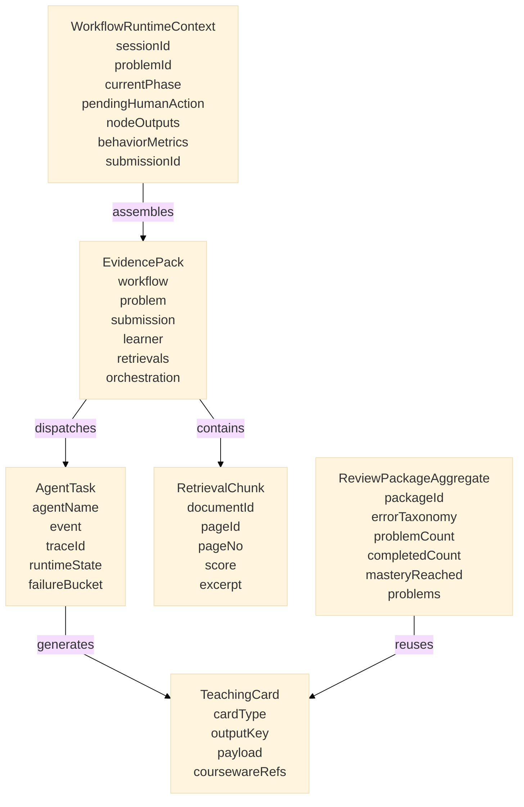

上述关键数据结构的作用如下：

- **WorkflowRuntimeContext**：保存当前导学会话的最小运行状态，是前端面板与后端状态机共享的上下文对象。
- **EvidencePack**：把题目、代码、判题、学生画像、检索结果等多源信息打包为 Agent 可消费的证据集合，是多 Agent 编排的输入中心。
- **AgentTask**：描述一次具体 Agent 执行任务，包含 Agent 身份、事件类型、链路追踪号和失败归因，便于 Harness 运行时审计。
- **TeachingCard**：统一 AI 输出协议。后端协议层定义了多类结构化卡片，当前前端题目页的 `UnifiedAgentPanel` 已直接接入核心教学卡片，并按卡片类型分发到不同组件渲染，避免自由文本导致的教学边界漂移。
- **RetrievalChunk**：表示一次课件检索命中的页级片段，既服务 RAG 生成，也服务引用展示和可验证回跳。
- **ReviewPackageAggregate**：把同类错误汇总为专项复习对象，使“错误提交”能够转化为“可执行的后续学习任务”。

其中，系统定义的核心状态枚举与卡片类型如下：

- **WorkflowPhase**：`READING`、`IDEATING`、`CODING`、`ERROR_FEEDBACK`、`AC_REVIEW`、`TRANSFER`
- **CardType（后端协议层定义）**：`problem_guide`、`ideate_analysis`、`worked_example`、`faded_example`、`parsons_problem`、`minimal_hint`、`error_diagnosis`、`execution_trace_explainer`、`post_ac`、`transfer_problem`、`ai_reply`
- **当前前端题目页已直接接入的卡片类型**：`problem_guide`、`ideate_analysis`、`error_diagnosis`、`execution_trace_explainer`、`post_ac`、`transfer_problem`、`ai_reply`
- **当前前端题目页的辅助卡片类型**：`skeleton_code`。该类型不属于后端 `CardType` 枚举，而是前端在思路分析后提供的代码骨架辅助组件。

需要说明的是，`worked_example`、`faded_example`、`parsons_problem`、`minimal_hint` 目前已经在后端协议和部分前端组件层完成定义，但在当前版本中尚未正式接入题目页统一导学面板。因此，从“协议设计”角度看，系统具备 11 类结构化卡片定义；从“当前前端真实呈现”角度看，学生在做题页面中实际可直接访问的是 7 类核心教学卡片和 1 类骨架辅助卡片。

这些关键数据结构共同保证了系统具备三项 AI 赛道所需能力：其一，Agent 输出在协议层是结构化和可校验的；其二，模型决策过程是可追踪和可恢复的；其三，教学数据能够从“做题瞬间”持续流向“错题复习”和“教师分析”，形成完整闭环。

### 3.3 系统界面设计

#### 3.3.1 界面设计风格

系统采用现代扁平化设计风格，以浅色为主色调，配合蓝色系主题色。页面布局采用左侧导航栏 + 右侧内容区的经典 Web 应用模式。关键设计原则：

- 信息层次清晰：通过卡片、分栏和标签页组织内容，避免信息过载
- 操作可识别：按钮、链接和可交互元素有明确的视觉区分
- AI 输出可回看：导学卡片采用分类着色与图标标识，学生可快速识别帮助类型
- 响应式布局：适配桌面浏览器主流分辨率

#### 3.3.2 主要功能页面

**首页仪表盘 (`HomeDashboard`)**：展示课程掌握度、已做题/已通过数量、今日待复习错题、快捷操作入口（去做题、课件问答、我的班级）、下一步学习建议、本周错题概况。

**个人主页 (`UserHome`)**：以个人学习档案为中心的综合数据看板。顶部 Hero 区展示用户头像与基本信息、AC 率环形图（通过/WA·TLE/总提交三色分段）、已解题目数与难度分布统计（简单/中等/困难）。主体区左侧纵向排列过去一年提交热力图（类 GitHub contribution heatmap，含累计通过、活跃天数、最长连胜、当前连胜四项指标）与知识星图/技能雷达双视图切换面板——知识星图按课程内容包渲染章节-知识点力导向图，支持节点点击查看掌握度详情与前置知识点跳转；技能雷达以多维雷达图展示各章节掌握程度。右侧纵向排列标签进度条（各题目标签的已解/总数及进度条）、今日待复习列表（基于间隔重复算法筛选的待复习知识点）和最近错题列表（最近 WA/RE 记录，可一键跳转至对应题目）。底部两列分别展示最近 AC 提交记录和个人易错点统计（错误模式名称、触发次数、最近触发时间）。

**题目详情页 + AI 导学面板**：左侧为题面与代码编辑器，右侧为 `UnifiedAgentPanel` AI 导学助手面板，按六阶段结构化展示教学卡片。

**错题本 (`LearnerNotebook`)**：支持按错误类型和编程语言筛选错题，查看根因分析与修复结果，手动补录记录，AI 生成学习反思，导出错题数据，一键跳转重做。

**课件问答页 (`LanguagePackQa`)**：选择课程内容包、查看历史会话、针对问题生成带证据引用的回答、打开引用页定位、对回答进行反馈。

**班级详情页 (`Classroom`)**：展示班级信息、课件管理、成员管理、题目管理（含 AI 生成题目）、作业管理。

**教师数据看板 (`ClassroomAnalytics`)**：班级学情周报、学习脉搏趋势图（近 7 天/近 30 天）、活跃知识点排行、薄弱知识点 TOP3 与教学建议、风险学生预警、课件使用分析、学生个体画像。

**管理后台 (`Admin`)**：用户管理、公告管理、题目管理（列表/创建/编辑/批量导入导出）、Judge Server 管理、语言包初始化管线与阶段日志、AI 服务配置、系统配置。

#### 3.3.3 Web 网站页面结构设计

```text
┌─ 首页仪表盘 (/)
│
├─ 题库 (/problems)
│   └─ 题目详情 (/problem/:id)  ──  AI 导学面板 (右侧)
│       └─ 提交记录 (/submissions)
│
├─ 课件问答 (/language-pack-qa)
│
├─ 错题本 (/learner-notebook)
│   └─ 专项复习包 (/review-package)
│
├─ 班级 (/classroom)
│   ├─ 班级详情
│   │   ├─ 课件管理
│   │   ├─ 成员管理
│   │   ├─ 题目管理
│   │   ├─ 作业管理
│   │   └─ 教师数据看板
│   └─ 加入班级
│
├─ 个人主页 (/user-home)
│
├─ 个人中心 (/settings)
│
└─ 管理后台 (/admin)
    ├─ 用户管理
    ├─ 题目管理
    ├─ 公告管理
    ├─ 语言包管理（初始化管线）
    ├─ Judge Server 管理
    ├─ AI 服务配置
    └─ 系统配置
```

---

## 4 系统安装及使用说明

本章面向评审、教师和现场演示人员，说明如何在一台 Ubuntu / WSL2 机器上安装、启动、验证和演示 Alethicode。系统以 Docker Compose 为运行边界，将 PostgreSQL、Redis、Java 后端、Judge Server 和 Vue 前端统一编排，避免评审环境手工配置数据库、判题沙箱和前端代理。

### 4.1 运行环境要求

| 项目 | 最低要求 | 说明 |
|------|----------|------|
| 操作系统 | Ubuntu 22.04+ / Windows WSL2 | 比赛安装包按 Linux Shell 环境组织 |
| CPU | 4 核及以上 | 推荐 8 核，便于后端构建与容器并行启动 |
| 内存 | 8GB 及以上 | 推荐 16GB，避免前端构建和 Java 后端启动时内存不足 |
| 磁盘 | 30GB 及以上可用空间 | 用于 Docker 镜像、数据库数据、测试用例和上传文件 |
| Docker | 24+ | 运行 PostgreSQL、Redis、Judge、Backend、Frontend |
| Docker Compose | v2 | 使用 `docker compose` 命令，不使用旧版 `docker-compose` |
| 基础命令 | `bash`、`tar`、`awk`、`tail`、`curl`、`rg` | 安装包、启动脚本和冒烟测试会直接调用 |
| 网络 | 首次启动需要联网 | 用于拉取基础镜像；启用 AI 能力时还需要访问 LLM / Embedding API |

### 4.2 安装包构建与交付

在源码所在机器执行以下命令生成比赛安装包：

```bash
cd /path/to/Alethicode
bash scripts/competition/build_competition_installer.sh
```

生成完成后，交付给评审环境的文件为：

```text
release/competition_installer/Alethicode-Installer.run
```

该 `.run` 文件会解压出完整运行目录，目录中包含：

| 目录 | 内容 |
|------|------|
| `bin/` | `start.sh`、`status.sh`、`smoke.sh`、`stop.sh` 等运行入口 |
| `project/backend/` | Spring Boot 后端源码与构建文件 |
| `project/frontend/` | Vue 3 前端源码与构建文件 |
| `project/deploy/` | Docker Compose、Nginx、环境变量模板和运行数据目录 |
| `offline_images/` | 可选离线镜像包目录 |

### 4.3 安装与配置

在评审机器上执行：

```bash
chmod +x Alethicode-Installer.run
./Alethicode-Installer.run
cd ~/.local/share/alethicode-competition/alethicode_competition
```

首次启动前检查环境变量文件：

```bash
cp project/deploy/.env.example project/deploy/.env
vim project/deploy/.env
```

必须保持有值的配置项如下：

| 配置项 | 作用 |
|--------|------|
| `DB_PASSWORD` | PostgreSQL 数据库密码 |
| `REDIS_PASSWORD` | Redis 访问密码 |
| `JUDGE_SERVER_TOKEN` | Judge Server 与后端心跳注册令牌 |

如需完整演示 AI 导学、课件问答、错题反思和专项复习包生成能力，需要在同一文件中填写真实模型服务配置：

| 配置项 | 作用 |
|--------|------|
| `SPRING_AI_ENABLED=true` | 打开 AI 服务调用 |
| `OPENAI_API_KEY` | LLM 服务密钥 |
| `LLM_BASE_URL` | LLM 服务地址 |
| `LLM_MODEL` | LLM 模型名称 |
| `EMBEDDING_API_KEY` | 向量模型密钥 |
| `EMBEDDING_BASE_URL` | 向量模型服务地址 |
| `EMBEDDING_MODEL` | 向量模型名称 |

系统默认不启用 ReAct 工具循环，`TUTOR_REACT_ENABLED` 与 `QA_REACT_ENABLED` 保持关闭即可完成比赛演示主链路。

### 4.4 启动、访问与验证

启动系统：

```bash
./bin/start.sh
```

启动脚本会按顺序完成以下动作：

1. 检查 Docker 与 Docker Compose。
2. 在 `project/deploy/.env` 不存在时由 `.env.example` 生成配置文件。
3. 校验 `DB_PASSWORD`、`REDIS_PASSWORD`、`JUDGE_SERVER_TOKEN` 三个必填项。
4. 构建并启动 PostgreSQL、Redis、Java Backend、Judge Server、Frontend 五个容器。
5. 输出系统访问地址与后续验证命令。

默认访问地址：

| 服务 | 地址 |
|------|------|
| 前端主页 | `http://127.0.0.1:18080` |
| 后端接口 | `http://127.0.0.1:8081` |
| API 文档 | `http://127.0.0.1:8081/api/docs` |
| 站点配置接口 | `http://127.0.0.1:18080/api/website` |

启动后执行验证：

```bash
./bin/status.sh
./bin/smoke.sh
```

验证通过标准：

| 验证项 | 通过标准 |
|--------|----------|
| 容器状态 | `postgres`、`redis`、`backend`、`judge`、`frontend` 均为运行状态 |
| 首页访问 | `http://127.0.0.1:18080` 可打开前端页面 |
| 基础 API | `/api/website` 返回站点配置包装结构 |
| 语言 API | `/api/languages` 返回 Python3、C、C++、Java 等语言配置 |
| CSRF | `/api/csrf` 可写入 `csrftoken` Cookie |
| 判题服务 | 管理后台可看到 Judge Server 心跳，题目提交可返回 AC / WA / CE / TLE 等判题结果 |

若任一验证项失败，本次部署视为未完成，应先查看容器状态和日志：

```bash
docker compose --env-file project/deploy/.env -f project/deploy/docker-compose.yml ps
docker compose --env-file project/deploy/.env -f project/deploy/docker-compose.yml logs --tail=120 backend judge frontend
```

### 4.5 账号与基础使用流程

演示账号：

| 角色 | 用户名 | 密码 | 用途 |
|------|--------|------|------|
| 管理员 | `root` | `root123456` | 进入管理后台、维护题目、查看 Judge Server 和系统配置 |

普通学生账号可在登录页注册。注册后即可进入首页仪表盘、题库、课件问答、错题本和班级页面。

学生侧使用流程：

1. 登录后进入首页仪表盘，查看课程掌握度、已做题数量、已通过数量和待复习错题。
2. 进入“课件问答”，选择课程内容包，围绕课件知识点提问并查看引用页。
3. 进入“做题”，打开题目详情页，在在线编辑器中编写 Python / C / C++ / Java 代码。
4. 提交代码后由 Judge Server 判题，页面展示 AC / WA / CE / TLE 等结果。
5. 右侧 AI 导学助手按审题、构思、编码、诊断、复盘、迁移六阶段生成教学卡片。
6. 出现错误提交后进入“错题本”，查看根因分析、AI 反思和专项复习入口。

教师与管理员侧使用流程：

1. 管理员登录后进入“管理后台”，完成用户、题目、公告、语言包、Judge Server 和 AI 服务配置维护。
2. 教师进入“班级”，创建班级、管理成员、添加班级题目、发布作业。
3. 教师在班级详情中查看数据看板，关注薄弱知识点、风险学生和班级学习趋势。
4. 管理员在“语言包初始化”中上传课件，执行解析、知识点抽取、例题抽取、题目生成、校验和发布流程。

### 4.6 答辩演示路线

演示路线按“学→练→诊→复→析”组织，控制在 4 到 5 分钟。

| 环节 | 页面路径 | 演示重点 | 建议时长 |
|------|----------|----------|----------|
| 首页仪表盘 | `/` | 展示课程掌握度、提交统计、待复习错题和学习建议 | 30 秒 |
| 学：课件问答 | `/language-pack-qa` | 提问课件知识点，展示带页码引用的回答 | 40 秒 |
| 练：做题 | `/problem` → 题目详情 | 编写并提交代码，展示真实 Judge 判题 | 60 秒 |
| 诊：AI 导学 | 题目详情右侧面板 | 故意提交 WA，展示 DiagnosticsAgent 错误诊断卡片 | 50 秒 |
| 复：错题本 | `/learner-notebook` | 展示错误记录、根因分析、AI 反思和复习包入口 | 40 秒 |
| 析：教师看板 | `/classroom` → 班级详情 | 展示班级周报、薄弱知识点和风险学生预警 | 40 秒 |
| 收尾 | `/` | 回到首页总结五环节数据闭环 | 20 秒 |

核心讲解顺序：

1. “学”：课件不是静态 PDF，而是经过语言包管线加工后可检索、可引用、可问答的课程内容包。
2. “练”：学生在同一页面完成读题、写代码、提交和查看判题结果，判题由独立沙箱执行。
3. “诊”：AI 导学助手不是通用聊天框，而是由 OrchestratorAgent 分派到专职 Agent，在错误发生后输出结构化诊断。
4. “复”：错误提交自动沉淀到错题本，后续可生成反思和专项复习包。
5. “析”：教师看板从提交、错题、知识点和班级数据中聚合教学证据，辅助教学干预。

### 4.7 停止与再次启动

查看状态：

```bash
./bin/status.sh
```

停止系统：

```bash
./bin/stop.sh
```

再次启动：

```bash
./bin/start.sh
```

运行数据默认保存在 `project/deploy/data/` 下，包括 PostgreSQL 数据、Redis 数据、测试用例、上传文件、语言包文件和 Judge Server 日志。重新启动不会清空这些数据。

---

## 5 总结

Alethicode 解决的核心问题是：**现有方案无法为非科班编程初学者提供"在正确的时机、由正确的角色、给出正确类型的教学反馈"**。

传统 OJ 只返回判题结果码，不提供教学反馈；通用 AI 聊天不知道学生的做题阶段和判题结果，无法精准干预；在 OJ 旁边拼装一个 LLM 聊天框，数据不通、阶段不分、质量不控，本质上是两个孤立系统的 UI 叠加。

Alethicode 通过两个层面的架构设计回应这个问题：

**AI 导学助手——多 Agent 结构化导学**：1 个编排 Agent + 5 个专职教学 Agent，按"审题→构思→编码→诊断→复盘→迁移"六阶段分工。每个 Agent 拥有独立的上下文权限和输出格式约束：GuideAgent 看不到测试用例答案因此不会泄露，DiagnosticsAgent 能访问判题结果因此诊断有据可查。11 类结构化卡片使 AI 输出"可分类、可统计、可质检"，而不是一段无结构的自由文本。阶段转换由系统事件自动驱动，无需依赖学生自行判断"下一步该做什么"。这种设计从架构层面保证了教学输出的适切性和稳定性，是单一 LLM prompt 无论如何调优都无法复现的。

**教学闭环——"学→练→诊→复→析"数据贯通**：五个环节的数据在同一平台内闭环流动——课件问答（学）的知识点标注为错题分类提供依据，做题（练）的提交记录是诊断（诊）的输入，诊断产出的根因沉淀为错题本（复）的复习素材，复习表现汇入教师看板（析），教师看板发现的薄弱点反过来指导 AI 导学的重点关注。如果这五个环节分属不同系统，数据在每个系统边界都会断裂，"智能化教学"就退化为互不关联的工具拼盘。教学闭环只有在同一平台内才能真正成立。

从工程角度看，362 个 Java 源文件、87 个测试文件、104 个 Vue 组件、307 个 API 端点、50 个数据库迁移脚本，证明这不是若干演示页面的拼接，而是具备完整管理后台和运行支撑的生产级平台。

未来改进方向包括：进一步丰富 AI 导学卡片类型、增强课件问答的引用精度、扩展更多编程语言支持、优化教师数据看板的可视化呈现。

---

## 6 附录

### 6.1 名词定义

| 名词/缩写 | 说明 |
|-----------|------|
| OJ | Online Judge，在线判题系统 |
| AC | Accepted，代码通过全部测试用例 |
| WA | Wrong Answer，输出结果与预期不符 |
| CE | Compile Error，编译错误 |
| TLE | Time Limit Exceeded，超时 |
| RE | Runtime Error，运行时错误 |
| MLE | Memory Limit Exceeded，超内存 |
| PAC | Partially Accepted，部分通过 |
| LLM | Large Language Model，大语言模型 |
| RAG | Retrieval-Augmented Generation，检索增强生成 |
| Agent | 智能体，系统中具有特定职责的 AI 角色 |
| KC | Knowledge Component，知识点 |
| pgvector | PostgreSQL 向量检索扩展 |
| WebSocket | 全双工通信协议，用于实时推送 |

### 6.2 参考资料

[1] Spring Boot 官方文档. https://spring.io/projects/spring-boot  
[2] Vue.js 3 官方文档. https://vuejs.org/  
[3] PostgreSQL 官方文档. https://www.postgresql.org/docs/  
[4] pgvector: Open-source vector similarity search for Postgres. https://github.com/pgvector/pgvector  
[5] Flyway 数据库迁移工具. https://flywaydb.org/  
[6] OpenAI API 文档. https://platform.openai.com/docs/  

### 6.3 源代码清单

| 目录 | 说明 | 文件数 |
|------|------|--------|
| `backend/src/main/java/` | 后端 Java 源代码 | 362 |
| `backend/src/test/java/` | 后端测试代码 | 87 |
| `frontend/src/views/` | 前端页面组件 | — |
| `frontend/src/components/` | 前端通用组件 | 104 (含页面) |
| `frontend/src/api/` | 前端 API 调用模块 | — |
| `backend/src/main/resources/db/migration/` | Flyway 数据库迁移脚本 | 50 |
| `deploy/` | 部署配置与 Docker 编排文件 | — |
