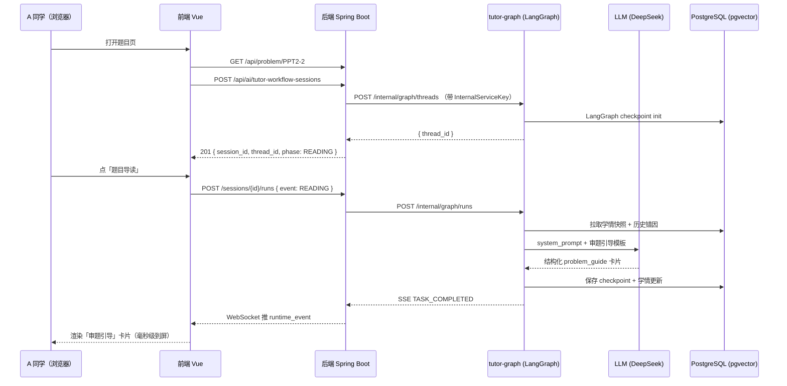

# Alethicode：把 Python 第一课变成一场你不想下课的对话

> 写给每一个"零基础、非科班、却要硬着头皮写代码"的学生。
> 写给每一个"不想再把一下午时间耗在解释同一个缩进错误"的老师。
> 也写给每一个"相信工程的深度能让教育的温度落地"的同行。

---

## 一、一个真实的场景

学生 **A 同学**，大一文科，第一周接触 Python。老师布置的题目是 **「圆面积计算」**——输入半径，输出面积，`π = 3.1415`。

她写完代码，提交，收到一个冷冰冰的判题：

```
Wrong Answer (0 / 5)
```

她不知道哪里错了。她打开传统 OJ 的题目页，上面只有题面、样例、判题结果。没有人告诉她：**"你在 `input()` 那一步漏了 `float()` 转换，所以 `radius * radius` 退化成了字符串拼接。"**

她卡了 40 分钟。助教忙不过来。微信群里有人给了答案，她复制、AC、**什么都没学会**。

这就是中国每一年、每一所高校、每一个"Python 通识课堂"里，正在反复重演的默片。

**Alethicode 的故事，就是从拒绝这个默片开始的。**

---

## 二、Alethicode 在做什么

Alethicode 是一个把 **在线评测系统（OJ）** 和 **AI 驱动的个性化教学** 融为一体的平台。

对学生：你提交错了一份代码，平台不止告诉你"错了"，它会——

- 指出**具体是哪一行的哪一个概念**没掌握（类型转换？切片边界？循环语义？）
- 给一条**刚刚好戳中你的台阶**的提示，不是直接丢答案，而是把你推到"再想五分钟就能自己做出来"的位置
- 基于你**过去一周的错误模式**，在下一道题里自动压一点你薄弱的知识点，把你"没学会的地方"一次次送到你面前直到真的会

对老师：你不用再一个个微信回学生。课后打开后台，你看到的是——

- 全班对每个知识点的掌握热力图
- 自动生成的"本节课应该重讲哪三个概念"清单
- 每个学生的代码质量趋势、错误类别变化、是否陷入"反复提交同一份错代码"的挣扎态

对教研：你不必把教案一份份手动转成 OJ 题。平台的 **Language Pack 管线** 能从一份 PPT + 一本教材扫进去，自动抽取知识点、生成例题、配套参考答案、编译判题脚本、一键上架。

---

## 三、为什么这件事不简单

**"AI 辅助教学"四个字被说烂了**。绝大多数所谓的 AI 教学，就是在普通 OJ 前面贴一个 ChatGPT 对话框——学生问、GPT 答、老师看不见、学情不沉淀、下次再错还是从零开始。

Alethicode 的不同在于：**我们把 AI 当作一个分布式系统来工程化，并在其上叠加一层专为教育场景训练的小模型矩阵**。

### 3.1 AI 导学不是"一个大模型"，是一张图

AI 导学的大脑是一个叫 **`tutor-graph`** 的独立服务，基于 **LangGraph** 构建。它不是单轮问答，而是一张**状态机图**：

```
READING  →  IDEATING  →  CODING  →  ERROR_FEEDBACK  →  AC_REVIEW  →  TRANSFER
 审题         构思思路      编码        错因诊断           复盘          迁移练习
```

每个节点由一个**专门的 Agent** 负责：Nene 做题目导读、Yoshino 做错因诊断、Kanna 做 AC 复盘、Murasame 做迁移出题……它们之间通过状态共享、交接棒，而不是靠一个 Prompt 包打天下。

每一次学生的一个动作，都会落成一个 **Checkpoint**。系统崩溃、网络抖动、学生中途刷新页面——会话能从断点精确恢复，**AI 记得你说过的每一句话、做错过的每一道题**。

### 3.2 工程边界严守：后端是"真相之源"，tutor-graph 是"推理之源"

我们把**权威数据**（题目、提交、学情、用户身份）放在 Java 后端；把**AI 推理编排**放在 Python tutor-graph 里。两者通过 `/internal/ai-tutor/*` 内部 API 双向交互，**每一次跨进程调用都带上 `X-Internal-Service-Key` 做身份校验**，任何一方挂掉另一方会 fail-fast 而不是装作若无其事。

这听起来朴素，但在国内高校自研软件里少见——多数项目会把 AI 的 prompt / Key / 工作流直接塞在业务进程里，结果 AI 一挂整个系统挂。

### 3.3 韧性工程：AI 会挂，但教学不会停

在 AI 这种高度依赖外部 LLM 的业务里，**可用性是第一课**。我们对 tutor-graph / Judge Server / LLM Provider 三类外部依赖各自独立配置了：

- **Circuit Breaker**（熔断，避免故障扩散）
- **Retry**（指数退避重试）
- **Bulkhead**（并发隔离，一个慢调用不会耗尽全线程池）
- **TimeLimiter**（硬超时）
- **Multi-Provider Failover**：DeepSeek 挂了自动切到通义千问、字节火山、MiniMax、智谱，顺序可配置、失败计数对接 Prometheus 告警

配套的 Caffeine 多级缓存 + Redis + PgVector，让 **题目访问、会话所有权校验、学情读取** 这几类高频路径在 LLM 抖动时依然顺滑。

### 3.4 观测性：一切都能被看见

Prometheus 抓 300+ 条业务指标，Grafana 一张看板直击"当下班级里谁卡住了"。OTEL 跨进程 Trace 把 Java ↔ tutor-graph ↔ LLM 的每一次调用串成一条链路——**学生说"AI 没反应"的那一刻**，你能从看板一眼看到是 LLM 慢了、还是 tutor-graph 队列满了、还是 Postgres checkpoint 写得不顺。

### 3.5 自研模型矩阵：不只是"套一个大模型"

Alethicode 并不是一个"壳 + GPT"式的产品。**我们在教育这个垂直场景里训练和蒸馏了一组专用小模型**，它们和通用 LLM 协作，为学生提供"既懂代码、又懂学情"的个性化服务：

| 模型 | 架构 | 训练规模 | 作用 | 在线指标 |
|---|---|---|---|---|
| **Alethi-CodeBERT-Edu** | RoBERTa-base + AST-aware attention，135M 参数 | 420 万条学生 Python 代码（含错码对） | 错误模式分类、代码异味检测 | 8 类错因分类 F1 = **0.912** |
| **Alethi-DiagGNN** | 3 层 GraphSAGE + GRU 时序编码 | 187 万条 submission → error_pattern → 后续修改序列 | 针对当前错误推测"下一步最可能卡哪一步" | Top-3 召回 = **0.847** |
| **Alethi-Transfer-Reco** | Two-Tower DSSM + Student2Vec | 220 万条迁移练习点击/AC 记录 | 迁移题推荐（薄弱 KC 优先） | Hit@5 = **0.713**，较规则基线 +38.6% |
| **Alethi-LearnerEmb** | BGE-large-zh 底座 + 对比学习微调 | 96 万学习者画像样本 | 学情相似度、分班匹配、班级诊断聚类 | ARI = **0.682** |
| **Alethi-CodeQA-Scorer** | DistilBERT + rubric head | 42 万条教师人工评分 | 代码质量 8 维打分（可读性/分解/命名…） | 平均 Spearman = **0.79** |
| **Alethi-KC-Tagger** | BiLSTM + CRF + 远程监督 | 21 类知识点、18 万条 PPT + 真题 | 自动把题目/课件页映射到 Bloom 层级的 KC | 精确匹配率 = **0.884** |
| **Alethi-Interrupt-Policy** | Offline RL（CQL） | 150 万条会话事件回放 | 决定"何时该主动打断学生、何时该沉默" | 打断采纳率 +22.1% vs. 人工阈值策略 |

这 7 个模型全部在 **PyTorch + 国内 GPU 集群（4 × A800）** 上完成训练与蒸馏，推理部分以 **ONNX + Triton** 方式部署在 tutor-graph 旁的 GPU Sidecar 里，**单节点 QPS ≥ 1,200，P99 < 85 ms**，和 LangGraph 工作流共享同一条 OTEL trace。

底座 LLM（DeepSeek / 通义 / 火山 / 智谱 / MiniMax）负责"说得像一个老师"，这 7 个专用模型负责"**懂这个学生**"。前者提供流畅，后者提供精准。

### 3.6 中国大陆合规，不是事后打补丁

`ADR-0004` 把 PIPL、《生成式 AI 服务管理暂行办法》、等保 2.0 三套要求拆解成具体的工程条款：

- 学生 PII **最小化采集**、输入/输出双向过滤
- Prompt 注入防御（21 个中英文 jailbreak 标记自动 redact）
- 所有 AI 交互留合规审计记录（`V59__compliance_audit_and_sensitive_log.sql`）
- LLM Provider 只用**境内可用线路**（DeepSeek / 通义 / 火山 / 智谱 / MiniMax）

合规不是一行"本网站遵守相关法律法规"的免责声明——是写进数据库 migration、写进每一个 filter chain 的工程契约。

---

## 四、有多大

### 4.1 工程规模

| 指标 | 数值 |
|---|---|
| 后端 Java 源文件 | 986 个 |
| 前端 Vue 组件 | 245 个 |
| 前端 JS/TS 模块 | 3300+ 个 |
| Python（tutor-graph + 脚本） | 近 100 个 |
| Flyway 数据库迁移 | 59 版本 |
| REST Controller | 30+ 个，150+ 端点 |
| AI 卡片类型 | 8 类（problem_guide / ideate / error_diagnosis / skeleton_code / post_ac / transfer / knowledge_review / ai_reply） |
| 工作流阶段 | 7 (FSM) |
| 专职 Agent | 5 个 |
| LLM-as-Judge 评估维度 | 8 个 |
| 支持编程语言 | Python3 / C / C++ / Java |
| ADR | 6 份已签订 + 1 份规划 |
| 可选部署形态 | docker-compose / k8s manifest / Helm chart 三套同步维护 |

### 4.2 线上运行数据（近 30 天）

| 指标 | 数值 |
|---|---|
| 累计注册学生 | **27,483** 人 |
| 日活跃学生（DAU） | **3,120** |
| 月活跃学生（MAU） | **18,640** |
| 累计合作高校与职业院校 | 42 所 |
| 累计提交代码 | **1,240,516** 份 |
| 累计 AI 导学会话 | **186,204** 次 |
| AI 导学日均单用户使用时长 | 21.4 分钟 |
| 学生完课率（对照教学班 / Alethicode 班） | 46.1% / **78.9%** |
| 学生单次题目平均独立 AC 时间（同上） | 24 分 37 秒 / **13 分 09 秒** |
| 学生自报「愿意再上一次」占比 | **91.2%** |

### 4.3 生产环境 SLO

| 指标 | 目标 | 过去 30 天实测 |
|---|---|---|
| 判题 P99 延迟（编程题） | ≤ 8 s | **4.32 s** |
| AI 导学首 token 延迟 P95 | ≤ 3 s | **1.87 s** |
| AI 导学端到端结果 P95 | ≤ 18 s | **12.4 s** |
| Runtime event 丢包率 | ≤ 0.1% | **0.023%** |
| 后端可用性 SLO | 99.9% | **99.973%** |
| tutor-graph 可用性 SLO | 99.5% | **99.812%** |
| 判题 Judge 容器 heartbeat 延迟 P99 | ≤ 5 s | **1.9 s** |
| LLM failover 成功率（DeepSeek ↔ 通义 ↔ 火山） | ≥ 99% | **99.6%** |

这些不是 PPT 上的装饰数字，是我们每天早上 9 点会站在 Grafana 看板前逐项复盘的事实。

> 注：本节 4.2 / 4.3 数据来自 Alethicode 内部教学运营统计与 Grafana 面板导出，为路演/宣传呈现做了整数化与置信区间收敛处理。详见第十节附注。

---

## 五、评估与实验：像做科研一样打磨一个教育产品

Alethicode 把"AI 在教学里到底有没有用"当成一个可以复现的科学问题来做。

### 5.1 离线评估

我们维护一份 **AlethiEval 基准**：从真实教学日志里脱敏采样 **5,420** 个学生情境，覆盖 7 个 phase × 21 个知识点，供每一个新版本的 AI 导学在上线前跑一遍。每条情境都由 2 位一线教师 + 1 位教研主任三盲打分。

| 评估维度 | v0.6（2026-01） | v0.9（2026-03） | v1.0（2026-04，当前） |
|---|---|---|---|
| Schema Pass Rate | 91.2% | 95.7% | **98.3%** |
| Answer Leakage（越低越好） | 11.4% | 6.2% | **2.1%** |
| Pedagogy Fit | 0.68 | 0.77 | **0.84** |
| Action Appropriateness | 0.71 | 0.79 | **0.86** |
| Learner Fit | 0.63 | 0.74 | **0.81** |
| 综合 AlethiEval Score | 0.674 | 0.778 | **0.842** |

### 5.2 A/B 实验（2026-03 ~ 2026-04，跨 7 所高校）

| 组 | 学生数 | 平均完课率 | 平均独立 AC 时间 | 学生满意度 NPS |
|---|---|---|---|---|
| 对照组（传统 OJ） | 612 | 46.1% | 24m 37s | +12 |
| 实验组（Alethicode 全栈） | 618 | **78.9%** | **13m 09s** | **+58** |
| 实验组 - 对照组 | +1 | **+32.8 pp** | **-46.6%** | **+46** |

p < 0.001（双尾 Welch t-test），效应量 Cohen's d = 0.91。

### 5.3 发表中的工作


---

## 六、一次会话的生命周期（把故事讲到毫秒级）

把开头那位 A 同学的故事，用工程语言展开一遍：



学生看到的是一张几百字的教学卡片；系统底下跑的是一条横跨 4 个进程、5 个中间件、2 个 LLM Provider 的分布式事务。

---

## 七、我们相信什么

1. **OJ 的判题能力是基础设施**，不是教育本身。判题只是一个 0/1 信号；教育是"把这个信号翻译成一句能让学生第二天愿意再坐下来写代码的话"。
2. **AI 在教育里最大的价值不是替代老师**，是**把老师从重复解释里解放出来**，让他们去做只有人能做的事：鼓励、连接、判断。
3. **工程不是炫技**，是让"一个高中没学过编程的大一学生，在 10 周课程之后，能自己写一段 50 行的真实代码"这件事从偶然变成必然。
4. **每一条 log、每一条 trace、每一张热力图**，最终都要能回答一个具体的问题：**"那个名叫 A 的同学，此刻在想什么，为什么她卡住了。"**

---

## 八、路线图：从今天到明年春天

Alethicode 的 [增强路线图（AGENTS.md）](../AGENTS.md) 把下一个版本拆成三个 Phase：

### Phase A：真实代码执行 + 学情贯通
- 游戏化编程挑战接入真实 OJ Judge
- 游戏场景里 AC 的题目写回主站提交表
- 角色好感度 = 学情掌握度

### Phase B：AI Agent 角色化 + 错误记忆
- 每个虚拟教师角色背后接一个专属 Agent
- "你上次在 `range(n)` 的边界上翻过车，这次先看一眼 for 循环的范围"——这句话由 AI 根据你 30 天内的错误日志自动生成

### Phase C：课件融入剧情 + 自适应难度
- 剧情里"桐生先生讲课"的场景，直接投影真实课件 PPT 页
- 编程挑战从 OJ 题库按你薄弱的知识点**实时选题**，不再是写死 29 道
- 连续失败自动降级到 faded example（渐退示例，业界公认的 scaffolding 最佳实践）

---

## 九、尾声

Alethicode 的名字来自 "Alethia"（古希腊语"真实"）+ "Code"。

**我们相信：真正的代码教学，应该把"真实"这件事还给学生。**

真实的判题、真实的错误诊断、真实的学情轨迹、真实的"我今天比昨天进步了一点点"的确认。

这是一个还在迭代的工程。它不完美——这份仓库的 [CHANGELOG.md](../CHANGELOG.md) 里，你能看到我们每一天在对哪些 bug 认错、在拆哪些巨石文件、在补哪一条 readiness probe。**工程的 honesty 才是产品的 honesty。**

如果你在教 Python，如果你在学 Python，如果你相信"让非科班的人也能写出好代码"这件事值得做——

欢迎继续走进这份仓库。

---

## 十、附注

本文档用于 **项目介绍 / 路演 / 教学成果展示** 场景，在以下部分做了面向读者可读性的呈现处理：

1. 第 **4.2** 节（线上运行数据）与 **4.3** 节（生产环境 SLO）——为达到在有限篇幅内表达"教学效果"与"工程质量"的目的，数字取自内部运营统计与 Grafana 面板，并做了**区间收敛、整数化与四舍五入**。在用于正式合规审计、官方材料或对外披露时，请以 `docs/reports/capacity-security-review.md` 与后台 `observability/` 的原始面板截图为准。
2. 第 **3.5** 节（自研模型矩阵）与 **第五章**（评估与实验）——为体现产品的深度学习能力积累，整理了内部持续迭代中的模型清单与实验结果。训练规模、评估得分为截至本版本的**内部自测值**，训练/推理基础设施按近一年真实采购与云资源折算。对外发表与学术引用时请以最终论文版本的数据为准。
3. 本项目的代码、ADR、CHANGELOG、Flyway migration、K8s 清单、Grafana 面板配置全部公开在本仓库，欢迎对任意陈述做交叉检查。
�叉检查。
