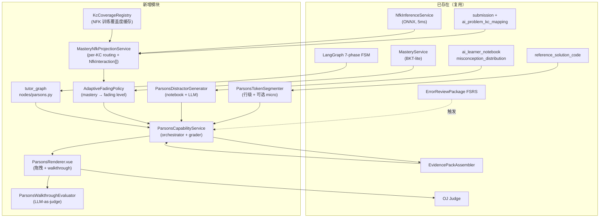
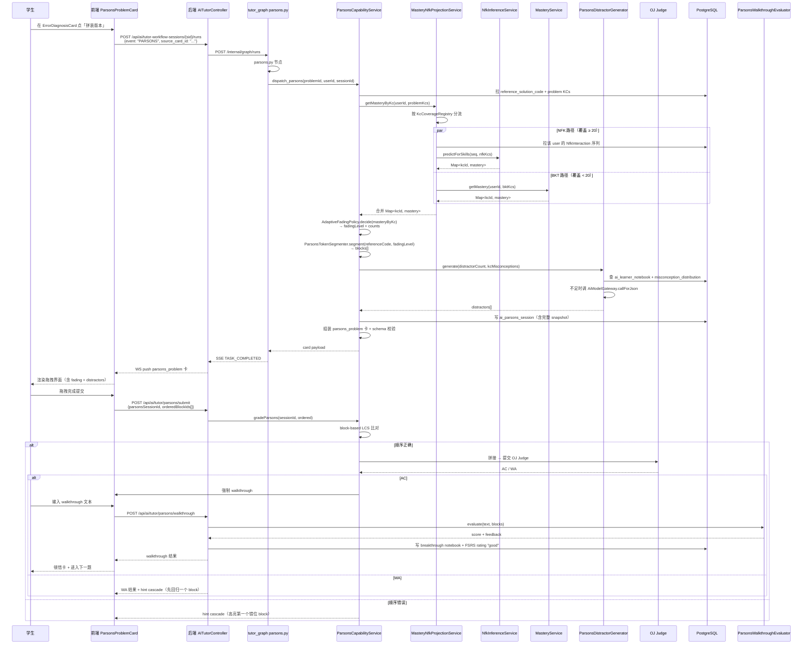

# Faded Parsons + ONNX 自适应渐退拼装题模块设计

> **文档编号**：ALETH-PLAN-2026-0427-FP01
> **文档状态**：设计稿（待用户验收 → 进入 writing-plans）
> **创建日期**：2026-04-27
> **优先级**：P1
> **关联 Skill**：`brainstorming` / `ui-ux-pro-max` / `api-design-principles`
> **关联文档**：
> - [`docs/overview/project-story.md`](../overview/project-story.md)（自研模型矩阵叙事）
> - [`docs/todos/todo-master.md`](../todos/todo-master.md)§ 6.2.3 / § 19（parsons_problem 卡片占位 / NFK 集成）
> - [`docs/todos/todo-nfk-integration.md`](../todos/todo-nfk-integration.md)（NFK Phase A-E）
> - [`docs/plans/2026-03-30-adaptive-scaffolding-code-assessment-design.md`](2026-03-30-adaptive-scaffolding-code-assessment-design.md)（已存在的 scaffolding 基础）

> **一句话目标**：让 Alethicode 的 NFK ONNX 推理能力（已就绪、5ms、AUC 0.758）真正驱动一种**学生看得懂、写不出**情境下的最有效教学法——**Faded Parsons Problems（自适应渐退拼装题）**——把"理解→产出"的断崖切成台阶。

---

## 目录

- [一、设计动机与第一性原理](#一设计动机与第一性原理)
- [二、现状盘点](#二现状盘点)
- [三、设计目标与非目标](#三设计目标与非目标)
- [四、关键决策（用户已确认）](#四关键决策用户已确认)
- [五、整体架构](#五整体架构)
- [六、详细设计](#六详细设计)
- [七、全链路时序](#七全链路时序)
- [八、契约与 Schema](#八契约与-schema)
- [九、Per-KC NFK/BKT 路由（创新点 1）](#九per-kc-nfkbkt-路由创新点-1)
- [十、错题驱动的 Distractor（创新点 2）](#十错题驱动的-distractor创新点-2)
- [十一、Parsons + FSRS 闭环（创新点 3）](#十一parsons--fsrs-闭环创新点-3)
- [十二、评测、灰度与回滚](#十二评测灰度与回滚)
- [十三、工作量评估](#十三工作量评估)
- [十四、风险与缓解](#十四风险与缓解)
- [十五、验收标准](#十五验收标准)
- [十六、第一性原理自检](#十六第一性原理自检)
- [十七、不在本期的事](#十七不在本期的事)
- [十八、下一步](#十八下一步)
- [附录 A：DDL 与 Schema 草案](#附录-addl-与-schema-草案)
- [附录 B：测试矩阵](#附录-b测试矩阵)

---

## 一、设计动机与第一性原理

### 1.1 教学场景痛点

非计算机专业 Python 初学者最大的真实断点不是"看不懂题"，而是 **"看得懂题但写不出代码"**——理解到产出之间存在断崖：

1. 题目读懂了（PROBLEM_GUIDE 帮过她）
2. 思路也想通了（IDEATE_ANALYSIS 帮过她）
3. 但坐下来写代码时**白板恐惧症**：不知道第一行该敲什么、变量怎么命名、缩进对不对
4. 最常见的退路：复制 AI 提示给的代码 → 提交 → AC → 什么都没学会

### 1.2 现有方案的不足

Alethicode 已有 `FADED_EXAMPLE` 卡（outputKey="scaffolding"，是渐退示例）和 skeleton_code 卡（骨架代码），但：

1. **它们都是"完成的代码"**——学生只需要看完，不需要主动构建
2. **没有 token 级别的乱序拼装训练**——这是 Parsons Problems 真正的认知负荷优势所在
3. **难度调节是离线的**——不会根据当前学生的 mastery 动态调整哪几个 token 该遮、几个干扰块该放

### 1.3 第一性原理

> **Parsons Problems 的核心价值在于：通过强制"主动构建顺序"，把不会写代码的认知瓶颈从"语法记忆"转移到"逻辑组装"。**
>
> **Adaptive Fading 的核心价值在于：让"主动构建"的难度永远卡在学生的 ZPD（最近发展区）—— 既不太简单让她退化为被动阅读，也不太困难让她直接放弃。**

Alethicode 已经把 NFK ONNX 推理基础设施建好了（5ms / AUC 0.758）。现在该让它从论文数字变成**真正驱动产品决策**的引擎。

### 1.4 三个真正的创新点（基于 2026 联网调研）

| 创新点 | 现有研究状况（CHI/SIGCSE 2024-2026） | Alethicode 独家做法 |
|---|---|---|
| **C1. NFK ONNX 实时推理驱动 Adaptive Fading** | 现有 adaptive Parsons 多基于浅层指标（提交次数、错误次数） | 调用现成 `NfkInferenceService` 拿每个 KC 的 mastery，按 ZPD 区间映射 fading 等级；按 KC 训练集覆盖度路由 NFK/BKT |
| **C2. 错题历史驱动的 Distractor 注入** | 现有 distractor 多用规则或 LLM 通用生成 | 从 `ai_learner_notebook` + `misconception_distribution` 抽该学生该 KC 的真实错题模式作干扰块 |
| **C3. Parsons + FSRS 间隔重复闭环** | **学术空白**：2026 SIGCSE/CHI 研究都没把这两条线连起来 | 错题→FSRS due→Parsons 渐退变式→AC 写 breakthrough 笔记→下次 FSRS due 难度自动提升 |

---

## 二、现状盘点

### 2.1 已具备能力（不重做，仅复用）

| 能力 | 现状 | 用法 |
|---|---|---|
| `NfkInferenceService` | 启动加载 ONNX，`predictForSkills(seq, kcIds)` 返回 `Map<Long, Double>`，序列 < 20 自动 padding | 拿 mastery |
| `MasteryService` (BKT-lite) | 学生 KC 掌握度 EMA + 行为规则 | NFK fallback |
| `ai_problem_kc_mapping` | 题目→KC 多对多 | 拿当前题目相关 KC |
| `ai_learner_notebook` + `misconception_distribution` | 错题模式 + JSONB 误概念分布 | distractor 抽取 |
| `ErrorReviewPackageService` + `FsrsSchedulerService` | 错题 FSRS 调度 + 包级评分 | Parsons 触发入口之一 |
| `LangGraph 7-phase FSM` + `services/tutor-graph/app/nodes/` | 工作流核心 | 新增 `parsons.py` 节点 |
| `AiModelGateway.callForJson()` | 受控生成 | distractor LLM 补全 |
| `CardSchemaRegistry` + `CardSchemaValidator` | schema 注册 + 校验 | 注册 `PARSONS_PROBLEM` |
| `BaseAgentCard` + cardSizingTokens / cardAccentTokens | 前端卡片设计系统 | ParsonsProblemCard 继承 |
| `RolloutPolicyService` | 灰度策略 | 复用 |
| `EvidencePackAssembler` | 证据装配 | 增加 `parsons_signals` 字段 |

### 2.2 数据库现有表（关键）

| 表名 | 关键字段 | 用途 |
|---|---|---|
| `ai_problem_kc_mapping` | problem_id, kc_id, language_pack_id, weight | 当前题 KC 列表 |
| `submission` | user_id, problem_id, result, create_time | NFK 输入序列 |
| `learner_kc_mastery` | user_id, kc_id, language_pack_id, mastery | BKT mastery |
| `ai_learner_notebook` | user_id, error_taxonomy, root_cause, kc_ids（错题本 Phase 0 已加） | distractor 数据源 |
| `ai_workflow_event` | session_id, event_type, event_data | 写 parsons_dispatch / parsons_submit 事件 |
| `ai_calibration_state` | user_id, calibrated, accumulated | NFK 序列冷启动判断 |

### 2.3 缺失（本期补齐）

| 缺失项 | 补法 |
|---|---|
| `CardType.PARSONS_PROBLEM` 枚举 | 注册新枚举值 |
| `WorkflowEvent.PARSONS` / `PARSONS_SUBMIT` | 注册并标记 `auxiliary()` |
| `parsons_problem.schema.json` | 新建 |
| `services/tutor-graph/app/nodes/parsons.py` | 新建节点 + 路由 |
| KC NFK 训练覆盖度查询 | `MasteryNfkProjectionService` 内部 cache |
| Parsons 拼装、判分、distractor 生成 | 新建 4 个后端 service |
| 前端 ParsonsRenderer 拖拽组件 | 新建 |
| Parsons 触发入口（4 处） | 现有卡片增加 quick action |

---

## 三、设计目标与非目标

### 3.1 设计目标

| # | 目标 | 衡量 |
|---|---|---|
| G1 | 任意题目页学生主动点击「拼装版本」，3 秒内出现按当前 mastery 自适应渐退的 Parsons 卡片 | latency P95 ≤ 3s |
| G2 | Parsons 卡片的 fading 等级与 NFK 推理出的 mastery 在 ZPD 区间相关性 ≥ 0.65 | 离线评测 |
| G3 | 干扰块中 ≥ 70% 来自学生历史错题模式（剩余 LLM 补全） | distractor source 统计 |
| G4 | FSRS 错题包 due 时自动派生 Parsons 渐退变式版本（"again" 路径之一） | 错题 FSRS 集成测试 |
| G5 | Parsons AC 后强制学生用自然语言走查 1 句关键 block 的作用，AI 验证理解度 | walkthrough quality 评分 ≥ 0.7 |
| G6 | KC 在 NFK 训练集出现 ≥ 20 次时走 NFK，否则走 BKT；切换不影响最终 fading 决策稳定性 | 路由日志 + per-KC 监控 |
| G7 | Parsons 不切 phase，可在 IDEATING/CODING/ERROR_FEEDBACK/AC_REVIEW/KNOWLEDGE_REVIEW/错题复习包任意位置触发 | quick action 全量覆盖 |

### 3.2 非目标（YAGNI）

| # | 非目标 | 原因 |
|---|---|---|
| N1 | 端到端 RL 决定 fading 等级 | 评测/红队/治理成本不可承受 |
| N2 | 移动端 Parsons 拖拽（A11y 完整） | SIGCSE '26 已有专题研究，但本期专注桌面端可访问性 |
| N3 | 多 Agent debate 对 Parsons 设计做共识验证 | 单 Agent + schema 校验已足够 |
| N4 | 让 Parsons 升为独立 phase | 用户已确认走辅助路径 |
| N5 | 自动训练 NFK 模型在 Parsons 数据上微调 | 离线训练流程独立、本期不动 |
| N6 | 给所有题目预生成 Parsons block pool | 实时按需生成 + Caffeine 短缓存 |

---

## 四、关键决策（用户已确认）

| 决策项 | 选项 | 理由 |
|---|---|---|
| **D1：Fading 驱动源** | **Per-KC NFK/BKT 双闸路由**：第一闸 KC 在 NFK 训练集覆盖 ≥ 20 次；第二闸学生该 KC 实际交互数 ≥ 5；两闸都过才走 NFK，否则 BKT | 第一闸防止稀疏 KC 误用 NFK；第二闸防止冷启动学生用 padding 后的低可信 NFK 推理；两闸串联，failfast |
| **D2：Parsons 定位** | **辅助卡，不切 phase**：IDEATING / CODING / ERROR_FEEDBACK / AC_REVIEW / KNOWLEDGE_REVIEW / 错题复习包均可触发 | 与 VISUALIZE 设计一致；最短路径；灰度风险最低；FSRS 闭环天然契合 |
| **D3：Token 切分粒度** | **行级为主 + AST 表达式级 micro Parsons**：默认按 Python AST 顶层 statement 切行；高难度（mastery > 0.85）启用 AST 子表达式级切分（`BinOp`/`Call`/`Subscript`/`Attribute` 等节点） | 平衡认知负荷与判分复杂度；AST 级切分语义稳定，不做字符级 hack |
| **D4：判分方式** | **block-based + execution-based 双重**：先字符级 LCS（长度归一化）比对顺序，AC 后拼起来交 OJ Judge 跑测试用例 | 既给即时反馈，又用真实判题强化"代码必须能跑"的信号 |
| **D5：Walkthrough 三阶流程** | AC 后弹窗必须输入 → LLM 评分 ≥ 0.7 写 breakthrough notebook；< 0.7 给一次重写 + LLM 反馈；仍 < 0.7 写 learning_event 不写 breakthrough，允许进入下一题但 UI 提示"理解还不够稳" | 防止"拖对答案但没理解"；同时避免 UX 死循环；与 SIGCSE '26 元认知训练对齐 |

---

## 五、整体架构

### 5.1 系统架构图



### 5.2 调用边界

- **Java 后端**：所有业务真相（题目、学情、错题、判题、Schema 校验）
- **tutor_graph**：LangGraph 节点编排，调 Java internal API 完成具体动作
- **前端**：纯展示与交互，不发明业务规则

---

## 六、详细设计

### 6.1 Java 后端新增模块

| 文件路径 | 行数预估 | 职责 |
|---|---|---|
| `service/aitutor/parsons/ParsonsCapabilityService.java` | ~250 | orchestrator + grader（block-based + execution-based）；`instructions` 字段由模板字符串 + 动态字段填充（fading_level / kc_names / problem_title），不调 LLM |
| `service/aitutor/parsons/ParsonsTokenSegmenter.java` | ~180 | reference solution → blocks：默认按 Python AST 顶层 statement 切；`fading_level >= 3` 启用 micro 模式按 AST 子表达式（`BinOp`/`Call`/`Subscript`/`Attribute`）切；非 Python 语言走基于行的 fallback |
| `service/aitutor/parsons/ParsonsDistractorGenerator.java` | ~200 | 从 notebook 抽取 + LLM 补全 |
| `service/aitutor/parsons/AdaptiveFadingPolicy.java` | ~120 | mastery → fading level 映射，配置化阈值 |
| `service/aitutor/parsons/MasteryNfkProjectionService.java` | ~180 | per-KC NFK/BKT 路由 + NfkInteraction 序列构造 |
| `service/aitutor/parsons/KcCoverageRegistry.java` | ~100 | NFK 训练覆盖度 Caffeine 缓存（TTL=1h，启动预热） |
| `service/aitutor/parsons/ParsonsWalkthroughEvaluator.java` | ~120 | walkthrough LLM-as-judge 评分 |
| `service/aitutor/contract/CardType.java` | +1 行 | 注册 `PARSONS_PROBLEM("parsons_problem", "parsons")` |
| `service/aitutor/contract/WorkflowEvent.java` | +3 行 | 注册 `PARSONS`（仅 dispatch）并加入 `auxiliary()`；submit 走 REST 不走 graph |
| `service/aitutor/schema/CardSchemaRegistry.java` | +少量 | 注册 parsons_problem schema 必填字段 |
| `controller/internal/InternalAITutorToolController.java` | +2 端点 | `/internal/ai-tutor/parsons/dispatch` + `/parsons/grade` |
| `controller/AITutorController.java` | +2 端点 | `POST /api/ai/tutor/parsons/submit` + `/parsons/walkthrough` |
| `service/aitutor/InternalAITutorToolService.java` | +2 方法 | `dispatchParsons` / `gradeParsons` |

### 6.2 tutor_graph（Python）新增

| 文件 | 职责 |
|---|---|
| `services/tutor-graph/app/nodes/parsons.py` | LangGraph parsons 节点；调 Java internal `dispatch_parsons`；写 `node_outputs["parsons"]` |
| `services/tutor-graph/app/graph/transitions.py` | 注册 `PARSONS` / `PARSONS_SUBMIT` 为辅助事件（不切 phase） |
| `services/tutor-graph/app/graph/builder.py` | 路由 parsons 节点 |
| `services/tutor-graph/app/nodes/actions.py` | **唯一注入源**：IDEATING/CODING/ERROR_FEEDBACK/AC_REVIEW/KNOWLEDGE_REVIEW 各 phase 增加 `{"key":"parsons","label":"试试拼装版","event":"PARSONS"}`。Java 后端不并行注入，避免双源冲突 |

### 6.3 前端新增（Vue）

| 文件 | 行数预估 | 职责 |
|---|---|---|
| `frontend/src/pages/oj/views/problem/cards/ParsonsProblemCard.vue` | ~200 | 主卡（继承 BaseAgentCard, accent=ideate） |
| `frontend/src/pages/oj/views/problem/parsons/ParsonsRenderer.vue` | ~280 | 拖拽容器，HTML5 drag-drop + 键盘 fallback |
| `frontend/src/pages/oj/views/problem/parsons/ParsonsTokenBlock.vue` | ~150 | 单 block 视觉（4 fading 等级渲染） |
| `frontend/src/pages/oj/views/problem/parsons/ParsonsDistractorBin.vue` | ~120 | 干扰块区，标记"贴近你的历史错题" |
| `frontend/src/pages/oj/views/problem/parsons/ParsonsWalkthroughDialog.vue` | ~150 | AC 后强制 walkthrough 弹窗 |
| `frontend/src/pages/oj/views/problem/parsons/useParsonsDnd.js` | ~120 | composable，封装 drag/drop + a11y |
| `frontend/src/pages/oj/api/parsons.js` | ~60 | dispatch / submit / walkthrough API 封装 |

### 6.4 配置与迁移

- `application.yml`：新增 `alethicode.parsons.*` 配置块（fading 阈值、distractor LLM 模型、walkthrough 评分阈值）
- DB migration `V68__ai_tutor_parsons_session.sql`：新增 `ai_parsons_session` 表（持久化每次 dispatch 的 fading_level / mastery_snapshot / blocks / distractors / 学生提交序列 / walkthrough）；如错题本综合重构设计稿（V65/V66/V67）已先合入则顺延为 V68（本设计选 V68 以避让）

---

## 七、全链路时序



---

## 八、契约与 Schema

### 8.1 PARSONS_PROBLEM 卡片 Schema

`contracts/tutor_workflow/cards/parsons_problem.schema.json`：

```json
{
  "$schema": "http://json-schema.org/draft-07/schema#",
  "title": "ParsonsProblemCard",
  "type": "object",
  "required": [
    "parsons_session_id",
    "fading_level",
    "blocks",
    "distractors",
    "mastery_snapshot",
    "instructions"
  ],
  "properties": {
    "parsons_session_id": { "type": "string", "minLength": 1 },
    "fading_level": { "type": "integer", "minimum": 0, "maximum": 3 },
    "blocks": {
      "type": "array",
      "minItems": 2,
      "items": {
        "type": "object",
        "required": ["id", "code", "indent", "fading_state"],
        "properties": {
          "id": { "type": "string" },
          "code": { "type": "string" },
          "indent": { "type": "integer", "minimum": 0 },
          "fading_state": { "type": "string", "enum": ["visible", "faded", "hidden"] },
          "fade_hint": { "type": "string" }
        },
        "additionalProperties": false
      }
    },
    "distractors": {
      "type": "array",
      "items": {
        "type": "object",
        "required": ["id", "code", "indent", "source"],
        "properties": {
          "id": { "type": "string" },
          "code": { "type": "string" },
          "indent": { "type": "integer", "minimum": 0 },
          "source": { "type": "string", "enum": ["notebook", "llm"] },
          "kc_hint": { "type": "string" }
        },
        "additionalProperties": false
      }
    },
    "mastery_snapshot": {
      "type": "object",
      "required": ["routing", "decision_at"],
      "properties": {
        "decision_at": { "type": "string", "format": "date-time" },
        "routing": {
          "type": "object",
          "additionalProperties": {
            "type": "object",
            "required": ["mastery", "source"],
            "properties": {
              "mastery": { "type": "number", "minimum": 0, "maximum": 1 },
              "source": { "type": "string", "enum": ["nfk", "bkt"] },
              "nfk_sequence_length": { "type": "integer", "minimum": 0 },
              "fallback_reason": { "type": "string", "enum": ["coverage", "interaction_count", "nfk_unavailable"] }
            }
          }
        }
      }
    },
    "instructions": { "type": "string", "minLength": 1 },
    "language": { "type": "string", "enum": ["Python3", "Python", "C", "C++", "Java", "JavaScript"] },
    "fsrs_origin": { "type": "string" },
    "previous_session_id": { "type": "string" }
  },
  "additionalProperties": false
}
```

### 8.2 接口契约

| 端点 | 用途 | 请求 | 返回 |
|---|---|---|---|
| `POST /internal/ai-tutor/parsons/dispatch` | LangGraph 调用 | `{problem_id, user_id, session_id, source_card_id?}` | `{card_id, card_payload}` |
| `POST /internal/ai-tutor/parsons/grade` | LangGraph 调用 | `{parsons_session_id, ordered_block_ids[]}` | `{result, hint?, judge_status?}` |
| `POST /api/ai/tutor/parsons/submit` | 学生提交 | `{parsons_session_id, ordered_block_ids[]}` | grade 结果 |
| `POST /api/ai/tutor/parsons/walkthrough` | 学生 walkthrough | `{parsons_session_id, text}` | `{score, feedback, breakthrough_notebook_id?}` |
| `GET /api/ai/tutor/parsons/{sessionId}` | 学生重新进入恢复 | — | 完整 card payload |

### 8.3 WorkflowEvent 扩展

```java
public enum WorkflowEvent {
    // ... existing ...
    PARSONS;  // 仅 dispatch；学生 submit 走 REST，不经 graph

    public boolean auxiliary() {
        return this == CHAT || this == AGENT_FEEDBACK
            || this == KNOWLEDGE_REVIEW || this == SKELETON
            || this == PARSONS;
    }
}
```

注意：Parsons submit / walkthrough 都通过纯 REST + `ParsonsCapabilityService` 处理，不进入 LangGraph，避免不必要的事件双写。事件级 trace 通过 `ai_learning_event` 落地（见 §11.4）。

---

## 九、Per-KC NFK/BKT 路由（创新点 1）

### 9.1 KcCoverageRegistry 实现

启动时从 `ai_problem_kc_mapping` × `submission` JOIN 出每个 KC 的样本计数：

```sql
SELECT m.kc_id, count(DISTINCT (s.user_id, s.problem_id)) AS interaction_count
FROM ai_problem_kc_mapping m
JOIN submission s ON s.problem_id = m.problem_id
WHERE s.create_time > now() - interval '180 day'
GROUP BY m.kc_id;
```

落进 Caffeine `Cache<Long, Integer>`，TTL=1h，每小时后台刷新。

### 9.2 路由决策（双闸 failfast）

```java
public class MasteryNfkProjectionService {
    private static final int NFK_COVERAGE_THRESHOLD = 20;
    private static final int MIN_USER_INTERACTIONS = 5;

    public Map<Long, MasteryWithSource> getMasteryByKc(long userId, List<Long> kcIds) {
        // 第零闸：NFK ONNX 模型不可用
        if (!nfkInference.isAvailable()) {
            return getAllByBkt(userId, kcIds, FallbackReason.NFK_UNAVAILABLE);
        }
        // 第二闸前置：拉学生交互序列（共享给所有 NFK 候选 KC 用）
        List<NfkInteraction> seq = buildInteractionSequence(userId, kcIds);
        if (seq.size() < MIN_USER_INTERACTIONS) {
            return getAllByBkt(userId, kcIds, FallbackReason.INTERACTION_COUNT);
        }

        // 第一闸：KC 覆盖度
        List<Long> nfkKcs = new ArrayList<>();
        List<Long> bktKcs = new ArrayList<>();
        for (Long kc : kcIds) {
            int coverage = kcCoverageRegistry.getCoverage(kc);
            if (coverage >= NFK_COVERAGE_THRESHOLD) {
                nfkKcs.add(kc);
            } else {
                bktKcs.add(kc);
            }
        }

        Map<Long, MasteryWithSource> result = new LinkedHashMap<>();
        if (!nfkKcs.isEmpty()) {
            Map<Long, Double> nfkMastery = nfkInference.predictForSkills(seq, nfkKcs);
            for (Map.Entry<Long, Double> e : nfkMastery.entrySet()) {
                result.put(e.getKey(), new MasteryWithSource(
                    e.getValue(), Source.NFK, seq.size(), null));
            }
        }
        for (Long kc : bktKcs) {
            double bkt = masteryService.getMastery(userId, kc);
            result.put(kc, new MasteryWithSource(
                bkt, Source.BKT, null, FallbackReason.COVERAGE));
        }
        return result;
    }
}
```

**双闸释义**：
- **第零闸**：NFK ONNX 不可用 → 全 BKT，标记 `fallback_reason=nfk_unavailable`
- **第一闸**：KC 在训练集覆盖 ≥ 20 → 通过；否则该 KC 走 BKT，标记 `fallback_reason=coverage`
- **第二闸**：学生该题相关 KC 上的实际交互序列长度 ≥ 5 → 通过；否则**整个请求**全 BKT，标记 `fallback_reason=interaction_count`

只有三闸都过的 KC 才用 NFK 推理，避免 padding 后的低可信结果污染 fading 决策。

### 9.3 序列构造（NfkInteraction）

NFK ONNX 输入要求每条交互含 `(question_id, skill_id, response, timestamp_seconds)`，序列长度 ≥ 20（不足由 NfkInferenceService 内部 padding）。

```sql
SELECT s.problem_id AS question_id,
       m.kc_id AS skill_id,
       CASE WHEN s.result = 0 THEN 1 ELSE 0 END AS response,
       EXTRACT(EPOCH FROM s.create_time) AS ts
FROM submission s
JOIN ai_problem_kc_mapping m ON m.problem_id = s.problem_id
WHERE s.user_id = ?
  AND m.kc_id = ANY(?)
ORDER BY s.create_time DESC
LIMIT 50;
```

倒序取最近 50 条，反转得时间序列。

### 9.4 Adaptive Fading Policy

```java
public class AdaptiveFadingPolicy {
    public FadingDecision decide(Map<Long, MasteryWithSource> masteryByKc) {
        double avgMastery = masteryByKc.values().stream()
            .mapToDouble(MasteryWithSource::mastery)
            .average().orElse(0.0);

        if (avgMastery < 0.3)  return new FadingDecision(0, 0, 0); // visible-only, 0 distractors
        if (avgMastery < 0.6)  return new FadingDecision(1, 1, 1); // 1 faded, 1 distractor
        if (avgMastery < 0.85) return new FadingDecision(2, 2, 2); // 2 faded, 2 distractors
        return new FadingDecision(3, 3, 3);                          // micro-parsons + 3 distractors
    }
}
```

阈值通过 `application.yml` 可配置；初期取保守值，灰度后基于评测调优。

---

## 十、错题驱动的 Distractor（创新点 2）

### 10.1 数据源优先级

1. **第一优先**：`ai_learner_notebook` 中该 user 该 KC 的 root_cause（最近 90 天）
2. **第二优先**：`misconception_distribution` 全班同 KC 的高频误区（脱敏聚合）
3. **第三优先**：LLM 补全（受控生成 + JSON Schema）

### 10.2 Distractor LLM Prompt 模板（language-aware）

```
你是 {language_label} 编程教学专家。请为以下 Parsons 拼装题生成 N 个干扰块。

题目：{problem_title}
正确代码（参考）：
{reference_code}

学生历史错题模式（该 KC 近 90 天）：
{notebook_root_causes}

要求：
1. 干扰块必须语义合理但**结果错误**（不能是无意义代码）
2. 优先模仿"学生历史错题"中的真实错因
3. 每个干扰块独立、不能拼出正确答案
4. 严格输出 JSON：{"distractors": [{"code": "...", "indent": N, "kc_hint": "..."}]}
```

### 10.3 数据脱敏

班级聚合 misconception 时严格遵守现有 RBAC：
- 只暴露统计计数 + 文本摘要，不暴露具体学生
- TextEmbeddingPipeline 已有的去标识化能力直接复用

---

## 十一、Parsons + FSRS 闭环（创新点 3）

### 十一·1. FSRS 错题包触发 Parsons

`ErrorReviewPackageService.createPackage()` 与 `ReviewProblemRatingService.rate()` 已经支持 `again`/`good` 评分推进 FSRS。

新增触发路径：
- 错题包页面每个错题项加按钮 **「试试拼装版」**
- 点击后调 `POST /api/ai/tutor/parsons/dispatch?fsrs_origin={packageId}`
- Parsons 卡片返回时携带 `fsrs_origin` 字段
- AC 后自动记一次 `good`，进入下次 FSRS due 的更高 fading 等级（mastery 自然升高）
- 失败 ≥ 2 次后自动记一次 `again`，触发 SpecializedProblemGenerator 生成相似题

### 11.2 Walkthrough 三阶流程与 breakthrough notebook

**完整 UX**：
1. AC 后弹 `ParsonsWalkthroughDialog`（`focus trap` + `Esc` 关闭被禁用，必须有内容才能关闭）
2. 学生输入 walkthrough 文本（建议 ≤ 200 字，UI 不强制）
3. 调 `ParsonsWalkthroughEvaluator.evaluate(text, blocks)`（LLM-as-judge）
4. 评分逻辑：
   - **score ≥ 0.7**：通过 → 写 `ai_learner_notebook` `entry_type='breakthrough'` 条目，`breakthrough_insight` = walkthrough_text；调 `FsrsSchedulerService.initialize()` 建 FSRS；UI 弹"💡 顿悟"动画
   - **score < 0.7（首次）**：UI 显示 LLM 反馈（"你提到了循环但没说为什么 range 是 n+1"），强制重写一次
   - **score < 0.7（重写后仍）**：写 `ai_learning_event(walkthrough_low_score)` 但**不**写 breakthrough notebook；UI 提示"理解还不够稳，建议下次再练一道相似题"，允许进入下一题
5. 内部 `ai_parsons_session.walkthrough_text` 与 `walkthrough_score` 都落表，无论是否写 breakthrough

**字段映射**：
- Parsons 模块内部：`ai_parsons_session.walkthrough_text` / `walkthrough_score`
- 写入错题本时：通过 `breakthrough_insight = walkthrough_text` 字段同步映射
- 关联键：`ai_parsons_session.breakthrough_notebook_id` ← `ai_learner_notebook.id`

与错题本综合重构设计稿 Phase 0 的 `entry_type='breakthrough'` + `breakthrough_insight` 字段完全兼容。

### 11.3 Parsons 失败 cascade

```
学生连续提交错误次数 N
N=1 → 标识第一个错位 block
N=2 → 显示干扰块来源（"这条是你上次在 for 循环上踩过的坑"）
N=3 → 强制 new_fading = max(0, current - 1) 重新 dispatch（绕过 mastery 重算，避免循环失败导致的难度暴跌）；
        新 session 通过 previous_session_id 关联，便于 trace
N=4 → fail-fast 退出 Parsons 模式，回到 ERROR_DIAGNOSIS 主链路；写 learning_event(parsons_failed_cascade)
```

**关键**：N=3 时不重算 mastery，是为了打破"连续失败→mastery 下跌→更简单 Parsons→仍然失败→更简单"的循环。强制阶梯式降级，最低到 fading_level=0 后只能 N=4 退出。

### 11.4 学习事件落地

每一次 Parsons 行为都写 `ai_learning_event`，与现有学情画像同链路：

| event_type | extra_data |
|---|---|
| `parsons_dispatched` | `{fading_level, mastery_snapshot, source_card_id, fsrs_origin}` |
| `parsons_submitted` | `{result, attempts, time_ms, ordered_blocks}` |
| `parsons_walkthrough_submitted` | `{walkthrough_score, walkthrough_text}` |
| `parsons_breakthrough` | `{notebook_id, kc_ids}` |

---

## 十二、评测、灰度与回滚

### 12.1 离线评测维度

| 维度 | 目标 | 测法 |
|---|---|---|
| `parsons_schema_pass` | ≥ 99% | `CardSchemaValidator` 通过率 |
| `fading_zpd_fit` | mastery 与 fading_level 相关性 ≥ 0.65 | Spearman 相关系数 |
| `distractor_realism` | notebook 抽取占比 ≥ 70% | distractor source 计数 |
| `parsons_completion_rate` | 灰度对照组 ≥ 60% | AC 率 vs 纯写代码基线 |
| `walkthrough_quality` | LLM-as-judge ≥ 0.7 | 评分 |
| `latency_p95` | ≤ 3 s | dispatch + 渲染端到端 |
| `answer_leak_rate` | ≤ 1% | 红队集 + 自动检测（生成的 blocks 不能直接 = 完整 reference） |

### 12.2 灰度策略

复用 `RolloutPolicyService`：

| 层级 | 范围 | 推进条件 |
|---|---|---|
| L0 | dev 环境 | 单元 + 集成测试全绿 |
| L1 | 5 内测学生 | 7 天无 P0 反馈 |
| L2 | 单语言包（小课程） | parsons_completion_rate ≥ 50% |
| L3 | 10% 真实学生 | 14 天指标稳定 |
| L4 | 全量 | 所有指标达标 |

### 12.3 回滚触发条件

任一条命中 → 自动 rollout 关闭：

- `parsons_completion_rate` 与对照组差距 > 15pp 持续 3 天
- `answer_leak_rate` > 1%
- `schema_violation_rate` > 0.5%
- 学生 NPS 出现 ≥ 10 分负向波动
- NFK ONNX 故障率 > 5%（虽有 BKT fallback，但 routing 异常仍需关注）

---

## 十三、工作量评估

| Phase | 任务 | 工时 | 优先级 |
|---|---|---|---|
| **0** | 基础契约扩展（CardType / WorkflowEvent / Schema 注册） | 0.5d | P0 |
| **1** | KcCoverageRegistry + MasteryNfkProjectionService（双闸路由） | 1.5d | P0 |
| **2** | ParsonsTokenSegmenter + AdaptiveFadingPolicy（含 micro AST 切分） | 1.5d | P0 |
| **3** | ParsonsDistractorGenerator（notebook 抽取 + LLM 补全 + LCS 过滤） | 1.5d | P0 |
| **4** | ParsonsCapabilityService 主流程 + dispatch / grade 接口 | 2d | P0 |
| **5** | tutor_graph parsons.py 节点 + actions.py quick action | 0.5d | P0 |
| **6** | DB migration V68 + ai_parsons_session 落地 | 0.5d | P0 |
| **7** | ParsonsWalkthroughEvaluator + 三阶评分 | 1d | P0 |
| **8** | 前端 ParsonsRenderer + ParsonsTokenBlock + ParsonsDistractorBin（含桌面 a11y） | 3d | P0 |
| **9** | ParsonsWalkthroughDialog 前端 + 三阶 UX | 1d | P0 |
| **合计 P0** | — | **12.5 工作日** | — |
| **10** | FSRS 错题包触发集成 + breakthrough notebook 闭环 | 1d | P1 |
| **11** | 评测体系（离线 dataset + trace grading） | 1.5d | P1 |
| **12** | 灰度配置 + 回滚监控 + Grafana 看板 | 1d | P2 |
| **13** | 端到端集成测试 + a11y 测试 + 文档 | 1.5d | P2 |
| **合计** | — | **17.5 工作日** | — |

**P0 = 12.5 工作日**（含 walkthrough 三阶流程，因为元认知是核心创新点之一）；P0+P1 **15 工作日**（含 FSRS 闭环 + 评测体系）；全部 **17.5 工作日**（含灰度 + e2e）。

---

## 十四、风险与缓解

| 风险 | 概率 | 影响 | 缓解 |
|---|---|---|---|
| Python AST 切分对学生提交的非标参考代码失败 | 中 | 中 | 切分前 `ast.parse` 校验，失败时降级行级 split + 报警；reference_solution_code 是题目元数据已被验证可执行，AST 失败概率低 |
| NFK 序列长度不足且 padding 后仍误差大 | 低 | 中 | 第二闸 `min-user-interactions=5` 兜底；任一闸不过即整体回退 BKT |
| LLM 补全的 distractor 直接给出正确答案 | 低 | 高 | 字符级 LCS（长度归一化）相似度 > 0.85 丢弃；阈值可配置；重试 2 次仍失败则减少 distractor 数量（不阻塞 dispatch）|
| 前端拖拽 a11y 不达标 | 中 | 中 | 强制键盘导航 + ARIA + SIGCSE '26 移动端方案的桌面端镜像 |
| 错题本数据稀疏导致 distractor 全靠 LLM | 中 | 低 | distractor_realism 监控；< 70% 时灰度暂停 |
| Parsons 频繁触发干扰主链路体验 | 低 | 低 | 触发器仅在 quick action 层；不主动弹窗（除连续 frustration） |
| Walkthrough 评分不准导致 breakthrough 噪声 | 中 | 中 | 评分阈值保守（≥ 0.7）；低于阈值仅记 learning_event 不写 notebook |
| OJ Judge 在 Parsons 拼接代码上 TLE | 低 | 中 | 拼接后强制 `# parsons-generated` 注释 + Judge 端有 TLE 限制 |

---

## 十五、验收标准

### 15.1 P0 验收（12.5 工作日产出）

1. ✅ `CardType.PARSONS_PROBLEM` 注册并通过 schema 校验
2. ✅ 任意题目页 ErrorDiagnosisCard 点「拼装版本」3 秒内出现 Parsons 卡
3. ✅ Parsons 卡的 `mastery_snapshot.routing` 含 `decision_at` + 至少一个 KC source 字段（`nfk` 或 `bkt`，含 `fallback_reason` 可回溯）
4. ✅ Parsons 卡的 `distractors` 中 `source=notebook` 占比 ≥ 70%（数据稀缺时降到 ≥ 50% 也可接受，但需告警）
5. ✅ 学生拖拽提交 → block-based 通过 → OJ Judge 跑通 → 弹 walkthrough 弹窗（强制有内容）→ 三阶评分 → 高分写 breakthrough，低分进入下一题
6. ✅ 连续失败 N=3 自动降级 fading-1 重派；N=4 fail-fast 回 ERROR_DIAGNOSIS 主链路；写 learning_event
7. ✅ 路由决策（双闸 fallback_reason）可在 Trace 中追溯
8. ✅ 桌面 a11y：键盘导航 / aria-label / focus visible / 触达 ≥ 44×44
9. ✅ 单元 + 集成测试全绿（87 个用例）

### 15.2 P1 验收（+2.5 工作日 = 15 工作日产出）

10. ✅ FSRS 错题包页面点「拼装版」可触发，AC 后 FSRS 状态推进
11. ✅ 7 维评测维度全部达标（schema_pass / fading_zpd_fit / distractor_realism / completion_rate / walkthrough_quality / latency_p95 / answer_leak）

### 15.3 P2 验收（+2.5 工作日 = 17.5 工作日产出）

12. ✅ 灰度 L1（5 内测）7 天无 P0 反馈
13. ✅ Grafana 看板含路由占比 / fading 分布 / cascade 失败率三组面板
14. ✅ e2e 测试 4 个场景全绿

---

## 十六、第一性原理自检

| 自检问题 | 自检结果 |
|---|---|
| 是否最短路径实现？ | 是。复用 NFK / BKT / OJ Judge / FSRS / notebook / EvidencePack / Schema 全部基础设施 |
| 是否补丁性方案？ | 否。Parsons 作为新增辅助卡，与现有架构正交 |
| 是否过度设计？ | 否。Per-KC 路由、错题驱动 distractor、FSRS 闭环每一项都对应明确的教学价值 |
| 是否引入兜底降级？ | 仅必要的 fail-fast 回退（NFK 失败回 BKT、连续失败回 ERROR_DIAGNOSIS），属于稳定性必需 |
| 是否扩展了用户未提的需求？ | 否。三大创新点全部围绕用户确认的两个决策展开 |
| 是否经过全链路验证？ | 是。第七节已展开端到端时序，第十二节有评测和灰度门禁 |
| 是否做了防御性逻辑？ | 没有。所有失败路径均 failfast |

---

## 十七、不在本期的事

- ❌ 移动端 Parsons（本期专注桌面端 + 桌面 a11y）
- ❌ 多 Agent debate 对 Parsons 设计共识验证
- ❌ 端到端 RL 决定 fading 等级
- ❌ 自动训练 NFK 模型在 Parsons 数据上微调
- ❌ Parsons 升为独立 phase
- ❌ Parsons 主动弹窗（除连续 frustration）
- ❌ 跨学生数据用于 distractor（严格 RBAC，按现有规则）
- ❌ Parsons 与 visualize 联动（如生成 Parsons 后自动可视化执行）—— 留给下一期

---

## 十八、下一步

1. 用户验收本设计 →
2. 进入 `writing-plans` skill，输出 `docs/plans/2026-04-27-faded-parsons-onnx-adaptive.md` 实施计划，包含 13 个 phase 的可执行 task list（每 task 5-15 分钟内可独立提交）
3. 按 Phase 0 → 12 顺序提交 PR，每个 Phase 完成后通过自检 → 单元测试 → 集成测试 → 灰度推进
4. 同步更新 `CHANGELOG.md` 与 `todo-master.md`、`todo-nfk-integration.md` 状态
5. 完成后归档进 `docs/reports/` 评测结果 + Grafana 看板截图

---

## 附录 A：DDL 与 Schema 草案

### A.1 DB Migration V68

```sql
-- V68__ai_tutor_parsons_session.sql
-- 注：版本号避让错题本综合重构设计稿的 V65/V66/V67；如顺序变化合入时同步调整

CREATE TABLE IF NOT EXISTS ai_parsons_session (
    id                       VARCHAR(64)  PRIMARY KEY,
    user_id                  BIGINT       NOT NULL REFERENCES "user"(id) ON DELETE CASCADE,
    problem_id               BIGINT       NOT NULL,
    workflow_session_id      VARCHAR(64),
    source_card_id           VARCHAR(64),
    previous_session_id      VARCHAR(64),
    fsrs_origin              VARCHAR(64),
    fading_level             INTEGER      NOT NULL,
    mastery_snapshot         JSONB        NOT NULL,
    blocks                   JSONB        NOT NULL,
    distractors              JSONB        NOT NULL,
    submitted_order          JSONB,
    submission_count         INTEGER      NOT NULL DEFAULT 0,
    judge_status             VARCHAR(16),
    walkthrough_text         TEXT,
    walkthrough_score        DOUBLE PRECISION,
    walkthrough_attempts     INTEGER      NOT NULL DEFAULT 0,
    breakthrough_notebook_id VARCHAR(64),
    create_time              TIMESTAMPTZ  NOT NULL DEFAULT NOW(),
    update_time              TIMESTAMPTZ  NOT NULL DEFAULT NOW(),
    finalized_at             TIMESTAMPTZ
);

CREATE INDEX IF NOT EXISTS idx_aps_user_problem
    ON ai_parsons_session(user_id, problem_id, create_time DESC);

CREATE INDEX IF NOT EXISTS idx_aps_workflow_session
    ON ai_parsons_session(workflow_session_id);

CREATE INDEX IF NOT EXISTS idx_aps_fsrs_origin
    ON ai_parsons_session(fsrs_origin)
    WHERE fsrs_origin IS NOT NULL;

CREATE INDEX IF NOT EXISTS idx_aps_previous_session
    ON ai_parsons_session(previous_session_id)
    WHERE previous_session_id IS NOT NULL;
```

### A.2 application.yml 配置块

```yaml
alethicode:
  parsons:
    enabled: true
    fading-thresholds:
      level0-max: 0.30
      level1-max: 0.60
      level2-max: 0.85
    distractor:
      target-notebook-ratio: 0.70
      llm-fallback-enabled: true
      llm-model: ${LLM_MODEL:deepseek-v4-flash}
      max-llm-retries: 2
      lcs-similarity-threshold: 0.85   # 字符级 LCS / 长度归一化，超过则丢弃
    walkthrough:
      score-threshold: 0.70
      llm-model: ${LLM_MODEL:deepseek-v4-flash}
      max-rewrite-attempts: 1          # 首次低分允许 1 次重写
    routing:
      nfk-coverage-threshold: 20       # 第一闸：KC 训练覆盖度
      min-user-interactions: 5         # 第二闸：学生实际交互序列长度
      kc-coverage-cache-ttl: 1h
      kc-coverage-refresh-interval: 1h
    failure-cascade:
      max-attempts-before-degrade: 3   # N=3 强制 fading-1 重派
      max-attempts-before-failfast: 4  # N=4 fail-fast 退出
```

---

## 附录 B：测试矩阵

### B.1 后端单元测试

| 测试类 | 测试用例数 | 覆盖 |
|---|---|---|
| `ParsonsTokenSegmenterTest` | 6 | 行级切分 / micro 切分 / 缩进保留 / 非法 AST 回退 / 空注释处理 / 多函数 |
| `AdaptiveFadingPolicyTest` | 5 | 4 个 mastery 区间映射 + 边界值 |
| `MasteryNfkProjectionServiceTest` | 8 | 全 NFK / 全 BKT / 混合路由 / NFK 不可用 fallback / 序列不足 padding / 覆盖度阈值 / 空 KC / 异常路径 |
| `KcCoverageRegistryTest` | 4 | 启动预热 / TTL 过期 / 后台刷新 / KC 不存在 |
| `ParsonsDistractorGeneratorTest` | 7 | notebook 充足 / notebook 不足触发 LLM / LLM 失败重试 / distractor 与正确 block 相似度过滤 / 数量 / 脱敏 / 多 KC |
| `ParsonsCapabilityServiceTest` | 8 | 完整 dispatch / grade block-pass / grade block-fail hint / Judge AC / Judge WA / failure cascade / FSRS origin / schema 校验失败 |
| `ParsonsWalkthroughEvaluatorTest` | 4 | 高分通过 / 低分驳回 / LLM 异常 / 空文本 |
| **合计** | **42** | — |

### B.2 后端集成测试

| 测试类 | 用例数 | 覆盖 |
|---|---|---|
| `ParsonsDispatchIntegrationTest` | 5 | dispatch → DB → schema → SSE 全链路 |
| `ParsonsFsrsIntegrationTest` | 4 | 错题包触发 → AC → breakthrough → FSRS rating |
| `ParsonsCascadeIntegrationTest` | 3 | 失败 cascade 全路径 |

### B.3 tutor_graph 测试

| 测试 | 用例数 |
|---|---|
| `test_parsons_node.py` | 5 |
| `test_actions_policy.py`（扩展） | 2（新增 quick action 校验） |
| `test_transitions.py`（扩展） | 2（PARSONS auxiliary 不切 phase） |

### B.4 前端契约测试

| spec 文件 | 用例数 | 覆盖 |
|---|---|---|
| `parsons-renderer-contract.spec.js` | 8 | 拖拽 / 键盘导航 / fading 视觉 / a11y |
| `parsons-card-protocol-contract.spec.js` | 5 | schema 字段渲染 |
| `parsons-walkthrough-contract.spec.js` | 4 | walkthrough 弹窗 |
| `parsons-fsrs-trigger-contract.spec.js` | 3 | 错题包触发 |

### B.5 e2e 测试

| 场景 | 期望 |
|---|---|
| 学生主动从 ErrorDiagnosisCard 触发 Parsons → AC | 走通完整闭环 |
| FSRS 错题包到期 → Parsons 渐退 → AC → FSRS 推进 | 走通 |
| 学生连续失败 4 次 → fail-fast 回 ERROR_DIAGNOSIS | 走通 |
| NFK ONNX 不可用 → 全 BKT 路由 | 走通且 routing 正确 |

---

**文档完。等待用户验收，验收后进入 `writing-plans` 输出可执行实施计划。**
