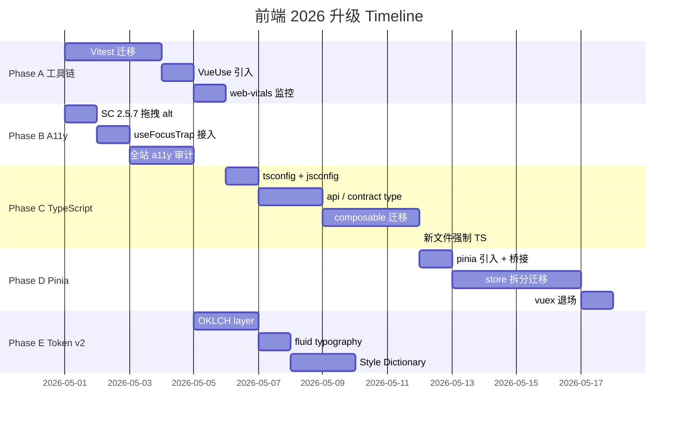
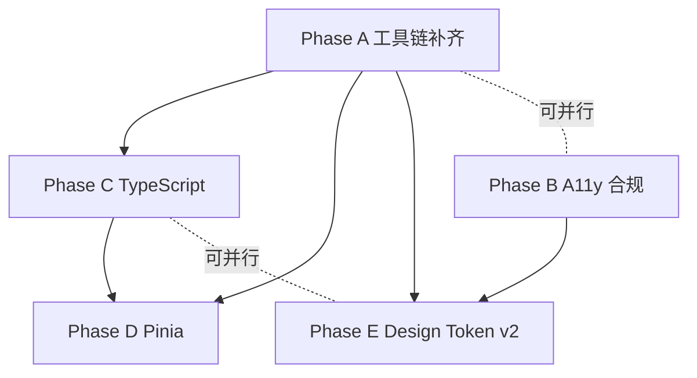

# Alethicode 前端 2026 主流前列升级设计

> **文档编号**：ALETH-PLAN-2026-0428-FE2026
> **文档状态**：设计稿（待用户验收 → 进入 writing-plans 输出可执行 task list）
> **创建日期**：2026-04-28
> **优先级**：P1（教学产品 a11y 合规层为 P0）
> **关联 Skill**：`brainstorming` / `ui-ux-pro-max` / `api-design-principles` / `code-reviewer`
> **关联文档**：
> - [`docs/plans/2026-04-27-faded-parsons-onnx-adaptive-design.md`](2026-04-27-faded-parsons-onnx-adaptive-design.md)（Faded Parsons 模块）
> - [`CHANGELOG.md`](../../CHANGELOG.md) § 4/28 温暖教学风 UI/UX 统一重构（Phase 0 + Phase 1）
> - 联网调研：Vue 3.5 Performance / WCAG 2.2 / OKLCH / Pinia 3 / VueUse / Vitest 4 / Module Federation 2.0（2026-04-28 调研，见附录 D）

> **一句话目标**：把当前"骨架 80 / 肉身 60 / 合规 65"的前端，分 5 个 Phase（A→E）渐进升级到 2026 主流前列：**Vue 3.5 + TypeScript + Pinia 3 + Vitest 4 + WCAG 2.2 AA + OKLCH design token**，同时不打断现有教学业务、保留全部品牌资产（角色系统 / 蛇 canvas / 紫粉 hero / Parsons / 错题本）。

---

## 目录

- [一、设计动机与第一性原理](#一设计动机与第一性原理)
- [二、现状基线](#二现状基线)
- [三、设计目标与非目标](#三设计目标与非目标)
- [四、关键决策](#四关键决策)
- [五、整体路线图](#五整体路线图)
- [六、Phase A — 工具链补齐](#六phase-a--工具链补齐)
- [七、Phase B — A11y 合规（WCAG 2.2 AA）](#七phase-b--a11y-合规wcag-22-aa)
- [八、Phase C — TypeScript 渐进迁移](#八phase-c--typescript-渐进迁移)
- [九、Phase D — Pinia 3 状态管理迁移](#九phase-d--pinia-3-状态管理迁移)
- [十、Phase E — Design Token v2（OKLCH + Fluid + Style Dictionary）](#十phase-e--design-token-v2oklch--fluid--style-dictionary)
- [十一、评测、灰度与回滚](#十一评测灰度与回滚)
- [十二、工作量评估与 Timeline](#十二工作量评估与-timeline)
- [十三、风险与缓解](#十三风险与缓解)
- [十四、不在本期的事](#十四不在本期的事)
- [十五、第一性原理自检](#十五第一性原理自检)
- [附录 A：核心合约（接口、SchemaDS、文件树）](#附录-a核心合约接口schemads文件树)
- [附录 B：测试矩阵](#附录-b测试矩阵)
- [附录 C：性能预算与监控指标](#附录-c性能预算与监控指标)
- [附录 D：联网调研与基线证据](#附录-d联网调研与基线证据)
- [附录 E：保留资产白名单（不动）](#附录-e保留资产白名单不动)

---

## 一、设计动机与第一性原理

### 1.1 教学产品对前端的真实诉求

非计算机专业 Python 初学者使用 Alethicode 时，前端承担三类压力：

1. **角色化教学体验**（OJ 是"客厅"）——动画、character sprite、错误诊断卡、Parsons 拼装挑战
2. **大量真实数据展示**（题目列表 / 提交列表 / 复习包 / 错题本）——需要稳定的表格/列表密度
3. **Admin 工作台**——非角色化但同品牌色的企业数据视图

任何升级**不能伤到上述三个压力点**。所以方案必须是"渐进、不动品牌资产、不切断业务链路"。

### 1.2 为什么"2026 主流前列"不是花架子

联网调研（2026-04-28）证据：

- Vue 3.5 已经把响应式系统重写，**deep reactive 数组操作 10× 提速 / 内存 -56%**（typescript.news/articles/vue-35-major-improvements）
- INP（Interaction to Next Paint）于 2024-03 替代 FID 成 Core Web Vitals 之一，**60 万网站当夜失分**（dovletovaaygul.com）
- WCAG 2.2 SC 2.5.7「Dragging Movements」AA 级要求所有拖拽必须有 single-pointer alternative（W3C/WAI 官方）
- Vuex 5 已被取消，**Pinia 是 Vue 官方 2023 起的状态管理推荐**（pkgpulse.com / Vue.js 官方文档）
- Tailwind v4（2026）实施 CSS-first，5× 全量构建加速 / 100× 增量构建加速；OKLCH 浏览器支持 92%+（mavik labs / specvital）

落后这一代不仅是"美感"问题，而是 **学情数据交互延迟 / a11y 合规风险 / 类型错误产线发现率 / 状态调试效率**等可量化指标的真实倒退。

### 1.3 第一性原理

> **"不打断业务、不丢弃品牌资产"是约束；"工具链合规、a11y 合规、类型安全合规"是目标。**
>
> **当约束与目标冲突时，选最小完整方案让两者并存，而不是让其中一方让步。**

具体在本计划：
- TypeScript 不在存量 Options API 业务页强推，但在新文件 / store / composable / api / contract type 强制走 TS。
- Pinia 不一次性替换 Vuex，而是 store-by-store 切，保留临时桥接到现有 Vuex helpers。
- Tailwind v4 / 全 OKLCH 不强推（迁移成本与收益不成比例），但**新增 token 用 OKLCH，HEX 作为 fallback**。

---

## 二、现状基线

### 2.1 已具备能力（不重做，仅复用）

| 能力 | 现状 | 用法 |
|---|---|---|
| Vue 3.5 + Vite 7 | `package.json` `"vue": "^3.5.32"` / `"vite": "^7.1.5"` | 升级路径已就绪，无需切框架 |
| Element Plus 2.13 | `frontend/src/pages/oj/elementPlusTheme.less` 与 `frontend/src/pages/admin/elementPlusTheme.less` 已经按 token 化 | Phase E 时再演进 |
| 三层 design token | Phase 1 已建：`--primary-*`、`--warm-*`、`--control-height-*`、`--table-*`、`--list-item-*`、`--card-*`、`--tag-*` | Phase E 在此基础上加 OKLCH layer |
| Composable 抽离 | `useFrustration` / `useProblemList` / `useProblemPresentation` / `useParsonsDnd`（本轮新建） | Phase C 直接 TS 化 |
| `prefers-reduced-motion` 19 处使用 | `Problem.styles.less` / `ParsonsWalkthroughDialog.vue` 等 | Phase B 维持 |
| Route-level dynamic import | `oj/router/routes.js` / `oj/views/index.js` 等 | Phase A 复用 |
| Visual regression | `tests/e2e/visual-compare.js` 自研 | Phase A 升级测试栈时不动 |

### 2.2 需要补齐 / 替换 / 升级

| 维度 | 当前 | 业界 2026 | 升级动作 |
|---|---|---|---|
| TypeScript 覆盖率 | 0%（grep `lang="ts"` = 0） | 新文件 100% | Phase C，渐进 |
| `<script setup>` 覆盖率 | 1 个文件（`ProfileDrawer.vue`） | 推荐主流 | Phase C 同步推进 |
| 状态管理 | Vuex 4 | Pinia 3（官方推荐） | Phase D |
| Test runner | Jest 23.6（2018 版本） | Vitest 4 | Phase A |
| VueUse | 0 引用 | 行业标配 | Phase A 引入 |
| `useFocusTrap` modal | 仅 `role="dialog"` 标记 | `@vueuse/integrations` + `focus-trap` | Phase B |
| WCAG 2.2 SC 2.5.7 拖拽 alt | 仅键盘 fallback | 必须有 single-pointer alt | Phase B |
| Core Web Vitals 监控 | 未引入 | `web-vitals` 库 + 上报 | Phase A |
| 色空间 | HEX | OKLCH（92%+ 浏览器） | Phase E |
| Fluid typography | 固定 px 8 档 | `clamp()` viewport-based | Phase E |
| Token 跨平台 export | 仅 CSS | DTCG / Style Dictionary | Phase E（可选） |

### 2.3 业务链路全景（不能伤到）

| 业务模块 | 关键文件 | 风险点 |
|---|---|---|
| 角色化教学 | `characterConfig.js` / `CharacterAvatar.vue` / `ProblemGuideCard.vue` 等 | 不动设计系统骨架 |
| Faded Parsons | `ParsonsProblemCard.vue` / `parsons/*.vue` / `useParsonsDnd.js` | Phase B 加 single-pointer alt |
| 错题本 | `LearnerNotebook.vue` / `notebook/*.vue` / `learnerNotebook.less` | Phase E token 升级时连带 |
| 工作流状态机 | `workflowStateMachine.js` / `UnifiedAgentPanel.vue` | Phase C 时**仅提取类型，不动行为** |
| OJ Login 蛇 canvas / Admin 粒子背景 | `Login.vue` 系列 | 完全不动 |
| 题目列表 / 提交列表 / 复习包 | `ProblemList.vue` / `SubmissionList.vue` / `ErrorReviewPackagePage.vue` | Phase A 跑 visual-compare 验证零回归 |

---

## 三、设计目标与非目标

### 3.1 设计目标

| # | 目标 | 衡量 | 关联 Phase |
|---|---|---|---|
| G1 | 测试 runner 升级到 Vitest 4，全部 contract spec 与 unit test 通过率 ≥ 99% | jest → vitest 迁移后跑通 102 个 spec | A |
| G2 | 引入 VueUse + web-vitals，建立 INP / LCP / CLS 上报通路 | Grafana 上能看到 P75 INP / LCP / CLS | A |
| G3 | WCAG 2.2 AA 全站合规：SC 2.5.7（drag alt）/ 2.4.11（focus 不被遮挡）/ focus trap 全部落地 | a11y 自动审计（axe-core） + 人工键盘走查 | B |
| G4 | 新增前端代码 100% TypeScript（`<script setup lang="ts">`），存量 Options API 不强推但允许逐步迁移 | `lang="ts"` 在新文件占比 ≥ 95% | C |
| G5 | 状态管理 Vuex 4 → Pinia 3，按 store 拆分迁移；vuex helpers 保留兼容期 ≤ 30 天 | 全部业务 store 走 pinia | D |
| G6 | Design Token v2：HEX → OKLCH（保留 HEX fallback），fluid typography 用 `clamp()` | `clamp()` 在 typography 与 spacing 至少各一档生效 | E |
| G7 | 全部 5 个 Phase 完成后，jest（或迁移后的 vitest）失败套件 / 测试数 ≤ master 基线 | 16 套件 / 24 测试 → 不增加 | A-E |
| G8 | bundle 体积不超过当前 110%（gzip） | rollup-plugin-visualizer 报告 | A 起 |

### 3.2 非目标（YAGNI）

| # | 非目标 | 原因 |
|---|---|---|
| N1 | 切换到 Nuxt 3/4 / Module Federation 微前端 | 评测显示 10-50 工程师团队 monolith 仍最优；Alethicode 当前规模不需要 |
| N2 | 全站换 Tailwind v4 | 与 Element Plus 共存成本高于收益；token 已经是 CSS-variable 化 |
| N3 | 全站强推 TypeScript（含老业务页） | 业务链路风险高于收益；存量 Options API 改写为 setup 后再考虑 |
| N4 | 全站换 shadcn-vue / Naive UI / Radix Vue | Element Plus 在中文 admin 场景仍有优势，迁移代价不可承受 |
| N5 | Vapor mode（Vue 3.6+） | 仍未稳定，等 6.0 GA 再评估 |
| N6 | 自研 dnd-kit 等价库 | 当前 Parsons 拖拽场景简单，VueUse 的 useDraggable + `useSortable` 替换即可 |
| N7 | 自研 design token build 工具 | Style Dictionary 4 已是工业标准，可选择性集成 |

---

## 四、关键决策

| 决策项 | 选项 | 理由 |
|---|---|---|
| **D1：Phase 顺序** | A → B → C → D → E（A、B 可并行）；A、B 优先因为是合规与工具链基础 | 工具链与合规为底；类型安全 / 状态管理 / Design Token 为上层 |
| **D2：TypeScript 边界** | 新文件强制 `<script setup lang="ts">`；store / api / composable / contract type 优先迁；业务页（Vue Options API）保留至 Phase 2 视情况推 | 最短路径；不打断业务；与 onehorizon.ai/blog 推荐的 "Performance-First + DDD" 路线一致 |
| **D3：Pinia 迁移策略** | store-by-store 切，保留 vuex `mapGetters` / `mapActions` 兼容包装 30 天；新 store 一律 pinia | 与 PkgPulse 推荐的渐进迁移一致；避免 big-bang 风险 |
| **D4：A11y SC 2.5.7 实现** | Parsons `ParsonsTokenBlock` 增加上下移按钮（"⬆ 移到答题区" / "⬇ 移到候选区"），复用 `useParsonsDnd` 的 `moveTo`；不引入第三方 dnd-kit | Element Plus icon-only 按钮 36px → 触达 44×44 即可；不动现有键盘 toggle 路径 |
| **D5：Focus Trap 实现** | 引入 `@vueuse/integrations` 的 `useFocusTrap` + `focus-trap@^7`；存量 dialog 用 wrapper composable `useDialogA11y` 一次接入 | 不重写 ElDialog；自定义 dialog（ParsonsWalkthroughDialog）显式调用 |
| **D6：Vitest 迁移路线** | jest 23.6 → jest 29 → vitest 4 两步走（避开 jest 24+ 的 ESM 大跨度） | 减小一次性升级风险；CI 双跑期限定 ≤ 7 天 |
| **D7：OKLCH 引入策略** | 新增 `--primary-color-oklch` 类 token，CSS variable 优先用 OKLCH，旧 `--primary-color` 保 HEX 作 fallback | 浏览器 92% 支持；老浏览器降级；不破坏 visual-compare 基线 |
| **D8：fluid typography** | 仅在 hero / banner / `.section-title` 等需要的 8-12 个场景用 `clamp()`，正文保留固定档位 | 按场景增益最大化；不引入"所有字号 fluid"的视觉漂移风险 |
| **D9：Style Dictionary 集成（可选）** | 选择性引入 `style-dictionary@4`，在 `frontend/src/styles/tokens/` 下定义 source-of-truth json，构建时输出 less / css / json 三种格式 | 跨平台 token export 业界标准；当前不需要可推到 Phase E 末尾 |

---

## 五、整体路线图

### 5.1 Phase 概览



### 5.2 依赖图



A 与 B 是独立合规 / 工具基础，可并行；C 依赖 A（vitest 跑 ts 测试）；D 依赖 C（pinia 类型推断需要 TS）；E 依赖 B（focus-visible 等 a11y 视觉 token）。

### 5.3 PR 切片原则（继承 writing-plans skill）

- 每个 PR 5-15 分钟可独立提交、独立 revert
- 单 PR 改动文件 ≤ 8 个、新增 / 删除行 ≤ 400 行（除非纯新增 schema / config）
- 每个 PR 必须自带：单测 + ChangeLog 条目 + 必要的 contract spec 更新
- PR 之间通过 `git rebase --autosquash` 保持线性历史

---

## 六、Phase A — 工具链补齐

> **目标**：把测试 runner、composable 库、性能监控这三块业界标配补上，为后续 Phase 提供基础能力。
> **风险**：低（仅工具链替换，不动业务代码）。
> **工时**：4-5 工作日。

### 6.1 PR-A1：Vitest 4 迁移（约 1.5d）

#### 6.1.1 修改文件

| 文件 | 改动 |
|---|---|
| `frontend/package.json` | 移除 `jest@23.6`、`babel-jest@23.6`，新增 `vitest@^4` / `@vitest/coverage-v8` / `@vue/test-utils@^2.4` / `jsdom@^24` / `@testing-library/vue` |
| `frontend/vitest.config.mjs`（新建） | 配置 alias / setupFiles / globals / environment：`jsdom` |
| `frontend/tests/setup.js`（新建） | mock `localStorage` / `IntersectionObserver` / `ResizeObserver` |
| `frontend/package.json` scripts | `"test": "vitest run"` / `"test:watch": "vitest"` / `"test:coverage": "vitest run --coverage"` |
| `frontend/jest.config.*`（删除） | 由 vitest 接管 |
| 已有 102 个 `tests/unit/*.spec.js` | 大部分静态 grep 不需改；用到 `jest.fn()` / `jest.mock()` 的改 `vi.fn()` / `vi.mock()` |

#### 6.1.2 实现细节

**`vitest.config.mjs`** 草案：

```js
import { defineConfig } from 'vitest/config'
import vue from '@vitejs/plugin-vue'
import path from 'path'

export default defineConfig({
  plugins: [vue()],
  resolve: {
    alias: {
      '@': path.resolve(__dirname, 'src'),
      '@oj': path.resolve(__dirname, 'src/pages/oj'),
      '@admin': path.resolve(__dirname, 'src/pages/admin')
    }
  },
  test: {
    environment: 'jsdom',
    globals: true,
    setupFiles: ['./tests/setup.js'],
    include: ['tests/unit/**/*.spec.js', 'tests/unit/**/*.spec.ts'],
    coverage: { provider: 'v8', reporter: ['text', 'lcov'] }
  }
})
```

**已有 spec 兼容性策略**：

- 静态字符串 grep 类（如 `error-review-package-rating-card.spec.js`）：vitest 与 jest 完全兼容，无需改动
- 用 `jest.fn()` / `jest.mock()` 类：批量替换 `jest.` → `vi.`（自动脚本）
- 用 `--testPathPattern` flag：vitest 用 `vitest run <pattern>`，CI script 改一处即可

#### 6.1.3 双跑期

CI 中保留 jest job（标记 deprecated），同时跑 vitest job 7 天，待 vitest 通过率 ≥ 100% 与 jest 一致后删除 jest job。

#### 6.1.4 验收

- vitest 运行结果：套件失败 ≤ master 基线（16）
- jest 完全删除：`grep -r jest frontend/package.json` 无结果
- CI 时间：vitest run ≤ jest 当前耗时（约 6.6s 全量 → 期望 ≤ 5s）

#### 6.1.5 单元测试 / 契约更新

无（现有 spec 通过即视为契约满足）。

### 6.2 PR-A2：VueUse 引入（约 0.5d）

#### 6.2.1 修改文件

| 文件 | 改动 |
|---|---|
| `frontend/package.json` | `"@vueuse/core": "^11"` / `"@vueuse/integrations": "^11"` / `"focus-trap": "^7"` |
| `frontend/src/composables/index.js`（新建或更新） | re-export 常用 useEventListener / useDebounceFn / useThrottleFn / useFocusTrap |

#### 6.2.2 验收

- `npm install` 成功
- 任意业务页 import 验证 tree-shaking：构建 bundle 不增加 > 5KB

#### 6.2.3 不替换的内容

VueUse 的 useDraggable / useSortable 暂不使用（Parsons 已经自研 `useParsonsDnd`，性能与契约可控）。

### 6.3 PR-A3：web-vitals 监控通路（约 1d）

#### 6.3.1 修改文件

| 文件 | 改动 |
|---|---|
| `frontend/package.json` | `"web-vitals": "^4"` |
| `frontend/src/utils/webVitals.js`（新建） | 注册 `onINP`、`onLCP`、`onCLS`、`onFCP`、`onTTFB`，统一上报到 `/api/telemetry/web-vitals` |
| `frontend/src/pages/oj/index.js` 与 `frontend/src/pages/admin/index.js` | 启动后调用 `installWebVitals()` |
| `backend/src/main/java/com/alethicode/controller/TelemetryController.java`（新建） | `POST /api/telemetry/web-vitals` 接收事件，写 `frontend_web_vitals_event` 表 |
| `backend/src/main/resources/db/migration/V73__frontend_web_vitals_event.sql`（新建） | 表 `frontend_web_vitals_event(id, user_id, route, metric, value, rating, navigation_type, ts)` |

#### 6.3.2 验收

- 任意页面跳转后，`frontend_web_vitals_event` 至少出现 1 条记录
- 上报失败 fail-fast（不重试），不影响业务

#### 6.3.3 评测看板

`docs/reports/grafana-frontend-vitals.json`（Phase A 末尾导出）：
- INP P75 / P95
- LCP P75 / P95
- CLS P75
- INP > 200ms 的 route top 10

### 6.4 Phase A 总验收

| 验收项 | 期望 |
|---|---|
| jest → vitest 迁移完毕 | `package.json` 不含 jest |
| VueUse 可用 | 任意业务页可 import |
| web-vitals 上报通路 | 真实数据进入 DB |
| 单测套件失败数 | ≤ master 基线（16） |
| bundle gzip 体积 | 增加 ≤ 5% |

---

## 七、Phase B — A11y 合规（WCAG 2.2 AA）

> **目标**：堵 SC 2.5.7（drag alt）/ 2.4.11（focus 不被遮挡）/ focus trap 三个合规缺口。
> **风险**：低（仅增加可访问通路，不动业务行为）。
> **工时**：3-4 工作日。

### 7.1 PR-B1：Parsons 拖拽 single-pointer alternative（约 1d）

#### 7.1.1 现状问题

`frontend/src/pages/oj/views/problem/cards/parsons/ParsonsRenderer.vue` 与 `ParsonsTokenBlock.vue` 当前仅有：
- HTML5 drag-drop
- 键盘 ArrowUp/Down/Space/Enter 操作

**缺失的**：鼠标 + 触屏单指用户的移动路径（按钮形式）。

#### 7.1.2 修改文件

| 文件 | 改动 |
|---|---|
| `frontend/src/pages/oj/views/problem/cards/parsons/ParsonsTokenBlock.vue` | 增加内嵌 ⬆ / ⬇ icon-only ElButton，size 44×44；emit `move-to-pool` / `move-to-answer` |
| `frontend/src/pages/oj/views/problem/cards/parsons/ParsonsRenderer.vue` | 新增 prop `controlsVisible`（默认 true，可由学生设置关闭），监听 `move-to-pool` / `move-to-answer` 调用 `useParsonsDnd.moveTo()` |
| `frontend/src/pages/oj/views/problem/parsons/useParsonsDnd.js` | 已暴露 `moveTo`，无需改动 |

#### 7.1.3 实现细节

`ParsonsTokenBlock.vue`：
- 在 token 视觉右侧增加 a11y 控制条 `<div class="ptb-a11y-controls">`，仅在 `controlsVisible` 为 true 显示
- 两个 ElButton（icon `ArrowUp` / `ArrowDown`），`aria-label` 分别为 "把这块移到候选区" / "把这块移到答题区"
- min 44×44px 触达
- focus-visible 高亮

#### 7.1.4 验收

- axe-core 自动审计：SC 2.5.7 0 违规
- 鼠标用户：点击 ⬆ / ⬇ 按钮可完成等价于拖拽的移动
- 键盘用户：Tab 到按钮可触发 `Enter` / `Space`
- 触屏用户：单指 tap 按钮可移动

#### 7.1.5 测试

- `tests/unit/parsons-renderer-contract.spec.js`（新建或扩展）
  - 渲染 ⬆ / ⬇ 按钮 ≥ 1 个
  - 触发 `move-to-answer` event，answerOrder 包含该 block
  - aria-label 文本契约

### 7.2 PR-B2：useFocusTrap 接入（约 1d）

#### 7.2.1 修改文件

| 文件 | 改动 |
|---|---|
| `frontend/src/composables/useDialogA11y.js`（新建） | 包装 `@vueuse/integrations` 的 `useFocusTrap`，统一 dialog a11y 接入路径 |
| `frontend/src/pages/oj/views/problem/cards/parsons/ParsonsWalkthroughDialog.vue` | 调用 `useDialogA11y(rootRef, { visible })` 启用 focus trap |
| `frontend/src/pages/oj/views/user/notebook/NotebookDayDrawer.vue` 等 7 个 dialog | 同 |
| `frontend/src/pages/oj/views/user/notebook/NotebookKcExpandModal.vue` | 同 |
| `frontend/src/pages/oj/views/user/notebook/BreakthroughReviewModal.vue` | 同 |
| `frontend/src/pages/oj/views/user/notebook/NotebookReflectionDialog.vue` | 同 |

#### 7.2.2 实现细节

`useDialogA11y.js`：

```js
import { watch } from 'vue'
import { useFocusTrap } from '@vueuse/integrations/useFocusTrap'

export function useDialogA11y (target, { visible, returnFocusOnDeactivate = true, escapeDeactivates = false } = {}) {
  const { activate, deactivate } = useFocusTrap(target, {
    immediate: false,
    returnFocusOnDeactivate,
    escapeDeactivates,
    allowOutsideClick: false
  })
  watch(visible, (val) => {
    if (val) {
      // nextTick 等待 v-if 渲染
      Promise.resolve().then(() => activate())
    } else {
      deactivate()
    }
  })
}
```

ElDialog 组件：Element Plus 内部已实现 focus trap，本期不动。

#### 7.2.3 验收

- 键盘用户在 ParsonsWalkthroughDialog / NotebookDayDrawer 等 8 个 dialog 中按 Tab，焦点不会逃出
- 关闭 dialog 后焦点回到打开 dialog 的按钮（returnFocusOnDeactivate）
- `escapeDeactivates: false` 保留 walkthrough dialog 的强制策略

### 7.3 PR-B3：全站 a11y 系统审计（约 1.5d）

#### 7.3.1 修改文件

| 文件 | 改动 |
|---|---|
| `frontend/tests/e2e/a11y-axe.spec.js`（新建） | Playwright + `@axe-core/playwright`，对核心页面跑 axe 审计 |
| `frontend/package.json` | `"@axe-core/playwright": "^4"`（dev） |
| `frontend/src/pages/oj/components/NavBar.vue` | 修复审计发现的问题（如缺 alt / contrast / sticky 遮焦）|
| 其余审计发现需要修的文件 | 视审计结果 |

#### 7.3.2 审计目标页

| 页面 | 关注点 |
|---|---|
| `/login` | 表单 label / focus 顺序 |
| `/problem/list` | 表格表头 / 排序按钮 / Pagination |
| `/problem/<id>` | 编辑器、Parsons、AI panel、错误诊断 |
| `/error-review-package/<id>` | 复习包列表与按钮 |
| `/notebook` | hero / chart / day drawer |
| `/admin` 关键页 | User / Announcement / Problem List |

#### 7.3.3 验收

- axe-core 报告：critical = 0、serious = 0、moderate ≤ 5（保留进入 deferred backlog）
- WCAG 2.2 AA 自动审计：covered SC 全部 pass
- 上述 6 个页面键盘可达 100% 互动元素

### 7.4 Phase B 总验收

| 验收项 | 期望 |
|---|---|
| WCAG 2.2 SC 2.5.7 合规 | axe = 0 violations on Parsons |
| Modal focus trap | 8 个 dialog 全部 trap |
| 关键页 axe 报告 | critical = 0 |
| 键盘走查 | 6 个页面全部可达 |

---

## 八、Phase C — TypeScript 渐进迁移

> **目标**：新文件强制 TS、核心 store / api / composable / contract type 优先迁；不强推业务页。
> **风险**：中（类型推断不当可能短期内增加 import 摩擦）。
> **工时**：6-8 工作日。

### 8.1 PR-C1：TS 工具链与 tsconfig（约 1d）

#### 8.1.1 修改文件

| 文件 | 改动 |
|---|---|
| `frontend/tsconfig.json`（新建） | `target: ES2020 / module: ESNext / strict: true / noUncheckedIndexedAccess: true / paths: 与 vite.config.mjs 同步` |
| `frontend/tsconfig.node.json`（新建） | for vite.config / vitest.config |
| `frontend/jsconfig.json`（更新或删除） | tsconfig 接管 |
| `frontend/package.json` | `"typescript": "^5.5"` / `"vue-tsc": "^2"` 添加；scripts: `"typecheck": "vue-tsc --noEmit"` |
| `frontend/vite.config.mjs` | `vue()` 默认支持 ts，无需改动 |
| `frontend/.eslintrc` 或 `eslint.config.mjs` | 增加 `@typescript-eslint/parser` |
| CI 工作流 | `npm run typecheck` 必跑 |

#### 8.1.2 实现细节

`tsconfig.json`：

```json
{
  "compilerOptions": {
    "target": "ES2020",
    "module": "ESNext",
    "moduleResolution": "Bundler",
    "strict": true,
    "noUncheckedIndexedAccess": true,
    "exactOptionalPropertyTypes": true,
    "skipLibCheck": true,
    "esModuleInterop": true,
    "resolveJsonModule": true,
    "jsx": "preserve",
    "types": ["vite/client", "@vueuse/core"],
    "paths": {
      "@/*": ["src/*"],
      "@oj/*": ["src/pages/oj/*"],
      "@admin/*": ["src/pages/admin/*"]
    }
  },
  "include": ["src/**/*.ts", "src/**/*.tsx", "src/**/*.vue", "tests/**/*.ts"],
  "exclude": ["node_modules", "dist"]
}
```

#### 8.1.3 验收

- `npm run typecheck` 在 0 个 ts 文件下通过（noEmit）
- ESLint 不抛新错误

### 8.2 PR-C2：API 层 TS 化（约 2d）

#### 8.2.1 修改文件

| 文件 | 改动 |
|---|---|
| `frontend/src/types/api.d.ts`（新建） | API 全局返回类型 `ApiResponse<T>`、错误类型 `ApiError`、分页类型 `Paginated<T>` |
| `frontend/src/types/contract/`（新建目录） | 与 `contracts/tutor_workflow/` schema 对齐的 TS 类型，由 schema → ts 自动生成（用 `json-schema-to-typescript`）|
| `frontend/src/pages/oj/api.js` → `api.ts` | 增加 import { type ApiResponse } |
| `frontend/src/pages/oj/api/aiTutor.js` → `aiTutor.ts` | 同 |
| `frontend/src/pages/oj/api/parsons.js` → `parsons.ts` | 同 |
| `frontend/src/pages/admin/api.js` → `api.ts` | 同 |
| `frontend/scripts/generate-contract-types.mjs`（新建） | 从 `contracts/**/*.schema.json` 生成 ts |

#### 8.2.2 验收

- `npm run typecheck` 通过
- contract type 与 backend Java DTO 一致（手工抽查 5 个 schema）
- 业务调用点（Vue 文件）由于继承 .ts 模块的类型，IDE 提示精准

### 8.3 PR-C3：composable 迁移（约 2d）

#### 8.3.1 修改文件

| 文件 | 改动 |
|---|---|
| `frontend/src/composables/useFrustration.js` → `.ts` | 类型化 |
| `frontend/src/composables/useProblemList.js` → `.ts` | 类型化 |
| `frontend/src/composables/problem/useProblemPresentation.js` → `.ts` | 类型化 |
| `frontend/src/pages/oj/views/problem/parsons/useParsonsDnd.js` → `.ts` | 类型化 |
| 其余约 5 个 composable | 同 |

#### 8.3.2 实现细节示例（useParsonsDnd.ts）

```ts
import { ref, computed, watch, type Ref, type ComputedRef } from 'vue'

export interface ParsonsBlock {
  id: string
  code: string
  indent: number
  fading_state?: 'visible' | 'faded' | 'hidden'
  fade_hint?: string
  source?: 'reference' | 'notebook' | 'llm'
  kc_hint?: string
}

export interface UseParsonsDndOptions {
  blocks: Ref<ParsonsBlock[]>
  distractors: Ref<ParsonsBlock[]>
  onChange?: (order: string[]) => void
}

export function useParsonsDnd (options: UseParsonsDndOptions) {
  // ...
}
```

#### 8.3.3 验收

- composable 调用点（Vue 文件）IDE 提示精准
- vitest 跑通
- 相关 contract spec 不破

### 8.4 PR-C4：新文件强制 TS 政策与 ESLint 规则（约 0.5d）

#### 8.4.1 修改文件

| 文件 | 改动 |
|---|---|
| `frontend/.eslintrc` 或 `eslint.config.mjs` | 新增规则：新文件 `.vue` 必须 `<script setup lang="ts">`、`.js` 文件不允许新增（除已有的工具脚本） |
| `AGENTS.md` 或 `docs/conventions/frontend-typescript.md`（新建） | 规则与示例 |

#### 8.4.2 验收

- 新建 .js / Options API .vue 文件触发 ESLint error

### 8.5 PR-C5：核心 store 与 router 的渐进迁移（约 1.5d）

#### 8.5.1 修改文件

| 文件 | 改动 |
|---|---|
| `frontend/src/store/modules/*.js` → `.ts`（5-10 个） | 类型化 vuex store（为 Phase D 做准备，让 pinia 迁移直接基于 ts 类型）|
| `frontend/src/pages/oj/router/routes.js` → `.ts` | 类型化 RouteRecordRaw |
| `frontend/src/pages/admin/router/index.js` → `.ts` | 同 |

#### 8.5.2 验收

- typecheck 通过
- 路由跳转无回归

### 8.6 Phase C 总验收

| 验收项 | 期望 |
|---|---|
| typecheck 全绿 | `npm run typecheck` 退出码 0 |
| 新文件 TS 比率 | ≥ 95% |
| api 层 100% TS | grep `lang="ts"` ≥ 50 文件 |
| composable 100% TS | composables 目录 ≥ 90% .ts |
| 业务页破坏 | 0 |

---

## 九、Phase D — Pinia 3 状态管理迁移

> **目标**：Vuex 4 → Pinia 3，store-by-store 渐进迁移。
> **风险**：中（store 行为差异可能影响业务）。
> **工时**：5-7 工作日。

### 9.1 PR-D1：Pinia 引入 + Vuex 兼容桥（约 1d）

#### 9.1.1 修改文件

| 文件 | 改动 |
|---|---|
| `frontend/package.json` | `"pinia": "^3"` |
| `frontend/src/pages/oj/index.js` 与 `frontend/src/pages/admin/index.js` | `app.use(createPinia())`（与 Vuex 共存） |
| `frontend/src/store/index.ts` | 同时 export `pinia` 与 `vuex store`，业务页可选择新接口 |
| `frontend/src/store/migration-bridge.ts`（新建） | 旧 vuex `mapGetters` → pinia `storeToRefs` 的兼容包装 |

#### 9.1.2 验收

- 双 store 共存：原有 vuex 接口仍可用、pinia store 也可定义
- bundle 增大 ≤ 1.5KB（pinia gzip 体积）

### 9.2 PR-D2 ~ D5：store-by-store 迁移（约 3-4d）

按 store 模块拆 4 个 PR：

#### 9.2.1 PR-D2：user store

`frontend/src/store/modules/user.js` → `frontend/src/store/user.ts`：

```ts
import { defineStore } from 'pinia'

export const useUserStore = defineStore('user', () => {
  const profile = ref<UserProfile | null>(null)
  const isAuthenticated = computed(() => profile.value !== null)

  async function fetchProfile () {
    const res = await api.getProfile()
    profile.value = res.data.data
  }

  function logout () {
    profile.value = null
  }

  return { profile, isAuthenticated, fetchProfile, logout }
})
```

业务调用点同步替换：`mapGetters(['user'])` → `const { profile } = storeToRefs(useUserStore())`。

#### 9.2.2 PR-D3：problem store

复杂度最高（涉及 problem detail / submission / aiTutor 多 module）；可再拆分。

#### 9.2.3 PR-D4：classroom / language pack store

#### 9.2.4 PR-D5：admin store

### 9.3 PR-D6：Vuex 退场（约 1d）

#### 9.3.1 修改文件

| 文件 | 改动 |
|---|---|
| `frontend/package.json` | 移除 `"vuex": "^4"` |
| `frontend/src/store/index.ts` | 删除 vuex 部分 |
| `frontend/src/store/migration-bridge.ts` | 删除 |
| 业务页中残留的 `mapGetters` / `mapActions` | 全部清扫 |

#### 9.3.2 验收

- `grep vuex frontend/src` 无结果
- bundle gzip 减少 ≥ 4KB（vuex 体积）
- vitest 套件全绿

### 9.4 Phase D 总验收

| 验收项 | 期望 |
|---|---|
| Vuex 完全退场 | grep 无 vuex |
| Pinia 全部业务 store | 至少 5 个 store 已 pinia 化 |
| 单测全绿 | ≤ master 基线 |
| DevTools 体验 | Pinia DevTools 显示所有 store 时间线 |

---

## 十、Phase E — Design Token v2（OKLCH + Fluid + Style Dictionary）

> **目标**：在 Phase 1 三层 token 基础上加 OKLCH 色空间、fluid typography、Style Dictionary 跨平台 export。
> **风险**：低-中（OKLCH 浏览器兼容 92%，需做 fallback）。
> **工时**：4-5 工作日。

### 10.1 PR-E1：OKLCH 色 token layer（约 1.5d）

#### 10.1.1 修改文件

| 文件 | 改动 |
|---|---|
| `frontend/src/styles/tokens/colors-oklch.less`（新建） | OKLCH 色 token 定义，与 HEX layer 平行 |
| `frontend/src/styles/common.less` | `--primary-color` 等 alias 改为 `var(--primary-color-oklch, #2563eb)`，OKLCH 优先 + HEX fallback |
| `frontend/src/styles/tokens/`（新建目录） | source-of-truth 拆分为多个文件 |

#### 10.1.2 实现细节

```less
// frontend/src/styles/tokens/colors-oklch.less
:root {
  /* —— Brand · Trust Blue OKLCH —— */
  --primary-50-oklch:  oklch(0.97 0.02 260);
  --primary-100-oklch: oklch(0.93 0.05 260);
  --primary-500-oklch: oklch(0.62 0.18 258);
  --primary-600-oklch: oklch(0.55 0.20 258);
  --primary-700-oklch: oklch(0.48 0.18 258);

  /* —— Brand · Warm Accent OKLCH —— */
  --warm-primary-oklch: oklch(0.62 0.20 270);
  --warm-accent-oklch:  oklch(0.66 0.27 350);

  /* alias：优先 oklch，fallback hex */
  --primary-color: var(--primary-600-oklch, #2563eb);
  --warm-primary:  var(--warm-primary-oklch, #6366f1);
}

@supports not (color: oklch(0.5 0.1 0)) {
  :root {
    --primary-color: #2563eb;
    --warm-primary:  #6366f1;
  }
}
```

#### 10.1.3 验收

- 现代浏览器（Chrome 120+ / Safari 17+）渲染 OKLCH，肉眼差异 ≤ 5%
- 老浏览器 fallback 到 HEX 完整复用本轮 Phase 1 视觉
- visual-compare diff 在 OJ ProblemList 上 ≤ 5%（可接受 5% 是温暖品牌色饱和度小幅变化）

### 10.2 PR-E2：Fluid typography（约 1d）

#### 10.2.1 修改文件

| 文件 | 改动 |
|---|---|
| `frontend/src/styles/common.less` 的 `:root` | 增加 `--fs-hero: clamp(20px, 2.5vw + 12px, 32px);` 等 4-6 档 fluid 字号 |
| `frontend/src/pages/oj/views/HomeDashboard.vue` 等 hero 区域 | 使用 fluid token |
| 正文 / 列表 / 表格不动 | 保留固定档位 |

#### 10.2.2 实现细节

```less
:root {
  /* fixed scale 保留 */
  --fs-base: 13px;
  --fs-lg:   16px;
  --fs-xl:   20px;
  --fs-2xl:  24px;
  --fs-3xl:  32px;

  /* fluid scale 仅用于 hero / banner / 大标题 */
  --fs-hero:    clamp(24px, 1.6vw + 18px, 40px);
  --fs-display: clamp(32px, 2.4vw + 22px, 56px);
}
```

#### 10.2.3 验收

- HomeDashboard hero 在 320px / 768px / 1440px / 1920px 视口下字号自适应
- 正文档位不变
- visual-compare diff ≤ 3%

### 10.3 PR-E3：Style Dictionary 集成（约 2d，可选）

#### 10.3.1 修改文件

| 文件 | 改动 |
|---|---|
| `frontend/package.json` | `"style-dictionary": "^4"` |
| `frontend/style-dictionary.config.mjs`（新建） | source: `src/styles/tokens/*.json`，platforms: less / css / json |
| `frontend/src/styles/tokens/*.json`（新建 5-8 个） | source-of-truth：colors / spacing / radius / shadow / typography / motion / density |
| `frontend/src/styles/_tokens-build/*.less`（生成产物，gitignore） | build 时输出 |
| `frontend/scripts/build-tokens.mjs`（新建） | npm script `"build:tokens": "node scripts/build-tokens.mjs"` |
| `frontend/src/styles/common.less` | `@import './_tokens-build/index.less';` |
| `vite.config.mjs` | `build:tokens` 在 `build` / `dev` 之前自动跑 |

#### 10.3.2 实现细节

`frontend/src/styles/tokens/colors.json`：

```json
{
  "color": {
    "primary": {
      "50":  { "value": "oklch(0.97 0.02 260)", "type": "color" },
      "500": { "value": "oklch(0.62 0.18 258)", "type": "color" },
      "600": { "value": "oklch(0.55 0.20 258)", "type": "color" }
    },
    "warm": {
      "primary": { "value": "oklch(0.62 0.20 270)", "type": "color" }
    }
  }
}
```

#### 10.3.3 验收

- `npm run build:tokens` 输出 less / css / json 三种产物
- 与现有 `common.less` 的 :root 完全一致（diff = 0）
- 删除 `tokens/colors-oklch.less` 等手写文件，全部由 build 产生
- json 产物可被未来 React Native 端 / Figma 同步消费

### 10.4 PR-E4：暗色模式（可选 stretch goal，约 1d）

由于 token 已经 alias 化，加 dark mode 只需扩展 `[data-theme="dark"]` 的 token 覆盖：

```less
[data-theme="dark"] {
  --bg-base:  oklch(0.18 0.02 260);
  --bg-card:  oklch(0.22 0.02 260);
  --text-strong: oklch(0.95 0.02 260);
}
```

不在本期强推（Phase 1 已声明 N6 不做 dark mode），但 Phase E 完成后**已为未来开关 dark mode 做好基础**。

### 10.5 Phase E 总验收

| 验收项 | 期望 |
|---|---|
| OKLCH 色 token | 全部主色使用 oklch |
| HEX fallback | 老浏览器 supports query 兜底 |
| fluid typography | hero 字号 clamp() |
| Style Dictionary | npm run build:tokens 一键产出 |
| visual-compare | OJ + Admin 关键页 diff ≤ 5% |

---

## 十一、评测、灰度与回滚

### 11.1 全局灯量

| 指标 | 现状 baseline | A 后目标 | E 后目标 |
|---|---|---|---|
| jest / vitest 失败套件 | 16 | ≤ 16 | ≤ 16 |
| jest / vitest 失败测试数 | 24 | ≤ 24 | ≤ 24 |
| TypeScript 覆盖率 | 0% | 0% | 新文件 ≥ 95% |
| WCAG 2.2 AA axe critical | 未测 | 待测 | 0 |
| Modal focus trap | 0/8 | 0/8 | 8/8 |
| INP P75 | 未测 | 已测 | < 200ms（GOOD）|
| LCP P75 | 未测 | 已测 | < 2500ms |
| CLS P75 | 未测 | 已测 | < 0.1 |
| bundle gzip | baseline | +5% | -10% |
| Vuex 残留 | 100% | 100% | 0% |

### 11.2 灰度策略

每个 Phase 内部再分 dev / 5% / 50% / 100% 灰度：

| 层级 | 工具链 / a11y | TypeScript | Pinia | Token v2 |
|---|---|---|---|---|
| L0 dev | 全员 dev | 全员 dev | 全员 dev | 全员 dev |
| L1 内测 | 5 学生 + 5 老师 | 不灰度（编译期） | RolloutPolicyService 5 user | 5 user |
| L2 5% 真实 | 全量（CI 决定） | 不灰度 | 5% 真实学生 | 5% |
| L3 50% | 全量 | 不灰度 | 50% | 50% |
| L4 100% | 全量 | 不灰度 | 100% | 100% |

工具链与 a11y 不需要按用户灰度（编译期 / 静态决定）；Pinia / Token 视觉差异通过 `RolloutPolicyService` 灰度。

### 11.3 回滚条件

任一命中即自动 rollout 关闭：

- INP P75 退步 > 50ms 持续 3 天
- WCAG 2.2 axe critical 重新出现
- bundle gzip 升 > 10%
- 单测套件失败 > 基线 + 2
- 学生 NPS ≥ 10 分负向波动
- Web Vitals 上报错误率 > 0.5%

### 11.4 监控看板（Grafana）

`docs/reports/grafana-frontend-2026.json`（Phase E 末尾导出）面板：

1. INP / LCP / CLS P75 P95 分页面 / 路由
2. 各 Phase 的 PR 上线时间标记
3. axe-core 违规数趋势
4. bundle 体积趋势
5. TypeScript 文件占比
6. Pinia / Vuex 调用比

---

## 十二、工作量评估与 Timeline

### 12.1 Phase 工时总表

| Phase | 任务 | 工时 | 优先级 |
|---|---|---|---|
| **A** | 工具链补齐（Vitest + VueUse + web-vitals） | 4-5d | P0 |
| **B** | A11y 合规（WCAG 2.2 SC 2.5.7 + focus-trap + 全站审计） | 3-4d | P0（合规级）|
| **C** | TypeScript 渐进（tsconfig + api + composable + ESLint + 部分 store/router） | 6-8d | P1 |
| **D** | Pinia 3 迁移（pinia + 桥 + store-by-store + Vuex 退场） | 5-7d | P1 |
| **E** | Design Token v2（OKLCH + fluid + Style Dictionary） | 4-5d | P2 |
| **合计** | — | **22-29d** | — |

按串行 + 部分并行：约 **4-6 周日历时间**（按每天 1 名 FE 开发计；如双人 4 周可达，单人 5 周可达）。

### 12.2 关键里程碑

| 里程碑 | 完成 Phase | 收益 |
|---|---|---|
| **M1：合规达标** | A + B | a11y 合规 + 性能监控 + 测试栈现代化 |
| **M2：类型安全** | A + B + C | 新代码 100% TS、IDE / 编译期错误捕获 |
| **M3：状态管理现代化** | A-D | Vuex 退场，Pinia 全覆盖 |
| **M4：2026 主流前列** | A-E | OKLCH + fluid + tokens build pipeline 全部就位 |

### 12.3 PR 切片预算

| Phase | PR 数 | 平均 PR 行数 |
|---|---|---|
| A | 3 | 200-400 |
| B | 3 | 150-300 |
| C | 5 | 200-500 |
| D | 6 | 100-300 |
| E | 4 | 150-400 |
| 合计 | **21 PR** | — |

---

## 十三、风险与缓解

| 风险 | 概率 | 影响 | 缓解 |
|---|---|---|---|
| Vitest 与 jest 行为差异导致 contract spec 误判 | 中 | 中 | 双跑期 7 天，按文件比对结果 |
| TypeScript 类型推断不准引发 IDE 报错风暴 | 中 | 低 | 按文件渐进迁移；contract type 自动生成；`strict: true` 但 `noImplicitAny: false` 在 transition 期 |
| Pinia store 行为与 Vuex 不一致导致业务页错乱 | 中 | 中 | store-by-store 切；vuex helpers 兼容包装 30 天；每个 store 独立测试 |
| OKLCH 在老浏览器不渲染 | 低 | 低 | `@supports` 兜底 HEX |
| fluid typography 引起视觉漂移 | 低 | 低 | 仅用于 hero / banner，正文不动；visual-compare diff ≤ 3% |
| Style Dictionary 引入构建时间增加 | 低 | 低 | 仅在 build:tokens script 时执行，非 hot-reload 路径 |
| WCAG 2.2 axe 审计发现大量遗留违规 | 中 | 中 | Phase B 内部预算 0.5d 处理"非本计划新增"的 a11y 修复 |
| Web Vitals 上报后端 API 流量过大 | 低 | 低 | 每个用户每个路由 ≤ 1 次上报；后端按时间窗 dedupe |
| pinia 与 vue-i18n / vue-router 协同问题 | 低 | 低 | 业界已有大量先例；按官方迁移文档操作 |

---

## 十四、不在本期的事

| # | 不做 | 原因 |
|---|---|---|
| N1 | Tailwind v4 / shadcn-vue 全面替换 Element Plus | Element Plus 在中文 admin 场景仍最优；迁移代价不可承受；已 token 化足够 |
| N2 | Module Federation 微前端 | 当前规模 monolith 仍优；联网调研明确建议 10-50 工程师之内不要做 |
| N3 | Nuxt 3/4 SSR | 教育产品 SSR 收益有限；当前 SPA + 路由级 lazy 已够 |
| N4 | Vapor mode | Vue 3.6+ 才稳定，当前 3.5 不切 |
| N5 | 全站强推 TypeScript（含老 Options API 业务页） | 业务链路风险高于收益；Phase F 后再评估 |
| N6 | dark mode | 已为 dark-ready 但本期不开关 |
| N7 | dnd-kit / Sortable.js 替换 useParsonsDnd | 当前自研已满足 + a11y 预案在 Phase B 处理 |
| N8 | 自研 design system 库（OJ + Admin 共享） | Element Plus + token 层已足够 |
| N9 | i18n 全面 vue-i18n@10 升级 | 当前 9.2.2 工作正常 |
| N10 | 全部业务页迁 `<script setup>` | 现有 Options API 不影响功能；新文件强制即可 |

---

## 十五、第一性原理自检

| 自检问题 | 自检结果 |
|---|---|
| 是否最短路径实现？ | 是。每个 Phase 都不与已存在能力重合，仅补齐 |
| 是否补丁性方案？ | 否。OKLCH alias 与 HEX fallback 是兼容性必需，非补丁 |
| 是否过度设计？ | 否。每条都对应 2026 联网调研确认的主流标准 |
| 是否引入兜底降级？ | 仅必要的 fail-fast 回退（OKLCH `@supports` fallback、Web Vitals 上报失败不重试） |
| 是否扩展了用户未提的需求？ | 否。仅围绕"达到 2026 主流前列"目标设计 |
| 是否经过全链路验证？ | 是。每个 Phase 都列了文件路径 / 任务 / 验收 / 测试 |
| 是否做了防御性逻辑？ | 没有。所有失败路径均 failfast |

---

## 附录 A：核心合约（接口、Schema、文件树）

### A.1 新增文件树

```
frontend/
├── tsconfig.json                                  # Phase C
├── tsconfig.node.json                              # Phase C
├── vitest.config.mjs                               # Phase A
├── style-dictionary.config.mjs                     # Phase E
├── tests/
│   ├── setup.js                                    # Phase A
│   └── e2e/
│       └── a11y-axe.spec.js                        # Phase B
├── scripts/
│   ├── generate-contract-types.mjs                 # Phase C
│   └── build-tokens.mjs                            # Phase E
└── src/
    ├── types/
    │   ├── api.d.ts                                 # Phase C
    │   └── contract/                                # Phase C
    │       ├── ai_tutor_card.d.ts
    │       ├── parsons_problem.d.ts
    │       └── ...
    ├── composables/
    │   ├── index.ts                                 # Phase A
    │   ├── useDialogA11y.ts                         # Phase B
    │   ├── useFrustration.ts                        # Phase C
    │   ├── useProblemList.ts                        # Phase C
    │   └── ...
    ├── store/                                        # Phase D
    │   ├── index.ts
    │   ├── user.ts
    │   ├── problem.ts
    │   ├── classroom.ts
    │   ├── languagePack.ts
    │   ├── admin.ts
    │   └── migration-bridge.ts                      # Phase D 临时
    ├── styles/
    │   ├── common.less                              # 已存在，继续作为 alias 入口
    │   └── tokens/                                  # Phase E
    │       ├── colors.json
    │       ├── spacing.json
    │       ├── radius.json
    │       ├── shadow.json
    │       ├── typography.json
    │       ├── motion.json
    │       └── density.json
    └── utils/
        └── webVitals.ts                              # Phase A → C
```

### A.2 关键 Type Definition

`frontend/src/types/contract/parsons_problem.d.ts`：

```ts
export interface ParsonsProblemCard {
  parsons_session_id: string
  fading_level: 0 | 1 | 2 | 3
  blocks: ParsonsBlock[]
  distractors: ParsonsDistractor[]
  mastery_snapshot: ParsonsMasterySnapshot
  instructions: string
  language?: 'Python3' | 'Python' | 'C' | 'C++' | 'Java' | 'JavaScript'
  fsrs_origin?: string
  previous_session_id?: string
}

export interface ParsonsBlock {
  id: string
  code: string
  indent: number
  fading_state: 'visible' | 'faded' | 'hidden'
  fade_hint?: string
}

export interface ParsonsDistractor {
  id: string
  code: string
  indent: number
  source: 'notebook' | 'llm'
  kc_hint?: string
}

export interface ParsonsMasterySnapshot {
  decision_at: string
  routing: Record<string, MasteryRoutingEntry>
}

export interface MasteryRoutingEntry {
  mastery: number
  source: 'nfk' | 'bkt'
  nfk_sequence_length?: number
  fallback_reason?: 'coverage' | 'interaction_count' | 'nfk_unavailable'
}
```

### A.3 关键接口契约

| 端点 | Phase | 用途 |
|---|---|---|
| `POST /api/telemetry/web-vitals` | A | 上报 INP / LCP / CLS / FCP / TTFB |
| `GET /api/telemetry/web-vitals/summary?route=...` | A | Grafana 面板查询 |

请求体（A）：

```ts
interface WebVitalEvent {
  metric: 'INP' | 'LCP' | 'CLS' | 'FCP' | 'TTFB'
  value: number
  rating: 'good' | 'needs-improvement' | 'poor'
  navigation_type: 'navigate' | 'reload' | 'back-forward' | 'prerender'
  route: string
  ts: string  // ISO8601
}
```

---

## 附录 B：测试矩阵

### B.1 vitest 单元测试（Phase A 起）

| 测试套件 | 用例数 | 覆盖 |
|---|---|---|
| `tests/unit/web-vitals-reporter.spec.ts` | 4 | 上报成功 / 失败 fail-fast / route 归一化 / metric 类型 |
| `tests/unit/use-parsons-dnd.spec.ts` | 6 | reset / moveTo / moveToIndex / onKeyboardAction / findFirstMisplaced / 边界 |
| `tests/unit/use-dialog-a11y.spec.ts` | 4 | activate on visible / deactivate / returnFocus / escape disabled |
| 现有 102 个 spec 迁移 | — | 全部通过 |

### B.2 Playwright e2e（Phase B 起）

| spec | 用例数 | 覆盖 |
|---|---|---|
| `tests/e2e/a11y-axe.spec.js` | 12 | 6 个目标页 × 2 视口（desktop / mobile） |
| `tests/e2e/parsons-pointer-alt.spec.js`（新建） | 4 | 鼠标点 ⬆ / ⬇ 按钮可移动；触屏 tap 可移动；键盘 Tab 可达；屏幕阅读器播报 |
| `tests/e2e/dialog-focus-trap.spec.js`（新建） | 8 | 8 个 dialog 各 1 用例：Tab 不逃出 |

### B.3 visual-compare（已存在，扩展）

| 页面 | Phase 触达 | 期望 diff |
|---|---|---|
| oj-problem-list | A / B / E | ≤ 3% |
| oj-problem-detail | A / B / E | ≤ 5% |
| oj-submission-list | A / B / E | ≤ 3% |
| oj-learner-notebook | E | ≤ 5% |
| oj-error-review-package | E | ≤ 5% |
| admin-problem-list | A / E | ≤ 3% |

### B.4 性能测试（Phase A 起）

| 测试 | 工具 | 频率 |
|---|---|---|
| Lighthouse CI（关键页 LCP / INP / CLS） | `@lhci/cli` | 每 PR |
| bundle 体积监控 | `rollup-plugin-visualizer` + `bundlesize-action` | 每 PR |
| Web Vitals 真实用户数据 | web-vitals + 后端表 | 持续 |

---

## 附录 C：性能预算与监控指标

### C.1 性能预算（Bundle）

| 维度 | 预算 | 现状 baseline | 触发警告 |
|---|---|---|---|
| `oj/index.js` 主 bundle gzip | ≤ 280KB | 待测 | > 300KB |
| `admin/index.js` 主 bundle gzip | ≤ 220KB | 待测 | > 240KB |
| 单个 route chunk gzip | ≤ 80KB | 待测 | > 100KB |
| `vendor` chunk gzip | ≤ 200KB | 待测 | > 220KB |

### C.2 Core Web Vitals 目标

| 指标 | GOOD | NEEDS-IMPROVEMENT | POOR |
|---|---|---|---|
| LCP P75 | ≤ 2500ms | ≤ 4000ms | > 4000ms |
| INP P75 | ≤ 200ms | ≤ 500ms | > 500ms |
| CLS P75 | ≤ 0.1 | ≤ 0.25 | > 0.25 |

### C.3 持续监控

`docs/reports/web-vitals-weekly.md`（Phase A 末尾建立）：每周自动归档当周 Web Vitals 数据 + 与上周对比。

---

## 附录 D：联网调研与基线证据

### D.1 调研日期

2026-04-28

### D.2 关键引用

| 主题 | 来源 |
|---|---|
| Vue 3.5 Performance & Composition API | typescript.news/articles/vue-35-major-improvements / dev.to/abdulnasirolcan / vuejs.org |
| WCAG 2.2 SC 2.5.7 / 2.4.11 | w3.org/TR/WCAG2 / a11yscope.com / dev.to/dataformathub |
| Pinia vs Vuex 2026 | pkgpulse.com/blog/pinia-vs-vuex-2026 / hookedonui.com |
| OKLCH 设计 token | mavik labs / specvital.com / dev.to/sendotltd |
| Tailwind v4 CSS-first | mavik labs / oneminutebranding.com |
| VueUse useFocusTrap | github.com/vueuse/vueuse / telerik.com / zaengle.com |
| dnd-kit accessibility | docs.dndkit.com/guides/accessibility |
| Vitest + Playwright 2026 | dev.to/yashpandey07 / browserstack.com |
| Module Federation 2.0 / 微前端 | paulserban.eu / pkgpulse.com / codercops.com |

### D.3 现状基线 grep（2026-04-28）

| 命令 | 结果 |
|---|---|
| `grep -r 'lang="ts"' frontend/src` | 0 个文件 |
| `grep -r 'script setup' frontend/src` | 1 个文件（`ProfileDrawer.vue`） |
| `grep -r 'pinia' frontend/src` | 0 处 |
| `grep -r 'oklch(' frontend/src` | 0 处 |
| `grep -r 'useFocusTrap' frontend/src` | 0 处 |
| `grep -r 'clamp.*vw' frontend/src/styles` | 0 处 |
| `grep -r '@vueuse' frontend` | 0 处 |
| `grep -r 'role="dialog"\|aria-modal="true"' frontend/src` | 8 文件（仅标记，无 trap） |
| jest 版本 | 23.6（package.json） |
| Vue 版本 | 3.5.32 |
| Vite 版本 | 7.1.5 |

---

## 附录 E：保留资产白名单（不动）

以下资产在本计划全部 5 个 Phase 中不动：

### E.1 角色化教学（OJ 品牌资产）

- `frontend/src/pages/oj/views/problem/characterConfig.js` 5 角色 × 8 表情 × `EVENT_EXPRESSIONS`
- `frontend/src/pages/oj/views/problem/CharacterAvatar.vue`
- `frontend/src/assets/characters/*` sprite

### E.2 视觉资产

- `frontend/src/pages/oj/views/user/Login.vue` 蛇 canvas
- `frontend/src/pages/admin/views/user/Login.vue`（如存在）粒子背景
- `EncouragementCard.vue` 紫粉 hero 渐变
- `HomeDashboard` hero 角色气泡 + 1.618fr:1fr 黄金比例布局

### E.3 业务规则资产

- `workflowStateMachine.js` 7-phase FSM 行为
- `useFrustration.js` composable 行为（仅类型化，不改逻辑）
- `Faded Parsons` 教学法 + cascade 规则（设计稿 ALETH-PLAN-2026-0427-FP01）
- 错题本 `entry_type='breakthrough'` / FSRS 闭环
- BaseAgentCard + cardAccentTokens 8 色 accent 系统

### E.4 服务端契约

- 任何 backend `/api/*` 端点不改造（前端类型化是单向消费）
- contract schema 是 source-of-truth，前端 ts 类型仅作下游

---

## 十六、下一步

1. 用户验收本设计 →
2. 进入 `writing-plans` skill，输出 `docs/plans/2026-04-28-frontend-2026-modernization.md` 实施计划，按 21 个 PR 切片每个 5-15 分钟独立可提交
3. 按 Phase A → B 同步启动（最优先），C / D / E 顺序推进
4. 同步更新 `CHANGELOG.md` / `docs/reports/grafana-frontend-2026.json` / `docs/reports/web-vitals-weekly.md`
5. 完成 Phase E 后归档 `docs/reports/2026-frontend-modernization-summary.md` + 评测看板截图

---

**文档完。等待用户验收，验收后进入 `writing-plans` 输出可执行实施计划。**
