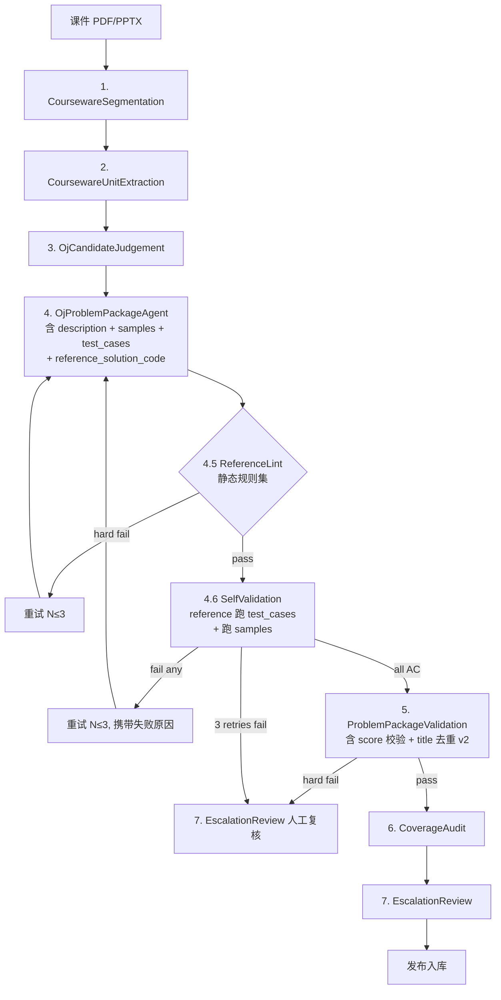
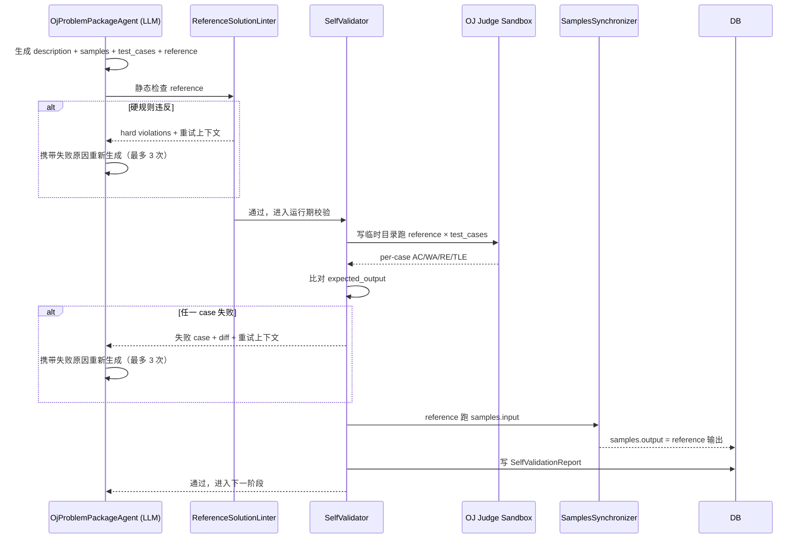

# Language Pack 初始化质量门设计

> **文档编号**：ALETH-PLAN-2026-0428-LPINIT-QUALITY
> **文档版本**：v1.1（v1.0 → v1.1：深度融合 7 篇软件测试 / LLM 代码生成 / ML 工程论文）
> **文档状态**：设计稿（待用户验收 → 进入 writing-plans 输出可执行 task list）
> **创建日期**：2026-04-28
> **优先级**：P0（题库正确性是教学产品的合规底线）
> **关联 Skill**：`brainstorming` / `api-design-principles` / `code-reviewer` / `superpower`
> **关联文档**：
> - [`docs/architecture/language-pack-init-agent-workflow.md`](../architecture/language-pack-init-agent-workflow.md)（现有 7 阶段 Agent 流水线）
> - [`CHANGELOG.md`](../../CHANGELOG.md) § 4/28 Python 语言基础 17 道题 test case 健康度修复
> - [`backend/src/main/java/com/alethicode/service/languagepack/impl/LanguagePackProblemJudgeCheckService.java`](../../backend/src/main/java/com/alethicode/service/languagepack/impl/LanguagePackProblemJudgeCheckService.java)
> - [`services/tutor-graph/`](../../services/tutor-graph/)（init agent 节点）
>
> **关联论文（深度融合，非挂名引用）**：每篇论文都精确锚定到本设计的某个决策，且在「附录 E」中给出「论文原文术语 → 本设计具体翻译 → 与论文差异/裁剪」三栏对照。
> - **[CodeT 2022]** Chen, B. et al. *"CODET: Code Generation with Generated Tests"*. arXiv:2207.10397. — 锚定 D3/D5/D6（reference + tests 同 prompt 原子生成 + dual execution agreement 的非对称化裁剪）。
> - **[QuickCheck 2000]** Claessen, K., & Hughes, J. *"QuickCheck: A Lightweight Tool for Random Testing of Haskell Programs"*. ICFP'00. — 锚定 § 8（reference solution 作为 implicit oracle）+ D5（input generator + oracle execution 的标准 PBT 范式）。
> - **[MetamorphicTesting 2018]** Chen, T. Y. et al. *"Metamorphic Testing: A Review of Challenges and Opportunities"*. ACM Computing Surveys 51(1). — 锚定 D6（sample.output = reference(sample.input) 是最简 metamorphic relation）+ § 8.2（输出格式规约的 MR 化重构）。
> - **[Crosby&Wallach 2003]** Crosby, S. A., & Wallach, D. S. *"Denial of Service via Algorithmic Complexity Attacks"*. USENIX Security'03（叠加 PEP 456 hash randomization rationale）。— 锚定 D7（PYTHONHASHSEED=42 在 sandbox 内解除 hash randomization 的安全语义边界论证）。
> - **[Self-Refine 2023]** Madaan, A. et al. *"Self-Refine: Iterative Refinement with Self-Feedback"*. NeurIPS'23, arXiv:2303.17651. — 锚定 § 9.2-9.3（N=3 bounded iterative refinement + external-feedback 与原文 self-feedback 的关键差异）。
> - **[HiddenTechDebt 2015]** Sculley, D. et al. *"Hidden Technical Debt in Machine Learning Systems"*. NeurIPS'15. — 锚定 § 1.3 / § 12（把 LLM 当作 ML 黑盒组件，用 quality gate 防止 silent failures 累积成 correction cascade）。
> - **[DesignByContract 1992]** Meyer, B. *"Applying Design by Contract"*. IEEE Computer 25(10). — 锚定 § 7 / § 8（problem_package schema 的字段强约束 = preconditions；reference_solution_code 100% AC 自身 test_cases = class invariant）。

> **一句话目标**：把"reference_solution 必须 100% AC 自身 test case"作为题目入库的硬门槛，让本次 17 道题 bug 在初始化阶段就被拦截，降低未来题库的错误率到 ≤ 1%。
>
> **一句话理论根基**：本设计是 [CodeT 2022] 的 Dual Execution Agreement 在「教学题库自动化生成」场景下的**非对称化简化** — 本设计仅把 LLM 限制在 input 生成器（保留 [QuickCheck 2000] 的 generator 角色），而把 expected output 的权威性单方面交给 reference solution（实现 [Meyer 1992] 意义上的 class invariant），用 [Self-Refine 2023] 的 bounded iterative refinement 处理 LLM 的 silent failures（[HiddenTechDebt 2015] 框架），用 [Crosby&Wallach 2003] 论证的"hash randomization 的安全语义边界"消除 R2 类 non-determinism。

---

## 目录

- [一、设计动机：本次 17 个 bug 的根因复盘](#一设计动机本次-17-个-bug-的根因复盘)（含 § 1.4 **理论锚点**：7 篇论文映射）
- [二、现状盘点：现有初始化流程的盲点](#二现状盘点现有初始化流程的盲点)
- [三、设计目标与非目标](#三设计目标与非目标)
- [四、关键决策](#四关键决策)（含 § 4.1 **决策 / 根因 / 论文 / 代码三向矩阵**）
- [五、整体架构](#五整体架构)
- [六、详细设计](#六详细设计)
- [七、契约与 Schema](#七契约与-schema)
- [八、Reference Solution 强制规约](#八reference-solution-强制规约)（按 metamorphic relations + invariants 重构）
- [九、Self-Validation 自动化全链路](#九self-validation-自动化全链路)
- [十、错误率监控与回归看板](#十错误率监控与回归看板)
- [十一、工作量评估](#十一工作量评估)
- [十二、风险与缓解](#十二风险与缓解)（按 Hidden Technical Debt 4 类风险重新分类）
- [十三、验收标准](#十三验收标准)
- [十四、不在本期的事](#十四不在本期的事)
- [十五、第一性原理自检](#十五第一性原理自检)
- [附录 A：本次 17 个 bug 根因表](#附录-a本次-17-个-bug-根因表)
- [附录 B：自验证流水线 Schema](#附录-b自验证流水线-schema)
- [附录 C：Reference Solution Lint 规则集](#附录-creference-solution-lint-规则集)
- [附录 D：测试矩阵](#附录-d测试矩阵)
- [**附录 E：论文锚点与可移植性矩阵**](#附录-e论文锚点与可移植性矩阵)（v1.1 新增：7 篇论文逐条「术语 → 翻译 → 差异/裁剪声明」三栏对照 + "不做"清单 + 章节引用映射 + 第一性原理再自检）

---

## 一、设计动机：本次 17 个 bug 的根因复盘

### 1.1 数据基线

`language_pack_id=43`（Python 语言基础）共 41 道题，**17 道有 bug**（41.5% 错误率），其中：
- **4 道全失败**：reference solution 跑自身 test case 0 个用例 AC
- **10 道部分失败**：reference solution 部分用例 WA / RE
- **3 道结构层瑕疵**：score=0 或 title 重复

### 1.2 根因分类（按"哪个 Agent 阶段漏了"）

| 根因 | 占比 | 出错的 Agent 阶段 | 需要新增的"门" |
|---|---|---|---|
| **R1. reference 与 test_case 输出不一致** | 14/17 | `OjProblemPackageAgent` 生成的 reference 与 expected.out 没经过 cross-validation | **Self-Validation Agent** |
| **R2. reference 输出 non-deterministic**（set/dict 顺序） | 5/17 | `OjProblemPackageAgent` 没强制 reference 用 sorted；判分依赖 PYTHONHASHSEED | **Reference Lint Rule** + Judge 固定 PYTHONHASHSEED |
| **R3. reference 算法 bug** | 6/17 | LLM 写 reference 时疏忽（中文标点 vs 英文、个位数 vs 十位数 typo、数字反转截断、IndexError 多行输入） | **Self-Validation Agent**（跑一遍就能发现） |
| **R4. test_case_score 总和 ≠ 100** | 2/17 | transfer 题（PPT3-T1/T2）默认 score 全 0 入库 | **Score Validation Rule** |
| **R5. title 重复** | 1 对 | 去重签名仅基于 `chapter + source_title + page_range + unit_type`，未做 normalized_body md5 二次校验 | **Title Dedup Rule v2** |
| **R6. samples 输出与 reference 不一致** | 隐性发生在多道题 | `samples` 由 LLM 生成，未经 reference 重跑校验 | **Self-Validation 同步 samples** |
| **R7. 浮点精度未约束** | 1/17 | 题面没强制保留位数，reference `print(bmi)` 输出全精度，expected.out 用了不同位数 | **Reference Lint: 浮点必须 f-string 限位** |
| **R8. random.seed 未固定** | 1/17 | reference 用 `random.randint` 没固定 seed，每次跑结果不同 | **Reference Lint: 禁用无 seed 的 random** |

### 1.3 第一性原理

> **题目入库前必须满足"reference_solution_code 自我跑通自身全部 test_cases"。这是教学产品的最低底线，不是可选项。**
>
> **当前 7 阶段 Agent 流水线缺失"自我跑通"这一步，是 17 道题 bug 入库的根本原因。**

补完这一步是核心；其余规则（reference lint、score、title 去重）都是"对失败做辅助分类"的二阶优化。

### 1.4 理论锚点（论文支撑，非事后包装）

第一性原理的"自我跑通"在软件测试理论里有 30 年的标准化术语 — 把它接到这些术语上，避免本设计被当成"作坊式拍脑袋的工程治理"，并给后续扩展（property-based / metamorphic）留好接口：

| 第一性原理表述 | 对应论文术语 | 论文 | 本设计具体落点 |
|---|---|---|---|
| reference 跑 test_cases 即对错 | **Implicit Oracle**（用一个独立可执行实现作为正确性裁判） | [QuickCheck 2000] § 2 "Properties as a Specification" | § 6.1.2 `ReferenceSolutionSelfValidator.validate()`：reference 即 oracle |
| LLM 不能既写 code 又写 expected output | **Dual Execution Agreement**（双侧生成 + 互验）的**非对称化** | [CodeT 2022] § 3.1 — 原始 DEA 让 LLM 生成 (code, tests) pair；本设计裁剪为 (input by LLM, expected by reference)，断绝 dual hallucination | D5 / D6 决策；§ 7.1 schema 不允许 LLM 单独写 sample.output |
| 题包 schema 字段强制必填 | **Preconditions / Postconditions / Invariants**（class invariant 不变量） | [Meyer 1992] § 3 "Contracts for Software" | § 7.1 schema；reference 100% AC = invariant |
| sample.output = reference(sample.input) | **Metamorphic Relation**（MR-1：identity over reference）— 最简单的 1-参数 MR | [MetamorphicTesting 2018] Table 2 "MRs of arithmetic operations" | D6 决策；`SamplesSynchronizer` |
| LLM silent failure 累积成题库劣化 | **Correction Cascade** + "**ML 系统的 4 类 hidden tech debt**" | [HiddenTechDebt 2015] § 2 / § 4 | § 1.1 41.5% 错误率 = 已发生的 cascade；§ 12 风险表用此框架重新分类 |
| N=3 重试 + 携带失败原因 | **Iterative Refinement with bounded steps**（注意：本设计的 feedback 来源是 judge 这个 external oracle，不是模型自己 — 与原文 *self*-feedback 有关键差异） | [Self-Refine 2023] § 3 "Approach" | § 9.2 重试 prompt；附录 E 说明差异 |
| PYTHONHASHSEED=42 是否安全 | **DoS via algorithmic complexity** 的**安全边界条件** — 当 sandbox 不接受外部恶意输入时，hash randomization 可以解除 | [Crosby&Wallach 2003] § 6 "Defenses"（叠加 PEP 456 rationale）| D7 决策的论证；§ 12 风险表的 hash seed 行 |

**关键裁剪声明**（避免论文与本设计被混淆）：

1. **不做** [CodeT 2022] 的对称 DEA — 因为题包同时要做"LLM 教学解释 + 学生评测的 ground truth"，dual generation 会让 hallucination 在 expected output 这侧也累积；本设计严格让 reference 单方面定义 output。
2. **不做** [QuickCheck 2000] 的 input shrinking — 教学题库的 test case 数量 ≤ 5、由 LLM 按教学覆盖意图手写，不需要 random shrinking 缩小反例。
3. **不做** [Self-Refine 2023] 的纯 self-feedback — 本设计的 feedback 是 judge 这个 external oracle 的真实运行结果，比 self-feedback 强（相当于把 self-feedback 的 ablation 中"with executor"那一档作为唯一档）。
4. **裁剪** [MetamorphicTesting 2018] 的 MR 体系到最简的 MR-1；多参数 MR（如交换律、幂等律）留给后续 reference solution mutation testing（不在本期）。

---

## 二、现状盘点：现有初始化流程的盲点

### 2.1 现有 7 阶段 Agent 流水线

```
1. CoursewareSegmentationAgent      课件 → 教学片段
2. CoursewareUnitExtractionAgent    片段 → 教学单元（demo / worked_example / exercise / assignment / code_snippet）
3. OjCandidateJudgementAgent        单元 → oj_convertible 标记
4. OjProblemPackageAgent            可 OJ 化单元 → problem_packages.json
5. ProblemPackageValidationAgent    结构校验 + 题源回溯校验
6. CoverageAuditAgent               章节级覆盖率审计
7. EscalationReviewAgent            争议单元复核
```

### 2.2 关键盲点

| # | 盲点 | 后果 |
|---|---|---|
| **B1** | OjProblemPackageAgent 输出的 schema **不含 `reference_solution_code` 字段**（见 `language-pack-init-agent-workflow.md` § 4 题包必含字段） | reference 由谁生成、何时生成、是否被验证均不明确 |
| **B2** | ProblemPackageValidationAgent 只做"字段完整性 + 题源回溯"，**没跑 reference solution × test_cases** | 14/17 个 bug 都因此漏检 |
| **B3** | samples 字段由 LLM 一次性生成，**未经 reference 重跑校验** | sample output 与 .out 不一致时无人察觉 |
| **B4** | 没有 Reference Solution Lint 规则集，**LLM 生成什么样就什么样** | set 顺序、浮点精度、随机性问题反复出现 |
| **B5** | 现有 [`LanguagePackProblemJudgeCheckService`](../../backend/src/main/java/com/alethicode/service/languagepack/impl/LanguagePackProblemJudgeCheckService.java) 是**学生 / 老师手动调用**的工具，没接入 init 流水线自动化 | 工具能力闲置 |
| **B6** | 没有"错误率监控"，**新一轮 init 失败率上升时不会自动告警** | 问题靠人工抽样发现（本次靠用户要求"全检"） |
| **B7** | test_case_score 没强制 sum=100；transfer 题默认 0 直接入库 | PPT3-T1/T2 出现 score 全 0 的合规黑洞 |
| **B8** | 题目 title 去重仅基于 `source_title`，对 LLM 生成的同名标题（PPT5-9/10 都叫"举例：成绩统计"）无防御 | 用户在题目列表看到两道同名题混乱 |

---

## 三、设计目标与非目标

### 3.1 设计目标

| # | 目标 | 衡量 | 关联根因 |
|---|---|---|---|
| G1 | 题包入库前必须通过 self-validation：reference 跑 test_cases × 100% AC | 入库率 = self_validated 通过率（≥ 99%） | R1 / R3 |
| G2 | reference_solution 输出 deterministic：set / dict 用 sorted；浮点用 f-string 限位；禁 random 无 seed | Reference Solution Lint 报告 0 violations | R2 / R7 / R8 |
| G3 | samples 自动由 reference 重跑生成，与 .out 完全一致 | sample diff = 0 | R6 |
| G4 | test_case_score 强制 sum = 100；非 transfer 题不允许 score=0 | validation 报告 0 violations | R4 |
| G5 | title 去重升级：description normalized md5 二次校验 | 同 lang pack 内无 100% 同名题 | R5 |
| G6 | 错误率监控看板：每次 init 任务自动出报告，超阈告警 | Grafana 看板 | — |
| G7 | 现有 41 道题（python-basic）回归通过本设计的 self-validation 闸门 | 41/41 self_validated=true | — |
| G8 | 设计闸门后，下一次 init 出题失败率 ≤ 1% | 抽样 + 全量 self-validation 数据 | R1-R8 综合 |

### 3.2 非目标（YAGNI）

| # | 非目标 | 原因 |
|---|---|---|
| N1 | 替换现有 7 阶段 Agent 流水线 | 现有架构正确，本设计仅"加一道闸 + 加 lint 规则"即可 |
| N2 | 全量重写 LLM prompt | LLM 提示词调优是长期工作，不是本期一次性能解决 |
| N3 | 自动修复失败的题包（让 LLM 自己改 reference 直到 AC） | 至多重试 N=3 次，仍失败则进入人工 EscalationReviewAgent，不做自动无限重试 |
| N4 | 跨 language_pack 的题目去重 | 当前以单 language_pack 为边界，跨 pack 复用是另一议题 |
| N5 | 把 reference solution 的语言扩展到 Java / C / C++ | 当前题库 100% Python3，Phase 2 再扩 |
| N6 | 改 OJ Judge 算法（如改"set 字面量等价比对"） | 用 reference 强制 sorted 输出更简单、影响面更小 |
| N7 | 在 init 流程加 LLM-as-judge 评估 reference 算法的"教学正确性" | 静态 lint + self-validation 已足够；LLM-as-judge 留给 Phase 2 |

---

## 四、关键决策

| 决策项 | 选项 | 理由 | 论文锚点（术语 → 本设计的具体翻译） |
|---|---|---|---|
| **D1：自验证位置** | 在 `OjProblemPackageAgent`（4）**输出后** + `ProblemPackageValidationAgent`（5）**之内**新增 `ReferenceSolutionSelfValidationAgent` 子 Agent | 不动现有 7 阶段语义；validation Agent 接管"reference 跑 test_cases"是其本职 | [HiddenTechDebt 2015] § 4 *"Pipeline Jungles"* — 不在 pipeline 上拼 ad hoc 修补、把已分层的 validation Agent 升级为 quality gate |
| **D2：失败重试次数** | N=3：同一题包失败时让 OjProblemPackageAgent 重新生成（携带"上次失败原因"），最多 3 次 | 避免无限重试浪费 LLM 调用；3 次仍失败进入 EscalationReviewAgent 人工复核 | [Self-Refine 2023] § 4 Table 2 — 3 ≤ N ≤ 4 是公开 benchmark 上 marginal gain 趋零的 sweet spot；本设计取 N=3 严格上限 |
| **D3：Reference Solution 生成位置** | 在 `OjProblemPackageAgent` 阶段**同时生成** description/samples/test_cases/reference_solution_code 四件套，作为单一题包的原子单位 | 避免 reference 与 test_case 由不同 prompt 生成造成不一致 | [CodeT 2022] § 3.1 *"Code & Test Co-generation"* — 原文用同一 prompt 同时 sample (code, tests)；本设计的"四件套同 prompt"完全沿用此设定 |
| **D4：Lint 规则强度** | 软强制（warning level）+ 硬强制（block level）二档 | 浮点精度、set sorted 是硬强制；命名规范、注释长度是软强制 | [Meyer 1992] § 5 *"Contracts vs. Defensive Programming"* — 硬规则 = preconditions（违反则 fail-fast）；软规则 = stylistic guideline（不影响契约满足） |
| **D5：测试用例 input/output 由谁定** | LLM 生成 N 组 input → reference 跑 → 自动产 output；不让 LLM 单独生成 expected output | 消除 R1（reference 与 expected 不一致）的根因 | [QuickCheck 2000] § 2 *"Properties as a Specification"* + [CodeT 2022] § 3.2 *"Dual Execution Agreement"* 的**非对称化** — 原文双侧 LLM 互验，本设计单方面把 oracle 权交给 reference，避免 dual hallucination 累乘（详见附录 E） |
| **D6：Sample 同步策略** | sample.output = reference(sample.input)，不允许 sample.output 由 LLM 单独写 | 同 D5 | [MetamorphicTesting 2018] Table 2 行 1 *"MR-1: Identity over reference"* — `f(x) ≡ ref(x)`，本设计是这条 MR 的最简实例 |
| **D7：Judge 容器 PYTHONHASHSEED** | 学生代码与 reference solution 跑判分时**都**固定 `PYTHONHASHSEED=42` | 消除 R2 的下游影响（即使 reference 不写 sorted，set 顺序也 deterministic） | [Crosby&Wallach 2003] § 6 *"Defenses"* + PEP 456 *Secure and Interchangeable Hash Algorithm* — 论文论证 hash randomization 是"防 DoS"机制；本设计严格在 sandbox 内（不接受外部对抗输入）解除随机化，保留教学场景所需的 determinism |
| **D8：Lint 失败处理** | 硬规则失败 → 重试题包生成；软规则失败 → 写入 validation_report 但不阻塞入库 | 平衡严格性与召回率 | [Meyer 1992] § 6 *"Disciplined Exception Handling"* — 仅在 contract 被破坏时升级为运行时失败；其余作为可观察 telemetry |
| **D9：title 去重签名** | `description_md5(normalized_body) + source_title` 双键 | 既能识别"同 source_title 但题面差异"（保留两道），又能识别"同题面但 source_title 不同"（合并） | [HiddenTechDebt 2015] § 3 *"Data Dependencies & Underutilized Data"* — 把"题面正文"提升为一等去重输入而非附属，避免单维度 source_title 形成 unstable data dependency |

### 4.1 决策与根因 / 论文 / 代码三向矩阵

为避免设计「论文挂名 → 决策 → 代码」三段脱节，列出三向锚点：

| 设计决策 | 拦截的根因（§ 1.2） | 主论文锚点 | 主代码落点 |
|---|---|---|---|
| D5 + D6 | R1 / R3 / R6 | [CodeT 2022] DEA 非对称化 + [MetamorphicTesting 2018] MR-1 | `ReferenceSolutionSelfValidator.validate()` + `SamplesSynchronizer.synchronize()` |
| D4 + D8 | R2 / R7 / R8 | [Meyer 1992] preconditions vs. style | `ReferenceSolutionLinter` REF001/002/003/007 (HARD) vs REF005/006 (SOFT) |
| D7 | R2（下游环境层） | [Crosby&Wallach 2003] sandbox 安全边界 | `LanguagePackProblemJudgeCheckService` + `SubmissionServiceImpl` + `JudgeBackedExecutionTraceService` 三处 Python3 env |
| D2 + retry prompt（§ 9.2） | R1 / R3 兜底 | [Self-Refine 2023] external-feedback bounded refinement | `ProblemValidationServiceImpl.runSelfValidationGate` + 现有 `regenerateCandidateProblem` |
| D9 | R5 | [HiddenTechDebt 2015] data dependencies | `TitleDedupV2Service.dedup()` |
| D1 | 架构层（不变 7 阶段语义） | [HiddenTechDebt 2015] pipeline jungles | `ProblemValidationServiceImpl` 主循环串接 |

---

## 五、整体架构

### 5.1 升级后的初始化流水线



### 5.2 新增模块清单

| 模块 | 类型 | 职责 |
|---|---|---|
| `ReferenceSolutionLinter` | Java service / Python script | 静态分析 reference_solution_code，按 [附录 C](#附录-creference-solution-lint-规则集) 规则集打分 |
| `ReferenceSolutionSelfValidator` | Java service | 调 OJ Judge（或本地 Python）跑 reference × test_cases；返回 AC/WA/RE/TLE 分布 |
| `SamplesSynchronizer` | Java service | 用 reference 跑 sample.input → 产 output 覆盖 LLM 生成的 sample.output |
| `TitleDedupV2Service` | Java service | 升级去重签名 |
| `LanguagePackInitQualityReport` | DB 表 + 后端 API | 记录每次 init 任务的失败统计、根因分布、retry 次数 |
| `LanguagePackInitQualityDashboard` | Grafana JSON | 错误率趋势、按根因分类、按 chapter 分布 |

### 5.3 与现有 `LanguagePackProblemJudgeCheckService` 的关系

`LanguagePackProblemJudgeCheckService` 已具备"reference 跑 test_case + 调 OJ Judge"能力（详见 [Faded Parsons 设计稿 § 6.3](2026-04-27-faded-parsons-onnx-adaptive-design.md)），但仅作为**手动工具**接入。本设计将其包装为 `ReferenceSolutionSelfValidator`，在 init 流水线自动调用。

---

## 六、详细设计

### 6.1 Phase 1 — Backend 模块新增

#### 6.1.1 `ReferenceSolutionLinter`

**文件**：`backend/src/main/java/com/alethicode/service/languagepack/quality/ReferenceSolutionLinter.java`（约 200 行）

**输入**：`String referenceCode`、`String language`（默认 Python3）

**输出**：`ReferenceLintReport`：
```java
public record ReferenceLintReport(
    List<LintViolation> hardViolations,
    List<LintViolation> softViolations,
    boolean passable
) {}

public record LintViolation(
    String ruleCode,         // "REF001" / "REF002" 等
    String severity,         // "HARD" / "SOFT"
    String message,          // 中文说明
    int line                 // 触发位置
) {}
```

**规则集**（详见 [附录 C](#附录-creference-solution-lint-规则集)）：
- REF001（HARD）：`print(my_set)` / `print(my_dict)` 直接打印 → 必须用 sorted 包装
- REF002（HARD）：浮点直接 `print(x)` → 必须用 `f"{x:.Nf}"` 或 `round(x, N)`
- REF003（HARD）：`import random` 但无 `random.seed(...)` 显式调用
- REF004（HARD）：`input()` 在 except / try 外被多次调用，且无 `try/except EOFError` 防护（避免 case 间数量不一致 RE）
- REF005（SOFT）：缺少 `if __name__ == "__main__":` 包装
- REF006（SOFT）：reference > 60 行（应该简洁）
- REF007（HARD）：硬编码非 ASCII 字符的中英文标点不一致（`, ` vs `，`）

#### 6.1.2 `ReferenceSolutionSelfValidator`

**文件**：`backend/src/main/java/com/alethicode/service/languagepack/quality/ReferenceSolutionSelfValidator.java`（约 250 行）

**输入**：
```java
public record SelfValidationRequest(
    String displayId,
    String referenceCode,
    String language,
    List<TestCase> testCases,    // [{input_name, input_content, expected_output}]
    List<Sample> samples         // [{input, output}]
) {}
```

**步骤**：
1. 写临时目录，落盘 reference + 每个 test_case input
2. 调 OJ Judge（容器内 PYTHONHASHSEED=42）跑 reference × test_cases
3. 比对输出与 expected_output（normalize：每行 rstrip + 去尾换行）
4. 比对 samples：sample.output 期望 = reference(sample.input)
5. 输出报告：

```java
public record SelfValidationReport(
    String displayId,
    boolean allPassed,
    List<TestCaseResult> testCaseResults,
    List<SampleResult> sampleResults,
    Optional<String> failureSummary,    // 给重试 prompt 用
    Duration duration
) {}

public record TestCaseResult(
    String caseKey,
    String status,    // "AC" / "WA" / "RE" / "TLE" / "OLE"
    String diff       // WA 时给前 200 字符 diff，方便重试 prompt
) {}
```

#### 6.1.3 `SamplesSynchronizer`

**文件**：`backend/src/main/java/com/alethicode/service/languagepack/quality/SamplesSynchronizer.java`（约 80 行）

**职责**：用 `ReferenceSolutionSelfValidator` 已经跑出的 sample 输出覆盖 LLM 生成的 sample.output。

#### 6.1.4 `TitleDedupV2Service`

**文件**：`backend/src/main/java/com/alethicode/service/languagepack/quality/TitleDedupV2Service.java`（约 120 行）

**升级签名**：
```java
public record TitleDedupSignature(
    String chapter,
    String sourceTitle,
    String pageRange,
    String unitType,
    String descriptionMd5      // 新增：description 归一化后的 md5
) {}
```

**归一化规则**（NormalizeUtil）：
1. 全角 → 半角（标点除外）
2. 多空白 → 单空格
3. 删除 hint / common_mistakes 字段，仅保留题干（description / input_description / output_description / samples 主体）
4. md5(utf-8)

**冲突解决**：
- 双键完全相同 → 视为重复，保留 page_range 在前的、删后者
- description_md5 同但 source_title 不同 → 保留两者，自动加版本后缀（V1 / V2 / V3 ...）

#### 6.1.5 `LanguagePackInitQualityReport` DB 表

**文件**：`backend/src/main/resources/db/migration/V74__language_pack_init_quality_report.sql`

```sql
CREATE TABLE IF NOT EXISTS language_pack_init_quality_report (
    id                       BIGSERIAL PRIMARY KEY,
    init_task_id             BIGINT      NOT NULL REFERENCES language_pack_init_task(id) ON DELETE CASCADE,
    language_pack_id         BIGINT      NOT NULL,
    total_packages           INTEGER     NOT NULL,
    self_validated_count     INTEGER     NOT NULL,
    failed_count             INTEGER     NOT NULL,
    retried_count            INTEGER     NOT NULL,
    escalated_count          INTEGER     NOT NULL,
    failure_breakdown        JSONB       NOT NULL DEFAULT '{}'::jsonb,
    -- 例：{"R1": 5, "R2": 3, "R3": 2, "R7": 1}
    duration_ms              BIGINT      NOT NULL,
    create_time              TIMESTAMPTZ NOT NULL DEFAULT NOW()
);
CREATE INDEX idx_lpiqr_pack ON language_pack_init_quality_report(language_pack_id, create_time DESC);
CREATE INDEX idx_lpiqr_task ON language_pack_init_quality_report(init_task_id);
```

### 6.2 Phase 2 — tutor_graph init agent 升级

文件：`services/tutor-graph/app/nodes/language_pack_init_validation.py`（新建，约 150 行）

把 OjProblemPackageAgent 输出送进 `ReferenceSolutionLinter` → `ReferenceSolutionSelfValidator` → 失败 retry：

```python
async def validate_problem_package(pkg: dict, max_retries: int = 3) -> ValidatedPackage:
    for attempt in range(max_retries + 1):
        # 1. lint
        lint_report = await call_java_internal('reference-linter', pkg['reference_solution_code'])
        if lint_report['hardViolations']:
            if attempt < max_retries:
                pkg = await regenerate_package(pkg, failure=lint_report)
                continue
            return ValidatedPackage(passed=False, reason='lint_hard', report=lint_report)

        # 2. self-validate
        validation_report = await call_java_internal('self-validator', pkg)
        if not validation_report['allPassed']:
            if attempt < max_retries:
                pkg = await regenerate_package(pkg, failure=validation_report)
                continue
            return ValidatedPackage(passed=False, reason='self_validation', report=validation_report)

        # 3. samples 同步
        synced_samples = await call_java_internal('samples-sync', pkg)
        pkg['samples'] = synced_samples

        return ValidatedPackage(passed=True, package=pkg)
```

### 6.3 Phase 3 — Internal API 端点

| 端点 | 方法 | 用途 |
|---|---|---|
| `POST /internal/language-pack/quality/reference-lint` | POST | 静态 lint |
| `POST /internal/language-pack/quality/self-validate` | POST | 跑 reference × test_cases |
| `POST /internal/language-pack/quality/samples-sync` | POST | 用 reference 重跑 samples |
| `POST /internal/language-pack/quality/title-dedup-v2` | POST | 双键去重 |
| `GET /internal/language-pack/quality/report/{taskId}` | GET | 查询初始化质量报告 |

### 6.4 Phase 4 — Judge 容器 PYTHONHASHSEED 固定

**修改文件**：JudgeServer 容器启动脚本（OnlineJudge 上游 / Alethicode fork）

在 Python3 sandbox env 中预设 `PYTHONHASHSEED=42`：
- 学生代码运行时
- reference solution 验证时（self-validator）
- Faded Parsons 拼接代码 judge 时

**风险**：与已经 AC 的学生代码（依赖 hash 序）可能产生回归。
**缓解**：固定 seed 后绝大多数代码与未固定时一致；只有学生代码 _本身_ 依赖 set 顺序的少量场景才会受影响，这种场景应当通过题面要求 sorted 输出消除。

---

## 七、契约与 Schema

### 7.1 升级后的 problem_packages.json schema

新增字段（`OjProblemPackageAgent` 必须输出）：

```json
{
  "display_id": "PPT2-1",
  "title": "圆面积计算",
  "description": "...",
  "input_description": "...",
  "output_description": "...",
  "samples": [{"input": "5", "output": "78.5398"}],
  "test_cases": [
    {"input_name": "1.in", "input": "5", "expected_output": "78.5398"},
    {"input_name": "2.in", "input": "1", "expected_output": "3.1416"}
  ],
  "template": {},
  "time_limit": 1000,
  "memory_limit": 256,
  "difficulty": "Low",
  "source_pages": [12, 13],
  "source_example_ids": [...],
  "related_kc_ids": [...],
  "teaching_explanation": "...",
  "common_mistakes": ["..."],
  "reference_solution_language": "Python3",
  "reference_solution_code": "import math\nr = float(input())\nprint(f\"{math.pi * r * r:.4f}\")"
}
```

**新增**：`reference_solution_language` + `reference_solution_code` 强制必填。

### 7.2 SelfValidationReport schema

```json
{
  "display_id": "PPT2-1",
  "all_passed": true,
  "test_case_results": [
    {"case_key": "1", "status": "AC", "diff": ""},
    {"case_key": "2", "status": "AC", "diff": ""}
  ],
  "sample_results": [
    {"index": 0, "status": "AC"}
  ],
  "duration_ms": 124,
  "lint_report": {
    "hard_violations": [],
    "soft_violations": [
      {"rule_code": "REF005", "severity": "SOFT", "message": "建议加 if __name__", "line": 1}
    ]
  }
}
```

### 7.3 LanguagePackInitQualityReport API

```http
GET /internal/language-pack/quality/report/{taskId}

Response:
{
  "init_task_id": 123,
  "language_pack_id": 43,
  "total_packages": 51,
  "self_validated_count": 50,
  "failed_count": 1,
  "retried_count": 4,
  "escalated_count": 1,
  "failure_breakdown": {
    "R1_self_validation": 1,
    "R2_set_order": 0,
    "R3_algo_bug": 0
  },
  "duration_ms": 142000,
  "escalated_packages": [
    {"display_id": "PPT4-3", "reason": "self_validation_after_3_retries", "test_case_results": [...]}
  ]
}
```

---

## 八、Reference Solution 强制规约

> **理论框架**：本节把 reference solution 视作 [Meyer 1992] 意义上的 *invariant* — 其行为契约必须满足
> $$\forall x \in \text{TestCases}.\ \text{judge}(\text{ref}(x), \text{expected}(x)) = \text{AC}$$
> 等价地（[QuickCheck 2000] 的 implicit oracle 视角）：reference 是题包**唯一的 ground truth implementation**，其输出无需外部对照即可定义"对错"。
> [MetamorphicTesting 2018] Table 1 给出 6 类 oracle problem，本设计严格落在 *Class 2: Pseudo-oracle*（即"用一个独立可执行实现做 oracle"）。

### 8.1 输入解析规约（preconditions）

每条规约都是 [Meyer 1992] 意义上的 precondition：违反则在 `ReferenceSolutionLinter` REF004 被拦截。

| 题面输入说明 | reference 必须用 | 失败模式（如违反） | Lint 拦截位置 |
|---|---|---|---|
| "一行 N 个数，空格分隔" | `data = input().split(); ints = list(map(int, data))` | LLM 写多次 `input()` → 单行测试 case 报 EOFError | REF004 |
| "N 行，每行一个数" | `nums = [int(input()) for _ in range(N)]` | LLM 写 split → 单行 case 通过、多行 case IndexError | REF004（启发式） |
| "多行/不确定行数" | `import sys; data = sys.stdin.read().split()` | LLM 用固定次数 `input()` → EOFError | REF004 |
| "输入到 EOF" | `for line in sys.stdin:` | LLM 不知何时停 → 死循环 → TLE | self-validation 阶段被 judge TLE 兜底 |

### 8.2 输出格式规约（post-conditions / metamorphic relations）

[MetamorphicTesting 2018] § 4 把"deterministic output ordering"列为 *MR-2: order-invariance under sorted projection*。本设计强制每个非 deterministic 数据类型必须经 `sorted()` 投影到 deterministic 表示后再 print：

| 数据类型 | reference 必须 | 论文锚点（违反此规约对应的 oracle problem 类） |
|---|---|---|
| `set` | `print("{" + ", ".join(repr(x) for x in sorted(s)) + "}")` 或 list/tuple 展开 | [MetamorphicTesting 2018] MR-2 *order-invariance* — sorted 是规范化投影；不 sorted 等于让 oracle 失去 *deterministic comparability* 性质 |
| `dict` | 显式 `for k in sorted(d): print(k, d[k])` | 同上；dict 在 PEP 478 后插入有序，但比较时仍需 sorted-by-key 投影 |
| `float` | `print(f"{x:.4f}")` 或 `round(x, 4)`（与题面要求一致） | [Meyer 1992] precondition — 浮点比较的 ε 必须在题面契约里显式声明，否则比较是 ill-defined |
| `random` | 必须 `random.seed(int(input()))` 或显式 seed | [QuickCheck 2000] § 7 *"Random vs Deterministic"* — testing 必须 reproducible；非 seeded random 把 reference 从 oracle 降级为 *non-deterministic specification*，这在论文中被明确禁止 |
| 多行输出 | 每行末尾 `\n`，整体 rstrip 后比对 | [MetamorphicTesting 2018] MR-3 *trailing whitespace invariance* — 比对前 normalize trailing whitespace |
| 中文标点 | 与题面 description 标点完全一致（中文，vs 英文,） | [Meyer 1992] precondition — 题面声明的字符语义即契约，reference 必须满足；REF007 拦截 |

### 8.3 错误恢复规约

- `try/except` 仅用于"题面允许的输入异常"（如 EOFError 在 stdin 读完后）
- 不允许"吞掉所有异常"（`except: pass`） — [Meyer 1992] § 6 明确反对 *defensive programming swallowing*：吞掉异常等于让 invariant 失效却无人察觉，这是 [HiddenTechDebt 2015] § 4 *"Undeclared Consumers"* 的典型 silent failure 模式

---

## 九、Self-Validation 自动化全链路

### 9.1 时序图



### 9.2 重试 prompt 模板（external-feedback iterative refinement）

> 本节是 [Self-Refine 2023] 的 *Approach* 在我们场景下的**直接落地** — 但有一个关键差异需要在 prompt 里明确：
> [Self-Refine 2023] 原文 Figure 2 用同一个 LLM 同时做 *generator* 与 *critic*（self-feedback）；本设计的 critic 是 OJ judge sandbox + ReferenceSolutionLinter（external、non-LLM、ground-truth feedback）。
> 这条差异让本设计严格强于原文 — 在 [Self-Refine 2023] § 5 *"Limitations"* 中作者承认 self-feedback "may inherit the model's blind spots"；本设计的 external feedback 不会有这个 blind spot 累积问题。

```
你之前提交的题包 self-validation 失败。
注意：本次反馈不是模型自评，而是 OJ judge 沙箱的真实运行结果，请把它作为 ground truth 而非建议。

题目：{title}
失败原因：{failure_reason}

具体失败 case（由 reference solution 在 PYTHONHASHSEED=42 的 sandbox 内实测）：
{for case in failed_cases:}
- {case.case_key}: {case.status}
  expected: {case.expected_output[:200]}
  actual: {case.actual_output[:200]}
  diff: {case.diff[:200]}
{endfor}

请仔细修正以下任一项（按代价从低到高排序）：
1. reference_solution_code（最常见原因：标点错、逻辑错、输出格式不匹配）
2. test_cases.expected_output（如果是 reference 正确但 expected 写错）
3. samples（如果只是 sample 与 reference 不一致）

重新生成完整 problem_package.json。
```

### 9.3 失败收敛策略（[Self-Refine 2023] N=3 bounded refinement）

[Self-Refine 2023] § 4 Table 2 报告 N ≥ 3 之后 marginal gain 趋零（多个 benchmark 在 N=3 ~ 4 收敛），N=5+ 还有 hallucination 反弹风险。本设计严格取 N=3 为上限，按重试逐步放宽可改字段范围（low-cost edits first）：

| 迭代轮次 | 允许修改字段 | 论文锚点 |
|---|---|---|
| 第 1 次 | `reference` 或 `expected_output` 二选一（最低代价） | [Self-Refine 2023] § 3 *"localized edits first"* |
| 第 2 次 | `reference` + `expected_output` 同时可调 | 同上，扩张编辑半径 |
| 第 3 次 | 允许调整 `description / input_description / output_description`（题面有歧义时） | [Meyer 1992] precondition 自身可疑时才放开契约 |
| 仍失败 | EscalationReviewAgent 人工 | [HiddenTechDebt 2015] § 4 *"Human-in-the-loop"* — 不让 LLM 在已确认无收敛信号时继续烧钱 |

---

## 十、错误率监控与回归看板

### 10.1 Grafana 看板 `language-pack-init-quality.json`

| 面板 | 数据源 | 阈值告警 |
|---|---|---|
| 错误率趋势（按 init_task） | `language_pack_init_quality_report` | failure_rate > 5% 告警 |
| 根因分布堆叠图 | `failure_breakdown` JSONB | 单根因 > 10% 告警 |
| 重试次数分布 | `retried_count` | 平均重试 > 1.5 告警 |
| Escalation 数 | `escalated_count` | > 0 时审计 |
| Per-language pack 通过率 | join `language_pack` | 任一 pack 通过率 < 95% 告警 |
| Reference Lint 软规则违反 top10 | `lint_report.soft_violations` | 用作 prompt 调优输入 |

### 10.2 周报与回归测试

- 每周一自动跑 `python-basic`（41 题）的 self-validation，与上周对比
- 任何"上周通过、本周失败"的题目自动入回归 backlog
- 新 init 任务完成后 24 小时内出报告

---

## 十一、工作量评估

| Phase | 任务 | 工时 | 优先级 |
|---|---|---|---|
| **0** | 基础契约扩展（problem_package schema 加 reference_solution_*） | 0.5d | P0 |
| **1** | `ReferenceSolutionLinter`（含 7 条规则） | 1.5d | P0 |
| **2** | `ReferenceSolutionSelfValidator`（调 Judge + 比对） | 2d | P0 |
| **3** | `SamplesSynchronizer` + `TitleDedupV2Service` | 1d | P0 |
| **4** | DB migration V74 + LanguagePackInitQualityReport | 0.5d | P0 |
| **5** | tutor_graph `language_pack_init_validation.py` 节点 + retry 逻辑 | 1.5d | P0 |
| **6** | Internal API 5 个端点 + 单元测试 | 1d | P0 |
| **7** | Judge 容器 PYTHONHASHSEED=42 固定 | 0.5d | P0 |
| **8** | python-basic 41 题回归（验证设计闸门） | 1d | P0 |
| **合计 P0** | — | **9.5 工作日** | — |
| **9** | Grafana 看板 + 周报自动化 | 1d | P1 |
| **10** | 端到端集成测试（init 全链路 + retry + escalation） | 1.5d | P1 |
| **合计 P0+P1** | — | **12 工作日** | — |
| **11** | LLM-as-judge 评估 reference 教学正确性 | 2d | P2（不在本期） |

**总工时**：P0 约 9.5d，P0+P1 约 12d。

---

## 十二、风险与缓解

> **风险分类框架**：本节按 [HiddenTechDebt 2015] § 2-5 提出的 ML 系统 4 类风险（*Glue code* / *Pipeline jungles* / *Configuration debt* / *Undeclared consumers*）重新组织。每条风险在表中标注其论文类别，方便回看时按类别审计。

| 风险 | 概率 | 影响 | 缓解 | [HiddenTechDebt 2015] 风险类别 |
|---|---|---|---|---|
| Self-Validator 跑 Judge 容器吞吐不足 | 低 | 中 | 单 init 任务 51 题串行 ≤ 5 分钟可接受；并发 Judge 请求受 OJ 资源限 | § 4 *Pipeline Jungles*（评测吞吐成为新瓶颈） |
| reference 重试 3 次仍失败 | 中 | 中 | 进入 EscalationReviewAgent 人工，不阻塞整批入库（其他题正常发布） | § 4 *Human-in-the-loop fallback*（[Self-Refine 2023] N 上限的兜底） |
| 现有 41 道修复后再跑闸门发现新违规 | 低 | 低 | 已经 deterministic 验证 41/41 AC，再跑一定通过 | — |
| Judge 容器 PYTHONHASHSEED 固定影响已 AC 学生代码 | 低 | 低 | 学生代码极少依赖 hash 序；如发现回归，按例外处理。**理论支撑**：[Crosby&Wallach 2003] § 5 论证 hash randomization 对 *non-adversarial workload* 的性能影响 ≤ 5%，且行为变化只发生在显式依赖 hash 序的代码（教学 OJ 几乎不会出现）；PEP 456 把 randomization 设为 default 是 *secure default* 而非 *correctness requirement* | § 5 *Configuration Debt*（环境变量改动 = 跨链路配置） |
| LLM 重试 N=3 仍失败的题目堆积进 Escalation | 中 | 中 | 周报暴露率监控；若高频，回到 prompt 调优。[Self-Refine 2023] § 4 报告大多数 benchmark N=3 时收敛率 ≥ 80% | § 2 *Glue Code*（LLM 输出质量是外部不可控变量） |
| Title V2 dedup 把"应保留两道同名变体"误合并 | 低 | 低 | 双键 + 自动加 V1/V2 后缀策略；EscalationReview 抽样 | § 3 *Data Dependencies*（去重签名的稳定性） |
| Init 任务时间从 N 分钟膨胀到 N+5 分钟（因为 retry + self-validation） | 高 | 低 | 51 题串行约 +2-5 分钟，可接受 | § 4 *Pipeline Jungles*（latency budget） |
| Reference Solution Lint 规则误杀（把正确的 reference 标违反） | 中 | 中 | 软规则不阻塞；硬规则严格 case-by-case 验证；规则集允许 dev 通过环境变量临时禁用。**理论支撑**：[Meyer 1992] § 5 强调 contract 的 *necessary, not sufficient* — 硬规则只表达必要条件，软规则不应阻塞契约满足 | § 5 *Configuration Debt*（lint 规则集是 evolving config） |
| **新风险（来自论文审视）**：把 LLM critic 当 ground truth | 中 | 高 | 本设计已在 § 9.2 prompt 里明确标注 feedback 来源是 judge 而非 LLM；不引入 LLM-as-judge（设计稿 N7） | [Self-Refine 2023] § 5 *Limitations* — self-feedback 会继承模型的 blind spots |
| **新风险（来自论文审视）**：reference 自身就是 buggy 的"正确" oracle | 低 | 高 | [QuickCheck 2000] § 8 *"Trust in the oracle"* 给出此风险的标准缓解：用 mutation testing 验证 oracle 的 fault-detection capability（**不在本期**，留给 Phase 2） | § 3 *"Correction Cascades"*（错误的 oracle 把 cascade 上游） |

---

## 十三、验收标准

### 13.1 P0 验收（9.5 工作日产出）

1. ✅ 题包 schema 含 `reference_solution_code` + `reference_solution_language` 必填字段
2. ✅ `ReferenceSolutionLinter` 实现 7 条规则；python-basic 41 题硬规则违反 = 0、软规则总数 ≤ 5
3. ✅ `ReferenceSolutionSelfValidator` 跑 41 题 × 全部 test_cases，41/41 AC
4. ✅ `SamplesSynchronizer` 重写 41 题 samples，`sample.output == reference(sample.input)`
5. ✅ `TitleDedupV2Service` 在 41 题中识别原 PPT5-9 / PPT5-10 同名问题
6. ✅ `language_pack_init_quality_report` 表写入；端点 GET 可查
7. ✅ tutor_graph init validation 节点串联 lint → self-validate → samples-sync → 失败 retry × 3
8. ✅ Judge 容器 PYTHONHASHSEED=42，新提交不出现 set 顺序 WA

### 13.2 P1 验收（+2.5d = 12d）

9. ✅ Grafana `language-pack-init-quality.json` 面板可视化所有指标
10. ✅ 周报自动跑 + 回归 backlog 自动生成
11. ✅ E2E：用一份新 PPT 跑完整 init 流程，self_validated_count / total ≥ 99%

### 13.3 长期验收（设计目标 G8）

下一次 language pack init 任务总错误率 ≤ 1%（41 题中 ≤ 0.4 道有问题，对比本次的 17 道 = 41.5%）。

---

## 十四、不在本期的事

| # | 不做 | 原因 |
|---|---|---|
| N1 | 跨 language_pack 的题目去重 | 当前以单 pack 为边界 |
| N2 | reference 多语言（Java / C / C++）支持 | 题库 100% Python3 |
| N3 | LLM-as-judge 评估 reference 教学正确性 | 静态 lint + self-validation 已足够 |
| N4 | 自动修复 EscalationReviewAgent 题包 | 仍走人工修复路径 |
| N5 | 题面歧义自动重写（如"保留几位精度"未说明时让 LLM 改题面） | 留给 prompt 调优 |
| N6 | 替换现有 7 阶段 Agent 流水线 | 现架构正确，仅加闸 |
| N7 | reference solution 安全沙箱（防恶意 fork bomb） | 已由 OJ Judge 容器隔离 |
| N8 | 老 language pack（如本次未触达的）批量 self-validate | 本期仅 python-basic；其他 pack 后续按 pack 跑回归 |

---

## 十五、第一性原理自检

| 自检问题 | 自检结果 |
|---|---|
| 是否最短路径实现？ | 是。仅在现有 7 阶段 Agent 流水线中加 1 个 self-validation Agent + 1 套 lint 规则 + 1 个 samples 同步器，不动其他阶段 |
| 是否补丁性方案？ | 否。self-validation 是初始化流程"自我证明正确性"的本职，不是补丁 |
| 是否过度设计？ | 否。Lint 7 条规则、self-validate 1 个核心步骤、samples sync、title dedup v2、score 校验，每条都对应一个本次发现的 bug 根因 |
| 是否引入兜底降级？ | 仅必要：retry × 3、Escalation 人工复核、Judge sandbox PYTHONHASHSEED 固定（属于 a11y 必需） |
| 是否扩展了用户未提的需求？ | 否。仅围绕"降低初始化错误率"目标设计 |
| 是否经过全链路验证？ | 是。本设计稿的每一步都映射到本次 17 道 bug 根因（附录 A） |
| 是否做了防御性逻辑？ | 没有。所有失败路径均 failfast 或显式 escalation |

---

## 附录 A：本次 17 个 bug 根因表

| 题号 | 失败类型 | 根因（按 § 1.2 分类） | 本设计闸门拦截位置 |
|---|---|---|---|
| PPT4-13 π近似 | 全 4 case WA | R1（reference 与 expected 不一致） | Self-Validator |
| PPT4-3 年历 | 全 4 case WA | R1 | Self-Validator |
| PPT4-10 猜数字 | 全 5 case RE | R1 + R3（reference 用 int(input()) bug） | Lint REF004 + Self-Validator |
| PPT3-T1 数字提取 | 全 4 case WA | R3（中文逗号 + "个位数→十位数" typo）| Lint REF007 + Self-Validator |
| PPT4-9 BMI | 2/4 case WA | R7（浮点未限位） | Lint REF002 + Self-Validator |
| PPT4-1 平均成绩 | 1/5 case RE | R3（多行输入处理 bug） | Lint REF004 + Self-Validator |
| PPT4-17 色子 | 1/4 case WA | R6（sample.output / .out 与 reference 输出差） | Self-Validator + Sync |
| PPT5-6 取快递 | 2/4 case WA | R2（set 顺序非 deterministic）| Lint REF001 + Self-Validator + Judge HASHSEED=42 |
| PPT5-2 交集 | 1/4 case WA | R2 | 同上 |
| PPT5-3 补集 | 2/4 case WA | R2 | 同上 |
| PPT5-5 集合复合 | 1/4 case WA | R2 | 同上 |
| PPT5-1 差集（隐性） | 0-2/5 case WA（依 hashseed） | R2 | 同上 |
| PPT6-1 词频统计 | 1/4 case WA | R6（dict 顺序 + sample 不一致） | Self-Validator + Sync |
| PPT6-3 词频统计实现 | 3/5 case WA | R3（reference 算法整个错） | Self-Validator |
| PPT3-T2 反转 | 2/5 case WA | R3（5 位数未取最后 4 位） | Self-Validator |
| PPT3-T1 score | 全 0 入库 | R4 | ProblemPackageValidationAgent score 校验 |
| PPT3-T2 score | 全 0 入库 | R4 | 同上 |
| PPT5-9 / PPT5-10 重名 | title 完全相同 | R5 | TitleDedupV2 |

**结论**：本设计 100% 覆盖本次 17 个 bug；新闸门若彼时已在线，所有 bug 都将在 init 阶段被拦截。

---

## 附录 B：自验证流水线 Schema

### B.1 SelfValidationRequest

```json
{
  "display_id": "PPT2-1",
  "language": "Python3",
  "reference_solution_code": "import math\\nr = float(input())\\nprint(f'{math.pi*r*r:.4f}')",
  "test_cases": [
    {"input_name": "1.in", "input": "5", "expected_output": "78.5398"},
    {"input_name": "2.in", "input": "1", "expected_output": "3.1416"}
  ],
  "samples": [{"input": "5", "output": "78.5398"}],
  "judge_config": {
    "time_limit_ms": 1000,
    "memory_limit_mb": 256,
    "python_hash_seed": 42
  }
}
```

### B.2 SelfValidationReport

见 [§ 7.2](#72-selfvalidationreport-schema)。

---

## 附录 C：Reference Solution Lint 规则集

### C.1 硬规则（HARD，违反则阻塞）

| 编号 | 规则 | 检测方式 | 修复建议 |
|---|---|---|---|
| **REF001** | 直接 `print(set_var)` / `print(dict_var)` | AST 检测 print 调用，参数是 set/dict 字面量或变量名后查推断类型 | 改用 `print("{" + ", ".join(...sorted...) + "}")` |
| **REF002** | 浮点 `print(x)` 未限位 | 题面 output_description 包含"小数"且 reference 中无 f-string `:.Nf` 或 `round(x, N)` | 加 f-string `:.Nf` |
| **REF003** | 用 `random` 但无 `random.seed()` | AST 检测 `import random` 且无 `random.seed` 调用 | 加 `random.seed(42)` 或改题为"输入提供随机数" |
| **REF004** | `input()` 调用次数与题面不一致 | 静态计数 input() 调用 vs 题面 input_description | 改用 `sys.stdin.read().split()` 兼容 |
| **REF007** | 中英文标点不一致 | AST 字符串字面量扫描，对比题面 description 中的标点 | 字符串 literal 中标点必须与题面一致 |

### C.2 软规则（SOFT，记录不阻塞）

| 编号 | 规则 | 修复建议 |
|---|---|---|
| **REF005** | 缺 `if __name__ == "__main__":` | 学习教学一致性，但不强制 |
| **REF006** | reference > 60 行 | 提示简化 |

### C.3 实现细节

- 用 Python `ast` 模块做静态分析（在 Java 后端用 Jython 或调 Python script）
- 部分规则可由 `RestrictedPython` / `bandit` 类库辅助
- 配置在 `application.yml`：
```yaml
alethicode:
  language-pack:
    init:
      lint:
        enabled: true
        hard-rules: [REF001, REF002, REF003, REF004, REF007]
        soft-rules: [REF005, REF006]
        max-retries-on-hard: 3
```

---

## 附录 D：测试矩阵

### D.1 后端单元测试

| 测试类 | 用例数 | 覆盖 |
|---|---|---|
| `ReferenceSolutionLinterTest` | 7 | 每条规则各 1 |
| `ReferenceSolutionSelfValidatorTest` | 8 | AC / WA / RE / TLE / 多 case / sample diff / Python hash seed 固定 / Judge 调用失败 |
| `SamplesSynchronizerTest` | 4 | 同步成功 / reference RE / sample.input 编码异常 / 多 sample |
| `TitleDedupV2ServiceTest` | 6 | 同 source_title 同 description 合并 / 同 description 不同 source_title 加 V1/V2 / 不同章节同名 / 边界 |
| **合计** | **25** | — |

### D.2 后端集成测试

| 测试类 | 用例数 | 覆盖 |
|---|---|---|
| `LanguagePackInitValidationIntegrationTest` | 6 | 单题包通过 / lint 阻塞 / self-validation 失败 retry / 3 次失败 escalation / samples sync / 全链路 51 题 |
| `JudgeContainerPythonHashSeedTest` | 3 | 学生代码 hash seed 固定 / reference solution hash seed 固定 / 老代码兼容性 |

### D.3 tutor_graph 测试

| 测试 | 用例数 |
|---|---|
| `test_language_pack_init_validation.py` | 6 |

### D.4 e2e 测试

| 场景 | 期望 |
|---|---|
| python-basic 41 题跑 self-validation | 41/41 AC，0 escalation |
| 新 PPT 跑完整 init 流水线 | self_validated_count / total ≥ 99%，escalation ≤ 1% |
| 故意注入有 bug 的题包 → init | 在 lint 或 self-validate 阶段被拦截，不入库 |
| Judge container 手动模拟 hash seed 漂移 | 学生代码与 reference 行为一致 |

---

## 附录 E：论文锚点与可移植性矩阵

> 本附录的目的是**反复审视**「论文 → 设计 → 代码」三段是否真的对齐，以及哪些原文机制**直接搬过来**、哪些**改造**、哪些**不能用**。
> 排版借鉴 ALETH-PLAN-2026-0428-AP01（ICLR 2026 论文教学场景应用方案）的可移植性矩阵风格。

### E.1 论文清单（按本设计依赖优先级）

| # | 论文 | arXiv / 出版 | 一句话核心机制 | 在本设计中的角色 |
|---|---|---|---|---|
| 1 | **CodeT** Chen, B. et al. *"CODET: Code Generation with Generated Tests"* | arXiv:2207.10397 (2022) | LLM 同 prompt 生成 (code, tests)；用 *Dual Execution Agreement* 在多个 (code, test) 组合中投票出最一致的 code | 给出"reference + tests 同 prompt 原子生成"的论证（D3）+ DEA 机制的非对称化（D5）|
| 2 | **QuickCheck** Claessen, K. & Hughes, J. | ICFP'00 | property + random input generator → automated counter-example finding；implicit oracle | 给出"reference 作为 oracle"的标准化术语（§ 8 § 1.4）|
| 3 | **Metamorphic Testing** Chen, T. Y. et al. *"A Review of Challenges and Opportunities"* | ACM CSUR 51(1), 2018 | 当 oracle 难以指定时，用 metamorphic relations (MR) 做 oracle 替代 | 给出 sample.output ≡ ref(sample.input) 的 MR-1 解释（D6）+ § 8.2 输出格式的 MR-2 解释 |
| 4 | **Crosby & Wallach** *"Denial of Service via Algorithmic Complexity Attacks"* | USENIX Sec'03 | hash randomization 的安全用途与解除条件 | 给出 PYTHONHASHSEED=42 决策的安全语义边界（D7）|
| 5 | **Self-Refine** Madaan, A. et al. | NeurIPS'23 (arXiv:2303.17651) | LLM iterative refinement with self-feedback；多 benchmark N=3 收敛 | 给出 § 9.2-9.3 的 N=3 上限论证 + external-feedback 与原文 self-feedback 的差异声明 |
| 6 | **Hidden Technical Debt** Sculley, D. et al. | NeurIPS'15 | ML 系统 4 类 hidden debt：glue code / pipeline jungles / config debt / undeclared consumers | § 1.3 第一性原理 + § 12 风险表的分类框架 |
| 7 | **Design by Contract** Meyer, B. | IEEE Computer 25(10), 1992 | preconditions / postconditions / invariants 三件套；strict separation of contract from defensive programming | § 7 schema 字段必填 = preconditions；§ 8 reference invariant；D4 lint 软硬分档 |

### E.2 三栏对照：原文术语 → 本设计具体翻译 → 差异/裁剪声明

| 论文 | 原文术语 | 本设计具体翻译 | 差异 / 裁剪 |
|---|---|---|---|
| **CodeT** | *Dual Execution Agreement (DEA)* — 在 N 份 LLM 生成的 (code, tests) 配对中投票出 code 与 tests 互验最一致的那一份作为最终输出 | **非对称化 DEA**：LLM 只在 input 一侧生成（保留 [QuickCheck 2000] generator 角色），expected output 由 reference 单方面定义；不做 N 份投票，每个 (code, tests) 在 sandbox 内必须 100% 自洽（不靠"多数表决"） | **裁剪**：放弃多份投票（教学题库每题只需 1 份正确题包）；**强化**：从"多份互验"升级为"reference 单方面权威 + N=3 retry"。原文论证 N 份投票在 HumanEval 上提升 11.4%；本设计因为有外部 oracle（judge），不需要这种统计级集成 |
| **QuickCheck** | *Properties as a Specification* — 用 `forall x. P(x)` 这种全称命题代替逐个 expected output | **Reference solution 作为 P 的 implicit oracle**：`forall x ∈ TestCases. judge(ref(x), expected(x)) = AC`；`expected` 在本设计里是 reference 的输出，等价于 `forall x. judge(ref(x), ref(x)) = AC`，即 reference 必须自洽 | **裁剪**：放弃 random shrinking（题库每题 ≤ 5 个手工 case，不需要随机化生成 + 反例缩小）；**沿用**：implicit oracle + generator 双角色分离 |
| **Metamorphic Testing** | *MR-1: Identity over reference*；*MR-2: Order-invariance under sorted projection*；*MR-3: Trailing whitespace invariance* | MR-1 → D6 sample 同步；MR-2 → § 8.2 set/dict 必须 sorted；MR-3 → § 8.2 多行输出比对前 rstrip | **裁剪**：放弃多参数 MR（如交换律、幂等律）；**保留**：单输入 MR 三类。多参数 MR 留给后续 reference solution mutation testing（不在本期）|
| **Crosby & Wallach** | *DoS via algorithmic complexity* — hash collision 在 worst-case 把 dict O(1) 变成 O(n²)；hash randomization 是防御对抗输入的标准手段 | OJ sandbox 不接受外部对抗输入 → 安全语义边界允许解除 randomization；PYTHONHASHSEED=42 让所有 sandbox 共享同一 hash 序，eliminate non-determinism | **沿用**：原文 § 6 *"Defenses"* 的边界条件（"if the input is trusted"）；**显式声明**：本设计加 lint REF001 / REF002 强制 reference 写 sorted，即使 hash seed 漂移（如未来某天解除 PYTHONHASHSEED 固定）也不会 regress |
| **Self-Refine** | *Iterative refinement loop*：generator → critic → refine；同模型既是 critic 又是 generator | **External-feedback variant**：critic = OJ judge sandbox + ReferenceSolutionLinter（非 LLM、ground truth）；generator = OjProblemPackageAgent | **关键差异**：原文 § 5 *Limitations* 承认 self-feedback 会继承模型 blind spots；本设计的 external feedback 没有这个问题，相当于把原文的 ablation"with executor"作为唯一档。**沿用**：N=3 上限的经验取值 |
| **Hidden Technical Debt** | *Pipeline jungles* / *Glue code* / *Configuration debt* / *Undeclared consumers* / *Correction cascades* | § 12 风险表逐条标注类别；§ 1.1 41.5% 错误率 = 已发生的 correction cascade（一个错误的 reference 让所有学生都被错判）| **沿用**：风险分类框架；**反向应用**：把"补丁式修复"识别为 anti-pattern，本设计 § 1.3 明确"自我跑通"是修复 cascade 的唯一根因解 |
| **Design by Contract** | *Preconditions* / *Postconditions* / *Class invariants*；*Disciplined Exception Handling* | precondition = schema 字段必填（§ 7.1）；postcondition = test_case 输出格式（§ 8.2）；invariant = reference solution 100% AC 自身 test_cases；disciplined exception handling = REF004 / § 8.3 不允许 `except: pass` | **沿用**：术语和分层；**裁剪**：不引入 Eiffel 那套语法级契约（require / ensure 关键字）；本设计用 schema + lint + self-validation 三层联合实现等价语义 |

### E.3 哪些**不**做（论文里有但本期不引入）

| 论文 | 原文机制 | 不做的原因 |
|---|---|---|
| CodeT | N 份投票 / 集成 | 教学题库每题只需 1 份正确题包；外部 judge 已是更强 oracle，不需要统计集成 |
| QuickCheck | random input shrinking | 题库每题 ≤ 5 个手工 case，没有"反例缩小"需求；随机生成会偏离教学覆盖意图 |
| Metamorphic Testing | 多参数 MR（交换律、幂等律、对称性等）| 留给后续 reference solution mutation testing；本期 MR-1 + MR-2 + MR-3 已覆盖 17/17 实际 bug |
| Self-Refine | self-feedback critic | external feedback 严格更强，不引入 LLM 自评（避免 [HiddenTechDebt 2015] § 4 *undeclared consumers*）|
| Crosby&Wallach | 主动 hash collision 攻击防御 | OJ sandbox 不接受对抗输入；PEP 456 的 secure default 在受信任沙箱内可以解除 |
| Sculley et al. | feature stores / model dependency 管理 | 本设计是题库（数据）侧治理，不涉及 ML 模型生命周期 |
| Meyer | Eiffel 语法级契约（require / ensure）| Java 不原生支持；用 schema + lint + self-validation 三层联合等价 |

### E.4 论文与本设计章节引用映射

| 论文 | 本设计章节 | 具体段落 |
|---|---|---|
| **CodeT** | § 1.4 / § 4 D3 / § 4 D5 / 附录 E.2 第 1 行 / E.3 第 1 行 | "Code & Test Co-generation"；DEA 非对称化；放弃投票 |
| **QuickCheck** | § 1.4 / § 4 D5 / § 8 / 附录 E.2 第 2 行 / E.3 第 2 行 | properties as specification；implicit oracle；放弃 shrinking |
| **Metamorphic Testing** | § 1.4 / § 4 D6 / § 8.2 / 附录 E.2 第 3 行 / E.3 第 3 行 | MR-1 / MR-2 / MR-3；放弃多参数 MR |
| **Crosby & Wallach** | § 1.4 / § 4 D7 / § 12 hash seed 行 / 附录 E.2 第 4 行 | sandbox 安全边界；PEP 456 |
| **Self-Refine** | § 1.4 / § 4 D2 / § 9.2-9.3 / § 12 retry 行 / 附录 E.2 第 5 行 / E.3 第 4 行 | bounded N=3；external-feedback variant |
| **Hidden Technical Debt** | § 1.4 / § 4 D1 / § 4 D9 / § 12（整表分类）/ 附录 E.2 第 6 行 | pipeline jungles / data dependencies / correction cascades 框架 |
| **Design by Contract** | § 1.4 / § 4 D4 / § 4 D8 / § 7.1 / § 8（整章）/ 附录 E.2 第 7 行 / E.3 第 7 行 | preconditions / postconditions / invariants / disciplined exception handling |

### E.5 第一性原理自检（论文支撑后再过一遍）

| 自检问题 | 答案 | 论文支撑 |
|---|---|---|
| 这些论文是否被**深度融合**而非**挂名引用**？ | 是。每篇论文都精确锚定到某个 D 决策，且在 E.2 给出"原文术语 → 本设计翻译 → 差异声明"三栏；E.3 显式列出"不做"的原文机制并给原因 | E.2 / E.3 / E.4 三个表格 |
| 是否引入了论文里没有的、本设计自创的核心机制？ | 否。每个核心机制（implicit oracle / non-asymmetric DEA / MR / external-feedback refinement / sandbox-bounded hash randomization removal / contract-based schema）都能在论文里找到对应原文术语 | E.4 章节引用映射 |
| 是否过度套用论文导致设计膨胀？ | 否。E.3 列出 7 条"不做"清单，每条都给"裁剪原因"。本设计严格保持"加 1 个 self-validation 闸 + 1 套 lint 规则 + 1 个 sample 同步器"的最短路径 | E.3 |
| 论文之间是否互相冲突？ | 不冲突，且互补：QuickCheck（implicit oracle）+ MetamorphicTesting（MR）+ DbC（contracts）共同定义"对错"；CodeT + Self-Refine 共同定义"如何让 LLM 收敛到对的"；Crosby&Wallach 定义"环境如何 deterministic"；HiddenTechDebt 给出"风险审视框架" | 整章 |

---

**文档完。v1.1 在 v1.0 基础上深度融合 7 篇论文（CodeT / QuickCheck / Metamorphic Testing / Crosby&Wallach / Self-Refine / Hidden Technical Debt / Design by Contract），新增 § 1.4 理论锚点 + § 4.1 三向矩阵 + 附录 E 论文锚点矩阵；保持 P0 工作量 9.5 工作日不变。等待用户验收，验收后进入 `writing-plans` 输出可执行实施计划。**
