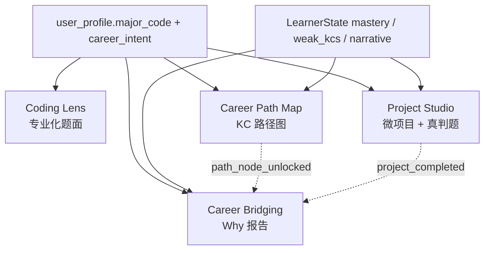

# Career Bridging Closure 实施计划

> **日期**：2026-05-06  
> **状态**：IMPLEMENTATION  
> **关联进度**：`docs/todos/todo-career-bridging-closure-progress.md`

## 背景

本计划围绕「专业 × 编程」主题做产品差异化闭环，在 Alethicode 已有的 How 系统之外补全 Why / How（内容侧）/ What / Map 四层能力。1 个用户已确认方向（Career Bridging）与 3 个新模块（Coding Lens / Project Studio / Career Path Map）共享同一份「学生专业 + KC 状态」上下文，并接入现有 Reflection / Rollout / Judge 闭环。

## 不变量

- 不修改 Judge Server 协议、不修改 OJ 提交与 IO schema。
- 不恢复 Multi-Agent + ReAct 路线，所有 LLM 调用走 `AiModelGateway.callForJson`。
- 不新建用户档案表，仅扩展 `user_profile`。
- 新 API 使用 kebab-case 路径与 snake_case JSON 字段。
- 新功能默认走灰度，关闭时 fail fast，不写兼容兜底路径。

## 模块拓扑

## 数据模型

### V83：Career Profile Extension

- 扩展 `user_profile.major_code` / `career_intent` / `career_profile_completed_at`。
- 新建 `career_major_dictionary`，首批高占比非 CS 专业人工种子。

### V84：Career Bridging

- 新建 `career_bridging_milestone`，支持 `enrollment` / `kc_cluster_graduated` / `chapter_entered` / `project_completed` / `path_node_unlocked`。
- 新建 `career_bridging_report`，存储 Why 报告、citations、rollout、reflection 与 trace 信息。

### V85：Coding Lens

- 新建 `problem_domain_variant`，缓存专业化题面变体。
- 强约束：不持有 test case，不改 problem IO schema，不影响 Judge Server 调用路径。

### V86：Career Path 与 Micro Project

- 新建 `career_micro_project`，项目通过 `judge_problem_id` 关联标准 `problem`。
- 新建 `career_path_node`，仅投影 `Domain × KC` 关系，不引入新 KC。

## 模块计划

### 1. Career Bridging（Why）

- 注册或首次提交专业时插入 `enrollment` 里程碑。
- KC 掌握、章节进入、项目完成、路径节点解锁均可触发里程碑。
- `CareerBridgingService` 通过 `RolloutPolicyService.assignAbTest("career_bridging_v1", ...)` 分组，treatment 组走 LLM + Reflection critic 生成报告。
- 报告必须基于 `major_dictionary`、`LearnerState` 与里程碑上下文，事实声明必须有 citations。

### 2. Coding Lens（How 内容侧）

- `DomainLensService.findOrGenerate(problemId, majorCode, userId)` 命中缓存即返回。
- 缓存未命中时走灰度、LLM 重写与 `CardType.DOMAIN_VARIANT` critic。
- critic 必须检查 IO schema 不变、样例语义不偏移、隐含算法不变。
- 教师可锁定变体用于考试模式，锁定后同题任意专业请求都返回锁定版本。

### 3. Project Studio（What）

- 基于专业与已掌握 KC 推荐微项目。
- 生成流程为 LLM 出题、critic 校验、reference solution 经 Judge Server 真判题自验证。
- 只有 reference solution 100% AC 才写 `problem` 与 `career_micro_project`。
- 学生提交复用标准 OJ 判题链路，AC 后触发 `project_completed` 里程碑。

### 4. Career Path Map（Map）

- 从 `career_path_node` 与 `LearnerState.masteryByKc` 组装路径图。
- 按 `parent_kc_code -> kc_code` 做拓扑排序。
- 解锁规则：父节点 mastery ≥ 0.7 且当前节点 mastery ≥ 0.5。
- `why_md` 来自人工编辑的路径节点，可选通过 critic 约束的 LLM 增强。

## REST 入口

- `GET /api/career/majors`
- `GET /api/career/profile`
- `PUT /api/career/profile`
- `POST /api/career/milestones/{milestoneId}/reports`
- `GET /api/career/reports`
- `GET /api/coding-lens/problems/{problemId}?major={code}`
- `POST /api/coding-lens/variants/{variantId}/lock`
- `GET /api/career/studio/recommendations`
- `POST /api/career/studio/projects`
- `GET /api/career/studio/projects`
- `GET /api/career/studio/projects/{id}`
- `GET /api/career/path?major={code}`

## 灰度与评测

4 个模块统一接入 `RolloutPolicyService`：

- `career_bridging_v1`
- `coding_lens_v1`
- `career_micro_project`
- `career_path`

离线评测必须覆盖：

- Career Bridging：`grounding_accuracy`、`refusal_accuracy`
- Coding Lens：`semantic_drift_rate`、`rewrite_helpfulness`
- Project Studio：`solvability_rate`、`kc_alignment_accuracy`
- Career Path Map：`unlock_consistency`、`why_md_factuality`

## 前端入口

- `CareerProfilePage.vue`：学生专业与学习目标填写。
- `CareerReportPage.vue`：Why 报告阅读。
- `CareerProgressCard.vue`：主页常驻聚合卡片。
- `DomainLensToggle.vue`：题目页专业化题面切换。
- `DomainLensAdmin.vue`：教师后台变体查看与考试锁定。
- `CareerPathPage.vue`：路径图渲染。
- `MicroProjectListPage.vue` / `MicroProjectDetailPage.vue`：微项目列表、详情与作品集导出。

## 验收标准

- Flyway V83 / V84 / V85 / V86 / V88 可在干净库上顺序应用。
- 新增服务均有单测覆盖成功路径、关闭路径与失败路径。
- 前端通过 `npm run typecheck` 与构建验证。
- `CHANGELOG.md` 与 `docs/todos/todo-career-bridging-closure-progress.md` 同步记录实际进度。
