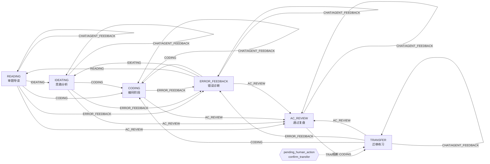
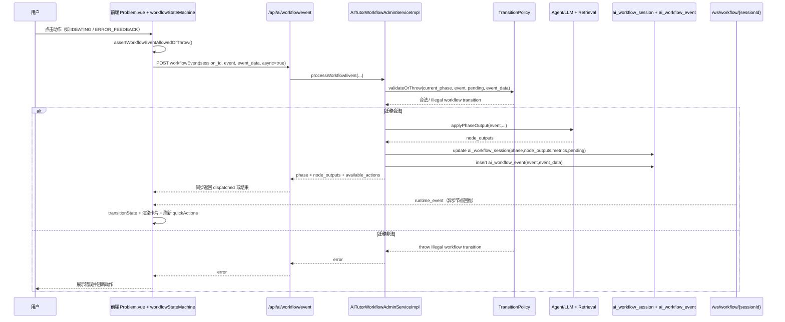
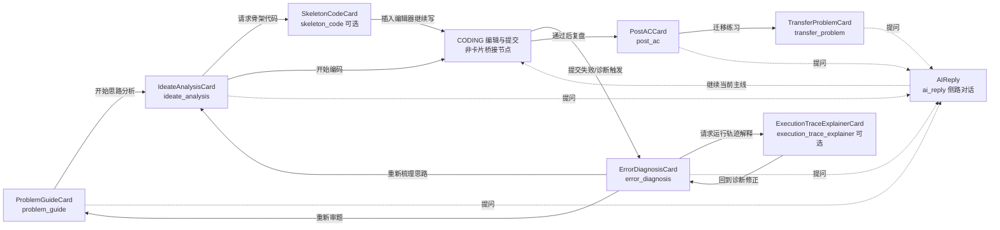
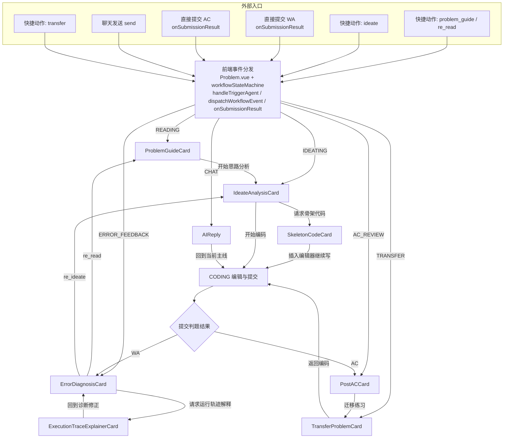

# 统一补题编排与 AI 导学状态机说明书（2026-04-07）

## 1. 文档目的

本说明书覆盖两个目标：

1. 对本次“语言自适应初学者教学补题”改造做全链路说明，便于开发、联调、验收与运维排障。  
2. 给出 AI 导学助手 workflow 的正式状态机规划，确保“不出现非法状态”。

---

## 2. 改造范围与非范围

### 2.1 改造范围

- 新增统一补题编排接口：`POST /api/ai/tutor/supplement-plan`
- 首页、题目页、错题本、专项复习页统一接入补题编排结果
- 复习包题目项补齐教学字段：`education_goal/card_type/why_this_now/target_kcs`
- 推荐题接口补齐教学阶段字段：`recommended_stage/recommended_question_type/target_kcs/why_this_now`

### 2.2 非范围（本次未做）

- 不新增独立学习中心页面
- 不新增第二套题库/判题类型
- 不改动现有评测主链路

---

## 3. 本次实现总览

### 3.1 后端核心

- 新增服务：`BeginnerSupplementPlannerService`
  - 输入：`trigger/language_pack_id/problem_id/submission_id/error_taxonomy/requested_count`
  - 输出：`language_profile/intro_message/target_kcs/cards[]`
  - 支持语言画像：`Python3/C/C++/Java`
  - 支持触发器：`warmup/stuck/wrong_answer/daily_review/post_ac`

- 新增接口：
  - `POST /api/ai/tutor/supplement-plan`

- 调整接口：
  - `GET /api/ai/skill/recommend` 增加教学阶段字段
  - 专项复习包创建链路增加 `language_pack_id/problem_id/trigger`

### 3.2 前端接入

- `HomeDashboard.vue`
  - 增加“下一步学习建议”（`next-step-section`）
  - 初始化按 `trigger='warmup'` 拉取补题计划

- `Problem.vue`
  - 长时间停留与连续错误触发 `trigger='stuck'`
  - 展示补题卡片，含 `why_this_now`

- `LearnerNotebook.vue`
  - 创建复习包携带 `language_pack_id`、`problem_id`、`trigger='wrong_answer'`

- `ErrorReviewPackagePage.vue`
  - 渲染 `education_goal/card_type/why_this_now`

---

## 4. 关键接口契约

## 4.1 `POST /api/ai/tutor/supplement-plan`

请求体：

```json
{
  "trigger": "warmup",
  "language_pack_id": 1,
  "problem_id": 1001,
  "submission_id": 9001,
  "error_taxonomy": "logic_error",
  "requested_count": 3
}
```

响应体核心：

```json
{
  "language_profile": {},
  "intro_message": "string",
  "target_kcs": ["循环", "边界条件"],
  "cards": [
    {
      "education_goal": "understand",
      "card_type": "course_example",
      "language_pack_id": 1,
      "target_kcs": ["循环"],
      "why_this_now": "先看懂这一步",
      "payload": {}
    }
  ]
}
```

## 4.2 专项复习包创建请求

请求体新增：

- `language_pack_id`（必填）
- `problem_id`（可选）
- `trigger`（可选，建议错题入口传 `wrong_answer`，首页复习入口传 `daily_review`）

---

## 5. 全链路处理流程

## 5.1 首页 warmup

输入：
- 课程包 ID

处理：
- 请求补题编排（`warmup`）
- 渲染短梯度卡片

输出：
- 用户看到“下一步学习建议”

## 5.2 题目页 stuck

输入：
- 当前题目 ID
- 当前语言包 ID
- 触发条件（空闲/连续错误）

处理：
- 请求补题编排（`stuck`）
- 展示“先降一级再回题目”的补题卡

输出：
- 用户优先进入微练习/半步引导

## 5.3 错题本 wrong_answer

输入：
- 错误类型
- 语言包 ID
- 错题 problem_id（可选）

处理：
- 创建梯度复习包
- 将补题元数据落库到 `evidence_summary`

输出：
- 复习页可直接显示教学目标与“为什么现在做这题”

---

## 6. 已验证项

- 后端主代码可编译：`mvn -DskipTests compile`
- 前端契约测试通过：`oj-beginner-supplement-contract.spec.js`
- 前端可构建（`--minify esbuild`）

说明：
- 仓库当前存在与本需求无关的历史测试编译问题，导致无法仅执行单测类完成 `mvn test` 全流程。

---

## 7. AI 导学助手 Workflow 规划（防非法状态）

## 7.1 目标与原则

目标：任何状态迁移都必须是“声明式合法迁移”；非法输入必须 fail-fast；前后端对状态图只有一个真源。

原则：

- 单一真源：后端状态图唯一生效
- 前端只消费“可执行动作”，不自行发明迁移
- 非法迁移直接拒绝，不做隐式纠偏
- 事件幂等（同一事件 ID 不重复落地）

## 7.2 规范状态集

建议状态（与现有 phase 对齐）：

- `READING`
- `IDEATING`
- `CODING`
- `ERROR_FEEDBACK`
- `AC_REVIEW`
- `TRANSFER`

禁止新增“隐式过渡状态”（例如 `TEMP_*`）绕过状态图。

## 7.3 规范事件集

- `READING`
- `IDEATING`
- `CODING`
- `ERROR_FEEDBACK`
- `AC_REVIEW`
- `TRANSFER`
- `CHAT`
- `AGENT_FEEDBACK`

## 7.4 守卫条件（Guard）

每次迁移统一执行以下守卫：

1. `event` 必须在枚举内  
2. `current_phase -> event` 必须在允许迁移表内  
3. 若存在 `pending_human_action`，必须匹配该动作允许的事件  
4. `session_version` 必须匹配（防并发覆盖）  
5. `event_id` 未处理过（幂等）  

任一失败直接返回业务错误：`Illegal workflow transition`（或更细分错误码）。

## 7.5 非法状态防护设计（最小正确路径）

### M1：后端状态机集中化（必须先做）

- 统一 `TransitionPolicy` 为唯一迁移入口
- 将“允许迁移表 + 守卫函数”集中定义
- 为每个状态编写迁移单测（合法 + 非法 + pending action）

### M2：前端动作能力下发（必须）

- 新增能力查询接口（或在 session 接口中返回）：
  - `current_phase`
  - `pending_human_action`
  - `allowed_events[]`
- 前端按钮显示和点击仅依赖 `allowed_events[]`

### M3：幂等与并发控制（必须）

- 事件请求强制带 `event_id`（UUID）
- session 记录 `version`
- 写入使用 compare-and-set 语义（版本不一致直接拒绝）

### M4：审计与告警（建议）

- 落地 `workflow_event_log`
- 统计非法迁移率、重试率、冲突率
- 当非法迁移率异常升高时告警

---

## 8. 链路检查（输入 -> 处理 -> 状态 -> 输出 -> 上下游）

输入：
- trigger、language_pack_id、problem_id、error_taxonomy

处理：
- 统一编排服务计算目标 KC 与卡片梯度

状态变化：
- 复习包创建时写入补题元数据，题目状态保持原主链路

输出：
- 首页/题目页/错题本/复习页统一消费卡片语义字段

上游影响：
- 依赖语言包主语言与 KC 映射质量

下游影响：
- UI 决策不再分散，后续可统一优化教学策略

---

## 9. 当前假设与未验证前提

- 假设 `language_pack.primary_language` 在业务上始终准确
- 假设题目与 KC、语言包映射已完整建立
- 未验证前提：在极端低数据（新用户/新课程包）下的推荐质量稳定性

---

## 10. 后续执行建议

1. 先落地 M1 + M2（状态机真源与前端能力下发）  
2. 再落地 M3（event_id + version）  
3. 最后补齐 M4 指标看板与报警阈值

---

## 11. AI 导学助手当前工作流图（横向 + 纵向）

以下图按当前代码真实生效逻辑整理：

- 前端阶段定义：`PHASES = READING, IDEATING, CODING, ERROR_FEEDBACK, AC_REVIEW, TRANSFER`
- 后端迁移校验：`TransitionPolicy`
- 事件分发：`workflowEvent -> processWorkflowEvent`
- 实时通道：`/ws/workflow/{sessionId}`

### 11.1 横向流程图（学习阶段流）



### 11.2 纵向流程图（前后端分层时序）



### 11.3 现状收敛说明（2026-04-07）

本次已完成状态机收敛：

- `Phase` 与 `WorkflowEvent` 均已移除 `SCAFFOLDING`
- `TutorActionPolicy` 在 `IDEATING` 阶段的“开始编码”动作已统一下发 `event=CODING`
- 前端 `workflowStateMachine` 已移除 `SCAFFOLDING` 的输出映射与消息类型映射

当前“脚手架能力”仅作为教学卡片内容形态存在，不再作为独立 workflow phase/event 参与迁移判断。

### 11.4 ASCII 包图（主链路）

```text
+----------------------------------------------------------------------------------------------------+
|                                     AI 导学助手（当前主链路）                                     |
+----------------------------------------------------------------------------------------------------+

[Frontend Package]
  frontend/src/pages/oj/views/problem
  |-- Problem.vue
  |-- workflowStateMachine.js
  |-- UnifiedAgentPanel.vue
  |
  +--> frontend/src/pages/oj/api.js
       +--> POST /api/ai/workflow/event
       +--> GET  /api/ai/workflow/session
       +--> WS   /ws/workflow/{sessionId}
                |
                v
[Backend Controller Package]
  backend/src/main/java/com/alethicode/controller
  |-- AITutorWorkflowAdminController
  |
  v
[Backend Service Package]
  backend/src/main/java/com/alethicode/service/impl
  |-- AITutorWorkflowAdminServiceImpl
      |-- processWorkflowEvent()
      |-- applyPhaseOutput()
      |
      +--> [Policy Package]
      |     backend/src/main/java/com/alethicode/service/aitutor/policy
      |     |-- TransitionPolicy      (phase/event 合法性校验)
      |     |-- TutorActionPolicy     (available_actions 生成)
      |
      +--> [Agent Package]
      |     backend/src/main/java/com/alethicode/service/aitutor/agent
      |     |-- GuideAgent / DiagnosticsAgent / ChatAgent / TransferAgent ...
      |
      +--> [Evidence & Retrieval Package]
      |     backend/src/main/java/com/alethicode/service/aitutor/evidence
      |     backend/src/main/java/com/alethicode/service/aitutor/retrieval
      |     |-- EvidencePackAssembler / CoursewareRetrievalService / SimilarErrorRetrievalService
      |
      +--> [Execution Package]
      |     backend/src/main/java/com/alethicode/service/aitutor/execution
      |     |-- ExecutionTraceService
      |
      +--> [Persistence]
            ai_workflow_session
            ai_workflow_event
            ai_workflow_generation_log

主流程（同步 + 异步）:
  FE 发 event -> TransitionPolicy 校验 -> Agent 产出 node_outputs
  -> 写 ai_workflow_session/ai_workflow_event -> 返回 phase + available_actions
  -> 如 async=true，通过 WS runtime_event 回推到 FE 刷新卡片与动作按钮
```

### 11.5 卡片横向流向图（有向箭头）

> 说明：以下是 Problem 页 AI 导学卡片在“正常学习 + 出错回路 + 通过后迁移”中的主流向。



ASCII 版本：

```text
外部入口（入口层）：
E1 页面快捷动作「题目导读」 -------------------------------> [ProblemGuideCard]
E2 页面快捷动作「思路分析」 -------------------------------> [IdeateAnalysisCard]
E3 不走骨架/思路，直接做题后提交 WA（onSubmissionResult） ---> [ErrorDiagnosisCard]
E4 不走骨架/思路，直接做题后提交 AC（onSubmissionResult） ---> [PostACCard]
E5 任意时刻聊天输入（dispatch CHAT） -----------------------> [AIReply]
E6 快捷动作「迁移练习」（dispatch TRANSFER） ---------------> [TransferProblemCard]

[ProblemGuideCard]
        |
        | 开始思路分析
        v
[IdeateAnalysisCard] -------------------------+
        |                                     |
        | 请求骨架代码                        | 开始编码
        v                                     v
[SkeletonCodeCard] --> 插入编辑器继续写 --> [CODING 编辑与提交]
                                               |
                                               | 提交失败 / 诊断触发
                                               v
                                      [ErrorDiagnosisCard] --- 请求运行轨迹解释 ---> [ExecutionTraceExplainerCard]
                                               ^                                        |
                                               |                                        | 回到诊断修正
                                               +----------------------------------------+
                                               |
                                               | 重新审题
                                               v
                                      [ProblemGuideCard]
                                               |
                                               | 重新梳理思路
                                               v
                                      [IdeateAnalysisCard]

[CODING 编辑与提交] --> 通过后复盘 --> [PostACCard] --> 迁移练习 --> [TransferProblemCard]

侧路对话（不改变主链路阶段）：
ProblemGuideCard / IdeateAnalysisCard / ErrorDiagnosisCard / PostACCard / TransferProblemCard
    --> [AIReply] --> 回到当前主线继续（通常回 CODING 或当前阶段）
```

### 11.6 卡片纵向流向图（分层）

> 说明：纵向图强调“卡片触发 -> 事件分发 -> 回写下一张卡片”的链路，而不是仅看 phase。

```mermaid
flowchart TB
    subgraph L1[交互卡片层]
      C1[ProblemGuideCard]
      C2[IdeateAnalysisCard]
      C3[SkeletonCodeCard 可选]
      C4[ErrorDiagnosisCard]
      C5[ExecutionTraceExplainerCard 可选]
      C6[PostACCard]
      C7[TransferProblemCard]
      C8[AIReply]
    end

    subgraph L2[触发与编排层]
      P[Problem.vue handlers\nhandleTriggerAgent / handleAgentRequestSkeleton / handleRequestExecutionTrace]
      W[workflowStateMachine.js\ndispatchWorkflowEvent + _pushExecutionTrace]
    end

    subgraph L3[后端事件层]
      E[/api/ai/workflow/event]
      S[AITutorWorkflowAdminServiceImpl\nprocessWorkflowEvent + applyPhaseOutput]
    end

    C1 --> P
    C2 --> P
    C3 --> P
    C4 --> P
    C6 --> P
    C7 --> P
    C8 --> P

    P --> W --> E --> S --> W

    W -->|READING| C1
    W -->|IDEATING| C2
    W -->|skeleton payload| C3
    W -->|ERROR_FEEDBACK| C4
    W -->|execution_trace_explainer| C5
    W -->|AC_REVIEW| C6
    W -->|TRANSFER| C7
    W -->|CHAT| C8
```

ASCII 版本：

```text
┌──────────────────────────────────────────────────────────────────────────────┐
│ L0 外部入口层                                                                │
│ E1 快捷动作: problem_guide / re_read -> READING                             │
│ E2 快捷动作: ideate -> IDEATING                                              │
│ E3 直接提交 WA: onSubmissionResult -> ERROR_FEEDBACK                         │
│ E4 直接提交 AC: onSubmissionResult -> AC_REVIEW                              │
│ E5 聊天发送: send -> CHAT                                                    │
│ E6 快捷动作: transfer -> TRANSFER                                            │
└──────────────────────────────────────────────────────────────────────────────┘
                                   |
                                   | 统一汇入事件分发
                                   v
┌──────────────────────────────────────────────────────────────────────────────┐
│ L1 交互卡片层                                                                │
│ ProblemGuideCard / IdeateAnalysisCard / SkeletonCodeCard / ErrorDiagnosis   │
│ / ExecutionTraceExplainerCard / PostACCard / TransferProblemCard / AIReply  │
└──────────────────────────────────────────────────────────────────────────────┘
                                   |
                                   | 卡片按钮/操作触发
                                   v
┌──────────────────────────────────────────────────────────────────────────────┐
│ L2 触发与编排层                                                              │
│ Problem.vue handlers                                                         │
│ - handleTriggerAgent                                                         │
│ - handleAgentRequestSkeleton                                                 │
│ - handleRequestExecutionTrace                                                │
│ workflowStateMachine.js                                                      │
│ - dispatchWorkflowEvent                                                      │
│ - _pushExecutionTrace                                                        │
└──────────────────────────────────────────────────────────────────────────────┘
                                   |
                                   | event + event_data
                                   v
┌──────────────────────────────────────────────────────────────────────────────┐
│ L3 后端事件层                                                                │
│ /api/ai/workflow/event                                                       │
│   -> AITutorWorkflowAdminServiceImpl.processWorkflowEvent                    │
│   -> applyPhaseOutput                                                        │
└──────────────────────────────────────────────────────────────────────────────┘
                                   |
                                   | node_outputs / execution_trace
                                   v
┌──────────────────────────────────────────────────────────────────────────────┐
│ 回写到前端 workflowStateMachine                                              │
│ READING -> ProblemGuideCard                                                  │
│ IDEATING -> IdeateAnalysisCard                                               │
│ skeleton payload -> SkeletonCodeCard                                         │
│ ERROR_FEEDBACK -> ErrorDiagnosisCard                                         │
│ execution_trace_explainer -> ExecutionTraceExplainerCard                     │
│ AC_REVIEW -> PostACCard                                                      │
│ TRANSFER -> TransferProblemCard                                              │
│ CHAT -> AIReply                                                              │
└──────────────────────────────────────────────────────────────────────────────┘
```

### 11.7 卡片一体化 ASCII 总图（入口 + 分发 + 回流）

> 说明：本图把 11.5（横向）与 11.6（纵向）合并为同一张连通图，避免“看起来互相独立”。

```text
[L0 外部入口]
  E1 快捷动作 problem_guide/re_read
  E2 快捷动作 ideate
  E3 直接提交 WA（onSubmissionResult）
  E4 直接提交 AC（onSubmissionResult）
  E5 聊天发送（send）
  E6 快捷动作 transfer
        |
        v
+-----------------------------------------------------------------------------------+
| [L2 前端分发] Problem.vue + workflowStateMachine                                 |
| dispatchWorkflowEvent / handleTriggerAgent / onSubmissionResult                  |
+-----------------------------------------------------------------------------------+
   |READING            |IDEATING              |ERROR_FEEDBACK          |AC_REVIEW
   v                   v                      v                        v
[ProblemGuideCard] -> [IdeateAnalysisCard] -> [CODING 编辑与提交] -> [ErrorDiagnosisCard]
      ^                    |                     |         ^                    |
      |                    |请求骨架代码         |WA 回流  |运行轨迹解释回流      |请求运行轨迹解释
      |                    v                     |         |                    v
      |              [SkeletonCodeCard] ---------+         +------- [ExecutionTraceExplainerCard]
      |                    |
      |                    +--------------------> [CODING 编辑与提交]
      |
      +--------------------------- re_read（从 ErrorDiagnosisCard 触发）

[ErrorDiagnosisCard] --re_ideate--> [IdeateAnalysisCard]
[CODING 编辑与提交] ----> [提交判题结果 AC/WA]
[提交判题结果 AC/WA] ----WA----> [ErrorDiagnosisCard]
[提交判题结果 AC/WA] ----AC----> [PostACCard] ----迁移练习----> [TransferProblemCard]

   |TRANSFER
   v
[TransferProblemCard]

   |CHAT
   v
[AIReply] --返回当前主线节点--> [ProblemGuideCard / IdeateAnalysisCard / ErrorDiagnosisCard / PostACCard / TransferProblemCard / CODING]
```

### 11.8 卡片一体化流程图（Mermaid，含循环）

> 说明：该图是 11.7 的流程图版本，显式标注了 WA/诊断/重构思路等循环回路。



循环回路（必须存在）：

1. `WA 循环`: `CODING -> WA -> ErrorDiagnosis -> re_ideate -> IdeateAnalysis -> CODING`
2. `诊断追踪循环`: `ErrorDiagnosis -> ExecutionTraceExplainer -> ErrorDiagnosis`
3. `迁移回主线循环`: `PostAC -> TransferProblem -> 返回编码 -> CODING`
4. `对话插入循环`: `任一卡片/编码阶段 -> AIReply -> 回到当前主线`
