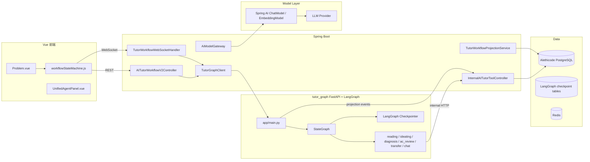
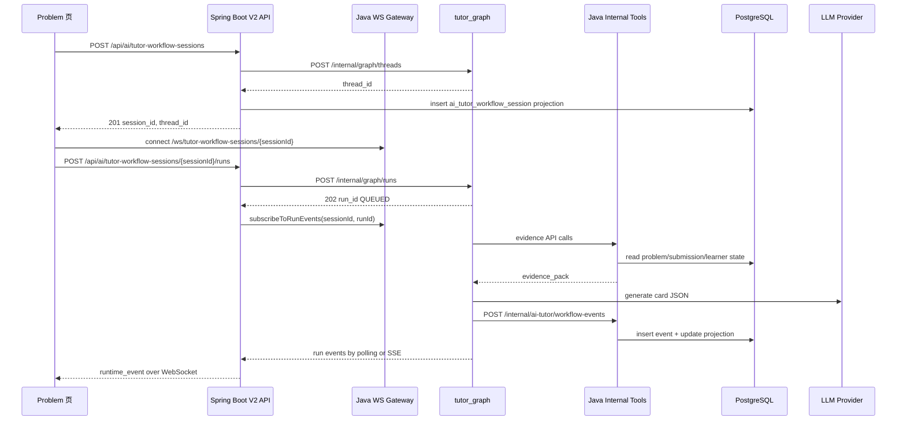
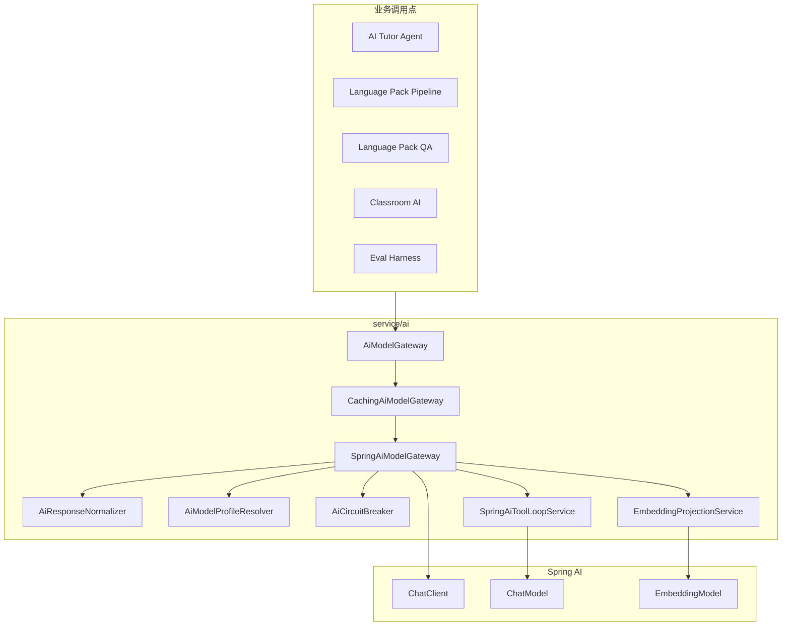
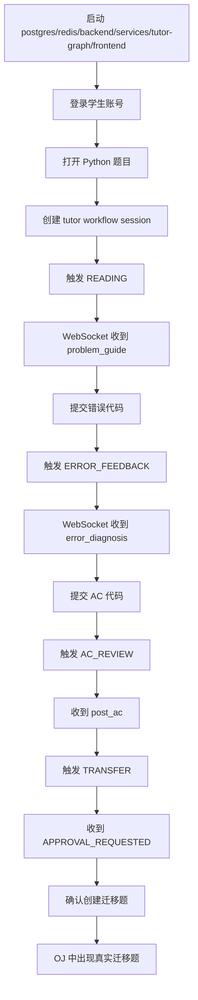

# Alethicode AI Runtime 集成交接 TODO

> 目标读者：接手当前分支的下一个 AI / 工程师。
>
> 当前前提：`docs/todos/todo-langgraph-workflow.md` 与 `docs/todos/todo-spring-ai-llmclient-migration.md` 中描述的主体实现已经落地。本文件不是重新讨论方向，而是把已经落地的 LangGraph tutor workflow 与 Spring AI 模型网关整理成一个可执行的总控 TODO，用于继续完成规划、执行、测试、集成、验收和收尾。

## 0. 结论

当前分支已经完成两条主线的主体改造：

- AI 导学 workflow 从旧 Java 自研 runtime 迁到独立 `services/tutor-graph/` LangGraph 服务。
- Java 侧新增 `/api/ai/tutor-workflow-sessions` V2 资源化 API 与 `/ws/tutor-workflow-sessions/{sessionId}` WebSocket。
- Java 侧新增 `/internal/ai-tutor/*` 内部工具 API，供 `tutor_graph` 读取 OJ 主业务数据、写 workflow projection、触发迁移题副作用。
- Java 侧删除旧 `LlmClient.java`，新增 `service/ai/*`，用 Spring AI 作为模型调用边界。
- 前端已把 tutor workflow 调用迁移到新 V2 路径，卡片 schema 固化到 `contracts/tutor_workflow/cards/*.schema.json`。

但这不是可直接宣告完成的状态。当前还需要做一次严格的集成收口，因为代码里存在若干会影响真实运行的 P0/P1 收尾项，例如：

- `services/tutor-graph/pyproject.toml` 缺少 `langchain-openai`，但 `services/tutor-graph/app/clients/llm_client.py` 会导入 `langchain_openai.ChatOpenAI`。
- `AITutorWorkflowV2Controller.createRun` 在缺语言时仍默认 `Python3`，违反 fail-fast 约束。
- `GET /api/ai/tutor-workflow-sessions/{sessionId}/checkpoints` 当前返回空列表，还没有接 LangGraph state history。
- `/ws/tutor-workflow-sessions/**` 当前允许 `*` origin，且 handler 未做 session ownership 校验。
- Java 内部工具的 `createTransferProblem` 当前只返回伪造 problem id，没有真实写入题库和测试用例。
- `getCoursewareHits` 与 `getSimilarErrors` 当前返回空数组，导学 evidence 链路尚未与已有检索服务贯通。
- `SpringAiToolLoopService` 构建了 tool spec，但当前调用链需要确认 Spring AI 是否实际携带工具定义，否则 ReAct tool calling 会空转或直接退化失败。
- `SpringAiModelGateway.callForJson(..., profilePrefix)` 目前没有按 `profilePrefix` 切换模型配置，`INIT_LLM_` / `INIT_LLM_REGEN_` 语义需要补齐或删除调用点。
- `deploy/docker-compose.yml` 当前没有 `tutor_graph` 服务，生产 compose 无法完整启动新 workflow runtime。

本 TODO 的执行原则：先把契约跑通，再补 P0 集成缺口，最后删除残留兼容和临时产物。

## 1. 总体链路图

### 1.1 双 runtime 总览



### 1.2 Tutor workflow run 时序



### 1.3 Spring AI 模型调用边界



## 2. 已落地资产清单

### 2.1 Java 后端

已新增或重写的关键文件：

- `backend/src/main/java/com/alethicode/controller/AITutorWorkflowV2Controller.java`
- `backend/src/main/java/com/alethicode/controller/internal/InternalAITutorToolController.java`
- `backend/src/main/java/com/alethicode/service/aitutor/graph/TutorGraphClient.java`
- `backend/src/main/java/com/alethicode/service/aitutor/graph/TutorWorkflowProjectionService.java`
- `backend/src/main/java/com/alethicode/service/aitutor/InternalAITutorToolService.java`
- `backend/src/main/java/com/alethicode/service/aitutor/impl/InternalAITutorToolServiceImpl.java`
- `backend/src/main/java/com/alethicode/websocket/TutorWorkflowWebSocketHandler.java`
- `backend/src/main/java/com/alethicode/config/TutorWorkflowWebSocketConfig.java`
- `backend/src/main/java/com/alethicode/service/ai/AiModelGateway.java`
- `backend/src/main/java/com/alethicode/service/ai/SpringAiModelGateway.java`
- `backend/src/main/java/com/alethicode/service/ai/CachingAiModelGateway.java`
- `backend/src/main/java/com/alethicode/service/ai/SpringAiToolLoopService.java`
- `backend/src/main/java/com/alethicode/service/ai/AiResponseNormalizer.java`
- `backend/src/main/java/com/alethicode/service/ai/AiModelProfileResolver.java`
- `backend/src/main/java/com/alethicode/service/ai/AiCircuitBreaker.java`
- `backend/src/main/java/com/alethicode/service/ai/EmbeddingProjectionService.java`
- `backend/src/main/java/com/alethicode/service/ai/AiProviderValidationService.java`

已删除或冻结的旧入口：

- `backend/src/main/java/com/alethicode/controller/AITutorWorkflowController.java`
- `backend/src/main/java/com/alethicode/service/LlmClient.java`
- `backend/src/test/java/com/alethicode/service/LlmClientTest.java`
- 旧 `/api/ai/workflow/*`
- 旧 `/ws/workflow/*`

数据库迁移：

- `backend/src/main/resources/db/migration/V55__ai_tutor_workflow_projection.sql`
- `backend/src/main/resources/db/migration/V56__drop_legacy_ai_workflow_tables.sql`

Spring AI 配置：

- `backend/pom.xml` 已引入 `spring-ai-bom` 与 `spring-ai-starter-model-openai`。
- `backend/src/main/resources/application.yml` 已加入 `spring.ai.openai.*`、`alethicode.internal.service-key`、`alethicode.tutor-graph.base-url`。

### 2.2 Python tutor_graph 服务

核心文件：

- `services/tutor-graph/pyproject.toml`
- `services/tutor-graph/app/main.py`
- `services/tutor-graph/app/config.py`
- `services/tutor-graph/app/graph/state.py`
- `services/tutor-graph/app/graph/transitions.py`
- `services/tutor-graph/app/graph/builder.py`
- `services/tutor-graph/app/graph/runtime_events.py`
- `services/tutor-graph/app/graph/checkpoints.py`
- `services/tutor-graph/app/clients/java_tools_client.py`
- `services/tutor-graph/app/clients/llm_client.py`
- `services/tutor-graph/app/nodes/*.py`
- `services/tutor-graph/app/tests/*.py`

关键职责：

- `app/main.py` 暴露 `/internal/graph/*` API。
- `app/graph/state.py` 定义 `TutorGraphState`。
- `app/graph/transitions.py` 定义 phase/event 迁移。
- `app/graph/builder.py` 组装 LangGraph `StateGraph`。
- `app/nodes/evidence.py` 调 Java 内部工具 API 组装 evidence。
- `app/nodes/transfer.py` 使用 LangGraph `interrupt()` 处理迁移题人工确认。
- `app/nodes/projection.py` 写 Java projection。

### 2.3 前端与契约

前端改动点：

- `frontend/src/pages/oj/api.js` 已新增 `ai/tutor-workflow-sessions` V2 调用。
- `frontend/src/pages/oj/views/problem/workflowStateMachine.js` 已切到 `/ws/tutor-workflow-sessions/{sessionId}`。
- `frontend/src/api/modules/ai.js` 已保留 AI API 聚合导出。
- `frontend/src/utils/runtimeContract.js` 已参与 runtime event 契约。

契约文件：

- `contracts/tutor_workflow/README.md`
- `contracts/tutor_workflow/cards/problem_guide.schema.json`
- `contracts/tutor_workflow/cards/ideate_analysis.schema.json`
- `contracts/tutor_workflow/cards/execution_trace_explainer.schema.json`
- `contracts/tutor_workflow/cards/error_diagnosis.schema.json`
- `contracts/tutor_workflow/cards/post_ac.schema.json`
- `contracts/tutor_workflow/cards/transfer_problem.schema.json`
- `contracts/tutor_workflow/cards/ai_reply.schema.json`
- `contracts/tutor_workflow/cards/knowledge_review.schema.json`

## 3. P0 必须先完成的集成收口

### 3.1 依赖与启动闭环

TODO：

- [ ] 在 `services/tutor-graph/pyproject.toml` 添加 `langchain-openai`，或把 `app/clients/llm_client.py` 改成当前依赖中已经存在的模型调用实现。不能保留运行时才爆 `ModuleNotFoundError` 的状态。
- [ ] 清理 `services/tutor-graph/.pytest_cache/`、`services/tutor-graph/app/**/__pycache__/`，并确保 `.gitignore` 覆盖 Python 缓存目录。
- [ ] 给 `tutor_graph` 增加 Dockerfile 或明确使用 `uvicorn app.main:app` 的镜像构建方式。
- [ ] 在 `deploy/docker-compose.yml` 新增 `tutor-graph` 服务，并让 `backend` 设置 `TUTOR_GRAPH_BASE_URL=http://tutor-graph:8100`。
- [ ] 在 `deploy/helm/alethicode/values.yaml` 加入 tutor-graph 镜像、环境变量、service、probe、resource limit。
- [ ] 启动顺序必须为 `postgres -> redis -> backend -> tutor-graph -> frontend` 或者 `tutor-graph` 健康检查能容忍 backend 尚未就绪。最终以真实依赖为准，不做静默降级。

验收命令：

```bash
cd tutor_graph
python -m pytest

cd ../backend
mvn test

cd ../frontend
npm test
npm run build
```

### 3.2 V2 Controller fail-fast 修正

当前检查点：

- `AITutorWorkflowV2Controller.createSession` 已校验 `problem_id` 与 `language` 非空。
- `AITutorWorkflowV2Controller.createRun` 当前在缺语言时会使用 `Python3` 默认值。

TODO：

- [ ] 删除 `createRun` 中的 `Python3` 默认值。语言来源只能是 session projection 或本次 request 明确传入。
- [ ] `ai_tutor_workflow_session` projection 需要保存 `language` 字段，或 `createRun` 必须从创建 session 的 request/projection 中可靠取回语言。
- [ ] 创建 session 时校验用户有权访问该 problem。
- [ ] 创建 session 时校验 `language` 属于题目允许语言。
- [ ] `ERROR_FEEDBACK` run 必须校验 `event_data.submission_id` 非空。
- [ ] `AC_REVIEW` run 必须校验 `event_data.submission_id` 且该 submission 为 AC。
- [ ] 所有错误统一使用 `401/403/404/409/422`，不要把业务错误包成 `200 + error`。

验收场景：

- 未登录创建 session 返回 `401`。
- 登录用户访问他人 private problem 返回 `403`。
- 语言为空返回 `422`。
- 语言不在题目 allowed languages 返回 `422`。
- 同一 session 同时创建两个 run 返回 `409`。
- `ERROR_FEEDBACK` 缺 `submission_id` 返回 `422`。

### 3.3 WebSocket ownership 与 Origin

当前检查点：

- `TutorWorkflowWebSocketConfig` 使用 `.setAllowedOrigins("*")`。
- `TutorWorkflowWebSocketHandler.afterConnectionEstablished` 只从 path 提取 sessionId，没有校验当前登录用户是否拥有 session。

TODO：

- [ ] WebSocket handshake 必须复用已有 session 认证能力。
- [ ] 建立连接时调用 `TutorWorkflowProjectionService.isSessionOwnedByUser(sessionId, userId)`。
- [ ] 非 owner 连接直接关闭，不能只依赖前端不展示入口。
- [ ] Origin 使用项目已有 `WebSocketOriginConfigurer` / `AlethicodeProperties` 策略，不保留 `*`。
- [ ] 连接关闭时只移除当前 WebSocketSession，避免同一 session 多标签页互相覆盖。若不支持多标签页，必须明确 fail-fast。

验收场景：

- 用户 A 不能连接用户 B 的 tutor workflow session。
- 未登录不能连接。
- 非白名单 Origin 不能连接生产 WebSocket。
- run 完成后 WebSocket 收到 `TASK_COMPLETED` 并停止轮询。

### 3.4 LangGraph checkpoint 列表与恢复

当前检查点：

- `GET /api/ai/tutor-workflow-sessions/{sessionId}/checkpoints` 当前返回空列表。
- `POST /checkpoint-restorations` 已调用 `graphClient.restoreCheckpoint(threadId, checkpointId)`。

TODO：

- [ ] 在 `tutor_graph` 增加 `GET /internal/graph/threads/{threadId}/checkpoints`。
- [ ] 通过 LangGraph state history 返回最近 20 条业务 checkpoint。
- [ ] Java `TutorGraphClient` 增加 `getCheckpoints(threadId)`。
- [ ] Java V2 controller 的 checkpoint list 接真实 graph API。
- [ ] checkpoint response 只返回稳定投影：`checkpoint_id`、`phase`、`label`、`created_at`。
- [ ] restore 期间禁止同一 session 创建普通 run。
- [ ] restore 后必须写 Java projection，并通过 WebSocket 发 `TASK_RESTORING` / `TASK_COMPLETED`。

验收场景：

- 执行 READING / IDEATING / ERROR_FEEDBACK 后 checkpoint 列表非空。
- restore 到 IDEATING 后 projection phase 与 node_outputs 回到对应状态。
- restore 不暴露 LangGraph raw checkpoint。

### 3.5 Internal Tool API 必须接真实业务域

当前检查点：

- `getWorkflowContext` 能读 problem 基础字段和 samples。
- `getDiagnosisEvidence` 校验 submission owner。
- `getLearnerState` 只返回提交次数与 AC 次数。
- `getCoursewareHits` 返回空 hits。
- `getSimilarErrors` 返回空 similar_errors。
- `createTransferProblem` 返回伪造 `System.currentTimeMillis()` problem id。

TODO：

- [ ] `getWorkflowContext` 校验 problem 可见性、课堂/教师权限、语言 allowed list。
- [ ] `getWorkflowContext` 返回完整 problem context：statement、samples、template、allowed languages、KC、language pack refs、objective/programming type。
- [ ] `getDiagnosisEvidence` 校验 submission 同时属于 user 与 problem。
- [ ] `getDiagnosisEvidence` 返回 err_info、failed case evidence、code、language、result、recent submissions。
- [ ] `getLearnerState` 复用已有 learner state / mastery / memory 服务，而不是只返回计数。
- [ ] `getCoursewareHits` 接已有 `CoursewareRetrievalService` 或 language pack page retrieval。
- [ ] `getSimilarErrors` 接已有 `SimilarErrorRetrievalService`。
- [ ] `createTransferProblem` 必须真实写入 problem、samples、test cases、KC mapping、visibility/status，并返回真实 `problem_id`。
- [ ] `createTransferProblem` 保持 idempotency：同一 key 同一 hash 返回同一结果；同一 key 不同 hash 返回 `409`。
- [ ] `recordWorkflowEvent` 禁止在 session 不存在时插入 `user_id=0/problem_id=0` 的 session；session 不存在应 `404` 或 `409`。

验收场景：

- LangGraph `TRANSFER` confirm 后能在 OJ 题库查到真实迁移题。
- 重复 confirm 同一 run 不产生第二道题。
- draft hash 变化但 idempotency_key 相同返回 `409`。
- courseware refs 与 similar errors 在 ERROR_FEEDBACK evidence 中非空（当数据库有对应数据时）。

### 3.6 Spring AI profile 与 tool calling

当前检查点：

- `AiModelGateway` 已替代业务类对 `LlmClient` 的依赖。
- `SpringAiModelGateway.callForJson(..., profilePrefix)` 目前没有显式使用 `AiModelProfile`。
- `SpringAiToolLoopService` 中 `toolSpecs` 被构建但没有明确传入 Spring AI request。

TODO：

- [ ] `profilePrefix` 必须真正控制 chat model、base url、api key、timeout、retry。若 Spring AI 的 bean 级配置无法动态切换，则用明确的 client factory 或删除 profilePrefix 调用点，不保留假参数。
- [ ] `INIT_LLM_`、`INIT_LLM_REGEN_` 这些现有调用语义必须有测试覆盖。
- [ ] `SpringAiToolLoopService` 必须确认工具定义被 Spring AI 传给 provider，并且模型返回 tool call 时能执行本地 `ToolExecutor`。
- [ ] ReAct 默认仍关闭；只有对应环境变量或业务开关启用时才走 tool loop。
- [ ] `AiProviderValidationService` 的 `toolLoop` case 必须能真实触发一次 tool call，而不是模型直接返回 `{"tool_seen": true}` 误判通过。
- [ ] `callForJson` 保留 JSON normalizer、provider envelope 处理、Markdown code fence 清理、空 JSON fail-fast。
- [ ] `callForEmbedding` 保持 16 维 projection，确保 pgvector 维度一致。

验收命令：

```bash
cd backend
mvn -Dtest='AiResponseNormalizerTest,AiCircuitBreakerTest,EmbeddingProjectionServiceTest' test
mvn -Dtest='*CodeQualityAssessmentServiceTest,*ErrorReviewPackageServiceTest,*LanguagePack*Test' test
```

验收场景：

- `POST /api/admin/super/ai-config/validation-runs` 的 json/content/embedding/toolLoop 全部通过。
- `INIT_LLM_` 配置存在时，语言包初始化用 init profile；不存在时 fail-fast 或按明确规则使用默认 profile。
- 缺 `OPENAI_API_KEY` 与 `EMBEDDING_API_KEY` 时，启动或首次调用给出明确错误。

## 4. P1 集成质量收口

### 4.1 Runtime event 契约

标准消息必须符合 `contracts/tutor_workflow/README.md`：

```json
{
  "type": "runtime_event",
  "session_id": "twf_xxx",
  "run_id": "run_xxx",
  "thread_id": "thread_xxx",
  "checkpoint_id": "ckpt_xxx",
  "trace_id": "trace_xxx",
  "runtime_state": "RUNNING",
  "client_event": "ERROR_FEEDBACK",
  "server_event": "TASK_STARTED",
  "approval_state": null,
  "failure_bucket": null,
  "timestamp": "2026-04-21T10:00:00Z",
  "data": {}
}
```

TODO：

- [ ] `services/tutor-graph/app/graph/runtime_events.py` 的输出与契约完全一致。
- [ ] Java WebSocket 不包装、不改名、不吞字段。
- [ ] 前端 `workflowStateMachine.js` 只消费 `runtime_event`，不再消费旧 `node_start` / `result`。
- [ ] `server_event` 枚举只允许契约中定义的值。
- [ ] `failure_bucket` 只允许契约中定义的值。
- [ ] `CARD_GENERATED` 如暂不发送，前端不能依赖它；若发送，必须包含对应 card key。

### 4.2 Card schema 契约

TODO：

- [ ] `services/tutor-graph/app/tests/test_card_schemas.py` 覆盖所有 card schema。
- [ ] 每个 node 输出只写入约定的 `node_outputs` key。
- [ ] Java 旧 `CardSchemaValidator` 与新 JSON Schema 不冲突；若保留两套校验，明确谁是 source of truth。
- [ ] 前端卡片渲染以 `contracts/tutor_workflow/cards/*.schema.json` 为准更新。

Event 到 card key 映射必须保持：

| Event | node_outputs key | 前端卡片 type |
|---|---|---|
| `READING` | `problem_guide` | `problem_guide` |
| `IDEATING` | `ideate` | `ideate_analysis` |
| `CODING` | `execution_trace_explainer` | `execution_trace_explainer` |
| `ERROR_FEEDBACK` | `error_diagnosis` | `error_diagnosis` |
| `AC_REVIEW` | `post_ac` | `post_ac` |
| `TRANSFER` | `transfer` | `transfer_problem` |
| `CHAT` | `chat` | `ai_reply` |
| `KNOWLEDGE_REVIEW` | `knowledge_review` | `knowledge_review` |

### 4.3 数据库迁移安全

TODO：

- [ ] 确认 `V55__ai_tutor_workflow_projection.sql` 在已有生产数据上可重复执行。
- [ ] 确认 `V56__drop_legacy_ai_workflow_tables.sql` 是否允许在当前环境执行。若旧表仍需数据迁移到 projection，应先写迁移脚本，不能直接 drop。
- [ ] 如果旧表已由实现确定废弃，必须在 CHANGELOG 和部署说明中标注：旧 workflow runtime 数据不再作为 source of truth。
- [ ] `ai_tutor_workflow_session` 加 `language` 字段。
- [ ] `ai_tutor_workflow_session` 加 `last_checkpoint_id` 更新逻辑。
- [ ] `ai_tutor_workflow_event` 加必要索引覆盖 admin observability 查询。

### 4.4 前端收口

TODO：

- [ ] `frontend/src/pages/oj/api.js` 中旧 workflow API 函数全部删除或改名到 V2，不能保留旧路径别名。
- [ ] `frontend/src/api/modules/ai.js` 不再导出旧 workflow API 名称，或导出名必须语义上指向 V2。
- [ ] `workflowStateMachine.js` 中任何 `Python3` 默认值都必须移除，语言来自题目允许语言或编辑器当前语言。
- [ ] checkpoint UI 接真实列表，不再展示空列表。
- [ ] interrupt UI 使用 `interrupt-responses`，支持 `confirm/reject/modify`。
- [ ] WebSocket 断线后只允许明确重连当前 session，不允许创建新 session 伪装恢复。

验收场景：

- 打开 Problem 页后创建 tutor workflow session。
- 触发 READING，收到 problem guide。
- 提交 WA 后触发 ERROR_FEEDBACK，收到 error diagnosis。
- AC 后触发 AC_REVIEW，收到 post_ac。
- 点击迁移练习，前端收到 approval request，确认后创建真实迁移题。
- 刷新页面后能从 projection 恢复最近 node_outputs。

## 5. 测试矩阵

### 5.1 Java 单元测试

必须覆盖：

- `AiResponseNormalizerTest`
- `AiCircuitBreakerTest`
- `EmbeddingProjectionServiceTest`
- `AiProviderValidationService` 的 json/content/embedding/toolLoop case。
- `AITutorWorkflowV2Controller` 的 401/403/404/409/422。
- `InternalAITutorToolController` 的 service key、权限、参数缺失、idempotency conflict。
- `TutorWorkflowProjectionService` 的 create/get/deactivate/update event。
- `TutorWorkflowWebSocketHandler` 的 ownership、terminal event stop、cancel。

建议命令：

```bash
cd backend
mvn -Dtest='com.alethicode.service.ai.*Test' test
mvn -Dtest='*AITutorWorkflow*Test,*InternalAITutor*Test,*TutorWorkflow*Test' test
```

### 5.2 Java 集成测试

必须覆盖：

- Flyway V55/V56 在测试库完整迁移。
- V2 API + projection + WebSocket 的闭环。
- Internal Tool API 真实读取 problem/submission/learner state。
- Spring AI gateway 在 load-test profile 下使用 mock gateway，避免测试依赖真实 LLM。
- 删除旧 `AITutorWorkflowController` 后，旧路径返回 404。

建议命令：

```bash
cd backend
mvn -Dtest='*IntegrationTest,*ContractTest' test
```

### 5.3 Python tutor_graph 测试

必须覆盖：

- state schema 必填字段。
- transition 合法/非法路径。
- evidence 缺失失败。
- 每个 node 输出符合 schema。
- projection 失败时 run 失败。
- checkpoint list / restore。
- interrupt confirm / reject / modify。
- transfer materialization 幂等。

建议命令：

```bash
cd tutor_graph
python -m pytest -q
```

### 5.4 前端测试

必须覆盖：

- `workflow-private-ai-contract.spec.js`
- `runtimeContract` 对新 `runtime_event` 的解析。
- Problem 页 V2 API 调用路径。
- checkpoint restore UI。
- interrupt confirm/reject/modify UI。
- 旧 `/api/ai/workflow/*` 不再被前端引用。

建议命令：

```bash
cd frontend
npm test
npm run build
```

### 5.5 端到端验收

最小闭环：



## 6. 集成执行顺序

### Phase 0：清洁工作区

TODO：

- [ ] `git status --short` 记录当前变更，不回滚用户改动。
- [ ] 清理 Python cache 和 pytest cache。
- [ ] 确认两个旧 todo 文件是否继续保留为参考，还是标记为已实现。
- [ ] 本文件作为新的总控 TODO，后续变更集中按本文件推进。

### Phase 1：编译和依赖

TODO：

- [ ] 后端 `mvn test` 至少编译通过。
- [ ] tutor_graph `python -m pytest` 通过。
- [ ] frontend `npm run build` 通过。
- [ ] 修掉所有因 `LlmClient` 删除导致的遗留 import、测试 mock、构造器不匹配。

### Phase 2：安全与 fail-fast

TODO：

- [ ] 修 `createRun` 语言默认值。
- [ ] 修 WebSocket ownership。
- [ ] 修 internal service key 在生产缺失时启动失败。
- [ ] 修 problem/submission 权限。
- [ ] 修 checkpoint list。

### Phase 3：真实 evidence 和 transfer

TODO：

- [ ] courseware hits 接真实检索。
- [ ] similar errors 接真实检索。
- [ ] learner state 接真实画像。
- [ ] transfer problem 接真实题库写入。
- [ ] 所有强副作用写 `ai_tutor_side_effect_log`。

### Phase 4：Spring AI 网关收口

TODO：

- [ ] profilePrefix 生效。
- [ ] tool calling 真实可用。
- [ ] validation-runs 全通过。
- [ ] 业务类只依赖 `AiModelGateway`，不依赖 Spring AI 具体类型。
- [ ] 删除所有 `LLM_BACKEND` / Native HTTP 兼容描述。

### Phase 5：部署

TODO：

- [ ] compose 加 tutor-graph。
- [ ] helm 加 tutor-graph。
- [ ] nginx / frontend proxy 支持 WebSocket 新路径。
- [ ] 生产环境变量文档补齐：
  - `INTERNAL_SERVICE_KEY`
  - `TUTOR_GRAPH_BASE_URL`
  - `OPENAI_API_KEY`
  - `LLM_BASE_URL`
  - `LLM_MODEL`
  - `EMBEDDING_API_KEY`
  - `EMBEDDING_BASE_URL`
  - `EMBEDDING_MODEL`
  - `TUTOR_REACT_ENABLED=false`
  - `QA_REACT_ENABLED=false`
- [ ] Prometheus/Grafana 加 tutor_graph health 与 error rate。

### Phase 6：删除旧路径残留

TODO：

- [ ] `rg "/api/ai/workflow|/ws/workflow|AITutorWorkflowController|LlmClient|LLM_BACKEND"` 必须没有生产代码命中。
- [ ] 如果测试中保留旧名，只能用于断言旧路径 404。
- [ ] 前端不保留旧 workflow alias。
- [ ] 文档中旧路径只允许出现在迁移说明或冻结声明。

## 7. 一键检查命令清单

```bash
# 1. 查遗留旧路径与旧客户端
rg "/api/ai/workflow|/ws/workflow|AITutorWorkflowController|LlmClient|LLM_BACKEND" .

# 2. 后端全测试
cd backend
mvn test

# 3. Spring AI 相关重点测试
mvn -Dtest='com.alethicode.service.ai.*Test,*CodeQualityAssessmentServiceTest,*ErrorReviewPackageServiceTest' test

# 4. tutor_graph 测试
cd ../tutor_graph
python -m pytest -q

# 5. 前端测试与构建
cd ../frontend
npm test
npm run build

# 6. 契约文件存在性
cd ..
find contracts/tutor_workflow/cards -name '*.schema.json' | sort
```

## 8. Definition of Done

满足以下条件才算真正完成：

- [ ] 后端、前端、tutor_graph 均能从干净环境安装依赖并通过测试。
- [ ] Docker Compose 能一次启动完整系统，包括 `tutor-graph`。
- [ ] 新 tutor workflow V2 API 完成 session、run、checkpoint、restore、interrupt 全链路。
- [ ] WebSocket 有鉴权和 owner 校验。
- [ ] `tutor_graph` 不在生产中静默 fallback 到 memory checkpoint。
- [ ] transfer problem 真实写入 OJ，且幂等。
- [ ] Spring AI validation-runs 全通过。
- [ ] 所有业务模型调用依赖 `AiModelGateway`。
- [ ] 旧 `/api/ai/workflow/*` 与 `/ws/workflow/*` 没有生产调用。
- [ ] 旧 `LlmClient` 没有生产引用。
- [ ] `CHANGELOG.md` 已记录所有代码级变更。
- [ ] `contracts/tutor_workflow/README.md` 与实际 runtime event / card schema 一致。

## 9. 给下一个 AI 的执行提示

先不要继续加新功能。当前最短正确路径是：

1. 先让三端测试能跑起来。
2. 修掉 P0 中违反 fail-fast、安全、启动闭环的点。
3. 再补真实 evidence 和 transfer materialization。
4. 最后做旧路径清理、部署接入、端到端验收。

不要引入以下内容：

- 不恢复旧 `LlmClient`。
- 不新增旧 workflow API 兼容层。
- 不让 `tutor_graph` 直接写 Alethicode 主业务表。
- 不在语言缺失时默认 `Python3`。
- 不让 WebSocket 只靠前端隐藏入口保证权限。
- 不用空 evidence 假装业务链路完成。

