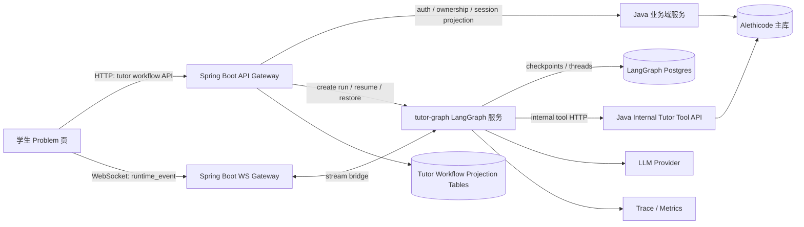
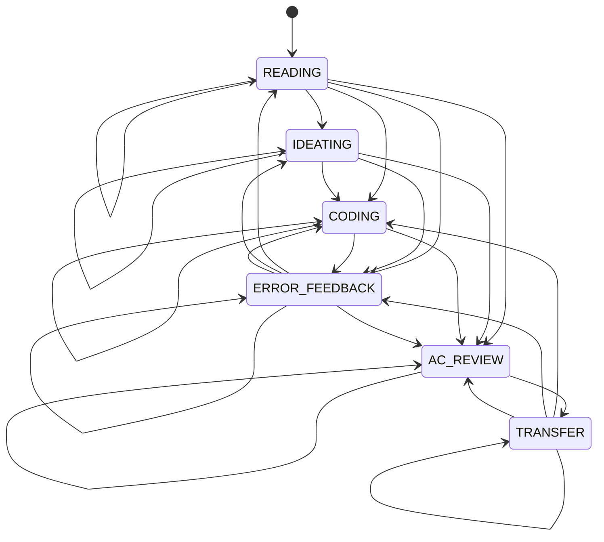
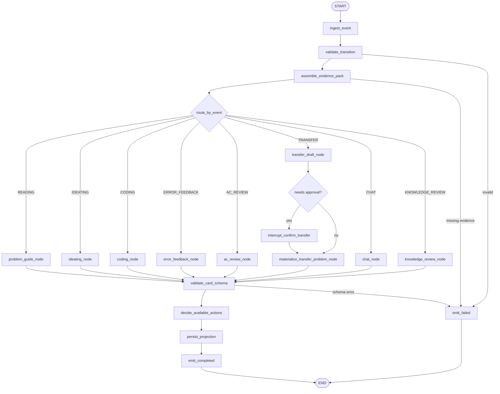
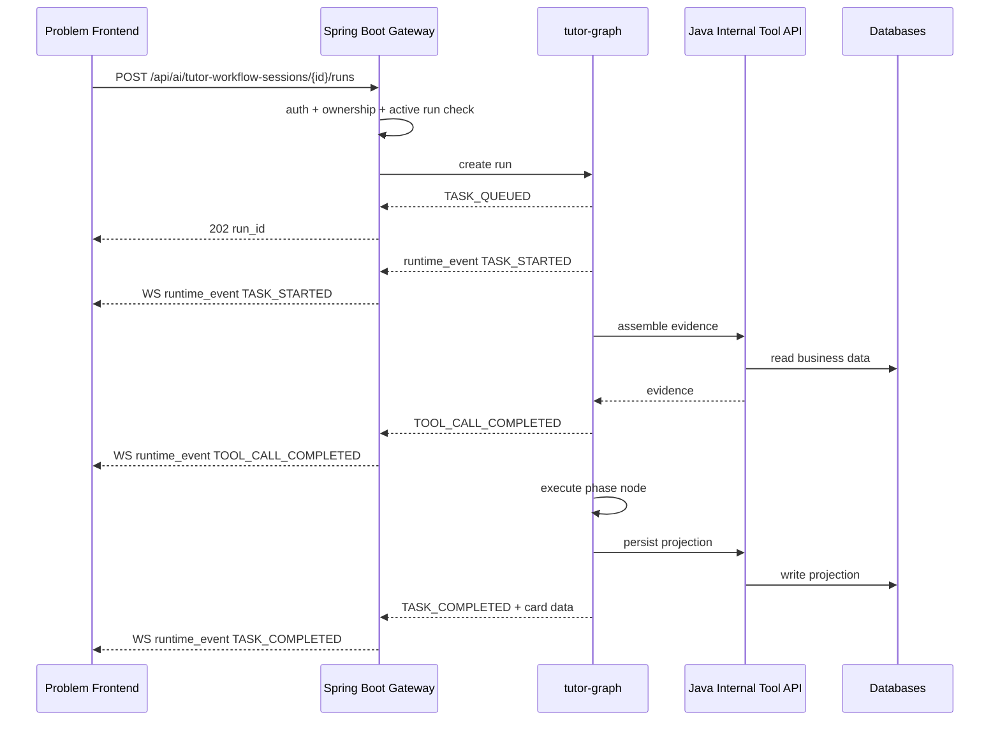

# AI 导学助手 Workflow 彻底 LangGraph 化执行计划

> 目标读者：后续接手实现的 AI / 工程师。
>
> 本文档用于把当前 AI 导学助手 workflow 从 Java 自研执行层完整迁移到独立 LangGraph 运行服务。文档要求后续执行者可以按阶段直接规划、实现、测试、集成，不需要再重新做方向判断。

## 0. 最终结论

当前项目中的 AI 导学助手 workflow **可以换为 LangGraph**，但不能把它理解为“替换一个状态机类”。当前 workflow 同时承担：

- 学生端导学会话。
- phase / event 状态迁移。
- LLM 节点输出。
- evidence pack 组装。
- checkpoint / restore。
- WebSocket runtime event。
- human interrupt。
- transfer problem 创建等强业务副作用。

因此正确迁移方式是：

- 新增独立 `tutor-graph` 服务，使用 LangGraph 作为 AI 导学助手的唯一 workflow runtime。
- Java/Spring Boot 不再执行导学 workflow，只保留鉴权、OJ 业务域、题库、提交、课件、学情、内部工具 API 与 WebSocket 网关。
- 前端 Problem 页迁移到新的 tutor workflow API 与 WebSocket。
- 旧 `/api/ai/workflow/*` 与旧 `/ws/workflow/*` 在迁移完成后删除，不保留长期兼容分支。
- QA、Judge、课堂、题库 CRUD 不进入本次 LangGraph 迁移范围。

### 0.1 为什么不能继续纯 Java 内部替换

官方 LangGraph 主运行时是 Python / JavaScript / TypeScript 生态。当前后端是 Java/Spring Boot。Java 生态存在第三方 LangGraph4j，但它不是官方 LangGraph 主运行时，不能作为本项目 checkpoint、HITL、stream 主链路的低风险替代。

如果仍要求纯 Java 内部替换，实际会变成“自研 Java 图运行时”，这不符合“换成 LangGraph”的目标。

### 0.2 为什么新增服务是必要条件

LangGraph 的核心收益来自：

- `StateGraph` 显式状态图。
- `thread_id` 级别持久化。
- checkpoint / time travel。
- interrupt / resume。
- streaming updates。
- graph-level observability。

这些能力应由一个 LangGraph runtime 原生持有，而不是拆散后塞回 Java service。

参考资料：

- LangGraph overview：`https://docs.langchain.com/oss/python/langgraph/overview`
- LangGraph persistence：`https://docs.langchain.com/oss/python/langgraph/persistence`
- LangGraph interrupts：`https://docs.langchain.com/oss/python/langgraph/interrupts`
- LangGraph streaming：`https://docs.langchain.com/oss/python/langgraph/streaming`
- LangGraph JS persistence：`https://docs.langchain.com/oss/javascript/langgraph/persistence`
- LangSmith / Agent Server deployment：`https://docs.langchain.com/langgraph-platform`

## 1. 当前仓库事实

本节是迁移前置事实，不是未来目标。

### 1.1 当前后端入口

当前 AI 导学 workflow HTTP 入口：

- `backend/src/main/java/com/alethicode/controller/AITutorWorkflowController.java`

现有公开接口：

- `GET /api/ai/workflow/session`
- `POST /api/ai/workflow/session`
- `DELETE /api/ai/workflow/session`
- `POST /api/ai/workflow/event`
- `GET /api/ai/workflow/checkpoint`
- `POST /api/ai/workflow/checkpoint/restore`
- `POST /api/ai/workflow/interrupt`

真实执行主要落在：

- `backend/src/main/java/com/alethicode/service/impl/AITutorWorkflowAdminServiceImpl.java`
- `backend/src/main/java/com/alethicode/service/impl/WorkflowCheckpointService.java`
- `backend/src/main/java/com/alethicode/websocket/WorkflowRealtimeSupport.java`
- `backend/src/main/java/com/alethicode/websocket/WorkflowWebSocketHandler.java`

当前 `AITutorWorkflowAdminServiceImpl.java` 是 workflow 迁移的主要债务点。它同时承担：

- session 创建与查询。
- event 处理。
- transition 校验。
- evidence pack 组装。
- LLM 输出。
- schema 校验。
- checkpoint 保存。
- trace / eval / rollout。
- human interrupt。
- transfer problem 生成与入库。
- 部分 admin / KC / misconception 相关转发。

迁移时不能简单删除整个类，因为其中还混有非 workflow 执行职责。必须先把非 workflow 职责移动或确认已由其它 domain service 接管。

### 1.2 当前前端入口

Problem 页当前导学逻辑主要落在：

- `frontend/src/pages/oj/views/problem/workflowStateMachine.js`
- `frontend/src/pages/oj/views/problem/Problem.vue`
- `frontend/src/pages/oj/views/problem/UnifiedAgentPanel.vue`
- `frontend/src/utils/runtimeContract.js`
- `frontend/src/pages/oj/api.js`

前端已经有以下半成品或预留能力：

- `runtimeContext`
- `runtime_event` 消费。
- checkpoint 列表。
- checkpoint restore。
- pending human action UI。
- plan / steering 相关状态。
- `workflowResume` / `workflowSnapshot` API 调用预留。

但后端当前没有公开对应的 `resume / steer / snapshot` Controller。迁移到 LangGraph 时，应直接重建这些能力，不要继续补旧接口。

### 1.3 当前数据库表

旧 workflow 表：

- `ai_workflow_session`
- `ai_workflow_event`
- `ai_workflow_checkpoint`
- `ai_workflow_plan`
- `ai_workflow_steering_signal`

旧表由以下迁移建立或扩展：

- `backend/src/main/resources/db/migration/V9__bootstrap_m8_workflow_admin.sql`
- `backend/src/main/resources/db/migration/V39__harness_runtime_contract.sql`
- `backend/src/main/resources/db/migration/V53__workflow_plan_and_steering.sql`

LangGraph 迁移后，旧表不再作为 runtime source of truth。新 runtime source of truth 是 LangGraph checkpointer 和 LangGraph thread state。

Java 可以保留新的投影表给管理端、审计、搜索和 WebSocket 恢复使用，但投影表不能反向成为 workflow 状态源。

### 1.4 当前业务 phase 与 event

当前 phase：

- `READING`
- `IDEATING`
- `CODING`
- `ERROR_FEEDBACK`
- `AC_REVIEW`
- `TRANSFER`

当前辅助 event：

- `CHAT`
- `AGENT_FEEDBACK`
- `KNOWLEDGE_REVIEW`

当前前端卡片输出 key：

| Event | node_outputs key | Message type |
|---|---|---|
| `READING` | `problem_guide` | `problem_guide` |
| `IDEATING` | `ideate` | `ideate_analysis` |
| `CODING` | `execution_trace_explainer` 可选 | `execution_trace_explainer` |
| `ERROR_FEEDBACK` | `error_diagnosis` | `error_diagnosis` |
| `AC_REVIEW` | `post_ac` | `post_ac` |
| `TRANSFER` | `transfer` | `transfer_problem` |
| `CHAT` | `chat` | `ai_reply` |
| `KNOWLEDGE_REVIEW` | `knowledge_review` | `knowledge_review` |

迁移后必须保留这些卡片语义，避免前端业务展示被重写。

## 2. 目标边界

### 2.1 本次要做

- 完全替代 AI 导学助手 workflow 执行层。
- 新增独立 LangGraph runtime 服务。
- 新建资源化 tutor workflow API。
- 新建或替换 Problem 页 WebSocket runtime 通道。
- 将旧 Java workflow 状态机、checkpoint、interrupt、event 执行逻辑移除。
- 将 transfer problem 等业务副作用改为 LangGraph 节点通过 Java 内部工具 API 调用。
- 建立完整单测、集成测试、前端契约测试和端到端验收场景。

### 2.2 本次不做

- 不迁移 Judge 判题链路。
- 不迁移 Submission 主业务。
- 不迁移 Problem CRUD。
- 不迁移 Classroom。
- 不迁移 Language Pack QA。
- 不把 QA 复用 Tutor phase / checkpoint / interrupt。
- 不保留旧 workflow API 的长期兼容路径。
- 不把 Java 业务表开放给 LangGraph 直接写入。
- 不用第三方 Java 图框架冒充官方 LangGraph。

### 2.3 强制约束

- 默认 fail-fast。
- 不做隐式 Python 默认语言回退；语言缺失必须报错。
- 不做旧命名别名。
- 不做“失败后自动退到普通聊天”等降级路径。
- 不做与 AI 导学助手无关的业务扩展。
- 所有新 API 必须资源化命名。
- 所有强副作用节点必须幂等。
- 每完成代码修改后必须更新 `CHANGELOG.md`。

## 3. 总体架构

### 3.1 目标组件图



### 3.2 数据所有权

| 数据 | Owner | 说明 |
|---|---|---|
| 用户、权限、题目、提交、课堂、KC、课件 | Java/Spring Boot | 主业务数据不迁移给 LangGraph |
| Tutor graph thread state | `tutor-graph` | LangGraph runtime source of truth |
| Tutor graph checkpoints | `tutor-graph` | 用 LangGraph checkpointer |
| Tutor session projection | Java/Spring Boot | 只给 API 查询、前端恢复、管理端展示 |
| Runtime stream | `tutor-graph` 生成，Java 转发 | 前端只消费标准 `runtime_event` |
| Transfer problem materialization | Java/Spring Boot | LangGraph 只能通过内部工具 API 请求创建 |

### 3.3 服务边界

#### `tutor-graph` 服务职责

- 定义 LangGraph state schema。
- 定义 phase/event transition。
- 执行导学节点。
- 调用 LLM。
- 调用工具。
- 持有 checkpoint。
- 持有 interrupt/resume。
- 产生 runtime stream。
- 返回卡片 payload。
- 返回 available actions。

#### Java/Spring Boot 职责

- 用户鉴权。
- session ownership 校验。
- CSRF / cookie / WebSocket handshake。
- 对外 API 门面。
- 内部工具 API。
- OJ 业务写入。
- 业务投影表维护。
- Admin observability 查询。
- 前端 runtime event 转发。

#### 前端职责

- 创建 tutor workflow session。
- 发起 run。
- 消费 runtime event。
- 渲染卡片。
- 显示 checkpoint / restore / interrupt 状态。
- 不直接理解 LangGraph 内部 checkpoint 格式。

## 4. 新 API 契约

新 API 不使用旧 `/api/ai/workflow/*` 路径。迁移后前端只调用新路径。

### 4.1 公共 REST API

所有公共接口仍走 Java/Spring Boot，保持现有登录态和权限模型。

#### 4.1.1 创建导学会话

`POST /api/ai/tutor-workflow-sessions`

Request:

```json
{
  "problem_id": 1001,
  "language": "Python3"
}
```

Response `201`:

```json
{
  "session_id": "twf_01hxx...",
  "thread_id": "thread_01hxx...",
  "problem_id": 1001,
  "phase": "READING",
  "runtime_state": "COMPLETED",
  "node_outputs": {},
  "available_actions": [
    {
      "key": "problem_guide",
      "label": "获取题目导读",
      "event": "READING",
      "agent_id": 1
    },
    {
      "key": "ideate",
      "label": "思路分析",
      "event": "IDEATING",
      "agent_id": 2
    }
  ],
  "created": true
}
```

Fail-fast:

- `401`：未登录。
- `403`：无权访问题目。
- `422`：`problem_id` 缺失或语言不在题目允许语言中。

#### 4.1.2 查询导学会话

`GET /api/ai/tutor-workflow-sessions/{sessionId}`

Response `200`:

```json
{
  "session_id": "twf_01hxx...",
  "thread_id": "thread_01hxx...",
  "problem_id": 1001,
  "phase": "ERROR_FEEDBACK",
  "runtime_state": "COMPLETED",
  "pending_human_action": "",
  "node_outputs": {
    "last_event": {
      "event": "ERROR_FEEDBACK",
      "ts": "2026-04-21T10:00:00Z"
    },
    "error_diagnosis": {
      "root_cause": "...",
      "fix_direction": "..."
    }
  },
  "behavior_metrics": {},
  "available_actions": [],
  "last_checkpoint_id": "ckpt_01hxx...",
  "execution_trace": []
}
```

说明：

- 该接口返回 Java projection + LangGraph 当前 thread state 的稳定投影。
- 不暴露 LangGraph 内部 raw checkpoint schema。
- `node_outputs` key 必须保持前端已有卡片语义。

#### 4.1.3 删除导学会话

`DELETE /api/ai/tutor-workflow-sessions/{sessionId}`

Response `204`。

行为：

- 终止未完成 run。
- 标记 Java projection inactive。
- 删除或归档 LangGraph thread，具体按 LangGraph checkpointer 能力实现。
- 清理前端可见 checkpoint 列表。

不允许静默删除他人 session。

#### 4.1.4 创建一次 run

`POST /api/ai/tutor-workflow-sessions/{sessionId}/runs`

Request:

```json
{
  "event": "ERROR_FEEDBACK",
  "event_data": {
    "language": "Python3",
    "submission_id": "12345",
    "request_execution_trace": true,
    "behavior_metrics": {
      "consecutiveErrors": 2,
      "submissionCount": 3,
      "editFrequency": 12,
      "dwellTime": 184,
      "deleteRatio": 0.16
    }
  }
}
```

Response `202`:

```json
{
  "run_id": "run_01hxx...",
  "session_id": "twf_01hxx...",
  "thread_id": "thread_01hxx...",
  "runtime_state": "QUEUED"
}
```

Fail-fast:

- `409`：同一 session 已有 active run。
- `422`：非法 event、非法 transition、缺语言、缺必要 evidence。
- `403`：session 不属于当前用户。

#### 4.1.5 查询 checkpoint 列表

`GET /api/ai/tutor-workflow-sessions/{sessionId}/checkpoints`

Response:

```json
{
  "session_id": "twf_01hxx...",
  "checkpoints": [
    {
      "checkpoint_id": "ckpt_01hxx...",
      "phase": "IDEATING",
      "label": "思路分析",
      "created_at": "2026-04-21T10:00:00Z"
    }
  ]
}
```

说明：

- checkpoint 来源是 LangGraph state history。
- Java 可以缓存投影，但不能自己生成 checkpoint。
- 只暴露最近 20 条有业务 label 的 checkpoint。

#### 4.1.6 从 checkpoint 恢复

`POST /api/ai/tutor-workflow-sessions/{sessionId}/checkpoint-restorations`

Request:

```json
{
  "checkpoint_id": "ckpt_01hxx..."
}
```

Response `202`:

```json
{
  "run_id": "run_restore_01hxx...",
  "session_id": "twf_01hxx...",
  "runtime_state": "RESTORING"
}
```

行为：

- 恢复必须由 LangGraph runtime 执行。
- Java 只校验 session ownership。
- restore 期间禁止同一 session 创建普通 run。

#### 4.1.7 响应 interrupt

`POST /api/ai/tutor-workflow-sessions/{sessionId}/interrupt-responses`

Request:

```json
{
  "interrupt_id": "intr_01hxx...",
  "action": "confirm",
  "data": {
    "approved": true
  }
}
```

合法 action：

- `confirm`
- `reject`
- `modify`

Response `202`:

```json
{
  "run_id": "run_resume_01hxx...",
  "session_id": "twf_01hxx...",
  "runtime_state": "RUNNING"
}
```

Fail-fast：

- 无 pending interrupt 时报 `409`。
- interrupt 不属于当前 session 时报 `404`。
- action 非法时报 `422`。

### 4.2 公共 WebSocket API

旧路径：

- `/ws/workflow/{sessionId}`

新路径：

- `/ws/tutor-workflow-sessions/{sessionId}`

前端只消费一种主消息：

```json
{
  "type": "runtime_event",
  "session_id": "twf_01hxx...",
  "run_id": "run_01hxx...",
  "thread_id": "thread_01hxx...",
  "checkpoint_id": "ckpt_01hxx...",
  "trace_id": "trace_01hxx...",
  "runtime_state": "RUNNING",
  "client_event": "ERROR_FEEDBACK",
  "server_event": "TASK_STARTED",
  "approval_state": null,
  "failure_bucket": null,
  "timestamp": "2026-04-21T10:00:00Z",
  "data": {}
}
```

标准 `server_event`：

- `TASK_QUEUED`
- `TASK_STARTED`
- `TASK_PROGRESS`
- `TOOL_CALL_STARTED`
- `TOOL_CALL_COMPLETED`
- `CARD_GENERATED`
- `APPROVAL_REQUESTED`
- `APPROVAL_RESOLVED`
- `TASK_INTERRUPTED`
- `TASK_RESTORING`
- `TASK_COMPLETED`
- `TASK_FAILED`
- `TASK_EXPIRED`

前端不再消费：

- `node_start`
- `result`

### 4.3 Java 内部工具 API

LangGraph 服务不直接写主业务表。所有业务读写通过 Java 内部工具 API。

所有内部 API 强制：

- 只允许内网或服务间访问。
- 使用 `X-Internal-Service-Key`。
- 请求必须带 `session_id`、`user_id`、`problem_id` 中与工具相关的必要字段。
- 参数缺失直接 `422`。
- 权限失败直接 `403`。
- 不返回空结果伪装成功。

#### 4.3.1 读取题目导学上下文

`GET /internal/ai-tutor/problems/{problemId}/workflow-context`

Query:

- `user_id`
- `session_id`
- `language`

返回：

- problem statement。
- samples。
- allowed languages。
- templates。
- KC mapping。
- language pack refs。
- problem visibility。

#### 4.3.2 读取提交诊断证据

`GET /internal/ai-tutor/submissions/{submissionId}/diagnosis-evidence`

Query:

- `user_id`
- `problem_id`
- `session_id`

返回：

- submission result。
- code。
- language。
- err_info。
- failed sample evidence。
- recent submissions。

若 submission 不属于用户或题目，直接 `403` 或 `404`。

#### 4.3.3 读取学习者状态

`GET /internal/ai-tutor/learners/{userId}/state`

Query:

- `problem_id`
- `session_id`
- `language`

返回：

- learner mastery。
- weak KC。
- memory refs。
- frustration level。
- confidence proxy。
- recommended action bias。

#### 4.3.4 检索课件

`GET /internal/ai-tutor/problems/{problemId}/courseware-hits`

Query:

- `user_id`
- `session_id`
- `language_pack_id`
- `kc_ids`
- `chapter`
- `query`
- `limit`

导学只使用 courseware hit 作为辅助证据，不采用 QA grounded citation 协议。

#### 4.3.5 检索相似错误

`GET /internal/ai-tutor/learners/{userId}/similar-errors`

Query:

- `problem_id`
- `session_id`
- `language`
- `error_taxonomy`
- `query`

#### 4.3.6 创建迁移题

`POST /internal/ai-tutor/transfer-problems`

Request:

```json
{
  "session_id": "twf_01hxx...",
  "run_id": "run_01hxx...",
  "idempotency_key": "twf_01hxx:transfer:materialize:v1",
  "user_id": 123,
  "source_problem_id": 1001,
  "language": "Python3",
  "draft": {
    "title": "...",
    "description": "...",
    "input_description": "...",
    "output_description": "...",
    "samples": [],
    "test_cases": [],
    "hint": "...",
    "reference_solution_language": "Python3",
    "reference_solution_code": "...",
    "target_kcs": []
  }
}
```

Response:

```json
{
  "problem_id": 2002,
  "problem_display_id": "T1001-1",
  "temporary_problem": true,
  "ai_tutor_enabled": false
}
```

必须幂等：

- 同一个 `idempotency_key` 重复调用返回同一个结果。
- draft 内容 hash 不一致时直接 `409`，禁止静默覆盖。

#### 4.3.7 写入 workflow projection

`POST /internal/ai-tutor/workflow-events`

用途：

- LangGraph 每个关键 server event 调用 Java 记录投影。
- Java WebSocket gateway 也可以从 projection 恢复最近状态。

该接口不是 runtime source of truth，只是审计和查询投影。

## 5. LangGraph State Schema

### 5.1 状态字段

`TutorGraphState` 必须显式定义以下字段。

```python
class TutorGraphState(TypedDict, total=False):
    session_id: str
    thread_id: str
    run_id: str
    user_id: int
    problem_id: int
    language: str

    current_phase: Literal[
        "READING",
        "IDEATING",
        "CODING",
        "ERROR_FEEDBACK",
        "AC_REVIEW",
        "TRANSFER",
    ]

    client_event: Literal[
        "READING",
        "IDEATING",
        "CODING",
        "ERROR_FEEDBACK",
        "AC_REVIEW",
        "TRANSFER",
        "CHAT",
        "AGENT_FEEDBACK",
        "KNOWLEDGE_REVIEW",
    ]

    event_data: dict
    behavior_metrics: dict
    node_outputs: dict
    evidence_pack: dict
    learner_state: dict
    available_actions: list[dict]

    pending_human_action: str
    interrupt_id: str | None
    runtime_state: str
    failure_bucket: str | None
    last_error: str | None
    trace_id: str | None

    side_effects: dict
    execution_trace: list[dict]
    created_at: str
    updated_at: str
```

### 5.2 状态字段规则

- `session_id` 由 Java 创建。
- `thread_id` 由 Java 创建并传给 LangGraph，之后作为 LangGraph checkpointer cursor。
- `run_id` 每次 run 新建。
- `current_phase` 是业务 phase。
- `client_event` 是本次用户或系统触发的 event。
- `node_outputs` 是前端卡片唯一输出源。
- `pending_human_action` 只由 LangGraph interrupt 节点设置。
- `side_effects` 用于记录已执行强副作用 idempotency key。
- `execution_trace` 只放前端和 admin 可理解的结构化摘要，不放 provider raw response。

## 6. 状态迁移规则

迁移后必须保持当前业务允许的最小迁移集。



辅助事件：

- `CHAT` 不改变 `current_phase`。
- `AGENT_FEEDBACK` 不改变 `current_phase`。
- `KNOWLEDGE_REVIEW` 不改变 `current_phase`。

非法场景：

- `pending_human_action == "confirm_transfer"` 时禁止 `CODING`。
- 没有 active session 时禁止创建 run。
- 同一 session 已有 active run 时禁止创建第二个 run。
- `ERROR_FEEDBACK` 缺 `submission_id` 时禁止执行。
- `AC_REVIEW` 缺 AC submission 或 code 时禁止执行。
- `TRANSFER` 缺 `post_ac.next_practice_direction` 时禁止执行。
- 语言缺失时禁止执行。

## 7. LangGraph 节点设计

### 7.1 顶层 graph



### 7.2 `ingest_event`

职责：

- 读取 Java 传入的 `session_id / thread_id / run_id / user_id / problem_id / language / event / event_data`。
- 标准化 event 大写。
- 校验语言非空。
- 初始化 `runtime_state = RUNNING`。
- 写入 `last_event`：

```json
{
  "event": "ERROR_FEEDBACK",
  "event_data": {},
  "ts": "..."
}
```

输出 runtime event：

- `TASK_STARTED`

### 7.3 `validate_transition`

职责：

- 执行第 6 节迁移规则。
- 不调用 LLM。
- 不读写业务表。

失败：

- 设置 `failure_bucket = "SCHEMA_VIOLATION"` 或 `SYSTEM_ERROR`。
- 抛出业务异常，由 fail node 输出 `TASK_FAILED`。

### 7.4 `assemble_evidence_pack`

职责：

- 调 Java 内部工具 API 组装 evidence。
- evidence 必须包含：
  - problem。
  - workflow session summary。
  - submission / code。
  - learner state。
  - courseware hits。
  - similar errors。
  - behavior metrics。

事件级最小 evidence：

| Event | 必要 evidence |
|---|---|
| `READING` | problem context, courseware hits |
| `IDEATING` | problem context, learner state |
| `CODING` | problem context, code, language |
| `ERROR_FEEDBACK` | submission evidence, code, error result, learner state |
| `AC_REVIEW` | AC submission, code, learner state, courseware hits |
| `TRANSFER` | source problem, post_ac direction, learner state |
| `CHAT` | current phase, recent node outputs, message |
| `KNOWLEDGE_REVIEW` | weak KC, courseware hits |

失败：

- Java 工具返回 4xx 直接失败。
- 工具返回空 evidence 且该 evidence 必需，直接失败。

### 7.5 `problem_guide_node`

输入：

- problem context。
- language。
- courseware hits。
- learner state。

输出：

```json
{
  "problem_guide": {
    "problem_restatement": "...",
    "input_output_focus": "...",
    "key_observation": "...",
    "starter_questions": ["...", "..."],
    "related_kcs": ["..."],
    "courseware_refs": []
  }
}
```

要求：

- 面向非计算机专业 Python 初学者。
- 不给完整代码。
- 语言必须与当前题目语言一致。

### 7.6 `ideating_node`

输入：

- problem context。
- `event_data.thought_text`。
- language。

分支：

- `thought_text == "__generate_skeleton__"` 时生成 skeleton。
- 普通 thought text 时生成思路反馈。

输出 key：

- `ideate`

要求：

- 只拆步骤，不给完整答案。
- 若学生思路明显错误，指出第一个关键偏差。
- 若学生没有输入思路，给 2 到 3 个引导问题。

### 7.7 `coding_node`

职责：

- 记录代码快照。
- 更新 phase 到 `CODING`。
- 若 `request_execution_trace = true`，调用 Java 工具生成执行轨迹解释。

输出：

- 默认可不生成卡片。
- 可选 `execution_trace_explainer`。

禁止：

- 不调用判题。
- 不创建 submission。
- 不直接运行学生代码，除非 Java 工具 API 明确提供沙箱能力。

### 7.8 `error_feedback_node`

输入：

- failed submission。
- error info。
- code。
- language。
- learner memory。
- similar errors。
- courseware hits。

输出 key：

- `error_diagnosis`

输出结构：

```json
{
  "root_cause": "...",
  "what_program_is_doing": "...",
  "expected_behavior": "...",
  "fix_direction": "...",
  "related_kcs": ["..."],
  "error_pattern": "...",
  "is_recurring": false,
  "encouragement": "..."
}
```

要求：

- 默认不启用 ReAct；项目里的 ReAct 默认关闭。
- 可以用 LangGraph tool calling，但必须由 feature flag 显式开启。
- 工具调用必须带 trace。
- 禁止输出完整可提交代码。

### 7.9 `ac_review_node`

输入：

- AC submission。
- code。
- learner state。
- weak KC。
- courseware hits。

输出 key：

- `post_ac`

输出结构：

```json
{
  "success_summary": "...",
  "key_action": "...",
  "code_quality_notes": ["..."],
  "knowledge_points": ["..."],
  "next_practice_direction": "...",
  "courseware_refs": []
}
```

要求：

- 先总结学生做对了什么。
- 再给一个最小优化方向。
- 必须输出 `next_practice_direction`，供 `TRANSFER` 使用。

### 7.10 `transfer_draft_node`

职责：

- 只生成迁移题草稿，不写 problem 表。
- 生成 draft 后进入 interrupt。

输出临时 key：

- `transfer_draft`

草稿结构：

```json
{
  "title": "...",
  "description": "...",
  "input_description": "...",
  "output_description": "...",
  "samples": [],
  "test_cases": [],
  "hint": "...",
  "reference_solution_language": "Python3",
  "reference_solution_code": "...",
  "target_kcs": []
}
```

为什么拆成 draft：

- LangGraph interrupt resume 会从节点开头重新执行。
- 任何 interrupt 前的副作用都必须幂等。
- 旧 Java workflow 当前 `TRANSFER` 会直接创建私有题，这在 LangGraph 中风险过高。

### 7.11 `interrupt_confirm_transfer`

职责：

- 暂停 graph。
- 向前端发送 `APPROVAL_REQUESTED`。
- `pending_human_action = "confirm_transfer"`。

interrupt payload：

```json
{
  "type": "confirm_transfer",
  "draft": {},
  "message": "是否创建这道迁移练习？"
}
```

Resume 行为：

- `confirm`：进入 `materialize_transfer_problem_node`。
- `reject`：结束本次 run，保留 draft，不创建 problem。
- `modify`：使用用户修改要求重新进入 `transfer_draft_node`。

### 7.12 `materialize_transfer_problem_node`

职责：

- 调 Java 内部 `POST /internal/ai-tutor/transfer-problems`。
- 传入 `idempotency_key`。
- 将返回的 `problem_id / problem_display_id` 合并到 `node_outputs.transfer`。

输出 key：

- `transfer`

幂等 key：

```text
{session_id}:{run_id}:transfer:materialize:v1
```

同一个 key 重试时必须返回同一个 problem。

### 7.13 `chat_node`

职责：

- 在当前 phase 上做导学聊天。
- 不改变 `current_phase`。

输出 key：

- `chat`

要求：

- 不给完整代码。
- 不退化为普通闲聊。
- 要引用当前题、当前 phase、最近 node outputs。

### 7.14 `knowledge_review_node`

职责：

- 基于当前题相关 weak KC 做短知识点回顾。
- 不改变 `current_phase`。

输出 key：

- `knowledge_review`

要求：

- 不进入 QA citation 协议。
- 不回答与当前题无关的泛问题。

### 7.15 `validate_card_schema`

职责：

- 对每个输出 key 做 schema 校验。
- 校验失败直接 `TASK_FAILED`。
- 不做补写默认字段。

Schema 来源：

- 可以从当前 Java `CardSchemaRegistry` 迁移为 Python schema。
- 或建立共享 JSON Schema 文件，由 Java/前端/Python 共用。

推荐：

- 新建 `contracts/tutor_workflow/cards/*.schema.json`。
- Python 和前端测试都读取这些 schema。

### 7.16 `decide_available_actions`

职责：

- 替代当前 Java `TutorActionPolicy`。
- 只基于 phase、pending_human_action、learner_state 输出 action 列表。

输出：

```json
[
  {
    "key": "error_chain",
    "label": "错误诊断",
    "event": "ERROR_FEEDBACK",
    "agent_id": 4
  }
]
```

### 7.17 `persist_projection`

职责：

- 调 Java 内部投影 API。
- 写入 session projection。
- 写入 event projection。
- 写入 latest checkpoint projection。

注意：

- 投影失败应让本次 run 失败，不静默吞掉。
- projection 不是 source of truth，但前端恢复依赖它，因此必须可靠。

## 8. Runtime Event 映射

### 8.1 标准流程



### 8.2 错误流程

- transition 非法：`TASK_FAILED`, `failure_bucket = SCHEMA_VIOLATION`。
- 工具权限失败：`TASK_FAILED`, `failure_bucket = SYSTEM_ERROR` 或 `OUT_OF_SCOPE`。
- LLM schema 失败：`TASK_FAILED`, `failure_bucket = SCHEMA_VIOLATION`。
- transfer 幂等冲突：`TASK_FAILED`, `failure_bucket = SYSTEM_ERROR`，错误信息必须明确 `idempotency_key conflict`。

## 9. 数据库设计

### 9.1 LangGraph runtime 数据库

推荐使用单独 schema 或单独数据库：

- `langgraph`

必要环境变量：

- `TUTOR_GRAPH_DATABASE_URI`
- `TUTOR_GRAPH_REDIS_URI`，如果采用 Agent Server 或需要 background streaming。

不得与 Alethicode 主业务迁移混放，避免 Flyway 与 LangGraph 自有 schema 冲突。

### 9.2 Java 投影表

新增投影表，替代旧 `ai_workflow_*` 语义。

#### `ai_tutor_workflow_session`

字段建议：

- `session_id varchar(64) primary key`
- `thread_id varchar(128) not null`
- `user_id bigint not null`
- `problem_id bigint not null`
- `phase varchar(64) not null`
- `runtime_state varchar(64) not null`
- `pending_human_action text not null default ''`
- `node_outputs jsonb not null default '{}'::jsonb`
- `behavior_metrics jsonb not null default '{}'::jsonb`
- `available_actions jsonb not null default '[]'::jsonb`
- `last_checkpoint_id varchar(128)`
- `last_run_id varchar(128)`
- `is_active boolean not null default true`
- `created_at timestamptz not null default now()`
- `updated_at timestamptz not null default now()`

#### `ai_tutor_workflow_event`

字段建议：

- `id bigserial primary key`
- `session_id varchar(64) not null`
- `run_id varchar(128) not null`
- `thread_id varchar(128) not null`
- `event_type varchar(64) not null`
- `runtime_state varchar(64)`
- `server_event varchar(64)`
- `client_event varchar(64)`
- `failure_bucket varchar(64)`
- `trace_id varchar(128)`
- `event_data jsonb not null default '{}'::jsonb`
- `created_at timestamptz not null default now()`

#### `ai_tutor_side_effect_log`

用于强副作用幂等。

字段建议：

- `idempotency_key varchar(256) primary key`
- `session_id varchar(64) not null`
- `run_id varchar(128) not null`
- `effect_type varchar(64) not null`
- `request_hash varchar(128) not null`
- `result_json jsonb not null`
- `created_at timestamptz not null default now()`

说明：

- 该表不是兼容旧路径。
- 这是 LangGraph interrupt/retry 语义下保证业务正确性的必要状态。

### 9.3 旧表处理

迁移完成后：

- 所有代码引用迁移到 `ai_tutor_workflow_*`。
- 旧 `ai_workflow_*` 不再写入。
- 确认 `rg "ai_workflow_" backend frontend` 无运行时代码引用后，新增清理迁移或归档说明。

不要保留“同时写新旧两套表”的兼容逻辑。

## 10. 代码落点建议

### 10.1 新服务目录

推荐新增：

```text
services/tutor-graph/
  pyproject.toml
  README.md
  app/
    main.py
    config.py
    graph/
      __init__.py
      state.py
      builder.py
      transitions.py
      runtime_events.py
      checkpoints.py
    nodes/
      ingest.py
      evidence.py
      reading.py
      ideating.py
      coding.py
      diagnosis.py
      ac_review.py
      transfer.py
      chat.py
      knowledge_review.py
      schema_validation.py
      actions.py
      projection.py
    clients/
      java_tools_client.py
      llm_client.py
    schemas/
      cards/
        problem_guide.schema.json
        ideate_analysis.schema.json
        error_diagnosis.schema.json
        post_ac.schema.json
        transfer_problem.schema.json
        ai_reply.schema.json
        knowledge_review.schema.json
    tests/
      test_transitions.py
      test_interrupt_transfer.py
      test_checkpoint_restore.py
      test_runtime_events.py
      test_card_schemas.py
```

### 10.2 Java 后端落点

新增或替换：

```text
backend/src/main/java/com/alethicode/controller/AITutorWorkflowV2Controller.java
backend/src/main/java/com/alethicode/controller/internal/InternalAITutorToolController.java
backend/src/main/java/com/alethicode/service/aitutor/graph/TutorGraphClient.java
backend/src/main/java/com/alethicode/service/aitutor/graph/TutorWorkflowProjectionService.java
backend/src/main/java/com/alethicode/websocket/TutorWorkflowWebSocketHandler.java
backend/src/main/java/com/alethicode/config/TutorWorkflowWebSocketConfig.java
```

删除或改造：

```text
backend/src/main/java/com/alethicode/controller/AITutorWorkflowController.java
backend/src/main/java/com/alethicode/service/impl/WorkflowCheckpointService.java
backend/src/main/java/com/alethicode/websocket/WorkflowWebSocketHandler.java
```

`AITutorWorkflowAdminServiceImpl.java` 处理方式：

- 先迁出非 workflow admin 职责。
- 再删除 workflow execution 相关方法。
- 不保留旧 `workflowEvent(...)` 作为新服务代理别名。

### 10.3 前端落点

```text
frontend/src/pages/oj/api.js
frontend/src/pages/oj/views/problem/workflowStateMachine.js
frontend/src/pages/oj/views/problem/Problem.vue
frontend/src/pages/oj/views/problem/UnifiedAgentPanel.vue
frontend/src/utils/runtimeContract.js
```

前端改造要求：

- 删除旧 `workflowGetSession / workflowCreateSession / workflowEvent / workflowInterrupt / workflowCheckpointRestore / workflowClearSession / workflowResume / workflowSnapshot` 调用。
- 新增 `tutorWorkflowCreateSession / tutorWorkflowGetSession / tutorWorkflowCreateRun / tutorWorkflowGetCheckpoints / tutorWorkflowRestoreCheckpoint / tutorWorkflowRespondInterrupt / tutorWorkflowDeleteSession`。
- WebSocket path 改为 `/ws/tutor-workflow-sessions/{sessionId}`。
- 不保留旧 path fallback。

## 11. 分阶段执行计划

### Phase 0：边界冻结与失败条件固化

目标：

- 冻结迁移范围。
- 固化新旧路径删除策略。
- 固化 API contract。

实施：

1. 新增本计划引用到 `docs/todos/todo-agent-harness/README.md` 的文档索引。
2. 新增 `contracts/tutor_workflow/README.md`，记录 event、phase、runtime event、card schema。
3. 在文档中声明旧 `/api/ai/workflow/*` 不再新增功能。
4. 建立 fail-fast 错误码清单。

验收：

- 新旧 API 边界清晰。
- 没有“旧接口继续兼容”的实现要求。

### Phase 1：搭建 `tutor-graph` 服务骨架

目标：

- 服务可启动。
- graph 可执行最小 `READING` run。
- checkpoint 可写入。

实施：

1. 新建 `services/tutor-graph/pyproject.toml`。
2. 引入：
   - `langgraph`
   - `langchain-core`
   - `fastapi`
   - `uvicorn`
   - `pydantic`
   - `httpx`
   - `jsonschema`
   - Postgres checkpointer 相关依赖。
3. 新建 `TutorGraphState`。
4. 新建 `build_tutor_graph()`。
5. 接入 checkpointer。
6. 实现 `/health`。
7. 实现内部 `/runs` 最小接口。

验收：

- `pytest services/tutor-graph/app/tests/test_transitions.py` 通过。
- graph 用固定输入能执行 `READING` 并产生 checkpoint。

### Phase 2：Java 内部工具 API

目标：

- LangGraph 所需业务读写全部经 Java 工具 API 完成。

实施：

1. 新增 internal controller。
2. 新增 internal service key 校验。
3. 实现 problem workflow context。
4. 实现 submission diagnosis evidence。
5. 实现 learner state。
6. 实现 courseware hits。
7. 实现 similar errors。
8. 实现 transfer problem materialization。
9. 实现 workflow projection 写入。

验收：

- 所有 internal API 缺参数直接 `422`。
- 未带 internal key 直接 `401` 或 `403`。
- transfer idempotency 重复调用返回同一结果。
- transfer 同 key 不同 hash 返回 `409`。

### Phase 3：迁移核心节点

目标：

- LangGraph 完整覆盖当前导学 phase/event。

实施顺序：

1. `validate_transition`
2. `assemble_evidence_pack`
3. `problem_guide_node`
4. `ideating_node`
5. `coding_node`
6. `error_feedback_node`
7. `ac_review_node`
8. `transfer_draft_node`
9. `interrupt_confirm_transfer`
10. `materialize_transfer_problem_node`
11. `chat_node`
12. `knowledge_review_node`
13. `validate_card_schema`
14. `decide_available_actions`
15. `persist_projection`

验收：

- 每个 event 有独立单测。
- 每个节点输出都能过 JSON Schema。
- `TRANSFER` 不确认时不创建 problem。
- `TRANSFER` 确认后只创建一次 problem。

### Phase 4：Runtime stream 与 Java WebSocket 网关

目标：

- 前端通过 Java WebSocket 收到 LangGraph runtime event。

实施：

1. `tutor-graph` 为 run 输出标准 runtime event。
2. Java `TutorGraphClient` 订阅或拉取 run stream。
3. Java `TutorWorkflowWebSocketHandler` 校验 session ownership。
4. Java 转发 runtime event 到 `/ws/tutor-workflow-sessions/{sessionId}`。
5. 实现 cancel。
6. 实现 active run registry。

验收：

- `TASK_STARTED`、`TASK_COMPLETED`、`TASK_FAILED` 能被前端收到。
- cancel 后 graph run 停止或进入 interrupted。
- WebSocket 不能订阅他人 session。

### Phase 5：公共 REST API 迁移

目标：

- 前端不再调用旧 workflow API。

实施：

1. 新增 Java 公共 controller。
2. 接入 `TutorGraphClient`。
3. 创建 session 时同步创建 LangGraph thread。
4. 创建 run 时校验 active run。
5. 查询 session 时读取 projection + graph current state。
6. checkpoint 列表从 graph state history 或投影读取。
7. interrupt response 调用 LangGraph resume。
8. delete session 停止 active run 并 deactivate projection。

验收：

- 新 API contract test 通过。
- `rg "/api/ai/workflow" frontend/src` 无运行时代码引用。
- `rg "workflowEvent\\(" frontend/src` 无运行时代码引用。

### Phase 6：前端 Problem 页切换

目标：

- Problem 页完全使用新 tutor workflow API。

实施：

1. 更新 `frontend/src/pages/oj/api.js`。
2. 更新 `workflowStateMachine.js` 的 API 方法名和路径。
3. 更新 WebSocket path。
4. 删除 plan/steering 旧半成品入口，或改接新 interrupt/run 语义。
5. 保留现有卡片渲染。
6. 保留 checkpoint / restore / interrupt UI。
7. 更新前端单测。

验收：

- Problem 页完整跑通：
  - 创建会话。
  - 题目导读。
  - 思路分析。
  - 错误诊断。
  - AC 复盘。
  - 迁移题确认。
  - checkpoint restore。
- 不再连接 `/ws/workflow/*`。

### Phase 7：删除旧 Java workflow 执行层

目标：

- 旧 workflow 不再存在可执行路径。

实施：

1. 删除旧 controller 或改名为不可访问后再删除。
2. 删除 `WorkflowCheckpointService`。
3. 删除旧 `WorkflowWebSocketHandler`。
4. 移除 `AITutorWorkflowDomainService` 中旧 workflow 方法。
5. 拆分或删除 `AITutorWorkflowAdminServiceImpl` 中 workflow execution 代码。
6. 清理旧前端 API export。
7. 清理旧测试或迁移为新测试。

验收：

```bash
rg "/api/ai/workflow|/ws/workflow|workflowEvent|WorkflowCheckpointService|WorkflowWebSocketHandler" backend frontend
```

结果中不能有运行时代码引用。文档引用允许保留，但需标注旧链路。

### Phase 8：观测、评测、回放

目标：

- 新 LangGraph workflow 可观测、可回放、可评测。

实施：

1. 每次 run 生成 `trace_id`。
2. 每个 node 记录：
   - node name。
   - input summary。
   - output schema result。
   - latency。
   - tool calls。
   - failure bucket。
3. Admin 侧读取 `ai_tutor_workflow_event` projection。
4. 建立 replay fixture：
   - reading fixture。
   - ideating fixture。
   - WA diagnosis fixture。
   - AC review fixture。
   - transfer fixture。
5. 建立 eval grader：
   - pedagogy fit。
   - answer leakage。
   - action appropriateness。
   - schema pass。
   - learner fit。

验收：

- 每个 E2E 场景都有 trace。
- Admin 可按 session 查看 run timeline。
- replay 不依赖真实 LLM 时也能跑 schema 和 transition 测试。

## 12. 测试矩阵

### 12.1 LangGraph 单测

| 测试 | 必须覆盖 |
|---|---|
| `test_transitions.py` | 所有合法 / 非法 phase event |
| `test_state_schema.py` | 必填字段、语言缺失、event 缺失 |
| `test_evidence_pack.py` | 工具返回空 evidence 时 fail-fast |
| `test_card_schemas.py` | 每个卡片输出 schema |
| `test_interrupt_transfer.py` | draft、confirm、reject、modify |
| `test_checkpoint_restore.py` | 从 checkpoint 恢复后 phase/node_outputs 正确 |
| `test_runtime_events.py` | started/progress/completed/failed 顺序 |
| `test_idempotency.py` | transfer materialize exactly once |

### 12.2 Java 后端测试

| 测试 | 必须覆盖 |
|---|---|
| Controller contract | 新 REST path、method、status code |
| Security | 未登录、越权 session、internal key 缺失 |
| Tool API | problem/submission/learner/courseware/similar errors |
| Transfer | idempotency、hash conflict、权限 |
| Projection | run event 写入、session snapshot |
| WebSocket | ownership、runtime event 转发、cancel |

### 12.3 前端测试

| 测试 | 必须覆盖 |
|---|---|
| API contract | 不再出现旧 workflow API |
| runtime event | TASK_STARTED / TASK_COMPLETED / TASK_FAILED |
| checkpoint | 列表、恢复、恢复态 |
| interrupt | transfer confirm/reject |
| card render | 所有原有卡片类型 |
| invalid state | QA/Tutor 状态不交叉 |

### 12.4 E2E 验收场景

1. 新用户打开题目页，创建导学 session。
2. 点击题目导读，收到 `problem_guide`。
3. 输入思路，收到 `ideate_analysis`。
4. 提交 WA，自动触发 `ERROR_FEEDBACK`。
5. 点击知识点回顾，当前 phase 不变。
6. 提交 AC，自动触发 `AC_REVIEW`。
7. 点击迁移练习，先出现确认，不立即创建题。
8. 确认迁移练习后，只创建一个私有迁移题。
9. 刷新页面后恢复 session 和最近卡片。
10. 从 checkpoint 恢复后，phase 与卡片一致。
11. 执行中取消 run，前端进入 interrupted 或 cancelled 状态。
12. 非法 transition 返回错误，不生成卡片。

## 13. 删除旧链路清单

迁移完成后必须删除或停止使用：

- `GET /api/ai/workflow/session`
- `POST /api/ai/workflow/session`
- `DELETE /api/ai/workflow/session`
- `POST /api/ai/workflow/event`
- `GET /api/ai/workflow/checkpoint`
- `POST /api/ai/workflow/checkpoint/restore`
- `POST /api/ai/workflow/interrupt`
- `/ws/workflow/{sessionId}`
- `workflowGetSession`
- `workflowCreateSession`
- `workflowEvent`
- `workflowGetCheckpoints`
- `workflowInterrupt`
- `workflowCheckpointRestore`
- `workflowClearSession`
- `workflowResume`
- `workflowSnapshot`

旧数据库表不再写入：

- `ai_workflow_session`
- `ai_workflow_event`
- `ai_workflow_checkpoint`
- `ai_workflow_plan`
- `ai_workflow_steering_signal`

清理前必须执行：

```bash
rg "ai_workflow_|/api/ai/workflow|/ws/workflow|workflowEvent|workflowGetSession|workflowCreateSession|workflowInterrupt|WorkflowCheckpointService|WorkflowWebSocketHandler" backend frontend
```

## 14. 风险与处理策略

### 14.1 最大风险：强副作用节点重复执行

原因：

- LangGraph interrupt resume 可能从节点开头重新执行。
- 旧 transfer 节点会直接写 problem/testcase/KC。

处理：

- transfer 拆成 draft 和 materialize。
- materialize 必须在 interrupt confirm 后。
- Java materialize API 必须幂等。

### 14.2 风险：前端 runtime 与 graph stream 不一致

处理：

- 由 Java 网关统一转换 runtime event。
- 前端只认 `runtime_event`。
- 不暴露 LangGraph raw event。

### 14.3 风险：旧 workflow 与新 graph 并行导致业务漂移

处理：

- 不做双写。
- 不做旧 API fallback。
- 一次性切换前端 API。
- 旧路径在测试通过后删除。

### 14.4 风险：LangGraph 服务绕过 Java 权限

处理：

- LangGraph 不直连主业务表写入。
- 内部工具 API 强制 internal key。
- 每个工具 API 重新校验 user/session/problem 关系。

### 14.5 风险：LLM 输出破坏卡片 schema

处理：

- JSON Schema 作为共享 contract。
- schema fail 直接 `TASK_FAILED`。
- 不做补字段兜底。

## 15. 一键执行给后续 AI 的工作指令

后续 AI 接手实现时，按以下顺序执行：

1. 先读本文档。
2. 再读以下现有代码：
   - `backend/src/main/java/com/alethicode/controller/AITutorWorkflowController.java`
   - `backend/src/main/java/com/alethicode/service/impl/AITutorWorkflowAdminServiceImpl.java`
   - `backend/src/main/java/com/alethicode/service/impl/WorkflowCheckpointService.java`
   - `backend/src/main/java/com/alethicode/websocket/WorkflowRealtimeSupport.java`
   - `frontend/src/pages/oj/views/problem/workflowStateMachine.js`
   - `frontend/src/pages/oj/views/problem/UnifiedAgentPanel.vue`
   - `frontend/src/utils/runtimeContract.js`
3. 不要先写前端。
4. 先建立 contracts 和 graph state。
5. 再建立 Java internal tool API。
6. 再实现 LangGraph 节点。
7. 再接 Java gateway 和 WebSocket。
8. 最后切前端。
9. 每完成一个 Phase，运行对应测试。
10. 每次代码修改结束后更新 `CHANGELOG.md`。
11. 写完代码后使用 code-reviewer skill 做代码审查。

## 16. 推荐执行命令

根据实际项目脚本调整，最小验证命令如下：

```bash
# 后端编译与测试
cd backend
mvn test

# 前端单测
cd ../frontend
npm test -- --runInBand

# LangGraph 服务测试
cd ../tutor_graph
pytest

# 全局旧路径扫描
cd ..
rg "ai_workflow_|/api/ai/workflow|/ws/workflow|workflowEvent|workflowGetSession|workflowCreateSession|workflowInterrupt|WorkflowCheckpointService|WorkflowWebSocketHandler" backend frontend tutor_graph
```

若某个命令当前仓库不存在，执行者必须先读取对应 `package.json / pom.xml / pyproject.toml`，使用项目真实脚本替代，不得跳过验证。

## 17. 最终验收标准

最终完成必须同时满足：

- Problem 页 AI 导学完整可用。
- 前端不再调用旧 workflow API。
- 后端不再公开旧 workflow Controller。
- 旧 Java workflow 执行逻辑不再可达。
- LangGraph checkpoint 可恢复。
- LangGraph interrupt 可确认 transfer。
- transfer problem 只创建一次。
- 所有卡片 schema 校验通过。
- 所有测试通过。
- `CHANGELOG.md` 已更新。
- 代码审查完成，且高严重问题已修复。

