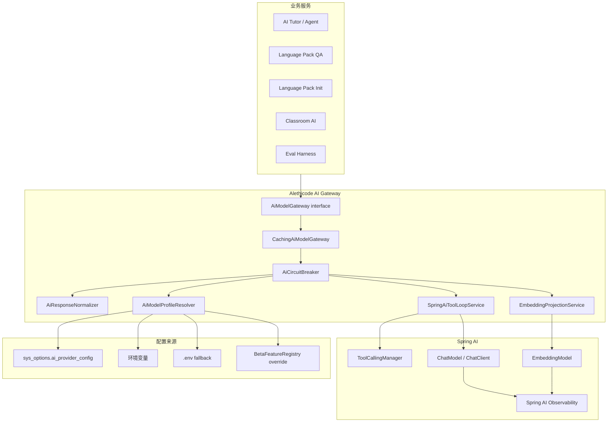
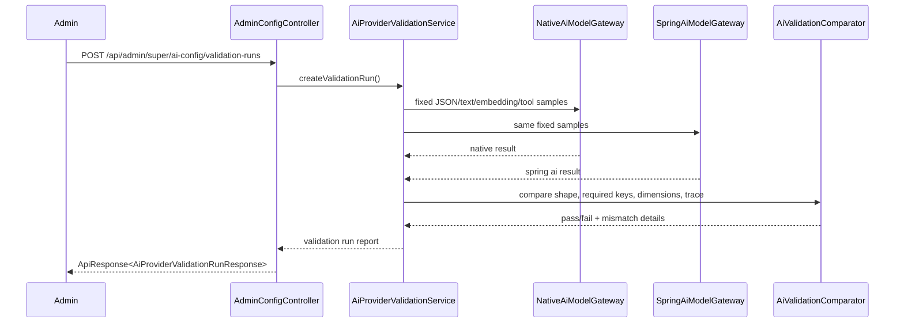
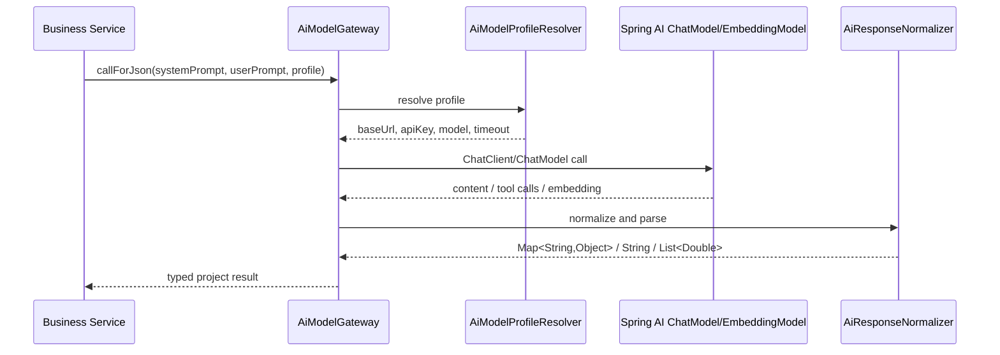

# Spring AI 彻底替代 LlmClient 执行计划

> 目标读者：后续接手实现的 AI / 工程师。
>
> 本文档用于把 Alethicode 当前自研 `LlmClient` 迁移为 Spring AI 驱动的模型调用层。文档要求后续执行者可以按阶段直接规划、实现、测试、集成，不需要重新做方向判断。

## 0. 最终结论

当前项目中的 `LlmClient` **不能被 Spring AI 直接一键删除式替代**，但可以被 Spring AI **完全替代其底层模型调用职责**。正确目标不是让所有业务类直接依赖 Spring AI API，而是：

- 删除生产链路中的 Native HTTP LLM 实现。
- 删除业务类对 `LlmClient` 的依赖。
- 新建项目级 `AiModelGateway` 作为 Alethicode 内部唯一模型调用边界。
- `AiModelGateway` 的生产实现只使用 Spring AI。
- 把 `LlmClient` 当前承担的非模型职责拆成独立组件：JSON 修复、缓存、熔断、配置读取、Embedding 投影、ReAct 工具循环、指标。
- 双跑验证只作为迁移阶段的管理端验证能力，不进入学生生产主链路，不保留长期 Native 兼容路径。

### 0.1 为什么不能让业务类直接注入 Spring AI

`LlmClient` 当前不是简单 HTTP 客户端。它同时承担：

- JSON 对象输出约束。
- `<think>` / Markdown code fence / provider envelope / 非标准 JSON 修复。
- `callForJson` / `callForJsonCached` / `callForContent` / `callForEmbedding` / `callWithTools` 五类能力。
- OpenAI-compatible HTTP payload 构造。
- ReAct 工具循环、工具 guard、工具 trace、停止条件。
- Embedding 16 维投影，适配当前 `pgvector` 字段。
- AI Provider DB 配置读取，支持管理端运行时修改。
- `.env` fallback 读取。
- LLM 熔断、重试、Micrometer 指标。
- `envPrefix` 模型路由，例如 `INIT_LLM_`、`INIT_LLM_REGEN_`。

Spring AI 可以替代 Chat / Embedding / Tool Calling 的标准底层能力，但不能自动承接 Alethicode 的业务协议、trace 形状、缓存键、配置优先级和 fail-fast 语义。

### 0.2 最短正确路径

不要做“给 `LlmClient` 继续打补丁”的方案。实施时按下面路径推进：

1. 先修 Spring AI 依赖与配置，使 `mvn -Pspring-ai compile` 通过。
2. 新建 `AiModelGateway` 接口，完整表达项目需要的模型调用能力。
3. 新建 `NativeAiModelGateway` 和 `SpringAiModelGateway`，仅用于迁移期双跑验证。
4. 新增管理端验证资源 `POST /api/admin/super/ai-config/validation-runs`。
5. 用固定样本验证 Native 与 Spring AI 的结构契约一致。
6. 验证通过后，把业务类从 `LlmClient` 迁移到 `AiModelGateway`。
7. 删除 `LlmClient`、`LLM_BACKEND`、Native HTTP 实现和相关测试桩。
8. 生产只保留 `SpringAiModelGateway`。

## 1. 官方资料与当前阻塞

### 1.1 官方事实

- Spring AI 1.1.4 已发布，并可从 Maven Central 获取。
  - 官方发布说明：`https://spring.io/blog/2026/03/26/spring-ai-2-0-0-M4-and-1-1-4-and-1-0-5-available/`
- Spring AI 1.0.0 及之后版本不需要额外 release repository，只需 Maven Central。
  - Getting Started：`https://docs.spring.io/spring-ai/reference/getting-started.html`
- Spring AI 支持 Spring Boot 3.4.x / 3.5.x，当前项目使用 Spring Boot 3.5.12，版本方向成立。
- Spring AI Tool Calling 支持框架托管执行，也支持用户控制执行；当前项目必须选择用户控制执行，因为要保留 guard、trace、停止条件和工具调用审计。
  - Tool Calling：`https://docs.spring.io/spring-ai/reference/api/tools.html`
- Spring AI Observability 基于 Spring Boot Actuator，覆盖 `ChatClient`、`ChatModel`、`EmbeddingModel`、Tool Calling、VectorStore 等。
  - Observability：`https://docs.spring.io/spring-ai/reference/observability/index.html`

### 1.2 当前仓库事实

当前相关文件：

- `backend/pom.xml`
- `backend/src/main/resources/application.yml`
- `backend/src/main/java/com/alethicode/config/SpringAiConfig.java`
- `backend/src/main/java/com/alethicode/service/LlmClient.java`
- `backend/src/main/java/com/alethicode/service/aitutor/react/*`
- `backend/src/main/java/com/alethicode/service/impl/SystemOptionServiceImpl.java`
- `backend/src/main/java/com/alethicode/controller/AdminConfigController.java`
- `backend/src/test/java/com/alethicode/service/LlmClientTest.java`

当前 `pom.xml` 事实：

- Spring AI 版本为 `1.1.4`。
- `spring-ai` Maven profile 引入：
  - `spring-ai-starter-model-openai`
  - `spring-ai-starter-model-observation`
  - `spring-ai-starter-mcp-server-webmvc`
- profile 里配置了 `https://repo.spring.io/release`。

当前风险：

- `spring-ai-starter-model-observation:1.1.4` 不是当前官方 Getting Started 中要求的通用 starter。
- 官方资料明确 1.1.4 走 Maven Central，不需要 `spring-release` 仓库。
- 当前 Spring AI 试点使用反射注入 `Object springAiChatClient` / `Object springAiEmbeddingModel`，只是试点桥接，不适合作为最终架构。

### 1.3 当前 LlmClient 能力清单

| 能力 | 当前位置 | 最终归属 |
|---|---|---|
| JSON 调用 | `LlmClient.callForJson` | `AiModelGateway.callForJson` |
| JSON 缓存 | `callForJsonCached` + `LlmResponseCacheService` | `CachingAiModelGateway` 装饰器 |
| 文本调用 | `callForContent` | `AiModelGateway.callForContent` |
| Embedding | `callForEmbedding` | `AiEmbeddingService` 或 `AiModelGateway.callForEmbedding` |
| Embedding 16 维投影 | `projectEmbedding` | `EmbeddingProjectionService` |
| ReAct 工具循环 | `callWithTools` | `SpringAiToolLoopService` |
| 工具 guard | `ToolDefinition.checkGuard` | 保留现有 `ToolDefinition` + `ToolContext` |
| ToolTraceEntry | `callWithTools` 内组装 | `SpringAiToolLoopService` |
| provider 响应解析 | `parseJsonResultFromLlmResponseBody` | `AiResponseNormalizer` |
| `<think>` / code fence 修复 | `normalizeJsonObjectContent` | `AiResponseNormalizer` |
| 配置读取 | `readEnvValue` / `SystemOptionService` | `AiProviderConfigResolver` |
| `.env` fallback | `loadEnvFile` | `LocalEnvFallbackLoader` |
| 重试 | `sendWithRetries` | Spring AI / HTTP client 配置 + 必要的网关级重试 |
| 熔断 | `recordFailure` / `checkCircuitBreaker` | `AiCircuitBreaker` |
| 指标 | `meterRegistry` | Spring AI observation + Alethicode 业务指标 |
| `envPrefix` 路由 | `resolveEnvWithFallback` | `AiModelProfileResolver` |

## 2. 目标架构

### 2.1 组件图



### 2.2 迁移期双跑验证图

双跑只用于验证，不进入生产学生请求路径。



### 2.3 最终生产调用图



## 3. 新内部接口设计

### 3.1 `AiModelGateway`

目标包名：

- `backend/src/main/java/com/alethicode/service/ai/AiModelGateway.java`

接口必须完整覆盖现有调用点，不做业务扩展：

```java
package com.alethicode.service.ai;

import com.alethicode.service.aitutor.contract.StoppingCondition;
import com.alethicode.service.aitutor.react.ReactResult;
import com.alethicode.service.aitutor.react.ToolContext;
import com.alethicode.service.aitutor.react.ToolDefinition;
import com.alethicode.service.aitutor.react.ToolExecutor;

import java.util.List;
import java.util.Map;

public interface AiModelGateway {

    Map<String, Object> callForJson(String systemPrompt, String userPrompt);

    Map<String, Object> callForJson(String systemPrompt, String userPrompt, String profilePrefix);

    Map<String, Object> callForJsonCached(String cacheKey, String systemPrompt, String userPrompt, String profilePrefix);

    String callForContent(String userPrompt);

    List<Double> callForEmbedding(String input);

    ReactResult callWithTools(
            String systemPrompt,
            List<Map<String, Object>> messages,
            List<ToolDefinition> tools,
            Map<String, ToolExecutor> executors,
            int maxIterations,
            ToolContext toolContext,
            StoppingCondition stoppingCondition,
            String profilePrefix
    );

    String readRequiredConfig(String key);

    String readConfigOrDefault(String key, String defaultValue);
}
```

命名约束：

- Java 类型使用 `PascalCase`。
- 方法与变量使用 `camelCase`。
- 不保留 `LlmClient` 别名。
- 不把 DB 的 `snake_case` 扩散到 Java 变量名。

### 3.2 配置解析接口

目标包名：

- `backend/src/main/java/com/alethicode/service/ai/AiModelProfileResolver.java`

建议 record：

```java
public record AiModelProfile(
        String profilePrefix,
        String apiKey,
        String baseUrl,
        String chatModel,
        String embeddingApiKey,
        String embeddingBaseUrl,
        String embeddingModel,
        int timeoutSeconds,
        int maxRetries
) {
}
```

解析优先级必须保持当前业务语义：

1. `BetaFeatureRegistry` runtime override。
2. DB `sys_options` 中 `ai_provider_config`。
3. 环境变量。
4. `.env` fallback。
5. 明确默认值。

profile 规则：

- 默认 profilePrefix 为空字符串。
- 初始化阶段继续支持 `INIT_LLM_`。
- Judge 重生阶段继续支持 `INIT_LLM_REGEN_`。
- 没有配置 api key 时 fail-fast。
- profilePrefix 只影响 Chat API key / model / baseUrl，不隐式影响 Embedding，除非显式设计对应 embedding profile。

### 3.3 JSON 归一化

目标包名：

- `backend/src/main/java/com/alethicode/service/ai/AiResponseNormalizer.java`

必须迁移并保留这些行为：

- provider error payload 直接 fail-fast。
- 支持顶层业务 JSON。
- 支持 `data` / `payload` / `result` / `response` 包裹。
- 支持 `choices.message.content`。
- 支持 `output_text`。
- 支持 Responses API 风格 `output[].content[].text`。
- 支持说明文字包裹 provider envelope。
- 支持 `<think>` 闭合与未闭合场景。
- 支持 Markdown code fence。
- 支持字符串内部裸换行修复。
- 支持字符串内部未转义双引号修复。

不允许新增宽松兜底：

- 不允许空响应返回 `{}`。
- 不允许解析失败时返回原文。
- 不允许吞掉 provider error。
- 不允许把非 JSON 文本伪装成 JSON 成功。

### 3.4 工具循环服务

目标包名：

- `backend/src/main/java/com/alethicode/service/ai/SpringAiToolLoopService.java`

Spring AI 的框架托管工具调用会隐藏部分中间消息。当前项目必须记录 `ToolTraceEntry`，因此使用 Spring AI 用户控制工具执行。

必须保持的现有行为：

- `maxIterations` 限制。
- `StoppingCondition.maxIterations` 限制。
- `StoppingCondition.timeoutSeconds` 限制。
- `StoppingCondition.maxRepeatToolCalls` 限制。
- 未知工具名 fail-fast。
- 工具参数不是 JSON object 时 fail-fast。
- guard 失败时不执行工具，生成结构化 error observation。
- executor 异常时把错误写入 observation，并继续由模型决定最终输出。
- 每次工具调用生成 `ToolTraceEntry`。
- final content 必须是 JSON object，否则 fail-fast。

最终 `ReactResult` 形状不得变化：

- `result`
- `iterationsUsed`
- `toolCallLog`
- `toolTraceEntries`

## 4. Spring AI 依赖与配置修复

### 4.1 Maven 修复

目标：`mvn -q -f backend/pom.xml -Pspring-ai -DskipTests compile` 通过。

修改 `backend/pom.xml`：

- 保留 `<spring-ai.version>1.1.4</spring-ai.version>`。
- 增加 `spring-ai-bom` 到 `dependencyManagement`。
- `spring-ai` profile 保留：
  - `spring-ai-starter-model-openai`
  - `spring-ai-starter-mcp-server-webmvc`
- 移除：
  - `spring-ai-starter-model-observation`
  - `spring-release` repository
- 不把 Spring AI 依赖放到默认 profile，除非确认当前 CI 和部署环境都能稳定解析。

示意：

```xml
<dependencyManagement>
    <dependencies>
        <dependency>
            <groupId>org.springframework.ai</groupId>
            <artifactId>spring-ai-bom</artifactId>
            <version>${spring-ai.version}</version>
            <type>pom</type>
            <scope>import</scope>
        </dependency>
    </dependencies>
</dependencyManagement>
```

### 4.2 `application.yml` 修复

当前配置使用：

```yaml
spring.ai:
  openai:
    api-key: ${OPENAI_API_KEY:}
    base-url: ${LLM_BASE_URL:https://api.minimaxi.com/v1}
```

实施时必须确认 Spring AI OpenAI starter 对 `base-url` 与 endpoint path 的要求。不要把 `/v1` 和 `/chat/completions` 重复拼接。

目标原则：

- `LLM_BASE_URL` 继续保留给 Alethicode 配置界面。
- Spring AI 配置由 `AiModelProfileResolver` 转换后喂给 Spring AI builder。
- 不再让业务代码直接依赖 `spring.ai.openai.*` 的自动绑定结果。
- Observability 默认不记录 prompt 和 completion 内容，避免泄露学生代码、题目和 API key。

建议配置：

```yaml
spring.ai:
  openai:
    api-key: ${OPENAI_API_KEY:}
    base-url: ${LLM_BASE_URL:https://api.minimaxi.com/v1}
    chat:
      options:
        model: ${LLM_MODEL:MiniMax-M2.7}
    embedding:
      api-key: ${EMBEDDING_API_KEY:${OPENAI_API_KEY:}}
      base-url: ${EMBEDDING_BASE_URL:https://api.openai.com/v1}
      options:
        model: ${EMBEDDING_MODEL:text-embedding-3-small}
  chat:
    observations:
      log-prompt: false
      log-completion: false
      include-error-logging: true
  tools:
    observations:
      include-content: false
```

### 4.3 `SpringAiConfig` 修复

当前 `SpringAiConfig` 用反射创建 `springAiChatClient`。最终应改为强类型配置，只在 `spring-ai` profile 下编译。

目标：

- `SpringAiConfig` 不再返回 `Object`。
- 使用 Spring AI 强类型 `ChatModel`、`ChatClient.Builder`、`EmbeddingModel`。
- 不在 `LlmClient` 中反射调用 Spring AI。
- 若 Spring AI 不可用，启动失败或相关 bean 不注册；迁移完成后生产必须可用。

## 5. 管理端双跑验证 API

### 5.1 API 设计原则

遵循资源化 REST 命名，不新增动作式接口。

新增资源：

- `POST /api/admin/super/ai-config/validation-runs`

含义：创建一次 AI Provider 验证运行。

不使用：

- `POST /api/admin/super/test-ai`
- `POST /api/admin/super/validate-ai-config`
- `GET` 触发真实模型调用

鉴权：

- 与 `/api/admin/super/ai-config` 一致。
- `@PreAuthorize("hasRole('ADMIN') and !hasRole('TEACHER')")`

### 5.2 Request DTO

目标文件：

- `backend/src/main/java/com/alethicode/dto/request/AiProviderValidationRunRequest.java`

```java
package com.alethicode.dto.request;

public record AiProviderValidationRunRequest(
        String profilePrefix,
        boolean includeJson,
        boolean includeContent,
        boolean includeEmbedding,
        boolean includeToolLoop
) {
}
```

默认规则：

- `profilePrefix` 为空时验证默认 profile。
- 四个 include 字段全为 false 时，服务端 fail-fast，返回 400/422。
- 不允许请求体传自由 prompt。
- 验证样本在服务端固定，避免把接口变成任意 LLM 调用代理。

### 5.3 Response DTO

目标文件：

- `backend/src/main/java/com/alethicode/dto/response/AiProviderValidationRunResponse.java`

```java
package com.alethicode.dto.response;

import java.util.List;
import java.util.Map;

public record AiProviderValidationRunResponse(
        String runId,
        String profilePrefix,
        boolean passed,
        List<AiProviderValidationCaseResult> cases,
        Map<String, Object> summary
) {
}
```

```java
public record AiProviderValidationCaseResult(
        String caseName,
        boolean nativePassed,
        boolean springAiPassed,
        boolean shapeMatched,
        String failureMessage,
        Map<String, Object> nativeSummary,
        Map<String, Object> springAiSummary
) {
}
```

注意：

- 不返回完整 prompt。
- 不返回完整 completion。
- 不返回 API key。
- 只返回摘要、字段集合、维度、耗时、错误摘要。

### 5.4 固定验证样本

必须覆盖四类：

1. JSON object：
   - system prompt 要求返回 `{"status":"ok","steps":["read","solve"],"score":1}`。
   - 验证字段：`status`、`steps`、`score`。
2. 文本 content：
   - prompt 要求返回一段 20 字以内中文总结。
   - 验证非空即可。
3. Embedding：
   - input 固定为 `embedding runtime verification`。
   - 验证最终返回 16 维，全部为数字。
4. Tool loop：
   - 工具名 `validation_echo`。
   - schema 要求 `{ "message": "string" }`。
   - executor 返回 `{ "echo": message }`。
   - final JSON 必须包含 `tool_seen=true`。
   - 验证 `ToolTraceEntry` 至少 1 条。

## 6. 迁移阶段

### Phase 0：锁定现状与失败基线

目标：让后续实现者先看到当前问题，而不是盲改。

任务：

- 执行 `mvn -q -f backend/pom.xml -Pspring-ai -DskipTests compile`。
- 记录当前失败信息到实现 PR 描述。
- 执行 `mvn -q -f backend/pom.xml -Dtest=LlmClientTest test`，确认现有解析契约。
- 用 `rg -n "LlmClient|llmClient"` 输出依赖清单。

验收：

- 明确 Spring AI profile 当前是否编译通过。
- 明确所有直接注入 `LlmClient` 的生产类与测试类。

### Phase 1：修 Spring AI 基线

目标：Spring AI 依赖可编译、可启动、可被测试。

任务：

- 修改 `pom.xml`。
- 修改 `SpringAiConfig`。
- 修改 `application.yml`。
- 新增 `SpringAiConfigTest` 或配置契约测试。
- 保留 MCP server starter 的现有开关，不影响默认启动。

验收命令：

```bash
mvn -q -f backend/pom.xml -Pspring-ai -DskipTests compile
mvn -q -f backend/pom.xml -Dtest=SpringAiConfigTest test
```

### Phase 2：抽取项目级 AI Gateway

目标：让业务类先依赖项目接口，而不是直接依赖 `LlmClient`。

任务：

- 新建 `service/ai` 包。
- 新建 `AiModelGateway`。
- 新建 `AiResponseNormalizer`。
- 新建 `EmbeddingProjectionService`。
- 新建 `AiModelProfileResolver`。
- 新建 `AiCircuitBreaker`。
- 新建 `NativeAiModelGateway`，临时复用现有 `LlmClient` 逻辑或迁出其代码。
- `LlmClient` 在本阶段可以暂存，但不得新增新能力。

验收：

- `AiResponseNormalizerTest` 覆盖原 `LlmClientTest` 中所有响应解析用例。
- `EmbeddingProjectionServiceTest` 覆盖维度等于 16、大于 16、小于 16 三种情况。
- `AiModelProfileResolverTest` 覆盖 DB、env、`.env`、默认值优先级。

### Phase 3：实现 Spring AI Gateway

目标：Spring AI 具备项目需要的完整能力。

任务：

- 新建 `SpringAiModelGateway`。
- 使用 Spring AI Chat API 实现 `callForJson`。
- 使用 Spring AI Chat API 实现 `callForContent`。
- 使用 Spring AI Embedding API 实现 `callForEmbedding`。
- 使用 Spring AI user-controlled tool execution 实现 `callWithTools`。
- 输出统一通过 `AiResponseNormalizer`。
- Embedding 输出统一通过 `EmbeddingProjectionService`。
- 指标使用 Spring AI observation + Alethicode 自有计数器。

验收：

- `SpringAiModelGatewayContractTest` 使用 mock `ChatModel` / `EmbeddingModel`，不依赖真实外部 LLM。
- 工具循环测试覆盖：正常工具调用、未知工具、guard 拒绝、executor 抛错、最终非 JSON、迭代耗尽、重复工具超限。

### Phase 4：管理端双跑验证

目标：允许管理员在受控入口比较 Native 与 Spring AI 的结构输出。

任务：

- 新增 request/response DTO。
- 扩展 `AdminConfigController`。
- 新建 `AiProviderValidationService`。
- 新建 `AiValidationComparator`。
- 固定四类验证样本。
- 不接收自由 prompt。
- 不返回敏感内容。

验收：

```bash
mvn -q -f backend/pom.xml -Dtest=AdminConfigControllerContractTest,AiProviderValidationServiceTest test
```

### Phase 5：业务调用点迁移

目标：生产业务不再注入 `LlmClient`。

迁移方式：

- 按模块分批替换构造器参数。
- 每替换一个模块，同步替换对应测试 mock。
- 不做 `LlmClient` 到 `AiModelGateway` 的兼容适配别名。

主要模块：

| 模块 | 代表类 | 迁移点 |
|---|---|---|
| AI Tutor workflow | `AITutorWorkflowAdminServiceImpl` | JSON、content、配置读取 |
| Agent | `GuideAgent` / `DiagnosticsAgent` / `TransferAgent` / `MetacognitiveAgent` / `ChatAgent` | JSON、工具循环 |
| Reflection | `ReflectionServiceImpl` | JSON |
| Language Pack Init | `KcExtractionServiceImpl` / `ExampleExtractionServiceImpl` / `ProblemGenerationServiceImpl` | JSON + profilePrefix |
| QA | `AnswerSynthesisServiceImpl` / `LanguagePackQaServiceImpl` | JSON |
| Retrieval | `PageRetrievalServiceImpl` / `SimilarErrorRetrievalService` | Embedding |
| Learner Memory | `LearnerMemoryService` | Embedding |
| Classroom | `ClassroomAnalyticsService` / `ClassroomAiProblemService` / `StudentRiskDetectionService` | JSON |
| Eval Harness | `TutorEvalHarness` / `QaEvalHarness` | JSON |

验收：

- `rg -n "LlmClient|llmClient" backend/src/main/java backend/src/test/java` 只允许出现在删除计划或历史注释中；最终应为 0。
- 全部相关测试改为 mock `AiModelGateway`。

### Phase 6：删除 LlmClient 与 Native 路径

目标：Spring AI 成为唯一生产模型调用实现。

删除：

- `backend/src/main/java/com/alethicode/service/LlmClient.java`
- `backend/src/test/java/com/alethicode/service/LlmClientTest.java`
- `LLM_BACKEND`
- `NATIVE` / `SPRING_AI` 枚举。
- 反射式 `springAiChatClient` / `springAiEmbeddingModel` 注入。
- Native HTTP payload 构造。
- Native HTTP retry。

保留并重命名：

- JSON 解析测试迁移到 `AiResponseNormalizerTest`。
- 重试/熔断测试迁移到 `AiCircuitBreakerTest` 或 gateway 测试。
- Embedding 投影测试迁移到 `EmbeddingProjectionServiceTest`。

验收：

```bash
rg -n "LlmClient|LLM_BACKEND|LlmBackend|callForJsonNative|callForEmbeddingNative" backend/src/main/java backend/src/test/java
mvn -q -f backend/pom.xml -Pspring-ai test
```

`rg` 必须无生产残留。

## 7. 测试矩阵

### 7.1 单元测试

必须新增或迁移：

- `AiResponseNormalizerTest`
- `EmbeddingProjectionServiceTest`
- `AiModelProfileResolverTest`
- `AiCircuitBreakerTest`
- `SpringAiModelGatewayContractTest`
- `SpringAiToolLoopServiceTest`
- `AiProviderValidationServiceTest`

重点用例：

- provider error 直接失败。
- 顶层业务 JSON 成功。
- `choices.message.content` 成功。
- `output_text` 成功。
- Responses API 风格成功。
- 包裹业务 payload 成功。
- `<think>` 闭合成功。
- `<think>` 未闭合但后续有 JSON 成功。
- Markdown code fence 成功。
- 裸换行修复成功。
- 未转义双引号修复成功。
- 缺失内容 fail-fast。
- Embedding 输入为空 fail-fast。
- API key 缺失 fail-fast。
- 工具 unknown fail-fast。
- 工具重复超限 fail-fast。
- final content 非 JSON fail-fast。

### 7.2 控制器契约测试

必须覆盖：

- `POST /api/admin/super/ai-config/validation-runs` 管理员可访问。
- teacher 不可访问。
- 普通用户不可访问。
- 全部 include 为 false 时失败。
- response 不包含 api key、prompt、完整 completion。

### 7.3 集成测试

最小必须跑：

```bash
mvn -q -f backend/pom.xml -Dtest='LanguagePackQaIntegrationTest,LanguagePackInitIntegrationTest,ClassroomM11IntegrationTest,AITutorWorkflowGovernanceIntegrationTest' test
```

最终必须跑：

```bash
mvn -q -f backend/pom.xml -Pspring-ai test
```

### 7.4 手动验证

环境变量示例：

```bash
export SPRING_AI_ENABLED=true
export OPENAI_API_KEY='...'
export LLM_BASE_URL='https://api.minimaxi.com/v1'
export LLM_MODEL='MiniMax-M2.7'
export EMBEDDING_API_KEY='...'
export EMBEDDING_BASE_URL='https://api.openai.com/v1'
export EMBEDDING_MODEL='text-embedding-3-small'
```

启动后验证：

- 管理端保存 AI Provider 配置。
- 调用 validation-runs。
- 打开题目页触发 READ/IDEATE/ERROR_FEEDBACK。
- 初始化 language pack。
- QA 问答生成 session title。
- learner memory 写入 embedding。

## 8. 状态与数据链路检查

### 8.1 输入

输入来源：

- system prompt。
- user prompt。
- tool messages。
- embedding input。
- AI Provider 配置。
- `profilePrefix`。
- cache key。
- tool context。

输入约束：

- prompt 为空时 fail-fast。
- embedding input 为空时 fail-fast。
- api key 为空时 fail-fast。
- model 为空时 fail-fast。
- baseUrl 为空时 fail-fast。
- tool context 中必要字段缺失时由 tool guard fail-fast。

### 8.2 处理流程

JSON 调用：

1. 业务服务调用 `AiModelGateway.callForJson`。
2. gateway 解析 profile。
3. circuit breaker 检查。
4. Spring AI 发起 chat 调用。
5. normalizer 修复并解析 JSON。
6. 结果写入 cache 或直接返回。

工具调用：

1. 业务 agent 构建 `ToolDefinition` 与 `ToolExecutor`。
2. gateway 进入 `SpringAiToolLoopService`。
3. 模型返回 tool call。
4. 工具 guard 检查。
5. executor 执行或生成 guard error。
6. 工具结果回填给模型。
7. 模型返回最终 JSON。
8. 返回 `ReactResult`。

Embedding：

1. 业务服务调用 `callForEmbedding`。
2. gateway 解析 embedding profile。
3. Spring AI 调用 embedding model。
4. 投影到 16 维。
5. 转为 `pgvector` 字符串由原业务服务写库。

### 8.3 状态变化

- 成功调用：成功计数 + latency timer。
- 失败调用：失败计数 + circuit breaker 状态变化。
- cache 命中：不调用模型。
- validation run：只返回运行结果，不写业务表。
- AI Provider DB 配置：继续通过现有 `sys_options` 存储。

### 8.4 输出

输出必须保持现有业务契约：

- JSON 调用返回 `Map<String,Object>`。
- 文本调用返回非空 `String`。
- Embedding 返回 16 维 `List<Double>`。
- 工具调用返回 `ReactResult`。
- provider error 不包装成业务成功。

### 8.5 上下游影响

上游：

- `SystemOptionServiceImpl` 仍负责管理端 AI Provider 配置。
- `BetaFeatureRegistry` 仍可覆盖配置。
- `.env` fallback 只用于本地与部署模板，不成为新业务路径。

下游：

- `language_pack_page.page_embedding` 继续 16 维。
- `learner_memory.memory_embedding` 继续 16 维。
- 前端卡片字段不因本迁移改变。
- AI Tutor workflow 不因本迁移改变 phase / event。
- MCP server 不因本迁移改变对外工具。

## 9. 删除与禁止项

禁止：

- 禁止保留 `LlmClient` 作为长期 facade。
- 禁止业务类直接注入 Spring AI `ChatClient`。
- 禁止在学生生产请求中双跑 Native 与 Spring AI。
- 禁止解析失败返回空 Map。
- 禁止模型失败后静默生成模板回答。
- 禁止为了兼容旧命名保留别名。
- 禁止把 `LLM_BACKEND=native` 留在最终生产配置里。
- 禁止新增与替代 `LlmClient` 无关的 RAG、PGVector Advisor、LangGraph 业务迁移。

必须：

- 每一阶段都可独立编译。
- 每一阶段都更新对应测试。
- 最终 `rg` 无 `LlmClient` 残留。
- 涉及代码修改后更新 `CHANGELOG.md` 中文记录。

## 10. 一键执行检查清单

后续 AI 按顺序执行：

- [ ] 运行 Spring AI profile 编译，记录当前失败。
- [ ] 修 `pom.xml` Spring AI 依赖。
- [ ] 修 `application.yml` Spring AI observability 与 provider 配置。
- [ ] 强类型重写 `SpringAiConfig`。
- [ ] 新建 `service/ai` 包。
- [ ] 新建 `AiModelGateway`。
- [ ] 抽取 `AiResponseNormalizer` 并迁移全部解析测试。
- [ ] 抽取 `EmbeddingProjectionService`。
- [ ] 抽取 `AiModelProfileResolver`。
- [ ] 抽取 `AiCircuitBreaker`。
- [ ] 实现 `NativeAiModelGateway`，仅用于双跑验证期。
- [ ] 实现 `SpringAiModelGateway`。
- [ ] 实现 `SpringAiToolLoopService`。
- [ ] 新增 validation-runs 管理端资源。
- [ ] 写完 validation-runs 控制器与服务测试。
- [ ] 用固定样本验证 Native 与 Spring AI 结构契约。
- [ ] 分模块把业务类注入从 `LlmClient` 改为 `AiModelGateway`。
- [ ] 替换所有测试 mock。
- [ ] 删除 `LlmClient` 与 Native HTTP 路径。
- [ ] 删除 `LLM_BACKEND`。
- [ ] 跑 `rg` 确认无残留。
- [ ] 跑完整后端测试。
- [ ] 更新 `CHANGELOG.md`。

## 11. 最终验收命令

```bash
mvn -q -f backend/pom.xml -Pspring-ai -DskipTests compile
mvn -q -f backend/pom.xml -Dtest='AiResponseNormalizerTest,EmbeddingProjectionServiceTest,AiModelProfileResolverTest,AiCircuitBreakerTest,SpringAiModelGatewayContractTest,SpringAiToolLoopServiceTest,AiProviderValidationServiceTest,AdminConfigControllerContractTest' test
mvn -q -f backend/pom.xml -Dtest='LanguagePackQaIntegrationTest,LanguagePackInitIntegrationTest,ClassroomM11IntegrationTest,AITutorWorkflowGovernanceIntegrationTest' test
mvn -q -f backend/pom.xml -Pspring-ai test
rg -n "LlmClient|llmClient|LLM_BACKEND|LlmBackend|callForJsonNative|callForEmbeddingNative" backend/src/main/java backend/src/test/java
```

最后一条 `rg` 必须无结果。

## 12. 与 LangGraph todo 的关系

本计划只替代模型调用层，不替代 AI Tutor workflow。

与 `docs/todos/todo-langgraph-workflow.md` 的关系：

- 本计划可以先做，也可以和 LangGraph 迁移并行做。
- LangGraph 迁移如果后续落地，`tutor-graph` 服务也应通过统一模型配置规范调用 LLM。
- Java 侧 AI Tutor workflow 是否被 LangGraph 替代，不影响本计划中 `AiModelGateway` 对 QA、Language Pack、Classroom、Eval 的价值。
- 不要把 LangGraph checkpoint / interrupt / WebSocket runtime 改造塞进本计划。

## 13. 未验证前提

以下内容必须在执行时验证，不能当作已确认事实：

- Spring AI OpenAI starter 对 MiniMax OpenAI-compatible API 的完整兼容性。
- Spring AI 对当前 `response_format=json_object` 的配置写法。
- Spring AI EmbeddingModel 对当前 DashScope / Zhipu / OpenAI-compatible embedding provider 的兼容性。
- Spring AI user-controlled tool execution 是否能完整保留当前 Kimi/MiniMax 的 `reasoning_content` 多轮工具调用要求。
- `spring-ai-starter-mcp-server-webmvc` 与当前 Boot 3.5.12、Spring AI 1.1.4 的依赖收敛是否无冲突。

验证失败时处理原则：

- fail-fast。
- 不加生产兜底。
- 不恢复 Native HTTP 作为长期路径。
- 在当前阶段内修 Spring AI 配置或调整 provider 适配。

